# سند طراحی معماری نرم‌افزار GravityPM

## فهرست مطالب

1. [مقدمه](#مقدمه)
2. [مرور کلی معماری](#مرور-کلی-معماری)
3. [الزامات سیستم](#الزامات-سیستم)
4. [معماری سیستم](#معماری-سیستم)
5. [مدل‌های داده](#مدلهای-داده)
6. [اجزا و ماژول‌ها](#اجزا-و-ماژولها)
7. [جریان داده و کنترل](#جریان-داده-و-کنترل)
8. [یکپارچه‌سازی با سیستم‌های خارجی](#یکپارچهسازی-با-سیستمهای-خارجی)
9. [امنیت](#امنیت)
10. [عملکرد و مقیاس‌پذیری](#عملکرد-و-مقیاسپذیری)
11. [استقرار](#استقرار)
12. [نتیجه‌گیری](#نتیجهگیری)

---

## مقدمه

GravityPM یک نرم‌افزار مدیریت پروژه پیشرفته است که برای مدیریت پروژه‌های پیچیده و بزرگ در سازمان‌ها طراحی شده است. این نرم‌افزار با تمرکز بر شفافیت، کارایی و همکاری تیمی، ابزارهای کاملی برای برنامه‌ریزی، اجرا و نظارت بر پروژه‌ها فراهم می‌کند.

### اهداف طراحی

- ایجاد یک پلتفرم یکپارچه برای مدیریت تمام جنبه‌های پروژه
- پشتیبانی از روش‌های مختلف مدیریت پروژه (Agile, Waterfall, Hybrid)
- ارائه دیدگاه‌های گوناگون برای ذینفعان مختلف
- امکان یکپارچه‌سازی با ابزارهای موجود در سازمان
- تضمین امنیت داده‌ها و کنترل دسترسی

### محدوده سیستم

GravityPM شامل قابلیت‌های زیر است:
- مدیریت پروژه‌ها و زیرپروژه‌ها
- مدیریت وظایف و فعالیت‌ها
- تخصیص و مدیریت منابع
- پیگیری پیشرفت و گزارش‌دهی
- مدیریت ریسک و مسائل
- همکاری و ارتباطات تیمی
- یکپارچه‌سازی با ابزارهای جانبی

---

## مرور کلی معماری

### دیاگرام معماری سطح بالا

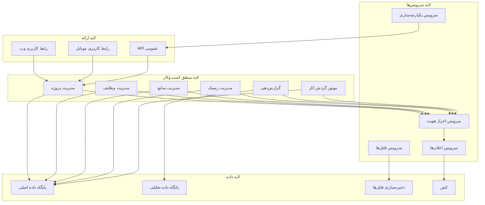

### توضیح معماری

GravityPM از یک معماری چندلایه استفاده می‌کند که شامل:

1. **لایه ارائه**: شامل رابط‌های کاربری برای وب، موبایل و API برای یکپارچه‌سازی
2. **لایه منطق کسب‌وکار**: شامل ماژول‌های اصلی مدیریت پروژه، وظایف، منابع و ریسک
3. **لایه سرویس‌ها**: شامل سرویس‌های پشتیبان مانند احراز هویت، اعلان‌ها و یکپارچه‌سازی
4. **لایه داده**: شامل پایگاه‌های داده، ذخیره‌سازی فایل‌ها و کش

### اصول طراحی

- **جداسازی وظایف**: هر جزء مسئولیت مشخصی دارد
- **قابلیت توسعه**: سیستم به راحتی قابل گسترش است
- **پایداری**: سیستم در برابر خطاها مقاوم است
- **امنیت**: لایه‌های امنیتی در تمام سطوح
- **کارایی**: بهینه‌سازی برای عملکرد بالا

---

## الزامات سیستم

### الزامات عملکردی

| شناسه | الزام | اولویت | توضیح |
|-------|-------|--------|-------|
| FR-001 | مدیریت پروژه‌ها | بالا | ایجاد، ویرایش، حذف و مشاهده پروژه‌ها |
| FR-002 | مدیریت وظایف | بالا | ایجاد، ویرایش، حذف و پیگیری وظایف |
| FR-003 | تخصیص منابع | بالا | تخصیص منابع انسانی و غیرانسانی به وظایف |
| FR-004 | پیگیری پیشرفت | بالا | گزارش پیشرفت وظایف و پروژه‌ها |
| FR-005 | مدیریت ریسک | متوسط | شناسایی، ارزیابی و مدیریت ریسک‌ها |
| FR-006 | گزارش‌دهی | متوسط | ایجاد گزارش‌های متنوع از پروژه‌ها |
| FR-007 | همکاری تیمی | متوسط | امکان ارتباط و همکاری بین اعضای تیم |
| FR-008 | یکپارچه‌سازی | پایین | اتصال به ابزارهای خارجی |

### الزامات غیرعملکردی

| شناسه | الزام | اولویت | معیار |
|-------|-------|--------|-------|
| NFR-001 | کارایی | بالا | زمان پاسخ کمتر از 2 ثانیه |
| NFR-002 | مقیاس‌پذیری | بالا | پشتیبانی از 10000 کاربر همزمان |
| NFR-003 | امنیت | بالا | رمزنگاری داده‌های حساس |
| NFR-004 | قابلیت اطمینان | متوسط | 99.9% زمان کارکرد |
| NFR-005 | قابلیت استفاده | متوسط | رابط کاربری ساده و شهودی |
| NFR-006 | سازگاری | پایین | کاربر روی مرورگرهای اصلی |

---

## معماری سیستم

### دیاگرام اجزا

```mermaid
componentDiagram
    [رابط کاربری] --> [کنترلر پروژه]
    [رابط کاربری] --> [کنترلر وظیفه]
    [رابط کاربری] --> [کنترلر منبع]
    
    [کنترلر پروژه] --> [سرویس پروژه]
    [کنترلر وظیفه] --> [سرویس وظیفه]
    [کنترلر منبع] --> [سرویس منبع]
    
    [سرویس پروژه] --> [ریپازیتوری پروژه]
    [سرویس وظیفه] --> [ریپازیتوری وظیفه]
    [سرویس منبع] --> [ریپازیتوری منبع]
    
    [ریپازیتوری پروژه] --> [پایگاه داده]
    [ریپازیتوری وظیفه] --> [پایگاه داده]
    [ریپازیتوری منبع] --> [پایگاه داده]
    
    [سرویس احراز هویت] --> [پایگاه داده]
    [سرویس اعلان] --> [پایگاه داده]
    [سرویس فایل] --> [ذخیره‌سازی فایل]
```

### توضیح اجزا

#### کنترلرها (Controllers)
- **کنترلر پروژه**: مدیریت درخواست‌های مرتبط با پروژه‌ها
- **کنترلر وظیفه**: مدیریت درخواست‌های مرتبط با وظایف
- **کنترلر منبع**: مدیریت درخواست‌های مرتبط با منابع

#### سرویس‌ها (Services)
- **سرویس پروژه**: منطق کسب‌وکار مرتبط با پروژه‌ها
- **سرویس وظیفه**: منطق کسب‌وکار مرتبط با وظایف
- **سرویس منبع**: منطق کسب‌وکار مرتبط با منابع
- **سرویس احراز هویت**: مدیریت احراز هویت و مجوزها
- **سرویس اعلان**: ارسال اعلان‌ها به کاربران
- **سرویس فایل**: مدیریت فایل‌های پیوست

#### ریپازیتوری‌ها (Repositories)
- **ریپازیتوری پروژه**: دسترسی به داده‌های پروژه‌ها
- **ریپازیتوری وظیفه**: دسترسی به داده‌های وظایف
- **ریپازیتوری منبع**: دسترسی به داده‌های منابع

### دیاگرام بسته‌ها

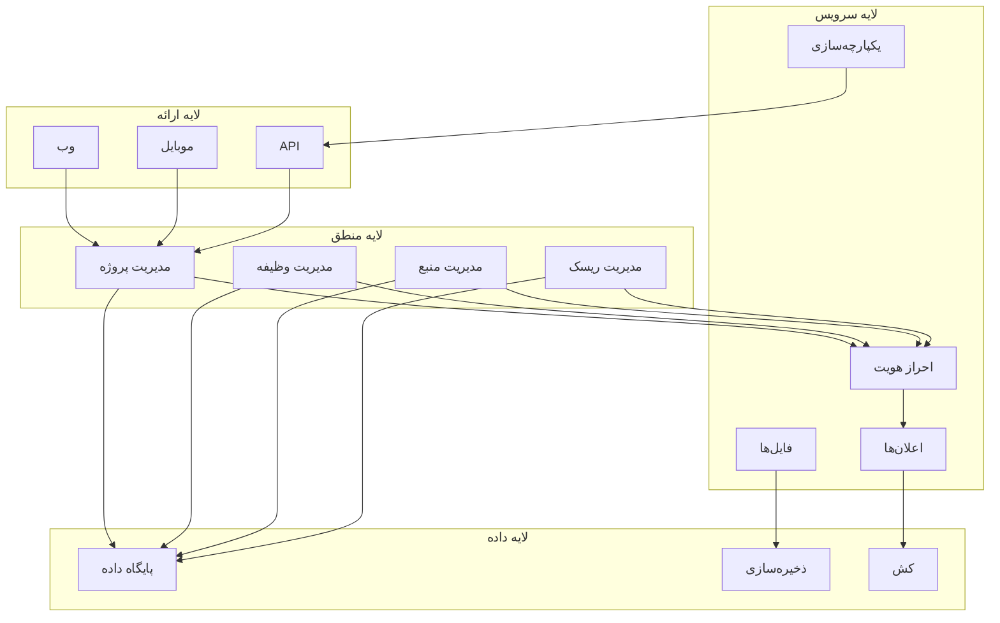

---

## مدل‌های داده

### دیاگرام موجودیت‌ها

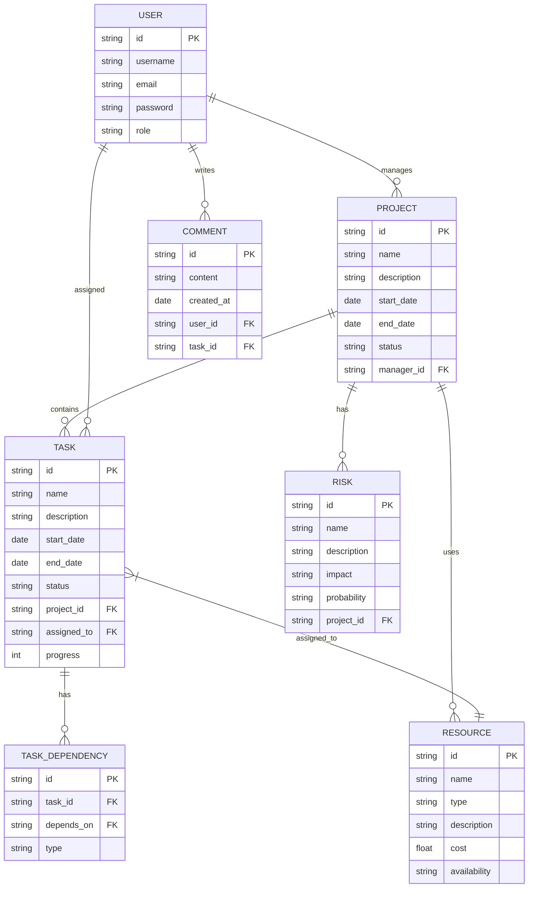

### توضیح موجودیت‌ها

#### پروژه (Project)
- **شناسه**: شناسه یکتای پروژه
- **نام**: نام پروژه
- **توضیحات**: توضیحات کامل پروژه
- **تاریخ شروع**: تاریخ شروع پروژه
- **تاریخ پایان**: تاریخ پایان پیش‌بینی شده
- **وضعیت**: وضعیت فعلی پروژه
- **مدیر**: شناسه مدیر پروژه

#### وظیفه (Task)
- **شناسه**: شناسه یکتای وظیفه
- **نام**: نام وظیفه
- **توضیحات**: توضیحات وظیفه
- **تاریخ شروع**: تاریخ شروع وظیفه
- **تاریخ پایان**: تاریخ پایان وظیفه
- **وضعیت**: وضعیت فعلی وظیفه
- **پروژه**: شناسه پروژه مرتبط
- **محول‌شده به**: شناسه کاربر محول‌شده
- **پیشرفت**: درصد پیشرفت وظیفه

#### منبع (Resource)
- **شناسه**: شناسه یکتای منبع
- **نام**: نام منبع
- **نوع**: نوع منبع (انسانی، تجهیزات، ...)
- **توضیحات**: توضیحات منبع
- **هزینه**: هزینه منبع
- **دسترسی**: وضعیت دسترسی منبع

#### ریسک (Risk)
- **شناسه**: شناسه یکتای ریسک
- **نام**: نام ریسک
- **توضیحات**: توضیحات ریسک
- **تأثیر**: سطح تأثیر ریسک
- **احتمال**: احتمال وقوع ریسک
- **پروژه**: شناسه پروژه مرتبط

### دیاگرام رابطه‌ها

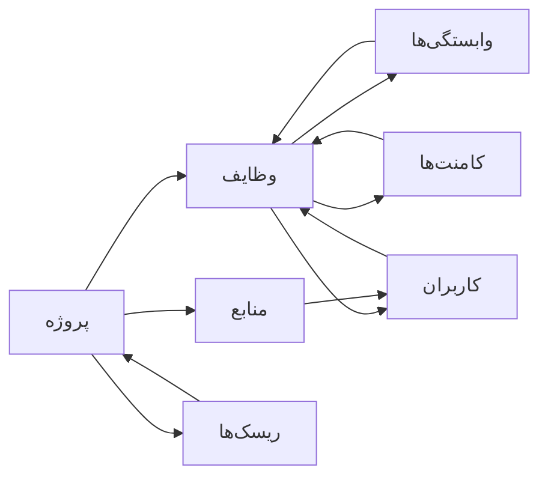

---

## اجزا و ماژول‌ها

### ماژول مدیریت پروژه

#### دیاگرام اجزا

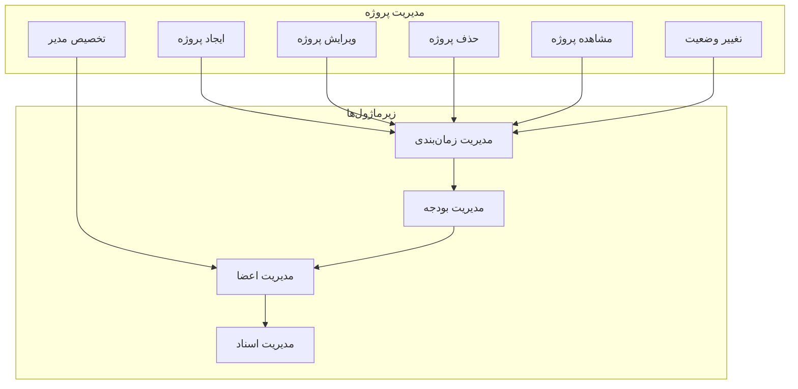

#### توضیح عملکرد

- **ایجاد پروژه**: ایجاد پروژه جدید با مشخصات کامل
- **ویرایش پروژه**: تغییر مشخصات پروژه موجود
- **حذف پروژه**: حذف پروژه و داده‌های مرتبط
- **مشاهده پروژه**: نمایش اطلاعات کامل پروژه
- **تغییر وضعیت**: تغییر وضعیت پروژه (فعال، متوقف، تمام‌شده)
- **تخصیص مدیر**: تعیین مدیر برای پروژه

### ماژول مدیریت وظایف

#### دیاگرام اجزا

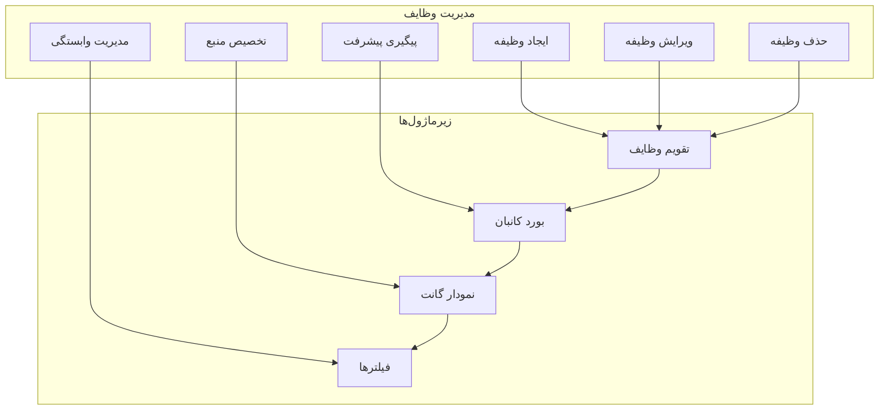

#### توضیح عملکرد

- **ایجاد وظیفه**: ایجاد وظیفه جدید با مشخصات کامل
- **ویرایش وظیفه**: تغییر مشخصات وظیفه موجود
- **حذف وظیفه**: حذف وظیفه و داده‌های مرتبط
- **پیگیری پیشرفت**: به‌روزرسانی پیشرفت وظیفه
- **تخصیص منبع**: تخصیص منابع به وظیفه
- **مدیریت وابستگی**: تعریف وابستگی بین وظایف

### ماژول مدیریت منابع

#### دیاگرام اجزا

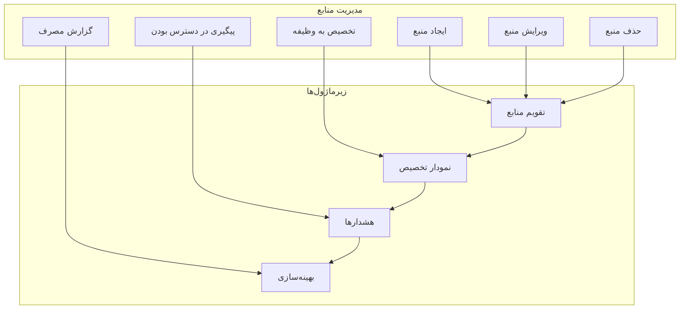

#### توضیح عملکرد

- **ایجاد منبع**: ایجاد منبع جدید با مشخصات کامل
- **ویرایش منبع**: تغییر مشخصات منبع موجود
- **حذف منبع**: حذف منبع و داده‌های مرتبط
- **تخصیص به وظیفه**: تخصیص منبع به وظایف
- **پیگیری در دسترس بودن**: بررسی در دسترس بودن منبع
- **گزارش مصرف**: گزارش مصرف منابع در پروژه‌ها

---

## جریان داده و کنترل

### جریان داده ایجاد پروژه

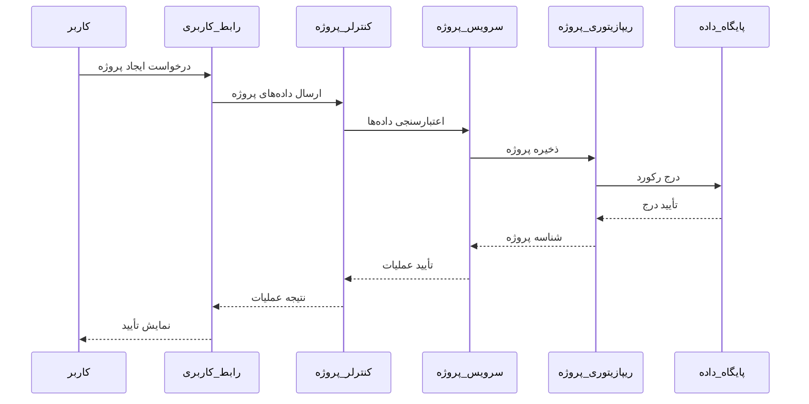

### جریان کنترل تخصیص وظیفه

```mermaid
stateDiagram-v2
    [*] --> شروع
    شروع --> انتخاب_وظیفه
    انتخاب_وظیفه --> انتخاب_منبع
    انتخاب_منبع --> بررسی_دسترس_بودن
    بررسی_دسترس_بودن --> در_دسترس_است؟
    
    در_دسترس_است؟ --> بله --> تخصیص_منبع
    در_دسترس_است؟ --> خیر --> نمایش_خطا
    
    تخصیص_منبع --> به_روزرسانی_وظیفه
    به_روزرسانی_وظیفه --> ارسال_اعلان
    ارسال_اعلان --> پایان
    پایان --> [*]
    
    نمایش_خطا --> انتخاب_منبع_دیگر
    انتخاب_منبع_دیگر --> بررسی_دسترس_بودن
```

### دیاگرام جریان داده گزارش‌دهی

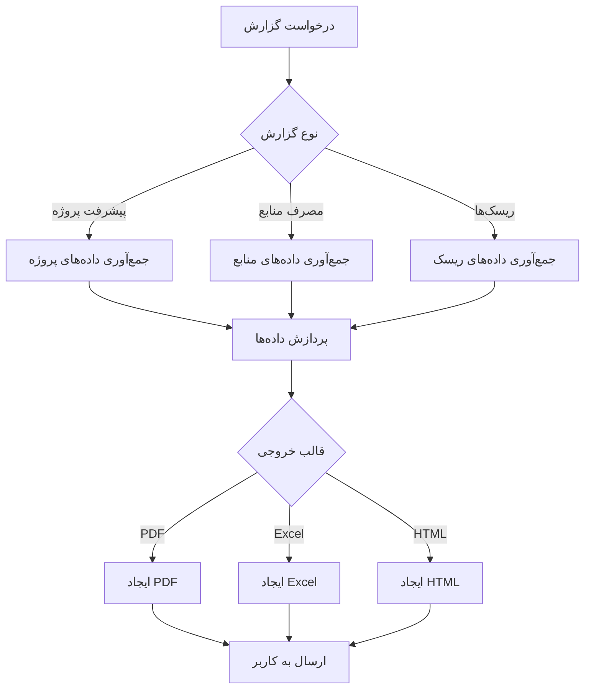

---

## یکپارچه‌سازی با سیستم‌های خارجی

### دیاگرام یکپارچه‌سازی

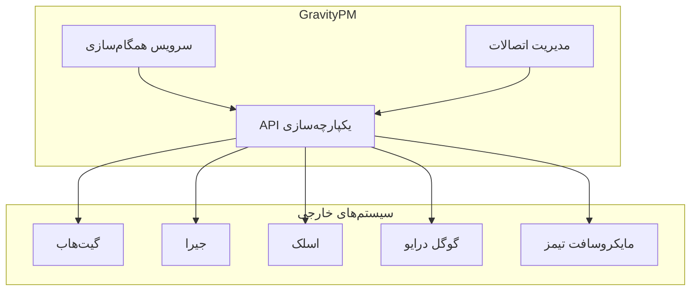

### جدول یکپارچه‌سازی

| سیستم خارجی | نوع یکپارچه‌سازی | داده‌های مبادله‌شده | فرکانس |
|-------------|------------------|----------------------|--------|
| گیت‌هاب | دوطرفه | کامیت‌ها، Issues | لحظه‌ای |
| جیرا | یکطرفه | وظایف، پروژه‌ها | روزانه |
| اسلک | یکطرفه | اعلان‌ها | لحظه‌ای |
| گوگل درایو | دوطرفه | فایل‌ها، اسناد | لحظه‌ای |
| مایکروسافت تیمز | یکطرفه | پیام‌ها، جلسات | لحظه‌ای |

### دیاگرام توالی یکپارچه‌سازی با گیت‌هاب

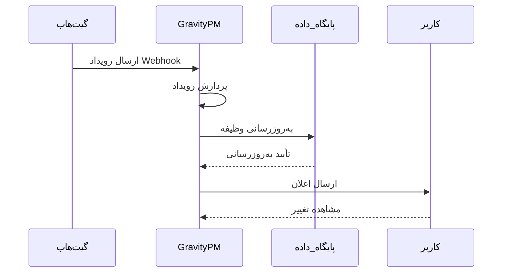

---

## امنیت

### دیاگرام امنیتی

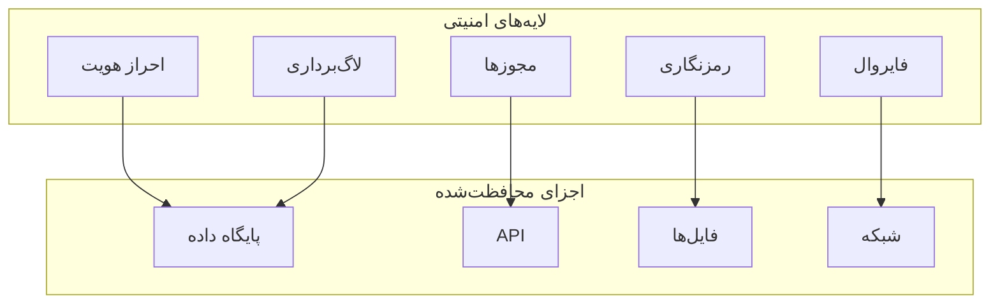

### مکانیزم‌های امنیتی

#### احراز هویت
- **ورود با نام کاربری و رمز عبور**
- **احراز هویت دو مرحله‌ای**
- **ورود با شبکه‌های اجتماعی**
- **توکن‌های دسترسی موقت**

#### مجوزها
- **سطح دسترسی مبتنی بر نقش (RBAC)**
- **دسترسی مبتنی بر ویژگی‌ها (ABAC)**
- **مجوزهای دقیق برای عملیات**
- ** inherited permissions**

#### رمزنگاری
- **رمزنگاری داده‌های حساس در حالت سکون**
- **رمزنگاری ارتباطات با TLS**
- **رمزنگاری فایل‌های پیوست**
- **مدیریت کلید امن**

#### لاگ‌برداری
- **ثبت تمام عملیات حساس**
- **ثبت تلاش‌های ناموفق ورود**
- **ثبت تغییرات داده‌ها**
- **نظارت بر فعالیت‌های مشکوک**

### دیاگرام جریان امنیتی

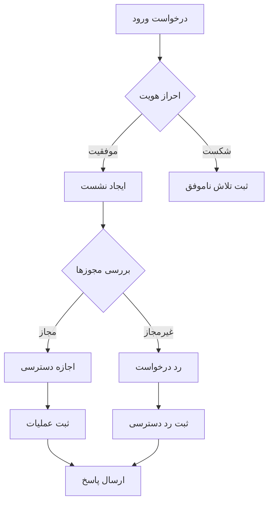

---

## عملکرد و مقیاس‌پذیری

### دیاگرام مقیاس‌پذیری

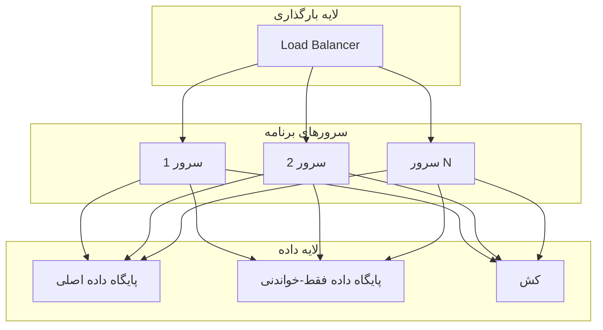

### استراتژی‌های بهینه‌سازی

#### بهینه‌سازی پایگاه داده
- **ایندکس‌گذاری مناسب**
- **بهینه‌سازی کوئری‌ها**
- **نرمال‌سازی داده‌ها**
- **پارتیشن‌بندی جدول‌های بزرگ**

#### کش کردن داده‌ها
- **کش کردن نتایج پرکاربرد**
- **کش کردن داده‌های مرجع**
- **کش کردن سشن‌های کاربران**
- **پاک‌سازی خودکار کش**

#### بهینه‌سازی شبکه
- **فشرده‌سازی پاسخ‌ها**
- **استفاده از CDN**
- **بهینه‌سازی تصاویر**
- **بارگذاری تنبل**

### جدول معیارهای عملکرد

| معیار | هدف | حداقل | بهینه |
|-------|------|-------|-------|
| زمان پاسخ API | < 200ms | < 500ms | < 100ms |
| زمان بارگذاری صفحه | < 2s | < 3s | < 1s |
| ظرفیت کاربر همزمان | 5000 | 2000 | 10000 |
| زمان پردازش گزارش | < 10s | < 30s | < 5s |
| uptime | 99.9% | 99% | 99.99% |

---

## استقرار

### دیاگرام استقرار

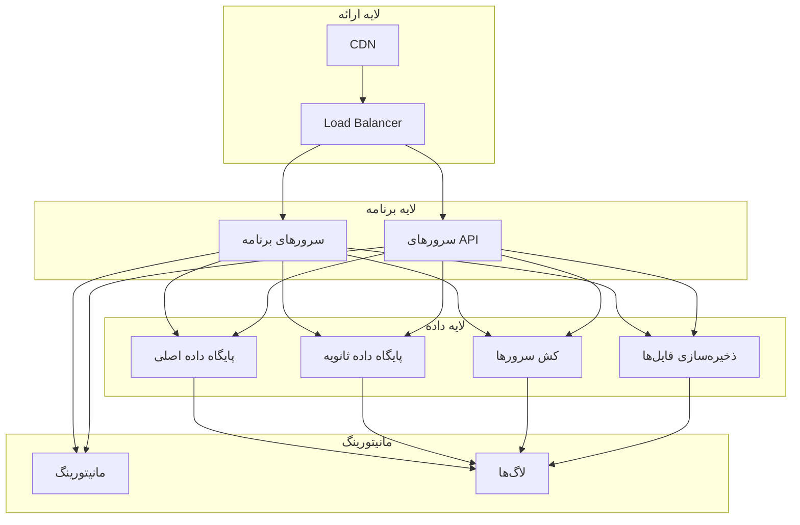

### محیط‌های استقرار

#### محیط توسعه
- **تعداد سرور**: 1
- **پیکربندی**: minimal
- **داده‌ها**: داده‌های تست
- **دسترسی**: توسعه‌دهندگان

#### محیط تست
- **تعداد سرور**: 2
- **پیکربندی**: مشابه تولید
- **داده‌ها**: داده‌های تست واقعی
- **دسترسی**: تیم تست و QA

#### محیط تولید
- **تعداد سرور**: 4+
- **پیکربندی**: بهینه‌سازی شده
- **داده‌ها**: داده‌های واقعی
- **دسترسی**: تیم عملیات

### استراتژی استقرار

#### استقرار پیوسته
- **استفاده از CI/CD**
- **تست‌های خودکار**
- **استقرار تدریجی**
- **قابلیت بازگشت سریع**

#### مانیتورینگ و لاگ‌برداری
- **نظارت بر عملکرد**
- **نظارت بر سلامت سیستم**
- **لاگ‌برداری متمرکز**
- **هشدارهای خودکار**

#### پشتیبان‌گیری و بازیابی
- **پشتیبان‌گیری منظم**
- **پشتیبان‌گیری در مکان‌های مختلف**
- **تست بازیابی**
- **برنامه بازیابی بلایا**

---

## نتیجه‌گیری

GravityPM یک نرم‌افزار مدیریت پروژه جامع است که با معماری مدرن و ماژولار طراحی شده است. این سیستم با تمرکز بر شفافیت، کارایی و همکاری تیمی، ابزارهای کاملی برای مدیریت پروژه‌های پیچیده فراهم می‌کند.

### نقاط قوت معماری
- **معماری چندلایه**: جداسازی وظایف و قابلیت نگهداری بالا
- **قابلیت توسعه**: امکان افزودن قابلیت‌های جدید بدون تأثیر بر سیستم موجود
- **امنیت لایه‌ای**: حفاظت از داده‌ها در تمام سطوح
- **مقیاس‌پذیری**: توانایی مدیریت رشد کاربران و داده‌ها
- **یکپارچه‌سازی**: امکان اتصال به ابزارهای خارجی

### چالش‌ها و راهکارها
- **پیچیدگی مدیریت**: استفاده از طراحی ماژولار و مستندات کامل
- **عملکرد در مقیاس بزرگ**: بهینه‌سازی پایگاه داده و کش کردن داده‌ها
- **امنیت داده‌ها**: پیاده‌سازی لایه‌های امنیتی متعدد
- **یکپارچه‌سازی با سیستم‌های قدیمی**: استفاده از APIهای استاندارد

### مسیر آینده
- **افزودن هوش مصنوعی**: برای پیش‌بینی ریسک‌ها و بهینه‌سازی منابع
- **گسترش موبایل**: توسعه برنامه‌های موبایل بومی
- **بهبود تجربه کاربری**: طراحی رابط‌های کاربری پیشرفته‌تر
- **افزایش یکپارچه‌سازی**: اتصال به سیستم‌های بیشتر

این سند طراحی معماری یک چارچوب جامع برای توسعه و استقرار نرم‌افزار GravityPM فراهم می‌کند و با رعایت اصول طراحی مدرن، تضمین می‌کند که سیستم پایدار، امن و قابل توسعه خواهد بود.