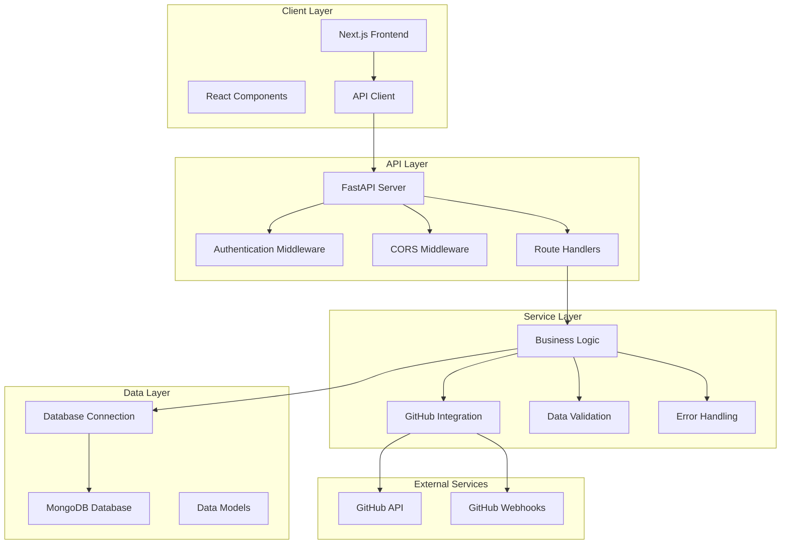
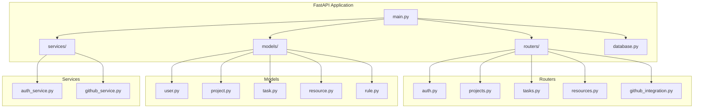
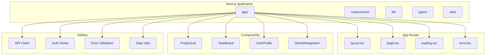
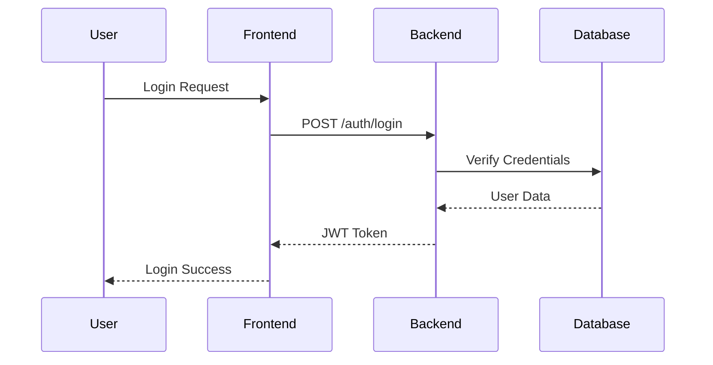
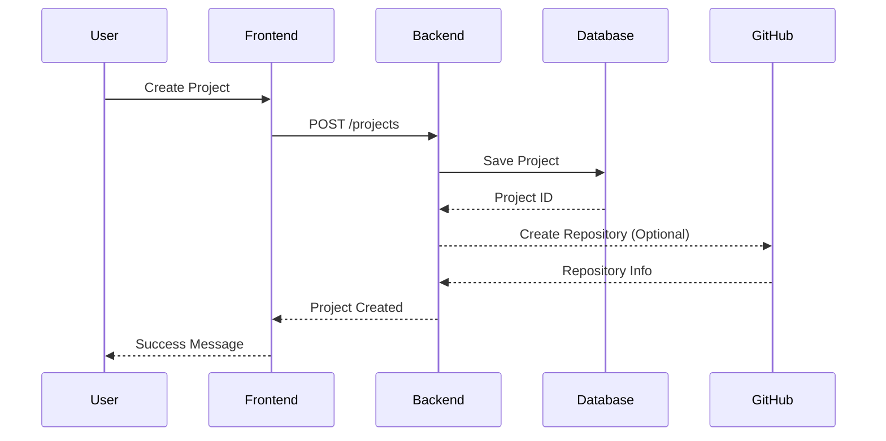
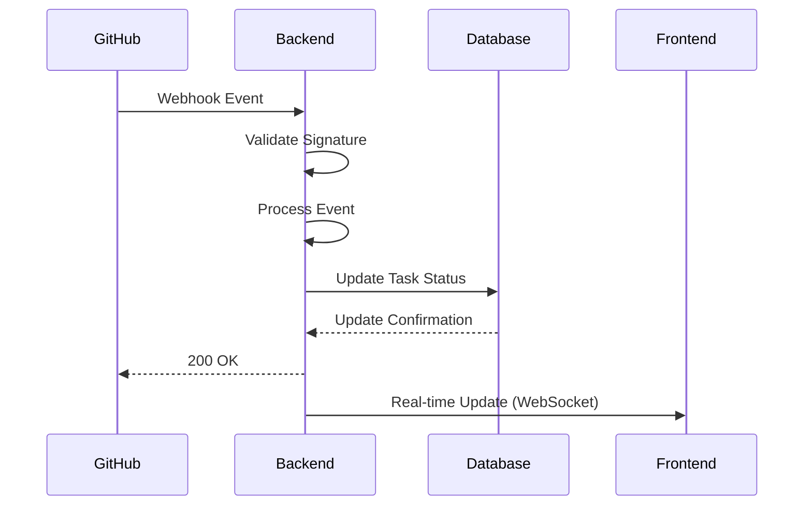
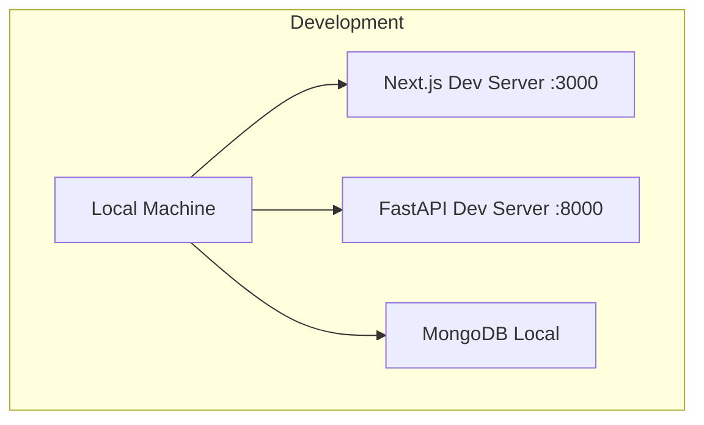
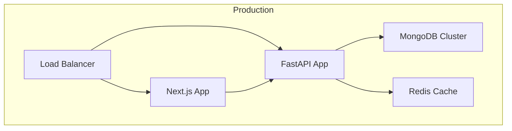

# GravityPM Architecture Documentation

## Overview

GravityPM is a comprehensive project management system built with modern web technologies. The system provides automated project management capabilities with seamless GitHub integration for streamlined development workflows.

## Technology Stack

### Backend
- **Framework**: FastAPI (Python)
- **Database**: MongoDB
- **Authentication**: JWT (JSON Web Tokens)
- **API Documentation**: OpenAPI/Swagger
- **ASGI Server**: Uvicorn

### Frontend
- **Framework**: Next.js 14 (React)
- **Language**: TypeScript
- **Styling**: Tailwind CSS
- **UI Components**: Radix UI
- **State Management**: React Hooks
- **HTTP Client**: Axios

### Infrastructure
- **Database**: MongoDB
- **Cache**: Redis (optional)
- **Deployment**: Docker
- **Version Control**: Git
- **CI/CD**: GitHub Actions

## System Architecture

### High-Level Architecture



### Component Architecture

#### Backend Components



#### Frontend Components



## Data Flow

### Authentication Flow



### Project Management Flow



### GitHub Integration Flow



## Database Schema

### User Collection
```json
{
  "_id": ObjectId,
  "username": "string",
  "email": "string",
  "full_name": "string",
  "hashed_password": "string",
  "role": "user|admin|manager",
  "github_id": "string",
  "disabled": false,
  "created_at": DateTime,
  "updated_at": DateTime
}
```

### Project Collection
```json
{
  "_id": ObjectId,
  "name": "string",
  "description": "string",
  "owner_id": ObjectId,
  "members": [ObjectId],
  "status": "active|completed|archived",
  "github_repo": "string",
  "created_at": DateTime,
  "updated_at": DateTime
}
```

### Task Collection
```json
{
  "_id": ObjectId,
  "title": "string",
  "description": "string",
  "project_id": ObjectId,
  "assignee_id": ObjectId,
  "status": "todo|in_progress|review|done",
  "priority": "low|medium|high",
  "due_date": DateTime,
  "github_issue_id": "string",
  "created_at": DateTime,
  "updated_at": DateTime
}
```

## API Design

### RESTful Endpoints

#### Authentication
- `POST /auth/login` - User login
- `POST /auth/register` - User registration
- `POST /auth/refresh` - Token refresh
- `GET /auth/me` - Get current user

#### Projects
- `GET /projects` - List projects
- `POST /projects` - Create project
- `GET /projects/{id}` - Get project details
- `PUT /projects/{id}` - Update project
- `DELETE /projects/{id}` - Delete project

#### Tasks
- `GET /tasks` - List tasks
- `POST /tasks` - Create task
- `GET /tasks/{id}` - Get task details
- `PUT /tasks/{id}` - Update task
- `DELETE /tasks/{id}` - Delete task

#### GitHub Integration
- `POST /github/webhook` - GitHub webhook handler
- `GET /github/repos` - Get user repositories
- `POST /github/connect` - Connect GitHub account

### Response Format

#### Success Response
```json
{
  "success": true,
  "data": { ... },
  "message": "Operation successful"
}
```

#### Error Response
```json
{
  "success": false,
  "error": {
    "code": "VALIDATION_ERROR",
    "message": "Invalid input data",
    "details": { ... }
  }
}
```

## Security Considerations

### Authentication & Authorization
- JWT-based authentication
- Password hashing with bcrypt
- Role-based access control (RBAC)
- Token expiration and refresh

### Data Protection
- Input validation with Pydantic
- SQL injection prevention (MongoDB)
- XSS protection in frontend
- CORS configuration

### GitHub Integration Security
- Webhook signature validation
- GitHub token encryption
- Rate limiting
- Secure token storage

## Deployment Architecture

### Development Environment


### Production Environment


## Performance Optimization

### Backend Optimizations
- Asynchronous database operations
- Connection pooling
- Caching with Redis
- Database indexing
- API rate limiting

### Frontend Optimizations
- Code splitting
- Image optimization
- Lazy loading
- Service worker caching
- Bundle analysis

## Monitoring & Logging

### Application Monitoring
- Health check endpoints
- Performance metrics
- Error tracking
- Database monitoring

### Logging Strategy
- Structured logging
- Log levels (DEBUG, INFO, WARNING, ERROR)
- Centralized log aggregation
- Log retention policies

## Conclusion

The GravityPM architecture provides a scalable, maintainable, and secure foundation for project management with seamless GitHub integration. The separation of concerns between frontend and backend, combined with modern technologies, ensures high performance and developer productivity.