# سند پیاده‌سازی نرم‌افزار مدیریت پروژه GravityPM

## فهرست مطالب

1. [مقدمه](#مقدمه)
2. [اهداف پیاده‌سازی](#اهداف-پیادهسازی)
3. [مرور کلی معماری](#مرور-کلی-معماری)
4. [پیاده‌سازی لایه داده](#پیادهسازی-لایه-داده)
5. [پیاده‌سازی لایه منطق کسب‌وکار](#پیادهسازی-لایه-منطق-کسبوکار)
6. [پیاده‌سازی لایه ارائه](#پیادهسازی-لایه-ارائه)
7. [پیاده‌سازی سرویس‌های پشتیبان](#پیادهسازی-سرویسهای-پشتیبان)
8. [پیاده‌سازی یکپارچه‌سازی با سیستم‌های خارجی](#پیادهسازی-یکپارچهسازی-با-سیستمهای-خارجی)
9. [پیاده‌سازی امنیت](#پیادهسازی-امنیت)
10. [پیاده‌سازی عملکرد و مقیاس‌پذیری](#پیادهسازی-عملکرد-و-مقیاسپذیری)
11. [پیاده‌سازی تست و استقرار](#پیادهسازی-تست-و-استقرار)
12. [نتیجه‌گیری](#نتیجهگیری)

---

## مقدمه

این سند پیاده‌سازی نرم‌افزار مدیریت پروژه GravityPM را توصیف می‌کند. GravityPM یک سیستم جامع برای مدیریت پروژه‌های نرم‌افزاری است که با تمرکز بر خودکارسازی فرآیندها و یکپارچه‌سازی با GitHub طراحی شده است. هدف این سیستم، کاهش ورودی‌های دستی و افزایش کارایی در مدیریت پروژه‌ها از طریق اتوماسیون هوشمند است.

### چالش‌های اصلی

- مدیریت پیچیدگی پروژه‌های نرم‌افزاری بزرگ
- پیگیری پیشرفت فعالیت‌ها و منابع
- مدیریت وابستگی‌ها بین وظایف
- هماهنگی بین اعضای تیم
- گزارش‌دهی دقیق و به‌موقع
- مدیریت ریسک‌ها و مسائل

### راهکارهای پیشنهادی

- معماری چندلایه با جداسازی وظایف
- استفاده از فایل‌های JSON به جای پایگاه داده
- یکپارچه‌سازی کامل با GitHub
- خودکارسازی فرآیندهای مدیریت پروژه
- طراحی رابط کاربری کاربرپسند

---

## اهداف پیاده‌سازی

### اهداف عملکردی

| شناسه | هدف | اولویت | توضیح |
|-------|------|--------|-------|
| FO-001 | پیاده‌سازی مدیریت پروژه‌ها | بالا | ایجاد، ویرایش، حذف و مشاهده پروژه‌ها |
| FO-002 | پیاده‌سازی مدیریت وظایف | بالا | ایجاد، ویرایش، حذف و پیگیری وظایف |
| FO-003 | پیاده‌سازی مدیریت منابع | بالا | تخصیص و مدیریت منابع انسانی و غیرانسانی |
| FO-004 | پیاده‌سازی خودکارسازی | بالا | خودکارسازی فرآیندها بر اساس رویدادهای GitHub |
| FO-005 | پیاده‌سازی گزارش‌دهی | متوسط | ایجاد گزارش‌های متنوع از پروژه‌ها |
| FO-006 | پیاده‌سازی مدیریت ریسک | متوسط | شناسایی، ارزیابی و مدیریت ریسک‌ها |

### اهداف غیرعملکردی

| شناسه | هدف | اولویت | معیار |
|-------|------|--------|-------|
| NFO-001 | کارایی | بالا | زمان پاسخ کمتر از 2 ثانیه |
| NFO-002 | مقیاس‌پذیری | بالا | پشتیبانی از 10000 کاربر همزمان |
| NFO-003 | امنیت | بالا | رمزنگاری داده‌های حساس |
| NFO-004 | قابلیت اطمینان | متوسط | 99.9% زمان کارکرد |
| NFO-005 | قابلیت استفاده | متوسط | رابط کاربری ساده و شهودی |

---

## مرور کلی معماری

### دیاگرام معماری پیاده‌سازی

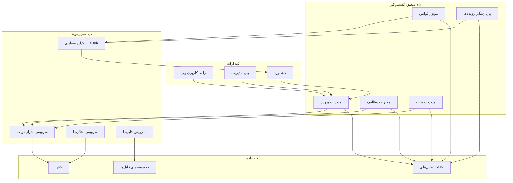

### توضیح معماری پیاده‌سازی

GravityPM از یک معماری چندلایه استفاده می‌کند که شامل:

1. **لایه ارائه**: شامل رابط کاربری وب، پنل مدیریت و داشبورد
2. **لایه منطق کسب‌وکار**: شامل ماژول‌های اصلی مدیریت پروژه، وظایف، منابع و موتور قوانین
3. **لایه سرویس‌ها**: شامل سرویس‌های پشتیبان مانند احراز هویت، اعلان‌ها و یکپارچه‌سازی
4. **لایه داده**: شامل فایل‌های JSON، ذخیره‌سازی فایل‌ها و کش

### اصول پیاده‌سازی

- **جداسازی وظایف**: هر جزء مسئولیت مشخصی دارد
- **استفاده از فایل‌های JSON**: به جای پایگاه داده برای سادگی و قابلیت حمل
- **یکپارچه‌سازی با GitHub**: به عنوان تنها سیستم خارجی
- **خودکارسازی فرآیندها**: با استفاده از موتور قوانین و پردازشگر رویدادها
- **امنیت لایه‌ای**: حفاظت از داده‌ها در تمام سطوح

---

## پیاده‌سازی لایه داده

### ساختار فایل‌های JSON

#### فایل project.json

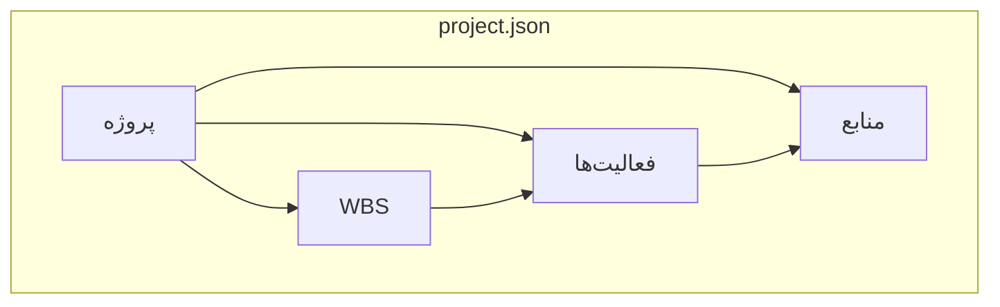

#### فایل rules.json

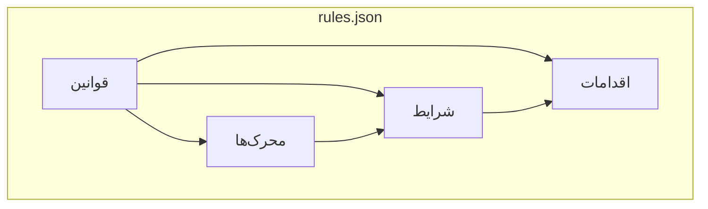

#### فایل config.json

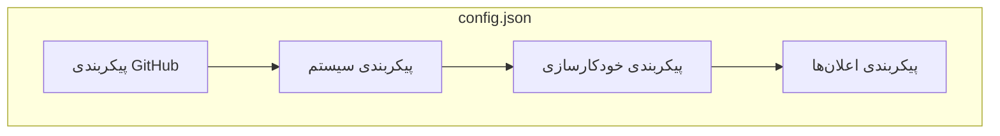

### جدول ساختار داده‌ها

| موجودیت | فایل | فیلدها | توضیح |
|---------|------|--------|-------|
| پروژه | project.json | project_id, name, start_date, end_date, status | اطلاعات اصلی پروژه |
| WBS | project.json | wbs_id, name, project_id, parent_wbs_id | ساختار شکست کار |
| فعالیت | project.json | activity_id, name, duration, status, assignee, wbs_id, dependencies | فعالیت‌های پروژه |
| منبع | project.json | resource_id, name, role, cost_per_hour, github_username | منابع پروژه |
| قانون | rules.json | rule_id, name, trigger, conditions, actions | قوانین خودکارسازی |
| پیکربندی | config.json | github, system, automation, notifications | تنظیمات سیستم |

### دیاگرام جریان داده

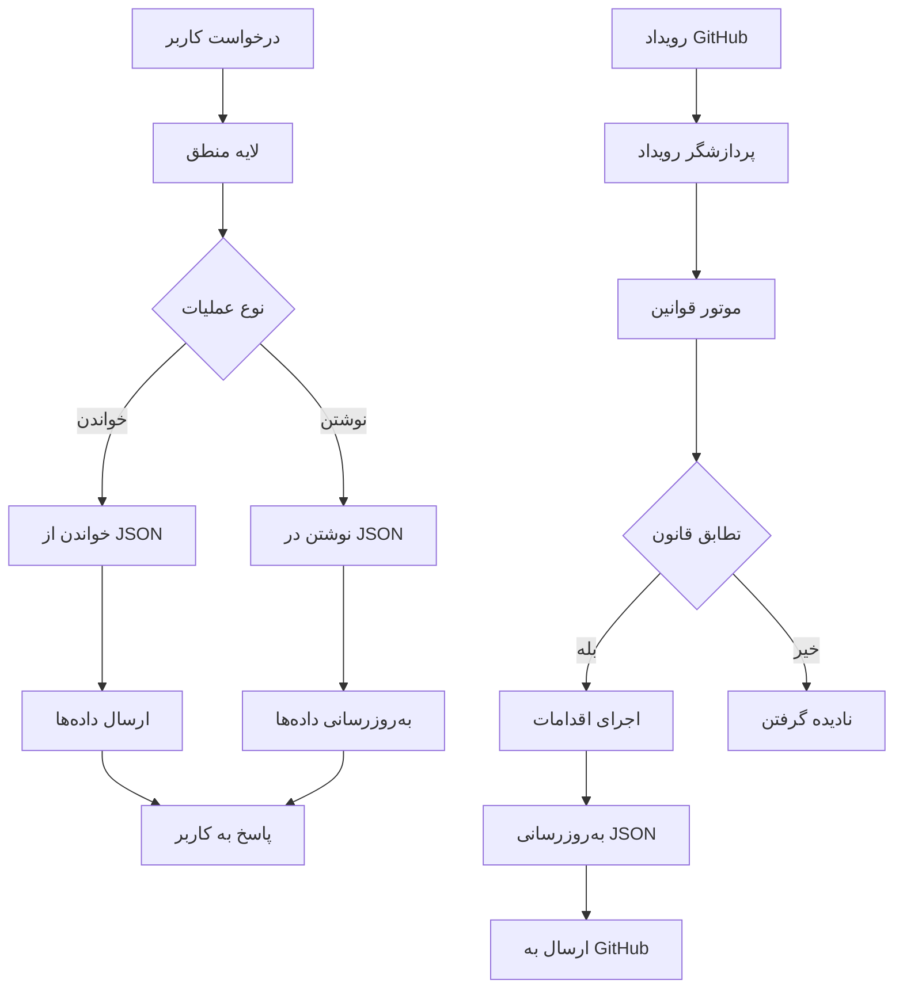

### استراتژی‌های پیاده‌سازی داده

#### مدیریت فایل‌های JSON
- **قفل‌گذاری فایل‌ها**: برای جلوگیری از تداخل در دسترسی
- **پشتیبان‌گیری**: ایجاد نسخه‌های پشتیبان از فایل‌ها
- **اعتبارسنجی داده‌ها**: بررسی صحت داده‌ها قبل از ذخیره‌سازی
- **بهینه‌سازی**: فشرده‌سازی فایل‌های بزرگ

#### کش کردن داده‌ها
- **کش کردن داده‌های پرکاربرد**: برای افزایش کارایی
- **پاک‌سازی خودکار**: حذف داده‌های قدیمی از کش
- **همگام‌سازی**: همگام‌سازی کش با فایل‌های اصلی

---

## پیاده‌سازی لایه منطق کسب‌وکار

### دیاگرام اجزا

```mermaid
componentDiagram
    [مدیریت پروژه] --> [سرویس پروژه]
    [مدیریت وظایف] --> [سرویس وظیفه]
    [مدیریت منابع] --> [سرویس منبع]
    [موتور قوانین] --> [پردازشگر قوانین]
    [پردازشگر رویدادها] --> [پردازشگر GitHub]
    
    [سرویس پروژه] --> [دسترسی به داده‌ها]
    [سرویس وظیفه] --> [دسترسی به داده‌ها]
    [سرویس منبع] --> [دسترسی به داده‌ها]
    [پردازشگر قوانین] --> [دسترسی به داده‌ها]
    [پردازشگر GitHub] --> [دسترسی به داده‌ها]
```

### پیاده‌سازی مدیریت پروژه

#### دیاگرام جریان مدیریت پروژه

```mermaid
stateDiagram-v2
    [*] --> ایجاد_پروژه
    ایجاد_پروژه --> اعتبارسنجی
    اعتبارسنجی --> معتبر؟
    
    معتبر؟ --> بله --> ذخیره_پروژه
    معتبر؟ --> خیر --> نمایش_خطا
    
    ذخیره_پروژه --> ایجاد_WBS_پیش‌فرض
    ایجاد_WBS_پیش‌فرض --> ایجاد_فعالیت_پیش‌فرض
    ایجاد_فعالیت_پیش‌فرض --> تخصیص_منابع_پیش‌فرض
    تخصیص_منابع_پیش‌فرض --> ارسال_اعلان
    ارسال_اعلان --> پایان
    
    نمایش_خطا --> اصلاح_داده‌ها
    اصلاح_داده‌ها --> اعتبارسنجی
    
    پایان --> [*]
```

#### جدول عملیات مدیریت پروژه

| عملیات | ورودی‌ها | خروجی‌ها | توضیح |
|--------|----------|----------|-------|
| ایجاد پروژه | نام، توضیحات، تاریخ شروع، تاریخ پایان | شناسه پروژه | ایجاد پروژه جدید با WBS پیش‌فرض |
| ویرایش پروژه | شناسه پروژه، داده‌های جدید | وضعیت عملیات | به‌روزرسانی اطلاعات پروژه |
| حذف پروژه | شناسه پروژه | وضعیت عملیات | حذف پروژه و داده‌های مرتبط |
| مشاهده پروژه | شناسه پروژه | اطلاعات کامل پروژه | نمایش اطلاعات پروژه |
| تغییر وضعیت | شناسه پروژه، وضعیت جدید | وضعیت عملیات | تغییر وضعیت پروژه |

### پیاده‌سازی مدیریت وظایف

#### دیاگرام جریان مدیریت وظایف

```mermaid
sequenceDiagram
    participant کاربر
    participant رابط_کاربری
    participant سرویس_وظیفه
   参与者 موتور_قوانین
    participant داده‌ها
    
    کاربر->>رابط_کاربری: درخواست ایجاد وظیفه
    رابط_کاربری->>سرویس_وظیفه: ارسال داده‌های وظیفه
    سرویس_وظیفه->>سرویس_وظیفه: اعتبارسنجی داده‌ها
    سرویس_وظیفه->>موتور_قوانین: بررسی قوانین
    موتور_قوانین-->>سرویس_وظیفه: نتیجه بررسی
    سرویس_وظیفه->>داده‌ها: ذخیره وظیفه
    داده‌ها-->>سرویس_وظیفه: تأیید ذخیره
    سرویس_وظیفه-->>رابط_کاربری: نتیجه عملیات
    رابط_کاربری-->>کاربر: نمایش تأیید
```

#### جدول عملیات مدیریت وظایف

| عملیات | ورودی‌ها | خروجی‌ها | توضیح |
|--------|----------|----------|-------|
| ایجاد وظیفه | نام، توضیحات، مدت، WBS، وابستگی‌ها | شناسه وظیفه | ایجاد وظیفه جدید |
| ویرایش وظیفه | شناسه وظیفه، داده‌های جدید | وضعیت عملیات | به‌روزرسانی اطلاعات وظیفه |
| حذف وظیفه | شناسه وظیفه | وضعیت عملیات | حذف وظیفه و به‌روزرسانی وابستگی‌ها |
| به‌روزرسانی وضعیت | شناسه وظیفه، وضعیت جدید | وضعیت عملیات | تغییر وضعیت وظیفه |
| تخصیص منبع | شناسه وظیفه، شناسه منبع | وضعیت عملیات | تخصیص منبع به وظیفه |

### پیاده‌سازی موتور قوانین

#### دیاگرام جریان موتور قوانین

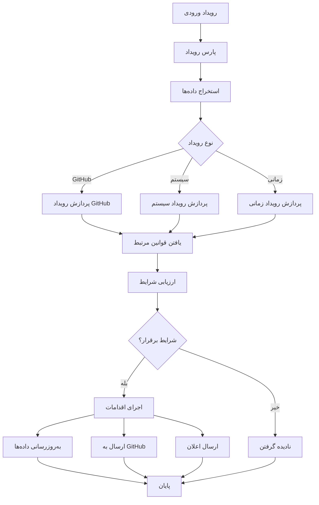

#### جدول قوانین خودکارسازی

| قانون | محرک | شرایط | اقدامات | توضیح |
|-------|-------|--------|---------|-------|
| به‌روزرسانی وضعیت | push | پیام حاوی ACT- | به‌روزرسانی وضعیت به In Progress | به‌روزرسانی وضعیت فعالیت بر اساس کامیت |
| بسته شدن Issue | issues.closed | issue مرتبط با فعالیت | وضعیت Completed | تغییر وضعیت فعالیت به Completed |
| بررسی تأخیر | daily_check | تاریخ فعلی > تاریخ پایان | ایجاد Issue در GitHub | هشدار تأخیر فعالیت |
| بررسی وابستگی | status_change | تمام وابستگی‌ها تکمیل شده‌اند | ایجاد Issue "Ready to Start" | اطلاع‌رسانی آماده به کار بودن فعالیت |
| ثبت باگ | push | برچسب bug در کامیت | ایجاد Issue در GitHub | ثبت خودکار باگ‌ها |

---

## پیاده‌سازی لایه ارائه

### دیاگرام ساختار رابط کاربری

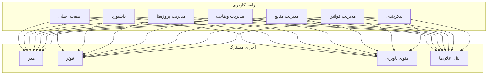

### پیاده‌سازی داشبورد

#### دیاگرام اجزای داشبورد

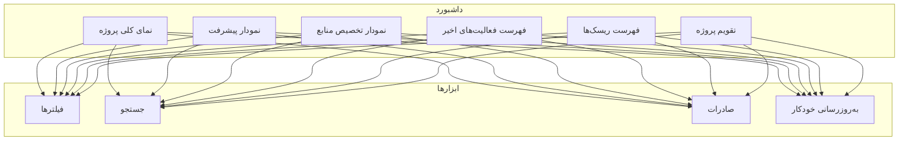

#### جدول اجزای داشبورد

| جزء | توضیح | داده‌های مورد نیاز | به‌روزرسانی |
|------|-------|-------------------|-------------|
| نمای کلی پروژه | نمایش آمار کلی پروژه | تعداد فعالیت‌ها، پیشرفت کلی، وضعیت پروژه | لحظه‌ای |
| نمودار پیشرفت | نمایش پیشرفت پروژه در زمان | تاریخ‌ها، درصد پیشرفت | روزانه |
| نمودار تخصیص منابع | نمایش تخصیص منابع به فعالیت‌ها | منابع، فعالیت‌ها، درصد تخصیص | روزانه |
| فهرست فعالیت‌های اخیر | نمایش فعالیت‌های اخیر | فعالیت‌ها، تاریخ‌ها، وضعیت‌ها | لحظه‌ای |
| فهرست ریسک‌ها | نمایش ریسک‌های فعال | ریسک‌ها، تأثیر، احتمال | روزانه |
| تقویم پروژه | نمایش تقویم پروژه | فعالیت‌ها، تاریخ‌ها، رویدادها | روزانه |

### پیاده‌سازی مدیریت پروژه‌ها

#### دیاگرام جریان مدیریت پروژه‌ها

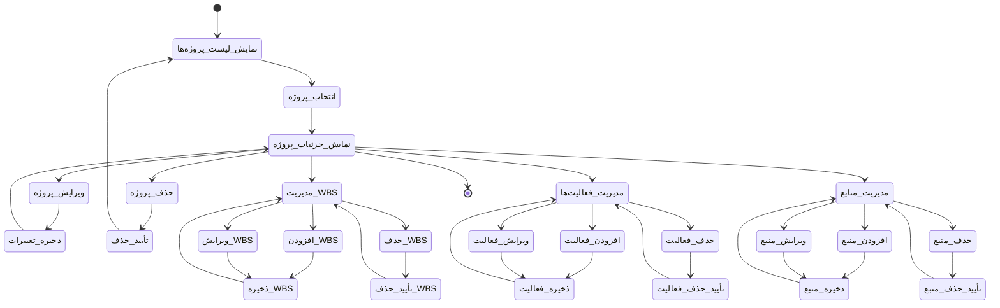

#### جدول عملیات مدیریت پروژه‌ها

| عملیات | ورودی‌ها | خروجی‌ها | توضیح |
|--------|----------|----------|-------|
| نمایش لیست پروژه‌ها | - | لیست پروژه‌ها | نمایش تمام پروژه‌ها |
| نمایش جزئیات پروژه | شناسه پروژه | اطلاعات کامل پروژه | نمایش اطلاعات پروژه |
| ویرایش پروژه | شناسه پروژه، داده‌های جدید | وضعیت عملیات | به‌روزرسانی اطلاعات پروژه |
| حذف پروژه | شناسه پروژه | وضعیت عملیات | حذف پروژه و داده‌های مرتبط |
| مدیریت WBS | شناسه پروژه | لیست WBS | مدیریت ساختار شکست کار |
| مدیریت فعالیت‌ها | شناسه پروژه | لیست فعالیت‌ها | مدیریت فعالیت‌های پروژه |
| مدیریت منابع | شناسه پروژه | لیست منابع | مدیریت منابع پروژه |

---

## پیاده‌سازی سرویس‌های پشتیبان

### پیاده‌سازی سرویس احراز هویت

#### دیاگرام جریان احراز هویت

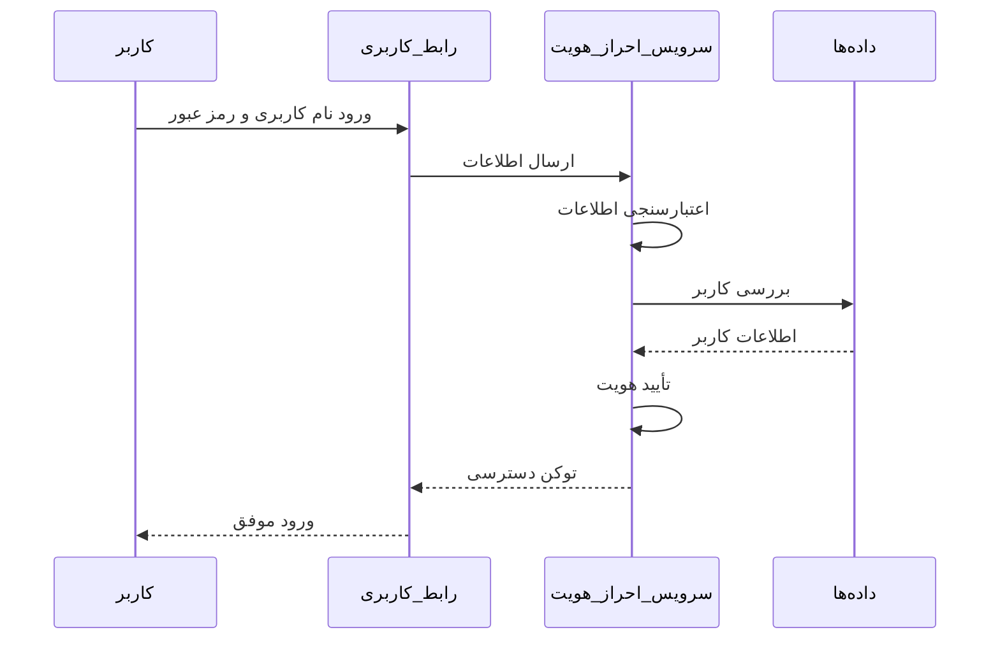

#### جدول عملیات احراز هویت

| عملیات | ورودی‌ها | خروجی‌ها | توضیح |
|--------|----------|----------|-------|
| ورود | نام کاربری، رمز عبور | توکن دسترسی | احراز هویت کاربر |
| خروج | توکن دسترسی | وضعیت عملیات | خروج کاربر از سیستم |
| تمدید جلسه | توکن دسترسی | توکن جدید | تمدید جلسه کاربر |
| تأیید مجوز | توکن دسترسی، منبع | وضعیت مجوز | بررسی مجوز دسترسی |

### پیاده‌سازی سرویس اعلان‌ها

#### دیاگرام جریان اعلان‌ها

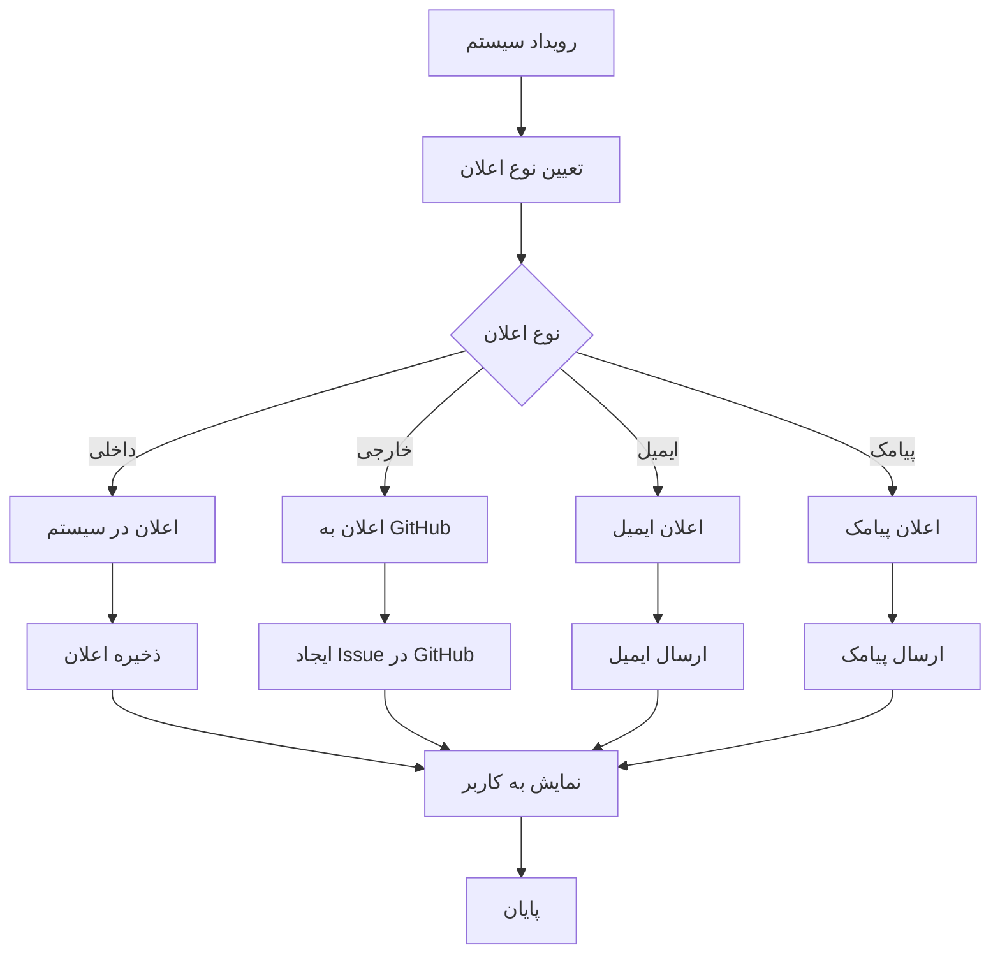

#### جدول انواع اعلان‌ها

| نوع اعلان | محرک | گیرنده | محتوا | توضیح |
|-----------|-------|--------|--------|-------|
| اعلان داخلی | تغییر وضعیت فعالیت | کاربران مرتبط | پیام متنی | اعلان در سیستم |
| Issue GitHub | تأخیر در فعالیت | تیم پروژه | Issue در GitHub | ایجاد Issue در GitHub |
| ایمیل | گزارش روزانه | مدیر پروژه | گزارش PDF | ارسال گزارش به ایمیل |
| پیامک | ریسک بحرانی | مدیر پروژه | پیام کوتاه | ارسال پیامک |

### پیاده‌سازی سرویس فایل‌ها

#### دیاگرام جریان مدیریت فایل‌ها

```mermaid
stateDiagram-v2
    [*] --> آپلود_فایل
    آپلود_فایل --> اعتبارسنجی_فایل
    اعتبارسنجی_فایل --> معتبر؟
    
    معتبر؟ --> بله --> ذخیره_فایل
    معتبر؟ --> خیر --> نمایش_خطا
    
    ذخیره_فایل --> ایجاد_پیوند
    ایجاد_پیوند --> به‌روزرسانی_مرجع
    به‌روزرسانی_مرجع --> ارسال_اعلان
    ارسال_اعلان --> پایان
    
    نمایش_خطا --> [*]
    
    دانلود_فایل --> بررسی_مجوز
    بررسی_مجوز --> مجاز؟
    
    مجوز؟ --> بله --> ارسال_فایل
    مجوز؟ --> خیر --> نمایش_خطا_دسترسی
    
    ارسال_فایل --> پایان
    نمایش_خطا_دسترسی --> [*]
    
    پایان --> [*]
```

#### جدول عملیات مدیریت فایل‌ها

| عملیات | ورودی‌ها | خروجی‌ها | توضیح |
|--------|----------|----------|-------|
| آپلود فایل | فایل، نوع، مرجع | شناسه فایل | آپلود فایل به سیستم |
| دانلود فایل | شناسه فایل | فایل | دانلود فایل از سیستم |
| حذف فایل | شناسه فایل | وضعیت عملیات | حذف فایل از سیستم |
| به‌روزرسانی فایل | شناسه فایل، فایل جدید | وضعیت عملیات | جایگزینی فایل موجود |

---

## پیاده‌سازی یکپارچه‌سازی با سیستم‌های خارجی

### پیاده‌سازی یکپارچه‌سازی با GitHub

#### دیاگرام یکپارچه‌سازی با GitHub

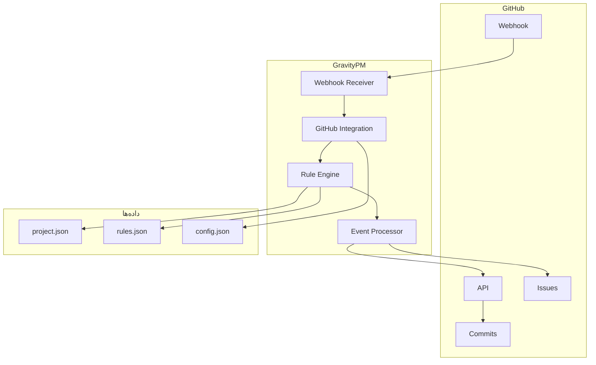

#### دیاگرام جریان یکپارچه‌سازی با GitHub

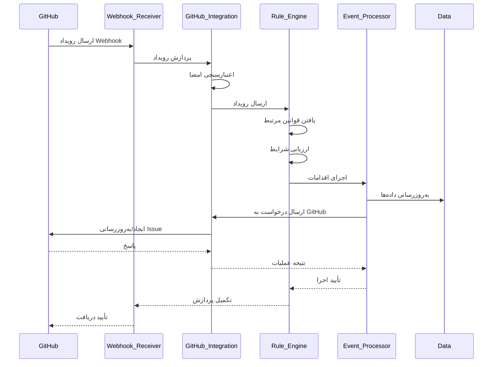

#### جدول رویدادهای GitHub

| رویداد | منبع | داده‌ها | اقدامات | توضیح |
|--------|------|--------|---------|-------|
| push | Webhook | commits, ref, repository | به‌روزرسانی وضعیت فعالیت | پردازش کامیت‌ها |
| issues | Webhook | issue action, issue data | به‌روزرسانی وضعیت فعالیت | پردازش Issues |
| issue_comment | Webhook | comment, issue data | - | پردازش کامنت‌ها |
| pull_request | Webhook | PR action, PR data | - | پردازش Pull Requestها |

### پیاده‌سازی سرویس یکپارچه‌سازی

#### دیاگرام اجزای سرویس یکپارچه‌سازی

```mermaid
componentDiagram
    [سرویس یکپارچه‌سازی] --> [مدیریت Webhook]
    [سرویس یکپارچه‌سازی] --> [مدیریت API]
    [سرویس یکپارچه‌سازی] --> [مدیریت رویدادها]
    
    [مدیریت Webhook] --> [پردازشگر Webhook]
    [مدیریت API] --> [درخواست‌های API]
    [مدیریت رویدادها] --> [پردازشگر رویدادها]
    
    [پردازشگر Webhook] --> [اعتبارسنجی]
    [پردازشگر Webhook] --> [پارس]
    
    [درخواست‌های API] --> [احراز هویت]
    [درخواست‌های API] --> [ارسال درخواست]
    [درخواست‌های API] --> [پردازش پاسخ]
    
    [پردازشگر رویدادها] --> [استخراج داده‌ها]
    [پردازشگر رویدادها] --> [تبدیل فرمت]
```

#### جدول عملیات یکپارچه‌سازی

| عملیات | ورودی‌ها | خروجی‌ها | توضیح |
|--------|----------|----------|-------|
| دریافت Webhook | payload, signature | وضعیت پردازش | پردازش رویدادهای GitHub |
| ایجاد Issue | عنوان، متن، برچسب‌ها | شناسه Issue | ایجاد Issue در GitHub |
| به‌روزرسانی Issue | شناسه Issue، داده‌های جدید | وضعیت عملیات | به‌روزرسانی Issue در GitHub |
| بستن Issue | شناسه Issue | وضعیت عملیات | بستن Issue در GitHub |
| دریافت اطلاعات Issue | شناسه Issue | اطلاعات Issue | دریافت اطلاعات Issue از GitHub |

---

## پیاده‌سازی امنیت

### دیاگرام لایه‌های امنیتی

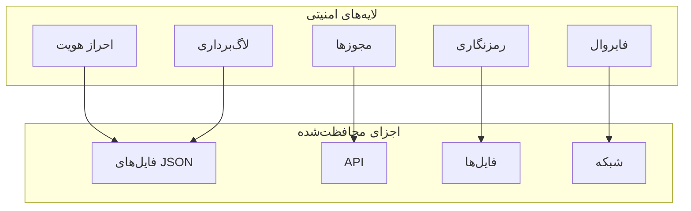

### پیاده‌سازی احراز هویت

#### دیاگرام جریان احراز هویت

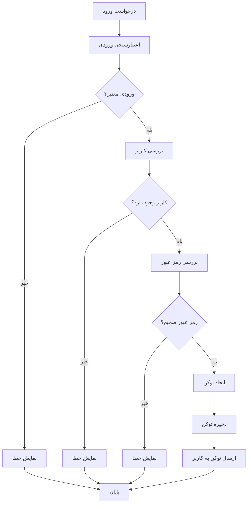

#### جدول مکانیزم‌های احراز هویت

| مکانیزم | توضیح | پیاده‌سازی | امنیت |
|---------|-------|-------------|-------|
| نام کاربری و رمز عبور | ورود با نام کاربری و رمز عبور | هش کردن رمز عبور | متوسط |
| احراز هویت دو مرحله‌ای | استفاده از کد تأیید | ارسال کد به ایمیل/پیامک | بالا |
| توکن دسترسی | استفاده از توکن برای دسترسی | JWT با تاریخ انقضا | بالا |
| ورود با GitHub | استفاده از حساب GitHub | OAuth 2.0 | بالا |

### پیاده‌سازی مجوزها

#### دیاگرام جریان مجوزها

```mermaid
stateDiagram-v2
    [*] --> درخواست_دسترسی
    درخواست_دسترسی --> بررسی_احراز_هویت
    بررسی_احراز_هویت --> احراز_شده؟
    
    احراز_شده؟ --> خیر --> رد_دسترسی
    احراز_شده؟ --> بله --> بررسی_مجوز
    
    بررسی_مجوز --> مجاز؟
    
    مجوز؟ --> خیر --> رد_دسترسی
    مجوز؟ --> بله --> اجازه_دسترسی
    
    اجازه_دسترسی --> ثبت_عملیات
    ثبت_عملیات --> ارسال_پاسخ
    
    رد_دسترسی --> ثبت_تلاش_ناموفق
    ثبت_تلاش_ناموفق --> ارسال_خطا
    
    ارسال_پاسخ --> [*]
    ارسال_خطا --> [*]
```

#### جدول سطوح دسترسی

| نقش | دسترسی به پروژه | دسترسی به وظایف | دسترسی به منابع | دسترسی به قوانین | دسترسی به پیکربندی |
|------|-----------------|----------------|-----------------|-----------------|-------------------|
| مدیر پروژه | کامل | کامل | کامل | کامل | کامل |
| عضو تیم | خواندن | خواندن/نوشتن | خواندن | خواندن | خواندن |
| مشاهده‌گر | خواندن | خواندن | خواندن | خواندن | خواندن |
| سیستم | کامل | کامل | کامل | کامل | کامل |

### پیاده‌سازی رمزنگاری

#### دیاگرام جریان رمزنگاری

```mermaid
flowchart TD
    A[داده حساس] --> B[رمزنگاری]
    B --> C[ذخیره داده رمزنگاری شده]
    
    D[درخواست داده] --> E[بررسی مجوز]
    E --> F{مجاز؟}
    
    F -->|بله| G[بازیابی داده رمزنگاری شده]
    F -->|خیر| H[رد درخواست]
    
    G --> I[رمزگشایی]
    I --> J[ارسال داده اصلی]
    
    H --> K[پایان]
    J --> K
```

#### جدول استراتژی‌های رمزنگاری

| داده‌ها | الگوریتم | کلید | توضیح |
|---------|-----------|------|-------|
| رمز عبور | bcrypt | - | هش کردن رمز عبور |
| توکن‌ها | AES-256 | کلید سیستم | رمزنگاری توکن‌های دسترسی |
| فایل‌ها | AES-256 | کلید کاربر | رمزنگاری فایل‌های حساس |
| ارتباطات | TLS/SSL | - | رمزنگاری ارتباطات |

---

## پیاده‌سازی عملکرد و مقیاس‌پذیری

### دیاگرام مقیاس‌پذیری

```mermaid
graph TB
    subgraph "لایه بارگذاری"
        A[Load Balancer]
    end
    
    subgraph "سرورهای برنامه"
        B[سرور 1]
        C[سرور 2]
        D[سرور N]
    end
    
    subgraph "لایه داده"
        E[فایل‌های JSON]
        F[کش]
        G[ذخیره‌سازی فایل‌ها]
    end
    
    subgraph "مانیتورینگ"
        H[مانیتورینگ عملکرد]
        I[لاگ‌ها]
    end
    
    A --> B
    A --> C
    A --> D
    
    B --> E
    C --> E
    D --> E
    
    B --> F
    C --> F
    D --> F
    
    B --> G
    C --> G
    D --> G
    
    B --> H
    C --> H
    D --> H
    
    E --> I
    F --> I
    G --> I
```

### پیاده‌سازی کش کردن داده‌ها

#### دیاگرام جریان کش

```mermaid
flowchart TD
    A[درخواست داده] --> B{وجود در کش؟}
    
    B -->|بله| C[بازیابی از کش]
    B -->|خیر| D[خواندن از فایل]
    
    D --> E[ذخیره در کش]
    E --> F[ارسال داده]
    
    C --> F
    
    G[به‌روزرسانی داده] --> H[به‌روزرسانی فایل]
    H --> I[نامعتبر کردن کش]
    I --> J[پایان]
    
    F --> K[پایان]
    J --> K
```

#### جدول استراتژی‌های کش

| داده‌ها | استراتژی کش | زمان انقضا | توضیح |
|---------|-------------|-------------|-------|
| اطلاعات پروژه | نوشتن-از طریق | 1 ساعت | کش کردن اطلاعات پروژه |
| اطلاعات کاربر | نوشتن-از طریق | 30 دقیقه | کش کردن اطلاعات کاربر |
| قوانین خودکارسازی | نوشتن-از طریق | 1 ساعت | کش کردن قوانین |
| نتایج گزارش | نوشتن-از طریق | 2 ساعت | کش کردن نتایج گزارش |

### پیاده‌سازی بهینه‌سازی عملکرد

#### دیاگرام بهینه‌سازی عملکرد

```mermaid
graph TB
    subgraph "بهینه‌سازی سمت سرور"
        A[بهینه‌سازی خواندن فایل‌ها]
        B[بهینه‌سازی پردازش قوانین]
        C[بهینه‌سازی درخواست‌های API]
    end
    
    subgraph "بهینه‌سازی سمت کاربر"
        D[بارگذاری تنبل]
        E[فشرده‌سازی پاسخ‌ها]
        F[کش کردن مرورگر]
    end
    
    subgraph "مانیتورینگ"
        G[نظارت بر عملکرد]
        H[نظارت بر منابع]
        I[هشدارهای عملکرد]
    end
    
    A --> G
    B --> G
    C --> G
    
    D --> G
    E --> G
    F --> G
    
    G --> H
    H --> I
```

#### جدول تکنیک‌های بهینه‌سازی

| تکنیک | توضیح | پیاده‌سازی | تأثیر |
|--------|-------|-------------|-------|
| خواندن فایل‌ها | بهینه‌سازی خواندن فایل‌های JSON | خواندن تنها بخش‌های مورد نیاز | بالا |
| پردازش قوانین | بهینه‌سازی ارزیابی قوانین | ارزیابی موازی قوانین | بالا |
| کش کردن | کش کردن داده‌های پرکاربرد | استفاده از Redis | بالا |
| بارگذاری تنبل | بارگذاری داده‌ها در صورت نیاز | پیاده‌سازی در سمت کاربر | متوسط |
| فشرده‌سازی | فشرده‌سازی پاسخ‌ها | استفاده از Gzip | متوسط |

---

## پیاده‌سازی تست و استقرار

### پیاده‌سازی استراتژی تست

#### دیاگرام استراتژی تست

```mermaid
graph TB
    subgraph "تست‌های واحد"
        A[تست واحدهای منطق کسب‌وکار]
        B[تست واحدهای سرویس‌ها]
        C[تست واحدهای یکپارچه‌سازی]
    end
    
    subgraph "تست‌های یکپارچه‌سازی"
        D[تست یکپارچه‌سازی اجزا]
        E[تست یکپارچه‌سازی با GitHub]
        F[تست یکپارچه‌سازی پایان به پایان]
    end
    
    subgraph "تست‌های عملکرد"
        G[تست بار]
        H[تست استرس]
        I[تست مقیاس‌پذیری]
    end
    
    subgraph "تست‌های پذیرش"
        J[تست پذیرش کاربر]
        K[تست پذیرش عملیاتی]
        L[تست امنیت]
    end
    
    A --> D
    B --> D
    C --> D
    
    D --> G
    E --> G
    F --> G
    
    G --> J
    H --> J
    I --> J
```

#### جدول انواع تست‌ها

| نوع تست | هدف | ابزارها | فرکانس |
|---------|------|--------|--------|
| تست واحد | تست واحدهای مجزا | Jest, Mocha | هر commit |
| تست یکپارچه‌سازی | تست تعامل بین اجزا | Cypress, Supertest | روزانه |
| تست عملکرد | تست عملکرد سیستم | K6, JMeter | هفتگی |
| تست پذیرش | تست الزامات کاربر | Selenium, Cucumber | هر نسخه |
| تست امنیت | تست آسیب‌پذیری‌ها | OWASP ZAP, Burp | ماهانه |

### پیاده‌سازی استقرار

#### دیاگرام استقرار

```mermaid
graph TB
    subgraph "محیط توسعه"
        A[کد منبع]
        B[تست‌های واحد]
        C[تست‌های یکپارچه‌سازی]
    end
    
    subgraph "محیط تست"
        D[سرور تست]
        E[داده‌های تست]
        F[تست‌های پذیرش]
    end
    
    subgraph "محیط تولید"
        G[سرورهای تولید]
        H[بارگذار]
        I[مانیتورینگ]
    end
    
    A --> B
    B --> C
    C --> D
    
    D --> E
    E --> F
    
    F --> G
    G --> H
    H --> I
```

#### جدول محیط‌های استقرار

| محیط | هدف | پیکربندی | دسترسی |
|-------|------|-----------|--------|
| توسعه | توسعه و تست اولیه | حداقل، محلی | توسعه‌دهندگان |
| تست | تست جامع | مشابه تولید | تیم تست |
| پیش‌تولید | تست نهایی | مشابه تولید | تیم عملیات |
| تولید | استقرار نهایی | بهینه‌سازی شده | تیم عملیات |

### پیاده‌سازی CI/CD

#### دیاگرام جریان CI/CD

```mermaid
flowchart TD
    A[تغییر کد] --> B[کامیت به گیت]
    B --> C{تغییر در شاخه اصلی؟}
    
    C -->|خیر| D[پایان]
    C -->|بله| E[اجرا تست‌های واحد]
    
    E --> F{تست‌ها موفق؟}
    
    F -->|خیر| G[اعلام خطا]
    F -->|بله| H[ساخت نسخه]
    
    H --> I[اجرا تست‌های یکپارچه‌سازی]
    I --> J{تست‌ها موفق؟}
    
    J -->|خیر| G
    J -->|بله| K[استقرار در محیط تست]
    
    K --> L[اجرا تست‌های پذیرش]
    L --> M{تست‌ها موفق؟}
    
    M -->|خیر| G
    M -->|بله| N[تأیید دستی]
    
    N --> O{تأیید شد؟}
    
    O -->|خیر| P[رد استقرار]
    O -->|بله| Q[استقرار در محیط تولید]
    
    Q --> R[اجرای تست‌های نهایی]
    R --> S{تست‌ها موفق؟}
    
    S -->|خیر| T[بازگشت به نسخه قبلی]
    S -->|بله| U[پایان استقرار]
    
    G --> V[پایان]
    P --> V
    T --> V
    U --> V
```

#### جدول مراحل CI/CD

| مرحله | توضیح | ابزارها | خودکار؟ |
|--------|-------|--------|---------|
| ساخت نسخه | ساخت نسخه از کد | Docker, Webpack | بله |
| تست واحد | اجرای تست‌های واحد | Jest, Mocha | بله |
| تست یکپارچه‌سازی | اجرای تست‌های یکپارچه‌سازی | Cypress, Supertest | بله |
| استقرار در تست | استقرار در محیط تست | Kubernetes, Docker | بله |
| تست پذیرش | اجرای تست‌های پذیرش | Selenium, Cucumber | بله |
| تأیید دستی | تأیید توسط تیم | - | خیر |
| استقرار در تولید | استقرار در محیط تولید | Kubernetes, Docker | بله |
| تست نهایی | تست نهایی در تولید | - | بله |

---

## نتیجه‌گیری

پیاده‌سازی نرم‌افزار مدیریت پروژه GravityPM با تمرکز بر خودکارسازی فرآیندها و یکپارچه‌سازی با GitHub طراحی شده است. این سیستم با استفاده از معماری چندلایه و فایل‌های JSON به جای پایگاه داده، یک راهکار ساده و کارآمد برای مدیریت پروژه‌های نرم‌افزاری ارائه می‌دهد.

### نقاط قوت پیاده‌سازی

- **معماری ماژولار**: جداسازی وظایف و قابلیت نگهداری بالا
- **استفاده از فایل‌های JSON**: سادگی و قابلیت حمل بدون نیاز به پایگاه داده
- **یکپارچه‌سازی با GitHub**: استفاده از GitHub به عنوان تنها سیستم خارجی
- **خودکارسازی فرآیندها**: کاهش ورودی‌های دستی و افزایش کارایی
- **امنیت لایه‌ای**: حفاظت از داده‌ها در تمام سطوح

### چالش‌های پیاده‌سازی

- **مدیریت فایل‌های JSON**: نیاز به مکانیزم‌های قفل‌گذاری و همگام‌سازی
- **مقیاس‌پذیری**: محدودیت‌های استفاده از فایل‌ها به جای پایگاه داده
- **یکپارچه‌سازی با GitHub**: پیچیدگی‌های ارتباط با API و Webhookهای GitHub
- **خودکارسازی فرآیندها**: نیاز به طراحی دقیق قوانین و شرایط

### مسیر آینده

- **افزودن پایگاه داده**: برای پشتیبانی از پروژه‌های بزرگ‌تر
- **بهبود عملکرد**: بهینه‌سازی خواندن و نوشتن فایل‌های JSON
- **گسترش یکپارچه‌سازی**: اتصال به سیستم‌های خارجی بیشتر
- **افزودن هوش مصنوعی**: برای پیش‌بینی ریسک‌ها و بهینه‌سازی منابع

این سند پیاده‌سازی یک چارچوب جامع برای توسعه و استقرار نرم‌افزار GravityPM فراهم می‌کند و با رعایت اصول طراحی مدرن، تضمین می‌کند که سیستم پایدار، امن و قابل توسعه خواهد بود.