Here's the complete English translation of the implementation document for GravityPM project management software:

---

# GravityPM Project Management Software Implementation Document

## Table of Contents

1. [Introduction](#introduction)
2. [Implementation Goals](#implementation-goals)
3. [Architecture Overview](#architecture-overview)
4. [Data Layer Implementation](#data-layer-implementation)
5. [Business Logic Layer Implementation](#business-logic-layer-implementation)
6. [Presentation Layer Implementation](#presentation-layer-implementation)
7. [Support Services Implementation](#support-services-implementation)
8. [External Systems Integration Implementation](#external-systems-integration-implementation)
9. [Security Implementation](#security-implementation)
10. [Performance and Scalability Implementation](#performance-and-scalability-implementation)
11. [Testing and Deployment Implementation](#testing-and-deployment-implementation)
12. [Conclusion](#conclusion)

---

## Introduction

This document describes the implementation of GravityPM project management software. GravityPM is a comprehensive system for managing software projects, focusing on process automation and GitHub integration. The system aims to reduce manual inputs and increase project management efficiency through intelligent automation.

### Key Challenges

- Managing complexity of large software projects
- Tracking activity progress and resources
- Managing task dependencies
- Coordinating team members
- Accurate and timely reporting
- Risk and issue management

### Proposed Solutions

- Multi-layered architecture with separation of concerns
- Using JSON files instead of databases
- Full GitHub integration
- Automated project management processes
- User-friendly interface design

---

## Implementation Goals

### Functional Goals

| ID | Goal | Priority | Description |
|-------|------|--------|-------|
| FO-001 | Implement project management | High | Create, edit, delete, and view projects |
| FO-002 | Implement task management | High | Create, edit, delete, and track tasks |
| FO-003 | Implement resource management | High | Allocate and manage human and non-human resources |
| FO-004 | Implement automation | High | Automate processes based on GitHub events |
| FO-005 | Implement reporting | Medium | Generate diverse project reports |
| FO-006 | Implement risk management | Medium | Identify, assess, and manage risks |

### Non-Functional Goals

| ID | Goal | Priority | Criteria |
|-------|------|--------|-------|
| NFO-001 | Performance | High | Response time under 2 seconds |
| NFO-002 | Scalability | High | Support 10,000 concurrent users |
| NFO-003 | Security | High | Encryption of sensitive data |
| NFO-004 | Reliability | Medium | 99.9% uptime |
| NFO-005 | Usability | Medium | Simple and intuitive interface |

---

## Architecture Overview

### Implementation Architecture Diagram

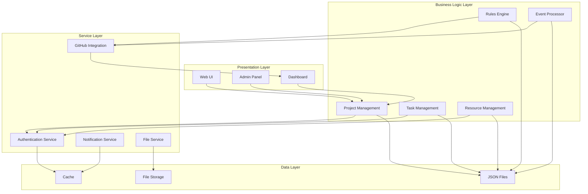

### Architecture Explanation

GravityPM uses a multi-layered architecture including:

1. **Presentation Layer**: Web UI, admin panel, and dashboard
2. **Business Logic Layer**: Core modules for project management, tasks, resources, and rules engine
3. **Service Layer**: Support services including authentication, notifications, and integration
4. **Data Layer**: JSON files, file storage, and cache

### Implementation Principles

- **Separation of Concerns**: Each component has specific responsibilities
- **JSON File Usage**: Instead of databases for simplicity and portability
- **GitHub Integration**: As the sole external system
- **Process Automation**: Using rules engine and event processor
- **Layered Security**: Data protection at all levels

---

## Data Layer Implementation

### JSON File Structure

#### project.json File

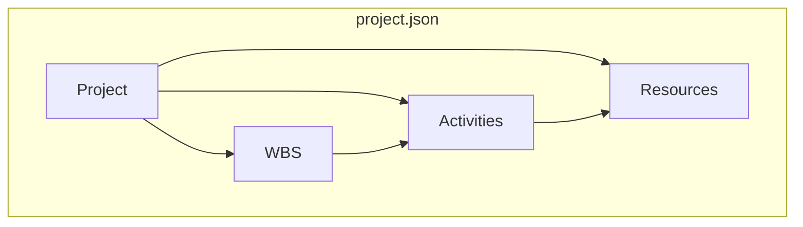

#### rules.json File

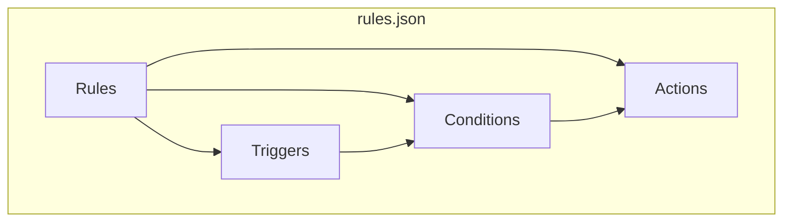

#### config.json File

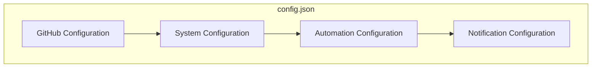

### Data Structure Table

| Entity | File | Fields | Description |
|---------|------|--------|-------|
| Project | project.json | project_id, name, start_date, end_date, status | Basic project information |
| WBS | project.json | wbs_id, name, project_id, parent_wbs_id | Work breakdown structure |
| Activity | project.json | activity_id, name, duration, status, assignee, wbs_id, dependencies | Project activities |
| Resource | project.json | resource_id, name, role, cost_per_hour, github_username | Project resources |
| Rule | rules.json | rule_id, name, trigger, conditions, actions | Automation rules |
| Configuration | config.json | github, system, automation, notifications | System settings |

### Data Flow Diagram

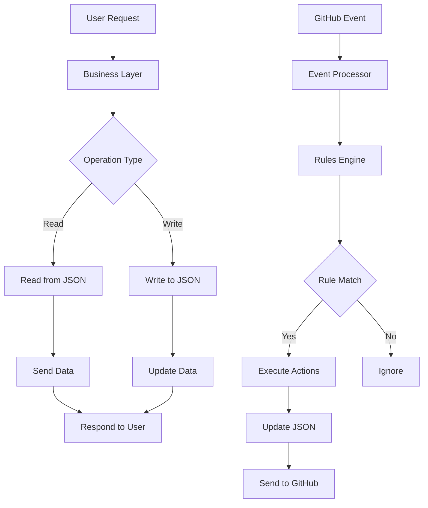

### Data Implementation Strategies

#### JSON File Management
- **File Locking**: Prevent concurrent access conflicts
- **Backup**: Create backup versions of files
- **Data Validation**: Verify data before storage
- **Optimization**: Compress large files

#### Data Caching
- **Cache Frequent Data**: Improve performance
- **Auto Cleanup**: Remove old cache data
- **Synchronization**: Sync cache with main files

---

## Business Logic Layer Implementation

### Component Diagram

```mermaid
componentDiagram
    [Project Management] --> [Project Service]
    [Task Management] --> [Task Service]
    [Resource Management] --> [Resource Service]
    [Rules Engine] --> [Rule Processor]
    [Event Processor] --> [GitHub Processor]
    
    [Project Service] --> [Data Access]
    [Task Service] --> [Data Access]
    [Resource Service] --> [Data Access]
    [Rule Processor] --> [Data Access]
    [GitHub Processor] --> [Data Access]
```

### Project Management Implementation

#### Project Management Flow Diagram

```mermaid
stateDiagram-v2
    [*] --> Create_Project
    Create_Project --> Validation
    Validation --> Valid?
    
    Valid? --> Yes --> Save_Project
    Valid? --> No --> Show_Error
    
    Save_Project --> Create_Default_WBS
    Create_Default_WBS --> Create_Default_Activity
    Create_Default_Activity --> Assign_Default_Resources
    Assign_Default_Resources --> Send_Notification
    Send_Notification --> End
    
    Show_Error --> Correct_Data
    Correct_Data --> Validation
    
    End --> [*]
```

#### Project Management Operations Table

| Operation | Inputs | Outputs | Description |
|--------|----------|----------|-------|
| Create Project | Name, description, start date, end date | Project ID | Create new project with default WBS |
| Edit Project | Project ID, new data | Operation status | Update project information |
| Delete Project | Project ID | Operation status | Delete project and related data |
| View Project | Project ID | Complete project info | Display project information |
| Change Status | Project ID, new status | Operation status | Change project status |

### Task Management Implementation

#### Task Management Flow Diagram

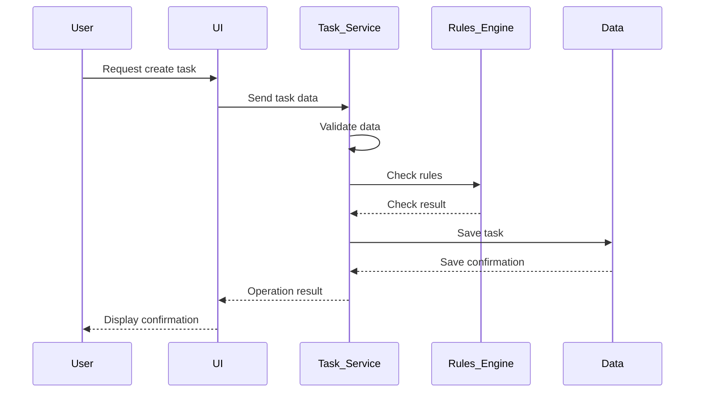

#### Task Management Operations Table

| Operation | Inputs | Outputs | Description |
|--------|----------|----------|-------|
| Create Task | Name, description, duration, WBS, dependencies | Task ID | Create new task |
| Edit Task | Task ID, new data | Operation status | Update task information |
| Delete Task | Task ID | Operation status | Delete task and update dependencies |
| Update Status | Task ID, new status | Operation status | Change task status |
| Assign Resource | Task ID, resource ID | Operation status | Assign resource to task |

### Rules Engine Implementation

#### Rules Engine Flow Diagram

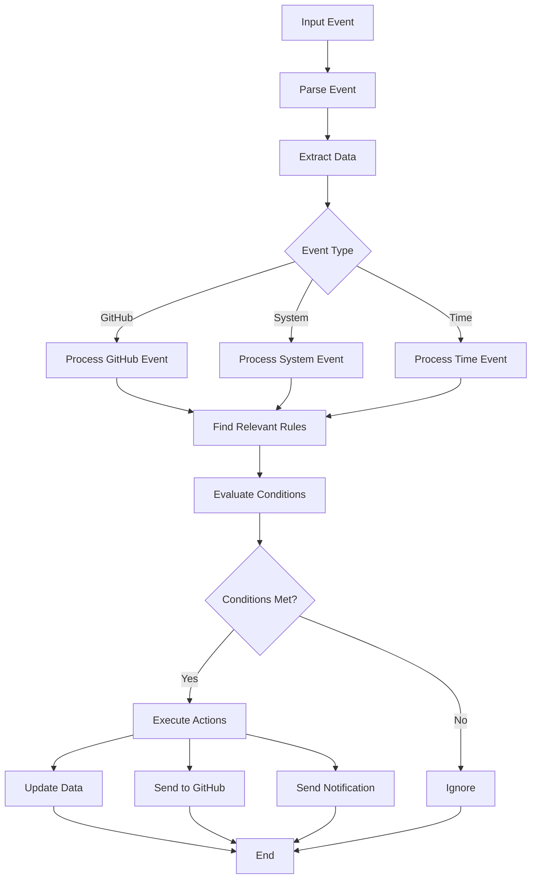

#### Automation Rules Table

| Rule | Trigger | Conditions | Actions | Description |
|-------|-------|--------|---------|-------|
| Status Update | push | Message contains ACT- | Update status to In Progress | Update activity status based on commit |
| Issue Closure | issues.closed | Issue related to activity | Set status to Completed | Change activity status to Completed |
| Delay Check | daily_check | Current date > end date | Create GitHub Issue | Activity delay warning |
| Dependency Check | status_change | All dependencies completed | Create "Ready to Start" Issue | Notify activity readiness |
| Bug Registration | push | Bug label in commit | Create GitHub Issue | Auto-register bugs |

---

## Presentation Layer Implementation

### UI Structure Diagram

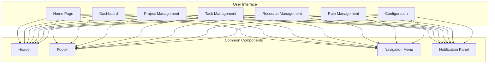

### Dashboard Implementation

#### Dashboard Components Diagram

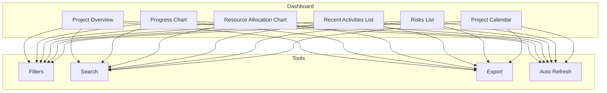

#### Dashboard Components Table

| Component | Description | Required Data | Update Frequency |
|------|-------|-------------------|-------------|
| Project Overview | Display project statistics | Activity count, overall progress, project status | Real-time |
| Progress Chart | Show project progress over time | Dates, progress percentage | Daily |
| Resource Allocation Chart | Show resource allocation to activities | Resources, activities, allocation percentage | Daily |
| Recent Activities List | Display recent activities | Activities, dates, statuses | Real-time |
| Risks List | Display active risks | Risks, impact, probability | Daily |
| Project Calendar | Display project calendar | Activities, dates, events | Daily |

### Project Management Implementation

#### Project Management Flow Diagram

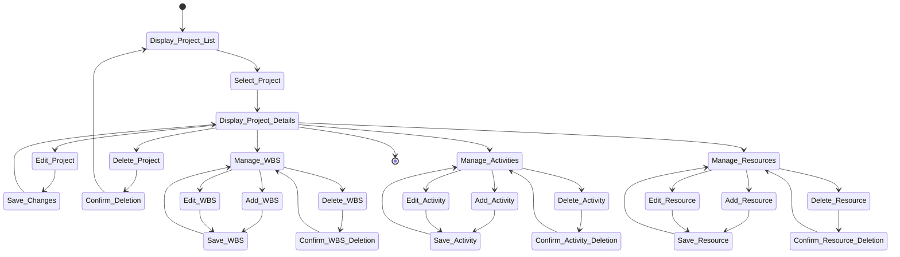

#### Project Management Operations Table

| Operation | Inputs | Outputs | Description |
|--------|----------|----------|-------|
| Display Project List | - | Project list | Show all projects |
| Display Project Details | Project ID | Complete project info | Display project information |
| Edit Project | Project ID, new data | Operation status | Update project information |
| Delete Project | Project ID | Operation status | Delete project and related data |
| Manage WBS | Project ID | WBS list | Manage work breakdown structure |
| Manage Activities | Project ID | Activity list | Manage project activities |
| Manage Resources | Project ID | Resource list | Manage project resources |

---

## Support Services Implementation

### Authentication Service Implementation

#### Authentication Flow Diagram

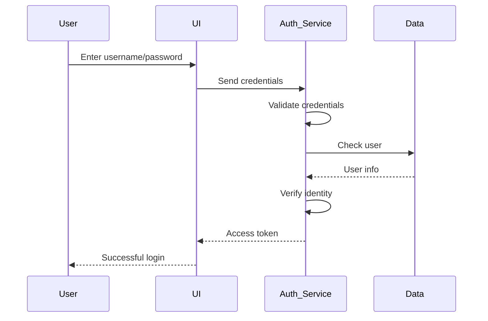

#### Authentication Operations Table

| Operation | Inputs | Outputs | Description |
|--------|----------|----------|-------|
| Login | Username, password | Access token | Authenticate user |
| Logout | Access token | Operation status | Log user out |
| Renew Session | Access token | New token | Renew user session |
| Verify Authorization | Access token, resource | Authorization status | Check access permission |

### Notification Service Implementation

#### Notification Flow Diagram

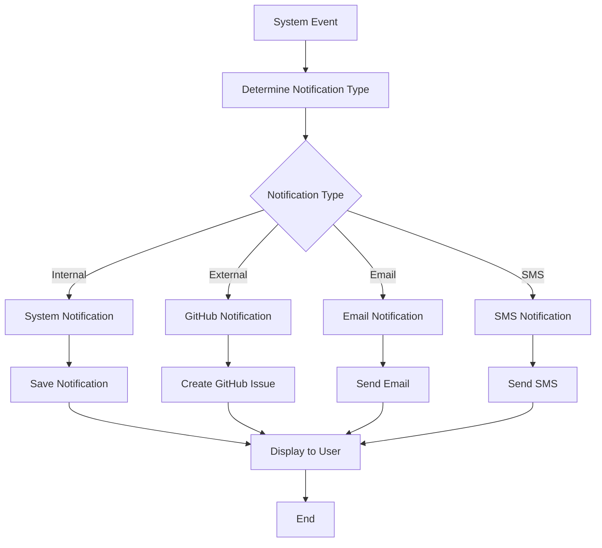

#### Notification Types Table

| Notification Type | Trigger | Recipients | Content | Description |
|-----------|-------|--------|--------|-------|
| Internal Notification | Activity status change | Related users | Text message | System notification |
| GitHub Issue | Activity delay | Project team | GitHub Issue | Create GitHub Issue |
| Email | Daily report | Project manager | PDF report | Send report via email |
| SMS | Critical risk | Project manager | Short message | Send SMS |

### File Service Implementation

#### File Management Flow Diagram

```mermaid
stateDiagram-v2
    [*] --> Upload_File
    Upload_File --> Validate_File
    Validate_File --> Valid?
    
    Valid? --> Yes --> Save_File
    Valid? --> No --> Show_Error
    
    Save_File --> Create_Link
    Create_Link --> Update_Reference
    Update_Reference --> Send_Notification
    Send_Notification --> End
    
    Show_Error --> [*]
    
    Download_File --> Check_Permission
    Check_Permission --> Authorized?
    
    Authorized? --> Yes --> Send_File
    Authorized? --> No --> Show_Access_Error
    
    Send_File --> End
    Show_Access_Error --> [*]
    
    End --> [*]
```

#### File Management Operations Table

| Operation | Inputs | Outputs | Description |
|--------|----------|----------|-------|
| Upload File | File, type, reference | File ID | Upload file to system |
| Download File | File ID | File | Download file from system |
| Delete File | File ID | Operation status | Delete file from system |
| Update File | File ID, new file | Operation status | Replace existing file |

---

## External Systems Integration Implementation

### GitHub Integration Implementation

#### GitHub Integration Diagram

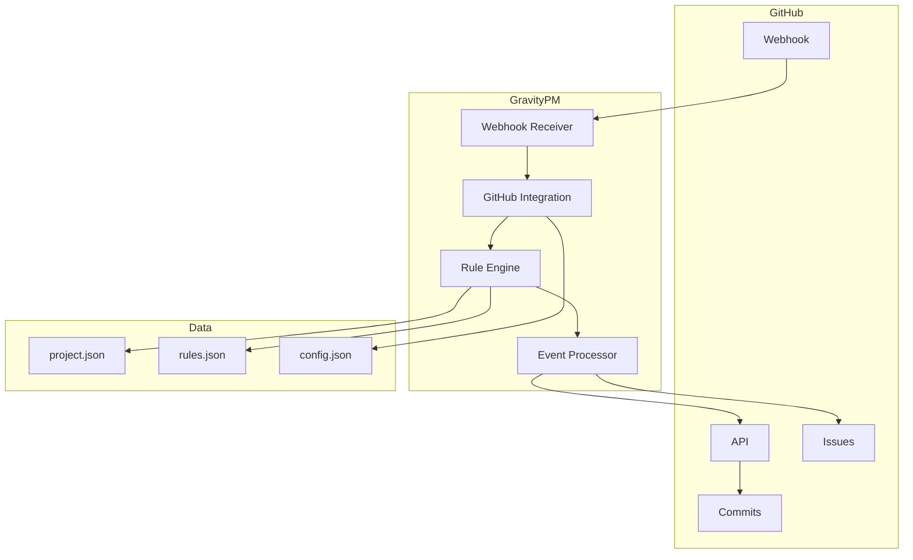

#### GitHub Integration Flow Diagram

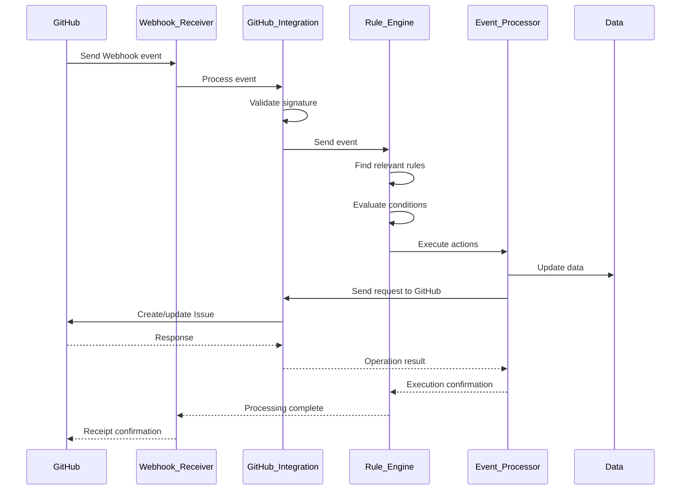

#### GitHub Events Table

| Event | Source | Data | Actions | Description |
|--------|------|--------|---------|-------|
| push | Webhook | commits, ref, repository | Update activity status | Process commits |
| issues | Webhook | issue action, issue data | Update activity status | Process Issues |
| issue_comment | Webhook | comment, issue data | - | Process comments |
| pull_request | Webhook | PR action, PR data | - | Process Pull Requests |

### Integration Service Implementation

#### Integration Service Components Diagram

```mermaid
componentDiagram
    [Integration Service] --> [Webhook Management]
    [Integration Service] --> [API Management]
    [Integration Service] --> [Event Management]
    
    [Webhook Management] --> [Webhook Processor]
    [API Management] --> [API Requests]
    [Event Management] --> [Event Processor]
    
    [Webhook Processor] --> [Validation]
    [Webhook Processor] --> [Parsing]
    
    [API Requests] --> [Authentication]
    [API Requests] --> [Send Request]
    [API Requests] --> [Process Response]
    
    [Event Processor] --> [Extract Data]
    [Event Processor] --> [Format Conversion]
```

#### Integration Operations Table

| Operation | Inputs | Outputs | Description |
|--------|----------|----------|-------|
| Receive Webhook | payload, signature | Processing status | Process GitHub events |
| Create Issue | Title, body, labels | Issue ID | Create GitHub Issue |
| Update Issue | Issue ID, new data | Operation status | Update GitHub Issue |
| Close Issue | Issue ID | Operation status | Close GitHub Issue |
| Get Issue Info | Issue ID | Issue info | Get Issue info from GitHub |

---

## Security Implementation

### Security Layers Diagram

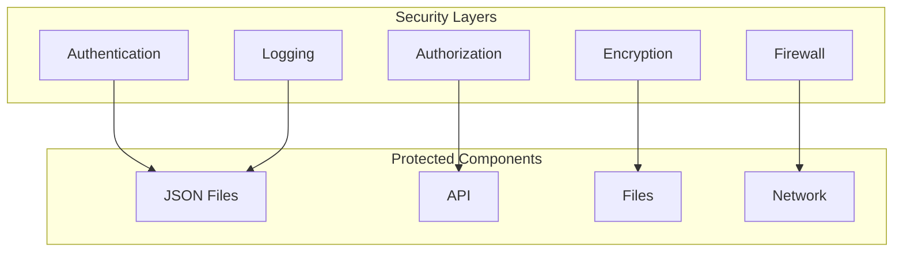

### Authentication Implementation

#### Authentication Flow Diagram

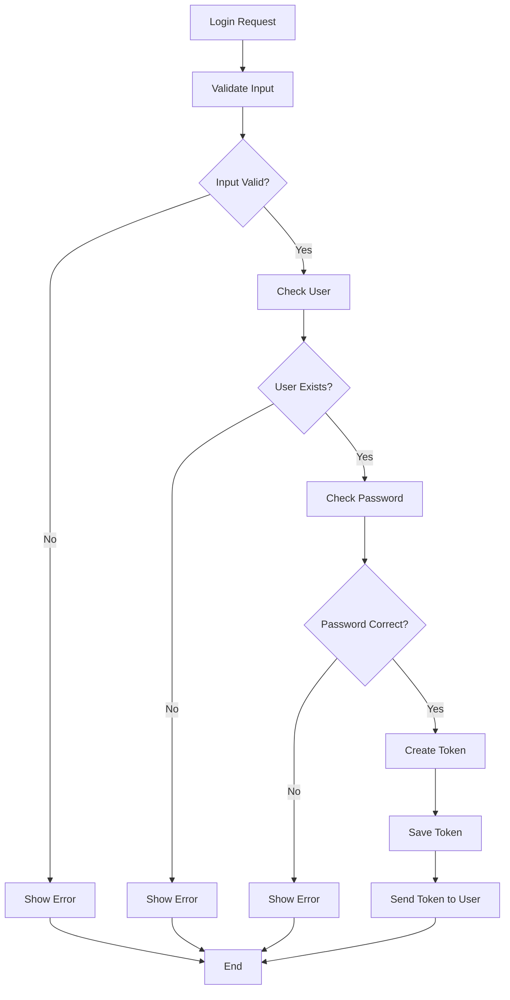

#### Authentication Mechanisms Table

| Mechanism | Description | Implementation | Security |
|---------|-------|-------------|-------|
| Username/Password | Login with username/password | Password hashing | Medium |
| Two-Factor Authentication | Use verification code | Send code to email/SMS | High |
| Access Token | Use token for access | JWT with expiration | High |
| GitHub Login | Use GitHub account | OAuth 2.0 | High |

### Authorization Implementation

#### Authorization Flow Diagram

```mermaid
stateDiagram-v2
    [*] --> Access_Request
    Access_Request --> Check_Authentication
    Check_Authentication --> Authenticated?
    
    Authenticated? --> No --> Deny_Access
    Authenticated? --> Yes --> Check_Authorization
    
    Check_Authorization --> Authorized?
    
    Authorized? --> No --> Deny_Access
    Authorized? --> Yes --> Grant_Access
    
    Grant_Access --> Log_Operation
    Log_Operation --> Send_Response
    
    Deny_Access --> Log_Failed_Attempt
    Log_Failed_Attempt --> Send_Error
    
    Send_Response --> [*]
    Send_Error --> [*]
```

#### Access Levels Table

| Role | Project Access | Task Access | Resource Access | Rule Access | Config Access |
|------|-----------------|----------------|-----------------|-----------------|-------------------|
| Project Manager | Full | Full | Full | Full | Full |
| Team Member | Read | Read/Write | Read | Read | Read |
| Viewer | Read | Read | Read | Read | Read |
| System | Full | Full | Full | Full | Full |

### Encryption Implementation

#### Encryption Flow Diagram

```mermaid
flowchart TD
    A[Sensitive Data] --> B[Encrypt]
    B --> C[Store Encrypted Data]
    
    D[Data Request] --> E[Check Authorization]
    E --> F{Authorized?}
    
    F -->|Yes| G[Retrieve Encrypted Data]
    F -->|No| H[Deny Request]
    
    G --> I[Decrypt]
    I --> J[Send Original Data]
    
    H --> K[End]
    J --> K
```

#### Encryption Strategies Table

| Data | Algorithm | Key | Description |
|---------|-----------|------|-------|
| Passwords | bcrypt | - | Password hashing |
| Tokens | AES-256 | System key | Token encryption |
| Files | AES-256 | User key | Sensitive file encryption |
| Communications | TLS/SSL | - | Communication encryption |

---

## Performance and Scalability Implementation

### Scalability Diagram

```mermaid
graph TB
    subgraph "Load Layer"
        A[Load Balancer]
    end
    
    subgraph "Application Servers"
        B[Server 1]
        C[Server 2]
        D[Server N]
    end
    
    subgraph "Data Layer"
        E[JSON Files]
        F[Cache]
        G[File Storage]
    end
    
    subgraph "Monitoring"
        H[Performance Monitoring]
        I[Logs]
    end
    
    A --> B
    A --> C
    A --> D
    
    B --> E
    C --> E
    D --> E
    
    B --> F
    C --> F
    D --> F
    
    B --> G
    C --> G
    D --> G
    
    B --> H
    C --> H
    D --> H
    
    E --> I
    F --> I
    G --> I
```

### Caching Implementation

#### Cache Flow Diagram

```mermaid
flowchart TD
    A[Data Request] --> B{Exists in Cache?}
    
    B -->|Yes| C[Retrieve from Cache]
    B -->|No| D[Read from File]
    
    D --> E[Store in Cache]
    E --> F[Send Data]
    
    C --> F
    
    G[Data Update] --> H[Update File]
    H --> I[Invalidate Cache]
    I --> J[End]
    
    F --> K[End]
    J --> K
```

#### Caching Strategies Table

| Data | Caching Strategy | Expiration | Description |
|---------|-------------|-------------|-------|
| Project Info | Write-through | 1 hour | Cache project information |
| User Info | Write-through | 30 minutes | Cache user information |
| Automation Rules | Write-through | 1 hour | Cache rules |
| Report Results | Write-through | 2 hours | Cache report results |

### Performance Optimization Implementation

#### Performance Optimization Diagram

```mermaid
graph TB
    subgraph "Server-Side Optimization"
        A[File Reading Optimization]
        B[Rule Processing Optimization]
        C[API Request Optimization]
    end
    
    subgraph "Client-Side Optimization"
        D[Lazy Loading]
        E[Response Compression]
        F[Browser Caching]
    end
    
    subgraph "Monitoring"
        G[Performance Monitoring]
        H[Resource Monitoring]
        I[Performance Alerts]
    end
    
    A --> G
    B --> G
    C --> G
    
    D --> G
    E --> G
    F --> G
    
    G --> H
    H --> I
```

#### Optimization Techniques Table

| Technique | Description | Implementation | Impact |
|--------|-------|-------------|-------|
| File Reading | Optimize JSON file reading | Read only needed sections | High |
| Rule Processing | Optimize rule evaluation | Parallel rule evaluation | High |
| Caching | Cache frequent data | Use Redis | High |
| Lazy Loading | Load data on demand | Client-side implementation | Medium |
| Compression | Compress responses | Use Gzip | Medium |

---

## Testing and Deployment Implementation

### Testing Strategy Implementation

#### Testing Strategy Diagram

```mermaid
graph TB
    subgraph "Unit Tests"
        A[Business Logic Unit Tests]
        B[Service Unit Tests]
        C[Integration Unit Tests]
    end
    
    subgraph "Integration Tests"
        D[Component Integration Tests]
        E[GitHub Integration Tests]
        F[End-to-End Tests]
    end
    
    subgraph "Performance Tests"
        G[Load Tests]
        H[Stress Tests]
        I[Scalability Tests]
    end
    
    subgraph "Acceptance Tests"
        J[User Acceptance Tests]
        K[Operational Acceptance Tests]
        L[Security Tests]
    end
    
    A --> D
    B --> D
    C --> D
    
    D --> G
    E --> G
    F --> G
    
    G --> J
    H --> J
    I --> J
```

#### Test Types Table

| Test Type | Goal | Tools | Frequency |
|---------|------|--------|--------|
| Unit Test | Test individual units | Jest, Mocha | Every commit |
| Integration Test | Test component interactions | Cypress, Supertest | Daily |
| Performance Test | Test system performance | K6, JMeter | Weekly |
| Acceptance Test | Test user requirements | Selenium, Cucumber | Every release |
| Security Test | Test vulnerabilities | OWASP ZAP, Burp | Monthly |

### Deployment Implementation

#### Deployment Diagram

```mermaid
graph TB
    subgraph "Development Environment"
        A[Source Code]
        B[Unit Tests]
        C[Integration Tests]
    end
    
    subgraph "Test Environment"
        D[Test Server]
        E[Test Data]
        F[Acceptance Tests]
    end
    
    subgraph "Production Environment"
        G[Production Servers]
        H[Load Balancer]
        I[Monitoring]
    end
    
    A --> B
    B --> C
    C --> D
    
    D --> E
    E --> F
    
    F --> G
    G --> H
    H --> I
```

#### Deployment Environments Table

| Environment | Purpose | Configuration | Access |
|-------|------|-----------|--------|
| Development | Development & initial testing | Minimal, local | Developers |
| Test | Comprehensive testing | Production-like | Test Team |
| Staging | Final testing | Production-like | Ops Team |
| Production | Final deployment | Optimized | Ops Team |

### CI/CD Implementation

#### CI/CD Flow Diagram

```mermaid
flowchart TD
    A[Code Change] --> B[Commit to Git]
    B --> C{Change in main branch?}
    
    C -->|No| D[End]
    C -->|Yes| E[Run Unit Tests]
    
    E --> F{Tests Passed?}
    
    F -->|No| G[Report Error]
    F -->|Yes| H[Build Version]
    
    H --> I[Run Integration Tests]
    I --> J{Tests Passed?}
    
    J -->|No| G
    J -->|Yes| K[Deploy to Test Environment]
    
    K --> L[Run Acceptance Tests]
    L --> M{Tests Passed?}
    
    M -->|No| G
    M -->|Yes| N[Manual Approval]
    
    N --> O{Approved?}
    
    O -->|No| P[Reject Deployment]
    O -->|Yes| Q[Deploy to Production]
    
    Q --> R[Run Final Tests]
    R --> S{Tests Passed?}
    
    S -->|No| T[Rollback to Previous Version]
    S -->|Yes| U[End Deployment]
    
    G --> V[End]
    P --> V
    T --> V
    U --> V
```

#### CI/CD Stages Table

| Stage | Description | Tools | Automated? |
|--------|-------|--------|---------|
| Build Version | Build version from code | Docker, Webpack | Yes |
| Unit Test | Run unit tests | Jest, Mocha | Yes |
| Integration Test | Run integration tests | Cypress, Supertest | Yes |
| Deploy to Test | Deploy to test environment | Kubernetes, Docker | Yes |
| Acceptance Test | Run acceptance tests | Selenium, Cucumber | Yes |
| Manual Approval | Approval by team | - | No |
| Deploy to Production | Deploy to production | Kubernetes, Docker | Yes |
| Final Test | Final tests in production | - | Yes |

---

## Conclusion

The implementation of GravityPM project management software focuses on process automation and GitHub integration. Using a multi-layered architecture and JSON files instead of databases, this system provides a simple and efficient solution for managing software projects.

### Implementation Strengths

- **Modular Architecture**: Separation of concerns and high maintainability
- **JSON File Usage**: Simplicity and portability without database dependency
- **GitHub Integration**: Using GitHub as the sole external system
- **Process Automation**: Reduced manual inputs and increased efficiency
- **Layered Security**: Data protection at all levels

### Implementation Challenges

- **JSON File Management**: Need for locking and synchronization mechanisms
- **Scalability**: Limitations of file-based storage vs databases
- **GitHub Integration**: Complexities with API and webhook communication
- **Process Automation**: Need for precise rule and condition design

### Future Path

- **Database Addition**: For support of larger projects
- **Performance Improvement**: Optimize JSON file reading/writing
- **Integration Expansion**: Connect to additional external systems
- **AI Addition**: For risk prediction and resource optimization

This implementation document provides a comprehensive framework for developing and deploying GravityPM, ensuring a stable, secure, and scalable system through modern design principles.