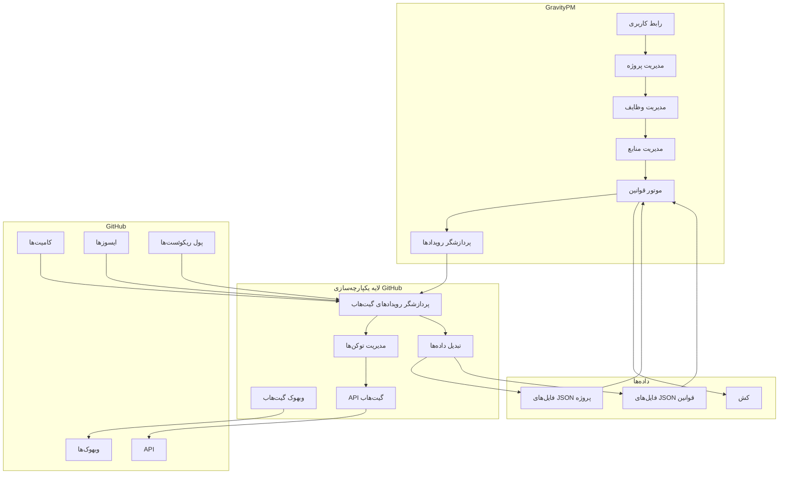
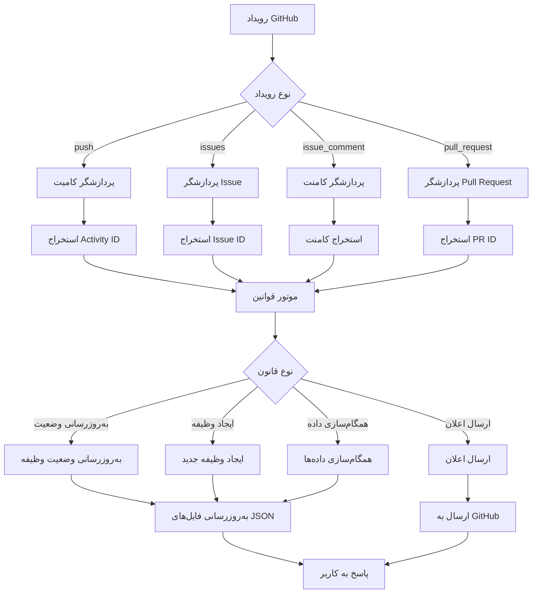
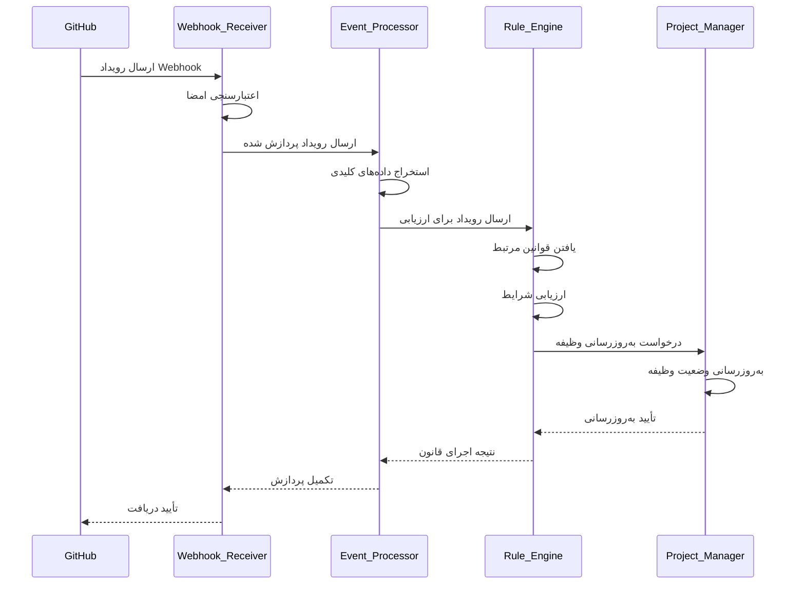
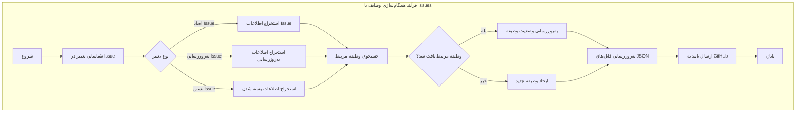
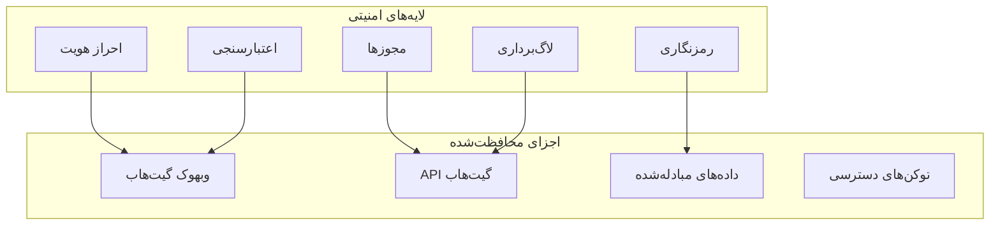
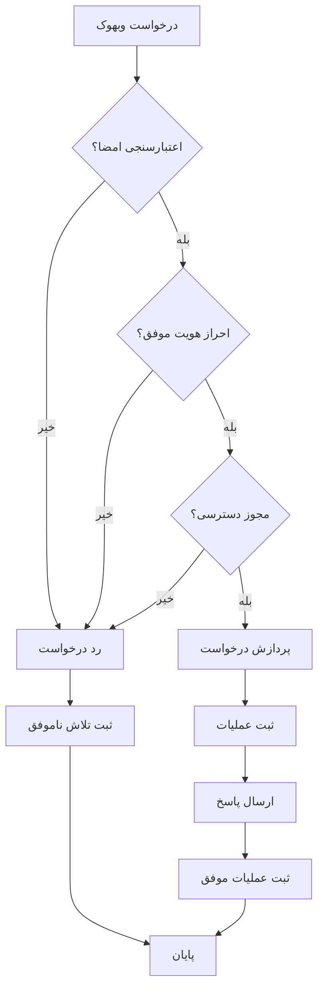
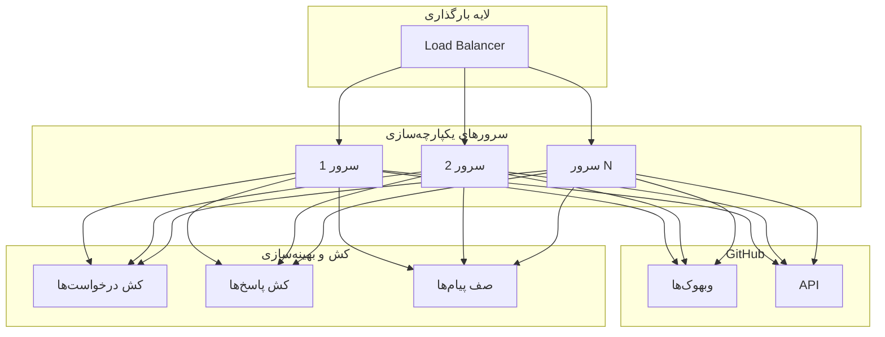
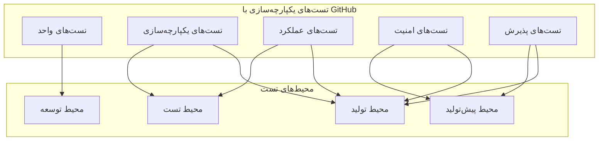
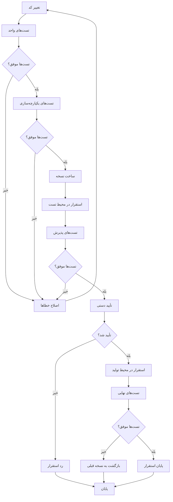

# سند یکپارچه‌سازی نرم‌افزار مدیریت پروژه GravityPM با GitHub

## فهرست مطالب

1. [مقدمه](#مقدمه)
2. [اهداف یکپارچه‌سازی](#اهداف-یکپارچهسازی)
3. [معماری یکپارچه‌سازی](#معماری-یکپارچهسازی)
4. [جزئیات یکپارچه‌سازی با GitHub](#جزئیات-یکپارچهسازی-با-github)
5. [جریان داده‌های یکپارچه‌سازی با GitHub](#جریان-دادههای-یکپارچهسازی-با-github)
6. [فرآیندهای یکپارچه‌سازی با GitHub](#فرآیندهای-یکپارچهسازی-با-github)
7. [امنیت یکپارچه‌سازی با GitHub](#امنیت-یکپارچهسازی-با-github)
8. [عملکرد و مقیاس‌پذیری یکپارچه‌سازی با GitHub](#عملکرد-و-مقیاسپذیری-یکپارچهسازی-با-github)
9. [تست و استقرار یکپارچه‌سازی با GitHub](#تست-و-استقرار-یکپارچهسازی-با-github)
10. [نتیجه‌گیری](#نتیجهگیری)

---

## مقدمه

این سند یکپارچه‌سازی نرم‌افزار مدیریت پروژه GravityPM با GitHub را به‌عنوان تنها سیستم خارجی توصیف می‌کند. GravityPM یک سیستم جامع مدیریت پروژه است که به‌طور کامل با GitHub یکپارچه شده و از آن به‌عنوان منبع اصلی برای خودکارسازی فرآیندهای مدیریت پروژه استفاده می‌کند. هدف اصلی این یکپارچه‌سازی، ایجاد ارتباطی هوشمند و دوسویه بین GravityPM و GitHub است تا بتوان تمام فرآیندهای مدیریت پروژه را بر اساس رویدادهای GitHub به‌طور خودکار مدیریت کرد.

### اهمیت یکپارچه‌سازی با GitHub
- **خودکارسازی کامل فرآیندها**: کاهش ورودی‌های دستی و خودکارسازی بر اساس رویدادهای GitHub
- **تمرکز بر توسعه**: استفاده از GitHub به‌عنوان مرکز اصلی فعالیت‌های توسعه
- **شفافیت در پیشرفت**: پیگیری پیشرفت پروژه از طریق کامیت‌ها و Issues
- **هماهنگی تیمی**: بهبود هماهنگی بین اعضای تیم از طریق Issues و Pull Requestها
- **مدیریت کیفیت**: ثبت و پیگیری خودکار باگ‌ها و مشکلات

---

## اهداف یکپارچه‌سازی

### اهداف عملکردی

| شناسه | هدف | اولویت | توضیح |
|-------|------|--------|-------|
| GIO-001 | دریافت رویدادهای GitHub | بالا | دریافت و پردازش رویدادهای Webhook از GitHub |
| GIO-002 | به‌روزرسانی خودکار وضعیت وظایف | بالا | به‌روزرسانی وضعیت وظایف بر اساس کامیت‌ها و Issues |
| GIO-003 | ایجاد خودکار Issues | بالا | ایجاد Issues در GitHub بر اساس رویدادهای پروژه |
| GIO-004 | همگام‌سازی داده‌ها | متوسط | همگام‌سازی داده‌ها بین GravityPM و GitHub |
| GIO-005 | مدیریت کامیت‌ها | متوسط | پیگیری کامیت‌ها و ارتباط با وظایف |

### اهداف غیرعملکردی

| شناسه | هدف | اولویت | معیار |
|-------|------|--------|-------|
| GINO-001 | قابلیت اطمینان | بالا | 99.9% زمان کارکرد |
| GINO-002 | کارایی | بالا | زمان پاسخ کمتر از 2 ثانیه |
| GINO-003 | امنیت | بالا | رمزنگاری ارتباطات و احراز هویت |
| GINO-004 | مقیاس‌پذیری | متوسط | پشتیبانی از 10000 رویداد در روز |
| GINO-005 | سازگاری | متوسط | سازگاری با API و Webhookهای GitHub |

---

## معماری یکپارچه‌سازی

### دیاگرام معماری یکپارچه‌سازی با GitHub



### توضیح معماری

معماری یکپارچه‌سازی GravityPM با GitHub از چند جزء اصلی تشکیل شده است:

1. **لایه GravityPM**: شامل اجزای اصلی سیستم مدیریت پروژه
2. **لایه یکپارچه‌سازی GitHub**: لایه اختصاصی برای مدیریت ارتباط با GitHub
3. **سرویس GitHub**: سرویس‌های GitHub که با GravityPM در ارتباط هستند
4. **لایه داده‌ها**: مدیریت داده‌های داخلی سیستم

### اجزای کلیدی یکپارچه‌سازی

| جزء | نقش | توضیح |
|------|------|-------|
| وبهوک گیت‌هاب | دریافت رویدادها | دریافت رویدادهای لحظه‌ای از GitHub |
| API گیت‌هاب | ارتباط با GitHub | ارسال درخواست‌ها به API GitHub |
| پردازشگر رویدادهای گیت‌هاب | پردازش رویدادها | تفسیر و پردازش رویدادهای دریافتی از GitHub |
| مدیریت توکن‌ها | مدیریت احراز هویت | مدیریت توکن‌های دسترسی به GitHub |
| تبدیل داده‌ها | هماهنگ‌سازی داده‌ها | تبدیل داده‌ها بین فرمت‌های GravityPM و GitHub |

---

## جزئیات یکپارچه‌سازی با GitHub

### دیاگرام اجزای یکپارچه‌سازی با GitHub

```mermaid
componentDiagram
    [GravityPM] --> [GitHub Webhook Receiver]
    [GravityPM] --> [GitHub API Client]
    [GitHub Webhook Receiver] --> [Event Processor]
    [Event Processor] --> [Rule Engine]
    [Rule Engine] --> [Project Manager]
    [Rule Engine] --> [Task Manager]
    [Rule Engine] --> [Resource Manager]
    [GitHub API Client] --> [GitHub API]
    [Project Manager] --> [Data Store]
    [Task Manager] --> [Data Store]
    [Resource Manager] --> [Data Store]
```

### رویدادهای پشتیبانی شده از GitHub

| رویداد | توضیح | داده‌های دریافتی | اقدامات GravityPM |
|--------|-------|---------------------------|------------------------------|
| push | ارسال کد به مخزن | commits, ref, repository | به‌روزرسانی وضعیت وظایف بر اساس کامیت‌ها |
| issues | ایجاد یا به‌روزرسانی Issue | issue action, issue data | همگام‌سازی وضعیت وظایف با Issues |
| issue_comment | افزودن کامنت به Issue | comment, issue data | پردازش کامنت‌ها و به‌روزرسانی وظایف |
| pull_request | ایجاد یا به‌روزرسانی Pull Request | PR action, PR data | مدیریت Pull Requestها و ارتباط با وظایف |

### جدول عملیات یکپارچه‌سازی با GitHub

| عملیات | توضیح | ورودی‌ها | خروجی‌ها |
|--------|-------|----------|----------|
| دریافت وبهوک | دریافت رویدادهای Webhook | payload, signature | رویداد پردازش شده |
| ایجاد Issue | ایجاد Issue در GitHub | عنوان، متن، برچسب‌ها | شناسه Issue |
| به‌روزرسانی Issue | به‌روزرسانی Issue موجود | شناسه Issue، داده‌های جدید | وضعیت عملیات |
| بستن Issue | بستن Issue در GitHub | شناسه Issue | وضعیت عملیات |
| دریافت کامیت‌ها | دریافت لیست کامیت‌ها | مخزن، شاخه | لیست کامیت‌ها |

---

## جریان داده‌های یکپارچه‌سازی با GitHub

### دیاگرام جریان داده‌های یکپارچه‌سازی با GitHub



### جریان داده‌های ورودی از GitHub

| منبع داده | نوع داده | فرمت | فرکانس | توضیح |
|-----------|----------|-------|--------|-------|
| وبهوک push | رویدادهای کامیت | JSON | لحظه‌ای | اطلاعات کامیت‌های ارسال شده |
| وبهوک issues | رویدادهای Issue | JSON | لحظه‌ای | اطلاعات ایجاد/به‌روزرسانی Issues |
| وبهوک issue_comment | رویدادهای کامنت | JSON | لحظه‌ای | اطلاعات کامنت‌های Issues |
| وبهوک pull_request | رویدادهای PR | JSON | لحظه‌ای | اطلاعات Pull Requestها |

### جریان داده‌های خروجی به GitHub

| مقصد داده | نوع داده | فرمت | فرکانس | توضیح |
|-----------|----------|-------|--------|-------|
| API Issues | ایجاد Issue | JSON | لحظه‌ای | ایجاد Issue برای وظایف جدید |
| API Issues | به‌روزرسانی Issue | JSON | لحظه‌ای | به‌روزرسانی وضعیت Issues |
| API Issues | بستن Issue | JSON | لحظه‌ای | بستن Issues تکمیل شده |
| API Repositories | دریافت کامیت‌ها | JSON | دوره‌ای | دریافت لیست کامیت‌ها |

---

## فرآیندهای یکپارچه‌سازی با GitHub

### فرآیند پردازش رویدادهای GitHub

#### دیاگرام فرآیند پردازش رویدادهای GitHub



#### جدول مراحل پردازش رویدادهای GitHub

| مرحله | توضیح | ورودی‌ها | خروجی‌ها |
|--------|-------|----------|----------|
| دریافت رویداد | دریافت رویداد از GitHub | payload, signature | رویداد اعتبارسنجی شده |
| اعتبارسنجی | اعتبارسنجی امضای دیجیتال | payload, signature | وضعیت اعتبارسنجی |
| استخراج داده‌ها | استخراج داده‌های کلیدی | رویداد اعتبارسنجی شده | داده‌های استخراج شده |
| ارزیابی قوانین | ارزیابی قوانین خودکارسازی | داده‌های استخراج شده | قوانین قابل اجرا |
| اجرای اقدامات | اجرای اقدامات تعریف شده | قوانین قابل اجرا | نتایج اجرا |
| به‌روزرسانی داده‌ها | به‌روزرسانی داده‌های سیستم | نتایج اجرا | داده‌های به‌روز شده |

### فرآیند همگام‌سازی وظایف با Issues

#### دیاگرام فرآیند همگام‌سازی وظایف با Issues



#### جدول استراتژی‌های همگام‌سازی با Issues

| استراتژی | توضیح | مزایا | معایب |
|----------|-------|-------|-------|
| همگام‌سازی لحظه‌ای | همگام‌سازی بلافاصله پس از تغییر Issue | داده‌ها همیشه به‌روز هستند | بار بالای سیستم |
| همگام‌سازی دوره‌ای | همگام‌سازی در بازه‌های زمانی مشخص | بار کمتر سیستم | تأخیر در به‌روزرسانی داده‌ها |
| همگام‌سازی بر اساس رویداد | همگام‌سازی در response به رویدادهای Issue | کارایی بالا | نیاز به تعریف رویدادها |

---

## امنیت یکپارچه‌سازی با GitHub

### دیاگرام لایه‌های امنیتی یکپارچه‌سازی با GitHub



### مکانیزم‌های امنیتی

#### احراز هویت و مجوزها

| مکانیزم | توضیح | پیاده‌سازی |
|---------|-------|-------------|
| توکن‌های دسترسی شخصی | استفاده از Personal Access Token | توکن با دسترسی‌های محدود |
| احراز هویت وبهوک | اعتبارسنجی امضای وبهوک | HMAC-SHA256 |
| کنترل دسترسی مبتنی بر نقش | محدود کردن دسترسی بر اساس نقش کاربر | RBAC |
| محدودیت نرخ درخواست | محدود کردن تعداد درخواست‌ها | Rate limiting |

#### رمزنگاری و امنیت داده‌ها

| نوع داده | روش رمزنگاری | کلید | توضیح |
|----------|--------------|------|-------|
| داده‌های در حال انتقال | TLS/SSL | - | رمزنگاری ارتباطات بین GravityPM و GitHub |
| امضای وبهوک | HMAC-SHA256 | Webhook Secret | اعتبارسنجی منبع وبهوک |
| توکن‌های دسترسی | رمزنگاری | کلید سیستم | ذخیره امن توکن‌ها |
| داده‌های حساس | AES-256 | کلید سیستم | رمزنگاری داده‌های حساس |

### دیاگرام جریان امنیتی یکپارچه‌سازی با GitHub



---

## عملکرد و مقیاس‌پذیری یکپارچه‌سازی با GitHub

### دیاگرام مقیاس‌پذیری یکپارچه‌سازی با GitHub



### استراتژی‌های بهینه‌سازی عملکرد

#### کش کردن داده‌ها

| نوع داده | استراتژی کش | زمان انقضا | توضیح |
|----------|-------------|-------------|-------|
| پاسخ‌های API GitHub | نوشتن-از طریق | 5 دقیقه | کش کردن پاسخ‌های پرتکرار API |
| اطلاعات کاربران GitHub | نوشتن-از طریق | 1 ساعت | کش کردن اطلاعات کاربران |
| اطلاعات مخازن | نوشتن-از طریق | 24 ساعت | کش کردن اطلاعات مخازن |
| نتایج پردازش رویدادها | نوشتن-از طریق | 10 دقیقه | کش کردن نتایج پردازش‌های مشابه |

#### مدیریت بار و مقیاس‌پذیری

| تکنیک | توضیح | تأثیر |
|--------|-------|-------|
| توزیع بار | توزیع درخواست‌های وبهوک بین چند سرور | افزایش ظرفیت و قابلیت اطمینان |
| پردازش موازی | پردازش همزمان رویدادهای مختلف | کاهش زمان پاسخ |
| صف پیام‌ها | استفاده از صف برای پردازش نامتقارن | افزایش توانایی پردازش |
| بهینه‌سازی پرس‌وجوهای API | بهینه‌سازی درخواست‌های API GitHub | کاهش بار روی GitHub |

### جدول معیارهای عملکرد یکپارچه‌سازی با GitHub

| معیار | هدف | حداقل | بهینه |
|-------|------|-------|-------|
| زمان پاسخ وبهوک | < 100ms | < 200ms | < 50ms |
| زمان پردازش رویداد | < 50ms | < 100ms | < 25ms |
| ظرفیت پردازش رویداد | 500 رویداد/ثانیه | 200 رویداد/ثانیه | 1000 رویداد/ثانیه |
| زمان همگام‌سازی داده‌ها | < 2s | < 5s | < 1s |
| uptime | 99.9% | 99% | 99.99% |

---

## تست و استقرار یکپارچه‌سازی با GitHub

### استراتژی تست یکپارچه‌سازی با GitHub

#### دیاگرام استراتژی تست یکپارچه‌سازی با GitHub



#### جدول انواع تست‌های یکپارچه‌سازی با GitHub

| نوع تست | هدف | ابزارها | محیط اجرا |
|---------|------|--------|-----------|
| تست واحد | تست اجزای مجزا یکپارچه‌سازی | Jest, Mocha | توسعه |
| تست یکپارچه‌سازی | تست تعامل با GitHub | Cypress, Supertest | تست |
| تست عملکرد | تست عملکرد تحت بار | K6, JMeter | تست |
| تست امنیت | تست آسیب‌پذیری‌های امنیتی | OWASP ZAP, Burp | پیش‌تولید |
| تست پذیرش | تست الزامات کاربر | Selenium, Cucumber | پیش‌تولید |

### استراتژی استقرار یکپارچه‌سازی با GitHub

#### دیاگرام استقرار یکپارچه‌سازی با GitHub



#### جدول محیط‌های استقرار یکپارچه‌سازی با GitHub

| محیط | هدف | پیکربندی | دسترسی |
|-------|------|-----------|--------|
| توسعه | توسعه و تست اولیه | حداقل، محلی | توسعه‌دهندگان |
| تست | تست جامع یکپارچه‌سازی | مشابه تولید | تیم تست |
| پیش‌تولید | تست نهایی قبل از تولید | مشابه تولید | تیم عملیات |
| تولید | استقرار نهایی | بهینه‌سازی شده | تیم عملیات |

---

## نتیجه‌گیری

یکپارچه‌سازی نرم‌افزار مدیریت پروژه GravityPM با GitHub به‌عنوان تنها سیستم خارجی، نقش کلیدی در خودکارسازی فرآیندهای مدیریت پروژه ایفا می‌کند. این یکپارچه‌سازی با استفاده از معماری متمرکز بر GitHub و استراتژی‌های امنیتی و عملکردی بهینه، یک راهکار کارآمد و قابل اعتماد برای مدیریت پروژه‌های نرم‌افزاری ارائه می‌دهد.

### نقاط قوت یکپارچه‌سازی با GitHub
- **تمرکز بر GitHub**: استفاده از GitHub به‌عنوان مرکز اصلی فعالیت‌های توسعه
- **خودکارسازی کامل**: خودکارسازی فرآیندها بر اساس رویدادهای GitHub
- **امنیت بالا**: حفاظت از داده‌ها و ارتباطات با لایه‌های امنیتی متعدد
- **عملکرد بهینه**: بهینه‌سازی برای پردازش سریع رویدادهای GitHub
- **مقیاس‌پذیری**: توانایی مدیریت حجم بالای رویدادهای GitHub

### چالش‌های یکپارچه‌سازی با GitHub
- **پیچیدگی مدیریت رویدادها**: نیاز به مدیریت انواع مختلف رویدادهای GitHub
- **همگام‌سازی داده‌ها**: چالش‌های همگام‌سازی بین GravityPM و GitHub
- **محدودیت‌های API**: رعایت محدودیت‌های نرخ درخواست‌های GitHub API
- **مدیریت خطاها**: نیاز به مدیریت خطاهای ارتباط با GitHub

### مسیر آینده
- **بهبود عملکرد**: بهینه‌سازی بیشتر برای پردازش سریع‌تر رویدادها
- **افزایش امنیت**: پیاده‌سازی لایه‌های امنیتی بیشتر
- **گسترش قابلیت‌ها**: افزودن قابلیت‌های جدید بر اساس رویدادهای GitHub
- **بهبود تجربه کاربری**: بهبود رابط کاربری برای مدیریت یکپارچه‌سازی

این سند یکپارچه‌سازی با ارائه توضیحات کامل، دیاگرام‌های دقیق و جداول جامع، چارچوبی روشن برای پیاده‌سازی و اجرای یکپارچه‌سازی GravityPM با GitHub فراهم می‌کند و به‌عنوان مرجعی اصلی برای تیم‌های فنی و مدیریتی عمل خواهد کرد.