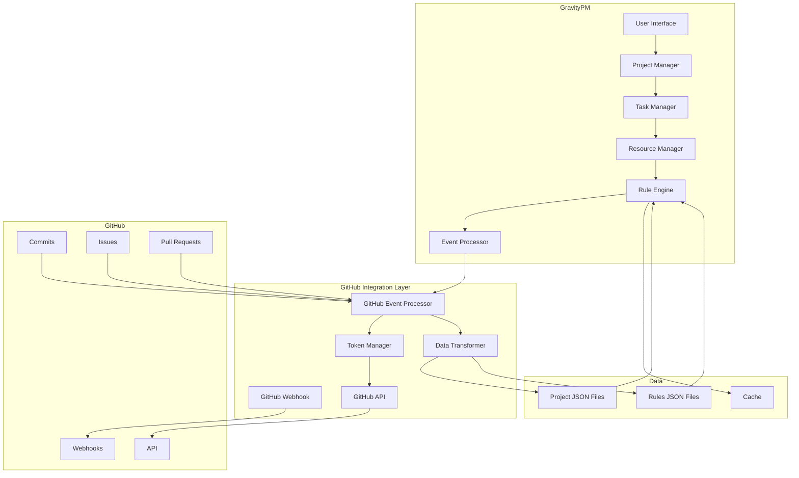
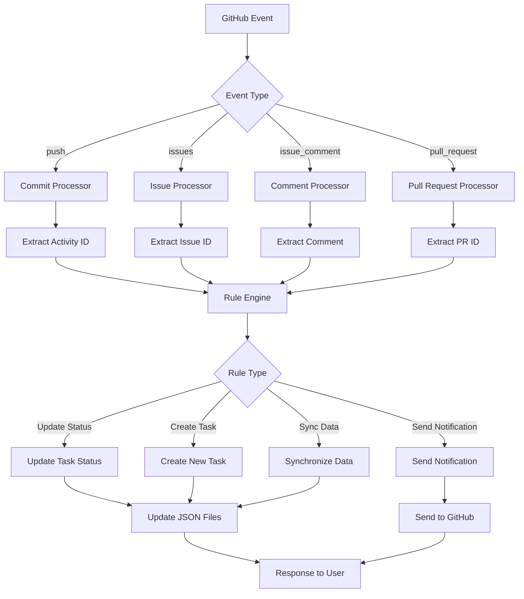
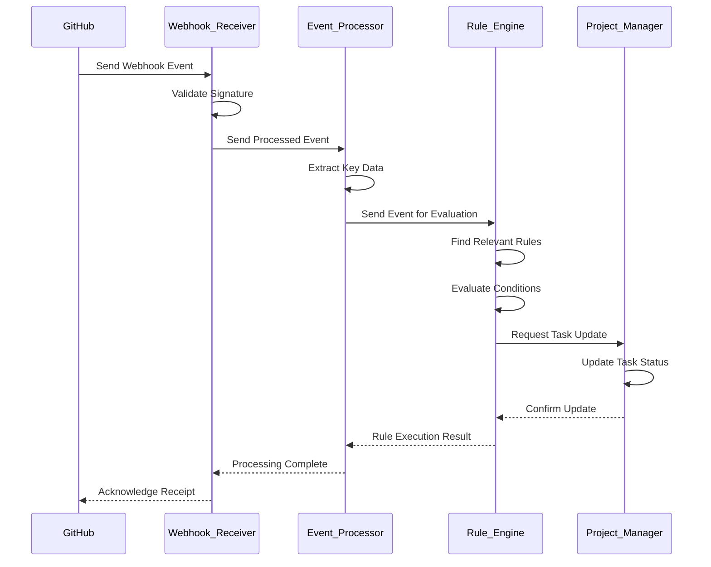
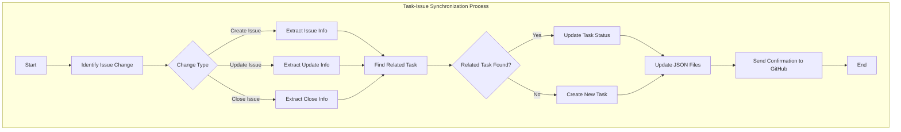
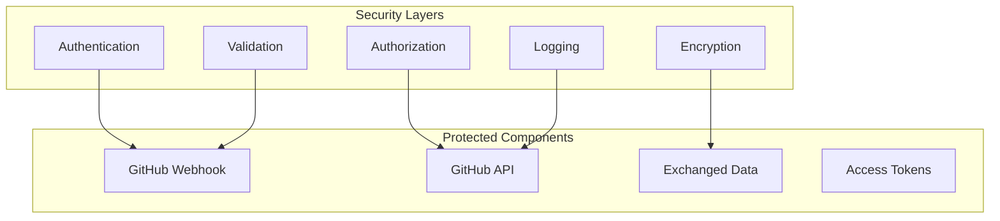
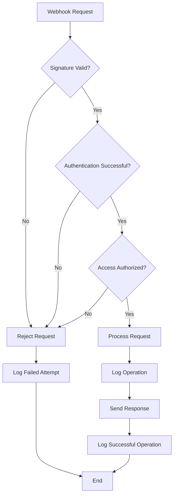
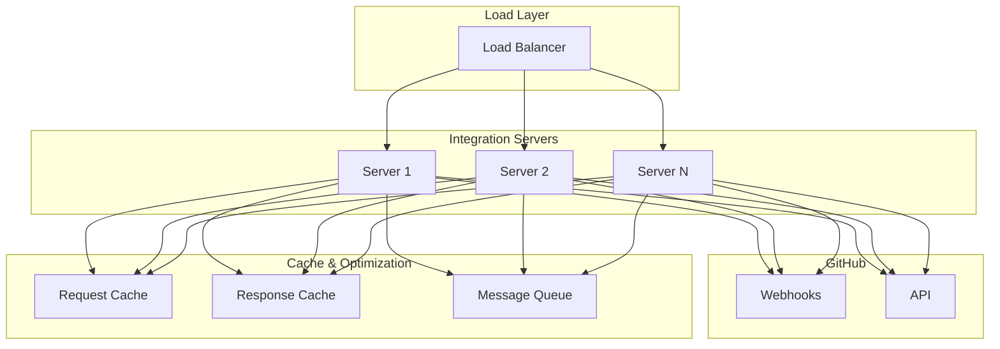
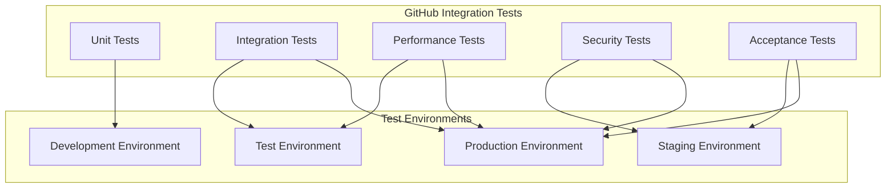
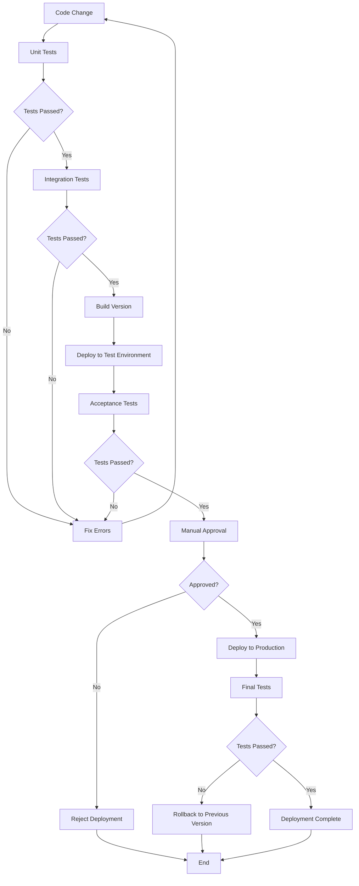

Here's the English translation of the provided Persian document:

```markdown
# GravityPM Project Management Software Integration Document with GitHub

## Table of Contents

1. [Introduction](#introduction)
2. [Integration Goals](#integration-goals)
3. [Integration Architecture](#integration-architecture)
4. [Integration Details with GitHub](#integration-details-with-github)
5. [Data Flow of Integration with GitHub](#data-flow-of-integration-with-github)
6. [Integration Processes with GitHub](#integration-processes-with-github)
7. [Security of Integration with GitHub](#security-of-integration-with-github)
8. [Performance and Scalability of Integration with GitHub](#performance-and-scalability-of-integration-with-github)
9. [Testing and Deployment of Integration with GitHub](#testing-and-deployment-of-integration-with-github)
10. [Conclusion](#conclusion)

---

## Introduction

This document describes the integration of GravityPM project management software with GitHub as the sole external system. GravityPM is a comprehensive project management system fully integrated with GitHub, using it as the primary source for automating project management processes. The main goal of this integration is to create an intelligent bidirectional connection between GravityPM and GitHub to enable full automation of project management processes based on GitHub events.

### Importance of GitHub Integration
- **Full Process Automation**: Reduce manual inputs and automate based on GitHub events
- **Development Focus**: Use GitHub as the central hub for development activities
- **Progress Transparency**: Track project progress through commits and Issues
- **Team Coordination**: Improve team coordination through Issues and Pull Requests
- **Quality Management**: Automatic logging and tracking of bugs and issues

---

## Integration Goals

### Functional Goals

| ID | Goal | Priority | Description |
|-------|------|--------|-------|
| GIO-001 | Receive GitHub Events | High | Receive and process Webhook events from GitHub |
| GIO-002 | Automatic Task Status Updates | High | Update task status based on commits and Issues |
| GIO-003 | Automatic Issue Creation | High | Create Issues in GitHub based on project events |
| GIO-004 | Data Synchronization | Medium | Synchronize data between GravityPM and GitHub |
| GIO-005 | Commit Management | Medium | Track commits and associate with tasks |

### Non-Functional Goals

| ID | Goal | Priority | Criteria |
|-------|------|--------|-------|
| GINO-001 | Reliability | High | 99.9% uptime |
| GINO-002 | Performance | High | Response time < 2 seconds |
| GINO-003 | Security | High | Encrypted communications and authentication |
| GINO-004 | Scalability | Medium | Support 10,000 events per day |
| GINO-005 | Compatibility | Medium | Compatible with GitHub APIs and Webhooks |

---

## Integration Architecture

### GitHub Integration Architecture Diagram



### Architecture Explanation

The GravityPM-GitHub integration architecture consists of several main components:

1. **GravityPM Layer**: Core project management system components
2. **GitHub Integration Layer**: Dedicated layer for managing GitHub communication
3. **GitHub Services**: GitHub services interacting with GravityPM
4. **Data Layer**: Internal system data management

### Key Integration Components

| Component | Role | Description |
|------|------|-------|
| GitHub Webhook | Event Reception | Receive real-time events from GitHub |
| GitHub API | GitHub Communication | Send requests to GitHub API |
| GitHub Event Processor | Event Processing | Interpret and process events from GitHub |
| Token Manager | Authentication Management | Manage GitHub access tokens |
| Data Transformer | Data Synchronization | Convert data between GravityPM and GitHub formats |

---

## Integration Details with GitHub

### GitHub Integration Components Diagram

```mermaid
componentDiagram
    [GravityPM] --> [GitHub Webhook Receiver]
    [GravityPM] --> [GitHub API Client]
    [GitHub Webhook Receiver] --> [Event Processor]
    [Event Processor] --> [Rule Engine]
    [Rule Engine] --> [Project Manager]
    [Rule Engine] --> [Task Manager]
    [Rule Engine] --> [Resource Manager]
    [GitHub API Client] --> [GitHub API]
    [Project Manager] --> [Data Store]
    [Task Manager] --> [Data Store]
    [Resource Manager] --> [Data Store]
```

### Supported GitHub Events

| Event | Description | Received Data | GravityPM Actions |
|--------|-------|---------------------------|------------------------------|
| push | Code pushed to repository | commits, ref, repository | Update task status based on commits |
| issues | Issue created or updated | issue action, issue data | Sync task status with Issues |
| issue_comment | Comment added to Issue | comment, issue data | Process comments and update tasks |
| pull_request | Pull Request created or updated | PR action, PR data | Manage Pull Requests and associate with tasks |

### GitHub Integration Operations Table

| Operation | Description | Inputs | Outputs |
|--------|-------|----------|----------|
| Receive Webhook | Receive Webhook events | payload, signature | Processed event |
| Create Issue | Create Issue in GitHub | Title, body, labels | Issue ID |
| Update Issue | Update existing Issue | Issue ID, new data | Operation status |
| Close Issue | Close Issue in GitHub | Issue ID | Operation status |
| Get Commits | Retrieve commit list | Repository, branch | Commit list |

---

## Data Flow of Integration with GitHub

### GitHub Integration Data Flow Diagram



### Input Data Flow from GitHub

| Data Source | Data Type | Format | Frequency | Description |
|-----------|----------|-------|--------|-------|
| push webhook | Commit events | JSON | Real-time | Information about pushed commits |
| issues webhook | Issue events | JSON | Real-time | Information about created/updated Issues |
| issue_comment webhook | Comment events | JSON | Real-time | Information about Issue comments |
| pull_request webhook | PR events | JSON | Real-time | Information about Pull Requests |

### Output Data Flow to GitHub

| Data Destination | Data Type | Format | Frequency | Description |
|-----------|----------|-------|--------|-------|
| Issues API | Create Issue | JSON | Real-time | Create Issue for new tasks |
| Issues API | Update Issue | JSON | Real-time | Update Issue status |
| Issues API | Close Issue | JSON | Real-time | Close completed Issues |
| Repositories API | Get Commits | JSON | Periodic | Retrieve commit list |

---

## Integration Processes with GitHub

### GitHub Event Processing Process

#### GitHub Event Processing Process Diagram



#### GitHub Event Processing Steps Table

| Step | Description | Inputs | Outputs |
|--------|-------|----------|----------|
| Receive Event | Receive event from GitHub | payload, signature | Validated event |
| Validation | Verify digital signature | payload, signature | Validation status |
| Extract Data | Extract key data | Validated event | Extracted data |
| Evaluate Rules | Evaluate automation rules | Extracted data | Executable rules |
| Execute Actions | Execute defined actions | Executable rules | Execution results |
| Update Data | Update system data | Execution results | Updated data |

### Task-Issue Synchronization Process

#### Task-Issue Synchronization Process Diagram



#### Issue Synchronization Strategies Table

| Strategy | Description | Advantages | Disadvantages |
|----------|-------|-------|-------|
| Real-time Sync | Immediate sync after Issue change | Data always up-to-date | High system load |
| Periodic Sync | Sync at specified intervals | Lower system load | Delayed data updates |
| Event-based Sync | Sync in response to Issue events | High efficiency | Requires event definitions |

---

## Security of Integration with GitHub

### GitHub Integration Security Layers Diagram



### Security Mechanisms

#### Authentication and Authorization

| Mechanism | Description | Implementation |
|---------|-------|-------------|
| Personal Access Tokens | Use Personal Access Tokens | Token with limited permissions |
| Webhook Authentication | Verify webhook signature | HMAC-SHA256 |
| Role-based Access Control | Limit access by user role | RBAC |
| Rate Limiting | Limit request volume | Rate limiting |

#### Data Encryption and Security

| Data Type | Encryption Method | Key | Description |
|----------|--------------|------|-------|
| Data in Transit | TLS/SSL | - | Encrypt communications between GravityPM and GitHub |
| Webhook Signature | HMAC-SHA256 | Webhook Secret | Verify webhook source |
| Access Tokens | Encryption | System Key | Secure token storage |
| Sensitive Data | AES-256 | System Key | Encrypt sensitive data |

### GitHub Integration Security Flow Diagram



---

## Performance and Scalability of Integration with GitHub

### GitHub Integration Scalability Diagram



### Performance Optimization Strategies

#### Data Caching

| Data Type | Caching Strategy | Expiration | Description |
|----------|-------------|-------------|-------|
| GitHub API Responses | Write-through | 5 minutes | Cache frequent API responses |
| GitHub User Info | Write-through | 1 hour | Cache user information |
| Repository Info | Write-through | 24 hours | Cache repository information |
| Event Processing Results | Write-through | 10 minutes | Cache similar processing results |

#### Load Management and Scalability

| Technique | Description | Impact |
|--------|-------|-------|
| Load Balancing | Distribute webhook requests across servers | Increased capacity and reliability |
| Parallel Processing | Process multiple events simultaneously | Reduced response time |
| Message Queues | Use queues for asynchronous processing | Increased processing capacity |
| API Query Optimization | Optimize GitHub API requests | Reduced load on GitHub |

### GitHub Integration Performance Metrics Table

| Metric | Target | Minimum | Optimal |
|-------|------|-------|-------|
| Webhook Response Time | < 100ms | < 200ms | < 50ms |
| Event Processing Time | < 50ms | < 100ms | < 25ms |
| Event Processing Capacity | 500 events/second | 200 events/second | 1000 events/second |
| Data Sync Time | < 2s | < 5s | < 1s |
| Uptime | 99.9% | 99% | 99.99% |

---

## Testing and Deployment of Integration with GitHub

### GitHub Integration Testing Strategy

#### GitHub Integration Testing Strategy Diagram



#### GitHub Integration Test Types Table

| Test Type | Goal | Tools | Execution Environment |
|---------|------|--------|-----------|
| Unit Tests | Test individual integration components | Jest, Mocha | Development |
| Integration Tests | Test GitHub interaction | Cypress, Supertest | Test |
| Performance Tests | Test performance under load | K6, JMeter | Test |
| Security Tests | Test security vulnerabilities | OWASP ZAP, Burp | Staging |
| Acceptance Tests | Test user requirements | Selenium, Cucumber | Staging |

### GitHub Integration Deployment Strategy

#### GitHub Integration Deployment Diagram



#### GitHub Integration Deployment Environments Table

| Environment | Purpose | Configuration | Access |
|-------|------|-----------|--------|
| Development | Development and initial testing | Minimal, local | Developers |
| Test | Comprehensive integration testing | Production-like | Test Team |
| Staging | Final pre-production testing | Production-like | Operations Team |
| Production | Final deployment | Optimized | Operations Team |

---

## Conclusion

The integration of GravityPM project management software with GitHub as the sole external system plays a key role in automating project management processes. This integration, utilizing a GitHub-centric architecture and optimized security and performance strategies, provides an efficient and reliable solution for managing software projects.

### Strengths of GitHub Integration
- **GitHub Focus**: Using GitHub as the central hub for development activities
- **Full Automation**: Automating processes based on GitHub events
- **High Security**: Protecting data and communications with multiple security layers
- **Optimal Performance**: Optimized for rapid processing of GitHub events
- **Scalability**: Ability to handle high volumes of GitHub events

### Challenges of GitHub Integration
- **Event Management Complexity**: Need to manage various GitHub event types
- **Data Synchronization**: Challenges in synchronizing between GravityPM and GitHub
- **API Limitations**: Adhering to GitHub API rate limits
- **Error Handling**: Need to handle GitHub communication errors

### Future Roadmap
- **Performance Improvement**: Further optimization for faster event processing
- **Enhanced Security**: Implementing additional security layers
- **Feature Expansion**: Adding new capabilities based on GitHub events
- **User Experience Improvement**: Enhancing UI for integration management

This document, by providing comprehensive explanations, detailed diagrams, and comprehensive tables, establishes a clear framework for implementing and executing the GravityPM-GitHub integration and will serve as the primary reference for technical and management teams.
```