# سند کامل فرآیندها و زیرفرآیندهای نرم‌افزار مدیریت پروژه GravityPM

## فهرست مطالب

1. [مقدمه](#مقدمه)
2. [فرآیند مدیریت پروژه](#فرآیند-مدیریت-پروژه)
3. [فرآیند مدیریت وظایف](#فرآیند-مدیریت-وظایف)
4. [فرآیند مدیریت منابع](#فرآیند-مدیریت-منابع)
5. [فرآیند مدیریت وابستگی](#فرآیند-مدیریت-وابستگی)
6. [فرآیند مدیریت ریسک](#فرآیند-مدیریت-ریسک)
7. [فرآیند مدیریت کیفیت](#فرآیند-مدیریت-کیفیت)
8. [فرآیند گزارش‌دهی](#فرآیند-گزارشدهی)
9. [فرآیند یکپارچه‌سازی با GitHub](#فرآیند-یکپارچهسازی-با-github)
10. [فرآیندهای خودکار و نیمه خودکار](#فرآیندهای-خودکار-و-نیمه-خودکار)
    - [تسطیح منابع](#تسطیح-منابع)
    - [ری‌اسکجولینگ](#ریاسکجولینگ)
    - [محاسبه مسیر بحرانی](#محاسبه-مسیر-بحرانی)
    - [پیش‌بینی زمان اتمام پروژه](#پیشبینی-زمان-اتمام-پروژه)
    - [هشدارهای زودهنگام](#هشدارهای-زودهنگام)
    - [مدیریت بودجه](#مدیریت-بودجه)
    - [مدیریت مستندات](#مدیریت-مستندات)
    - [مدیریت ارتباطات](#مدیریت-ارتباطات)
    - [مدیریت تغییرات](#مدیریت-تغییرات)
    - [مدیریت قراردادها](#مدیریت-قراردادها)
11. [نتیجه‌گیری](#نتیجهگیری)

---

## مقدمه

این سند فرآیندها و زیرفرآیندهای نرم‌افزار مدیریت پروژه GravityPM را به‌صورت کامل و با جزئیات دقیق توصیف می‌کند. GravityPM یک سیستم مدیریت پروژه پیشرفته است که با تمرکز بر خودکارسازی فرآیندها و یکپارچه‌سازی با GitHub طراحی شده است. هدف این سیستم، کاهش ورودی‌های دستی و افزایش کارایی در مدیریت پروژه‌های نرم‌افزاری از طریق اتوماسیون هوشمند است.

### اهداف سند
- مستندسازی کامل فرآیندهای اصلی سیستم
- توصیف دقیق زیرفرآیندها و جریان‌های کاری
- ارائه دیاگرام‌های واضح برای درک بهتر فرآیندها
- تعیین نقش‌ها و مسئولیت‌ها در هر فرآیند
- شناسایی نقاط ورودی و خروجی هر فرآیند
- پوشش کامل فرآیندهای خودکار و نیمه خودکار

---

## فرآیند مدیریت پروژه

### توضیح کلی
فرآیند مدیریت پروژه شامل تمام فعالیت‌هایی است که برای ایجاد، نظارت و کنترل پروژه‌ها انجام می‌شود. این فرآیند از تعریف پروژه تا خاتمه آن را پوشش می‌دهد.

### زیرفرآیندها
1. ایجاد پروژه
2. ویرایش پروژه
3. حذف پروژه
4. مشاهده پروژه
5. تغییر وضعیت پروژه
6. تخصیص مدیر پروژه

### دیاگرام فرآیند مدیریت پروژه
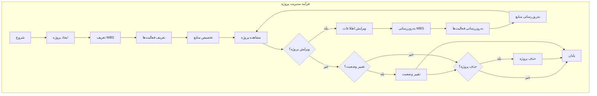

### جدول زیرفرآیندهای مدیریت پروژه
| زیرفرآیند | توضیح | نقش‌ها | ورودی‌ها | خروجی‌ها |
|-----------|-------|--------|----------|----------|
| ایجاد پروژه | ایجاد پروژه جدید با مشخصات کامل | مدیر پروژه | نام، توضیحات، تاریخ شروع، تاریخ پایان | شناسه پروژه، وضعیت اولیه |
| ویرایش پروژه | تغییر مشخصات پروژه موجود | مدیر پروژه | شناسه پروژه، داده‌های جدید | وضعیت عملیات |
| حذف پروژه | حذف پروژه و داده‌های مرتبط | مدیر پروژه | شناسه پروژه | وضعیت عملیات |
| مشاهده پروژه | نمایش اطلاعات کامل پروژه | مدیر پروژه، اعضای تیم | شناسه پروژه | اطلاعات کامل پروژه |
| تغییر وضعیت | تغییر وضعیت پروژه | مدیر پروژه | شناسه پروژه، وضعیت جدید | وضعیت عملیات |
| تخصیص مدیر | تعیین مدیر برای پروژه | مدیر سیستمی | شناسه پروژه، شناسه مدیر | وضعیت عملیات |

### دیاگرام جریان ایجاد پروژه
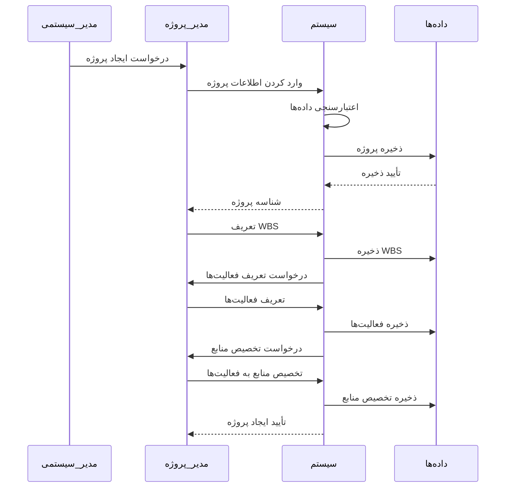

---

## فرآیند مدیریت وظایف

### توضیح کلی
فرآیند مدیریت وظایف شامل تمام فعالیت‌هایی است که برای ایجاد، پیگیری و کنترل وظایف پروژه انجام می‌شود. این فرآیند به‌طور مستقیم با پیشرفت پروژه در ارتباط است.

### زیرفرآندها
1. ایجاد وظیفه
2. ویرایش وظیفه
3. حذف وظیفه
4. پیگیری پیشرفت وظیفه
5. تخصیص منبع به وظیفه
6. مدیریت وابستگی‌های وظیفه
7. به‌روزرسانی وضعیت وظیفه

### دیاگرام فرآیند مدیریت وظایف
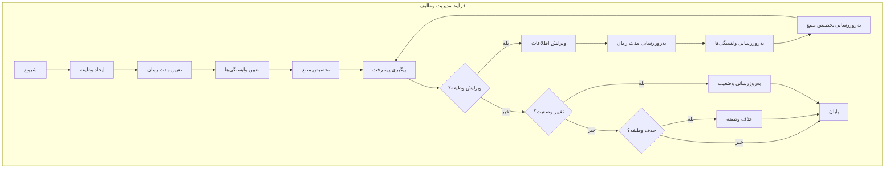

### جدول زیرفرآیندهای مدیریت وظایف
| زیرفرآیند | توضیح | نقش‌ها | ورودی‌ها | خروجی‌ها |
|-----------|-------|--------|----------|----------|
| ایجاد وظیفه | ایجاد وظیفه جدید با مشخصات کامل | مدیر پروژه، عضو تیم | نام، توضیحات، مدت زمان، WBS | شناسه وظیفه |
| ویرایش وظیفه | تغییر مشخصات وظیفه موجود | مدیر پروژه، عضو تیم | شناسه وظیفه، داده‌های جدید | وضعیت عملیات |
| حذف وظیفه | حذف وظیفه و به‌روزرسانی وابستگی‌ها | مدیر پروژه | شناسه وظیفه | وضعیت عملیات |
| پیگیری پیشرفت | به‌روزرسانی درصد پیشرفت وظیفه | عضو تیم | شناسه وظیفه، درصد پیشرفت | وضعیت عملیات |
| تخصیص منبع | تخصیص منبع به وظیفه | مدیر پروژه | شناسه وظیفه، شناسه منبع | وضعیت عملیات |
| مدیریت وابستگی | تعریف و مدیریت وابستگی بین وظایف | مدیر پروژه | شناسه وظیفه، لیست وابستگی‌ها | وضعیت عملیات |
| به‌روزرسانی وضعیت | تغییر وضعیت وظیفه | عضو تیم | شناسه وظیفه، وضعیت جدید | وضعیت عملیات |

### دیاگرام جریان پیگیری پیشرفت وظیفه
```mermaid
stateDiagram-v2
    [*] --> دریافت_درخواست_به‌روزرسانی
    دریافت_درخواست_به‌روزرسانی --> اعتبارسنجی_دسترسی
    اعتبارسنجی_دسترسی --> دسترسی_مجاز؟
    
    دسترسی_مجاز؟ --> خیر --> نمایش_خطا
    دسترسی_مجاز؟ --> بله --> اعتبارسنجی_درصد_پیشرفت
    
    اعتبارسنجی_درصد_پیشرفت --> درصد_معتبر؟
    
    درصد_معتبر؟ --> خیر --> نمایش_خطا_درصد
    درصد_معتبر؟ --> بله --> به‌روزرسانی_پیشرفت
    
    به‌روزرسانی_پیشرفت --> محاسبه_وضعیت_جدید
    محاسبه_وضعیت_جدید --> به‌روزرسانی_وضعیت
    به‌روزرسانی_وضعیت --> بررسی_تکمیل_وظیفه
    
    بررسی_تکمیل_وظیفه --> وظیفه_تکمیل_شده؟
    
    وظیفه_تکمیل_شده؟ --> بله --> بررسی_وابستگی‌ها
    وظیفه_تکمیل_شده؟ --> خیر --> ارسال_تأیید
    
    بررسی_وابستگی‌ها --> به‌روزرسانی_وضعیت_وابسته‌ها
    به‌روزرسانی_وضعیت_وابسته‌ها --> ارسال_اعلان_به_وابسته‌ها
    ارسال_اعلان_به_وابسته‌ها --> ارسال_تأیید
    
    ارسال_تأیید --> [*]
    نمایش_خطا --> [*]
    نمایش_خطا_درصد --> [*]
```

---

## فرآیند مدیریت منابع

### توضیح کلی
فرآیند مدیریت منابع شامل تمام فعالیت‌هایی است که برای تعریف، تخصیص و نظارت بر منابع پروژه انجام می‌شود. این فرآیند به‌طور مستقیم با بهینه‌سازی استفاده از منابع در ارتباط است.

### زیرفرآندها
1. ایجاد منبع
2. ویرایش منبع
3. حذف منبع
4. تخصیص منبع به وظیفه
5. پیگیری در دسترس بودن منبع
6. گزارش مصرف منابع
7. بهینه‌سازی تخصیص منابع

### دیاگرام فرآیند مدیریت منابع
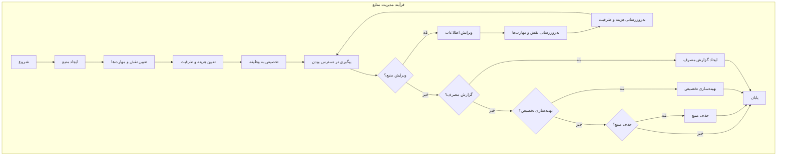

### جدول زیرفرآندهای مدیریت منابع
| زیرفرآیند | توضیح | نقش‌ها | ورودی‌ها | خروجی‌ها |
|-----------|-------|--------|----------|----------|
| ایجاد منبع | ایجاد منبع جدید با مشخصات کامل | مدیر پروژه | نام، نقش، مهارت‌ها، هزینه، ظرفیت | شناسه منبع |
| ویرایش منبع | تغییر مشخصات منبع موجود | مدیر پروژه | شناسه منبع، داده‌های جدید | وضعیت عملیات |
| حذف منبع | حذف منبع و به‌روزرسانی تخصیص‌ها | مدیر پروژه | شناسه منبع | وضعیت عملیات |
| تخصیص منبع | تخصیص منبع به وظیفه | مدیر پروژه | شناسه منبع، شناسه وظیفه | وضعیت عملیات |
| پیگیری در دسترس بودن | بررسی در دسترس بودن منبع | مدیر پروژه | شناسه منبع، تاریخ | وضعیت در دسترس بودن |
| گزارش مصرف | ایجاد گزارش مصرف منابع در پروژه | مدیر پروژه | شناسه پروژه | گزارش مصرف منابع |
| بهینه‌سازی تخصیص | بهینه‌سازی تخصیص منابع بر اساس بار کاری | سیستم | داده‌های منابع و وظایف | پیشنهادات تخصیص بهینه |

### دیاگرام جریان تخصیص منبع به وظیفه
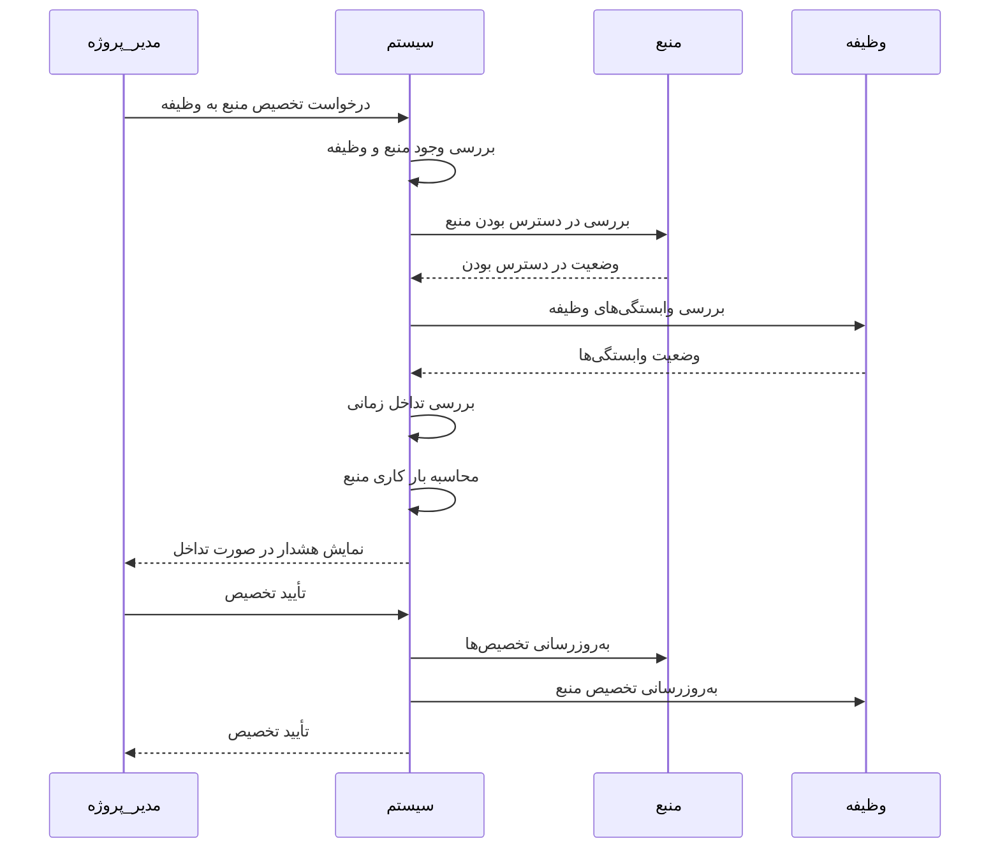

---

## فرآیند مدیریت وابستگی

### توضیح کلی
فرآیند مدیریت وابستگی شامل تمام فعالیت‌هایی است که برای تعریف، بررسی و مدیریت وابستگی‌های بین وظایف انجام می‌شود. این فرآیند به‌طور مستقیم با برنامه‌ریزی و اجرای صحیح پروژه در ارتباط است.

### زیرفرآندها
1. تعریف وابستگی بین وظایف
2. بررسی وابستگی‌ها
3. به‌روزرسانی وضعیت وابستگی‌ها
4. اطلاع‌رسانی برای آماده‌سازی وظایف
5. مدیریت تداخل‌های وابستگی
6. بازبینی وابستگی‌ها

### دیاگرام فرآیند مدیریت وابستگی
```mermaid
graph TB
    subgraph "فرآیند مدیریت وابستگی"
        A[شروع] --> B[تعریف وابستگی بین وظایف]
        B --> C[تعیین نوع وابستگی]
        C --> D[ذخیره وابستگی]
        D --> E[بررسی وابستگی‌ها]
        E --> F{همه وابستگی‌ها برقرار؟}
        F -->|بله| G[به‌روزرسانی وضعیت وظیفه به "آماده"]
        F -->|خیر| H[نگهداری وضعیت فعلی]
        G --> I[اطلاع‌رسانی به مسئول وظیفه]
        H --> J{تداخل در وابستگی؟}
        I --> K
        J -->|بله| L[مدیریت تداخل]
        J -->|خیر| K
        L --> M{بازبینی وابستگی؟}
        M -->|بله| N[بازبینی وابستگی‌ها]
        M -->|خیر| O[پایان]
        N --> B
        K --> O
    end
```

### جدول زیرفرآیندهای مدیریت وابستگی
| زیرفرآیند | توضیح | نقش‌ها | ورودی‌ها | خروجی‌ها |
|-----------|-------|--------|----------|----------|
| تعریف وابستگی | تعریف وابستگی بین وظایف | مدیر پروژه | وظیفه مبدأ، وظیفه مقصد، نوع وابستگی | شناسه وابستگی |
| بررسی وابستگی‌ها | بررسی وضعیت وابستگی‌ها | سیستم | وظیفه، لیست وابستگی‌ها | وضعیت وابستگی‌ها |
| به‌روزرسانی وضعیت | به‌روزرسانی وضعیت وابستگی‌ها | سیستم | شناسه وابستگی، وضعیت جدید | وضعیت عملیات |
| اطلاع‌رسانی | اطلاع‌رسانی به مسئول وظیفه | سیستم | وظیفه، وضعیت جدید | اعلان |
| مدیریت تداخل | مدیریت تداخل‌های وابستگی | مدیر پروژه | وظیفه‌های دارای تداخل | راهکارهای رفع تداخل |
| بازبینی وابستگی | بازبینی وابستگی‌های تعریف شده | مدیر پروژه | وظیفه، لیست وابستگی‌ها | پیشنهادات بهبود |

### دیاگرام جریان بررسی وابستگی‌ها
```mermaid
flowchart TD
    A[تغییر وضعیت وظیفه] --> B[استخراج وابستگی‌ها]
    B --> C[بررسی وضعیت هر وابستگی]
    C --> D{همه وابستگی‌ها تکمیل شده‌اند؟}
    
    D -->|خیر| E[نگهداری وضعیت فعلی]
    D -->|بله| F[به‌روزرسانی وضعیت وظیفه به "آماده"]
    
    F --> G[ایجاد Issue "آماده به شروع"]
    G --> H[ارسال اعلان به مسئول وظیفه]
    
    E --> I{آیا تداخل وجود دارد؟}
    I -->|بله| J[شناسایی نوع تداخل]
    I -->|خیر| K[پایان]
    
    J --> L[ایجاد Issue "تداخل وابستگی"]
    L --> M[ارسال اعلان به مدیر پروژه]
    M --> N[پیشنهاد راهکارهای رفع تداخل]
    N --> K
    
    H --> K
```

---

## فرآیند مدیریت ریسک

### توضیح کلی
فرآیند مدیریت ریسک شامل تمام فعالیت‌هایی است که برای شناسایی، ارزیابی، پاسخ و نظارت بر ریسک‌های پروژه انجام می‌شود. این فرآیند به‌طور مستقیم با کاهش تهدیدات و افزایش فرصت‌های پروژه در ارتباط است.

### زیرفرآندها
1. شناسایی ریسک
2. ارزیابی ریسک
3. برنامه‌ریزی پاسخ به ریسک
4. اجرای پاسخ به ریسک
5. نظارت بر ریسک
6. بازبینی ریسک

### دیاگرام فرآیند مدیریت ریسک
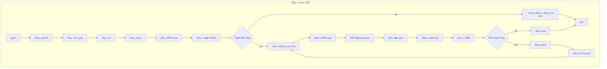

### جدول زیرفرآیندهای مدیریت ریسک
| زیرفرآیند | توضیح | نقش‌ها | ورودی‌ها | خروجی‌ها |
|-----------|-------|--------|----------|----------|
| شناسایی ریسک | شناسایی ریسک‌های بالقوه پروژه | تیم پروژه | توصیف ریسک، دسته ریسک | شناسه ریسک |
| ارزیابی ریسک | ارزیابی احتمال و تأثیر ریسک | مدیر پروژه، تیم پروژه | شناسه ریسک | احتمال، تأثیر، اولویت |
| برنامه‌ریزی پاسخ | برنامه‌ریزی اقدامات برای پاسخ به ریسک | مدیر پروژه | شناسه ریسک، نوع پاسخ | برنامه پاسخ |
| اجرای پاسخ | اجرای اقدامات پاسخ به ریسک | مسئول اقدام | شناسه ریسک، اقدامات | نتایج اجرا |
| نظارت بر ریسک | نظارت بر وضعیت ریسک و اقدامات | مدیر پروژه | شناسه ریسک | گزارش وضعیت |
| بازبینی ریسک | بازبینی ارزیابی و پاسخ به ریسک | مدیر پروژه | شناسه ریسک، نتایج نظارت | ارزیابی به‌روز شده |

### دیاگرام جریان شناسایی و ارزیابی ریسک
```mermaid
stateDiagram-v2
    [*] --> دریافت_ریسک_جدید
    دریافت_ریسک_جدید --> اعتبارسنجی_ریسک
    اعتبارسنجی_ریسک --> ریسک_معتبر؟
    
    ریسک_معتبر؟ --> خیر --> رد_ریسک
    ریسک_معتبر؟ --> بله --> تعیین_دسته_ریسک
    
    تعیین_دسته_ریسک --> تعیین_احتمال_ریسک
    تعیین_احتمال_ریسک --> تعیین_تأثیر_ریسک
    تعیین_تأثیر_ریسک --> محاسبه_اولویت_ریسک
    
    محاسبه_اولویت_ریسک --> اولویت_ریسک_بالا؟
    
    اولویت_ریسک_بالا؟ --> بله --> ایجاد_اعلان_فوری
    اولویت_ریسک_بالا؟ --> خیر --> ثبت_ریسک
    
    ایجاد_اعلان_فوری --> ثبت_ریسک
    ثبت_ریسک --> ارزیابی_تأثیر_بر_زمان_و_هزینه
    ارزیابی_تأثیر_بر_زمان_و_هزینه --> پیشنهاد_اقدامات_پاسخ
    پیشنهاد_اقدامات_پاسخ --> [*]
    
    رد_ریسک --> [*]
```

---

## فرآیند مدیریت کیفیت

### توضیح کلی
فرآیند مدیریت کیفیت شامل تمام فعالیت‌هایی است که برای اطمینان از کیفیت محصولات و فرآیندهای پروژه انجام می‌شود. این فرآیند به‌طور مستقیم با رضایت ذینفعان و موفقیت پروژه در ارتباط است.

### زیرفرآندها
1. برنامه‌ریزی کیفیت
2. تضمین کیفیت
3. کنترل کیفیت
4. ثبت و پیگیری باگ‌ها
5. بهبود کیفیت
6. گزارش‌دهی کیفیت

### دیاگرام فرآیند مدیریت کیفیت
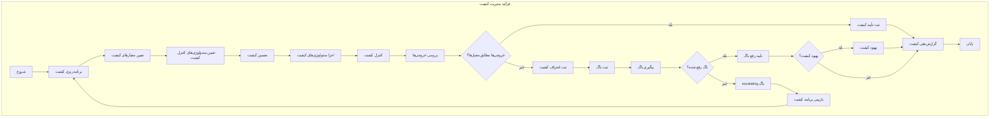

### جدول زیرفرآیندهای مدیریت کیفیت
| زیرفرآیند | توضیح | نقش‌ها | ورودی‌ها | خروجی‌ها |
|-----------|-------|--------|----------|----------|
| برنامه‌ریزی کیفیت | برنامه‌ریزی معیارها و متدولوژی‌های کیفیت | مدیر پروژه، مدیر کیفیت | الزامات پروژه | برنامه کیفیت |
| تضمین کیفیت | اطمینان از رعایت فرآیندهای کیفیت | مدیر کیفیت | برنامه کیفیت، فرآیندها | گزارش تضمین کیفیت |
| کنترل کیفیت | بررسی خروجی‌ها بر اساس معیارها | مدیر کیفیت، تیم فنی | خروجی‌های پروژه، معیارها | نتایج کنترل کیفیت |
| ثبت و پیگیری باگ‌ها | ثبت و پیگیری باگ‌های شناسایی شده | تیم فنی، مدیر کیفیت | توصیف باگ، شدت | شناسه باگ، وضعیت |
| بهبود کیفیت | پیاده‌سازی اقدامات بهبود کیفیت | مدیر کیفیت | نتایج کنترل کیفیت | اقدامات بهبود |
| گزارش‌دهی کیفیت | تهیه گزارش‌های کیفیت | مدیر کیفیت | داده‌های کیفیت | گزارش کیفیت |

### دیاگرام جریان ثبت و پیگیری باگ‌ها
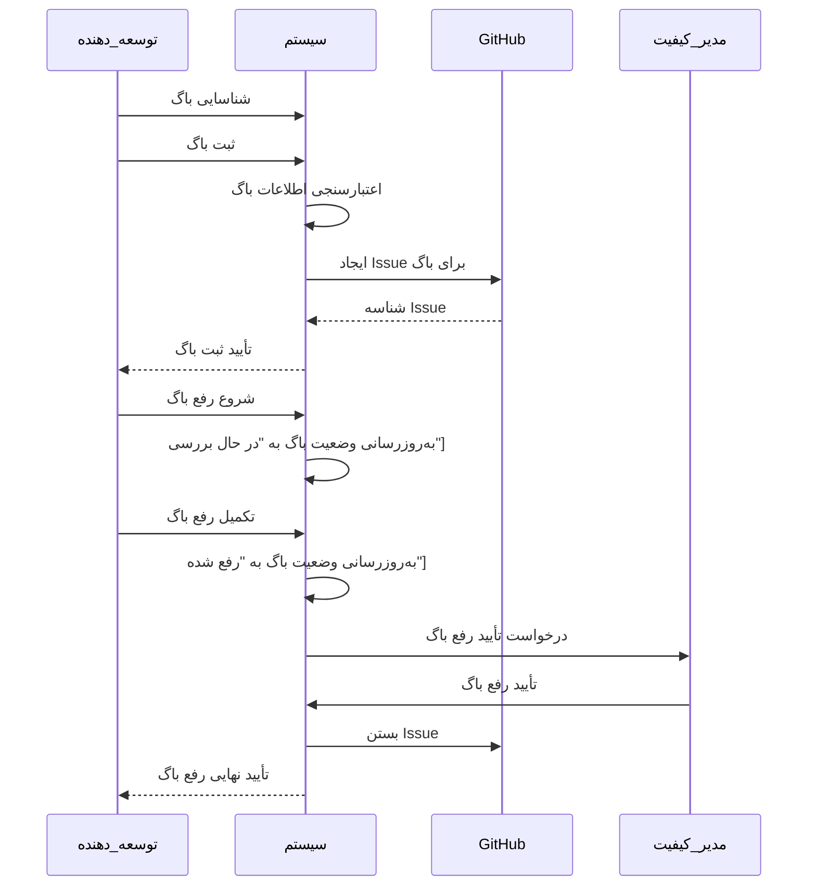

---

## فرآیند گزارش‌دهی

### توضیح کلی
فرآیند گزارش‌دهی شامل تمام فعالیت‌هایی است که برای تهیه، توزیع و نگهداری گزارش‌های پروژه انجام می‌شود. این فرآیند به‌طور مستقیم با شفافیت و تصمیم‌گیری‌های مدیریتی در ارتباط است.

### زیرفرآندها
1. برنامه‌ریزی گزارش‌دهی
2. جمع‌آوری داده‌ها
3. پردازش داده‌ها
4. ایجاد گزارش
5. توزیع گزارش
6. پیگیری گزارش

### دیاگرام فرآیند گزارش‌دهی
```mermaid
graph TB
    subgraph "فرآیند گزارش‌دهی"
        A[شروع] --> B[برنامه‌ریزی گزارش‌دهی]
        B --> C[تعیین انواع گزارش‌ها]
        C --> D[تعیین فرکانس گزارش‌دهی]
        D --> E[تعیین گیرندگان گزارش]
        E --> F[جمع‌آوری داده‌ها]
        F --> G[استخراج داده‌های پروژه]
        G --> H[استخراج داده‌های وظایف]
        H --> I[استخراج داده‌های منابع]
        I --> J[پردازش داده‌ها]
        J --> K[محاسبه شاخص‌ها]
        K --> L[تحلیل داده‌ها]
        L --> M[ایجاد گزارش]
        M --> N[قالب‌بندی گزارش]
        N --> O{توزیع گزارش؟}
        O -->|بله| P[ارسال به گیرندگان]
        O -->|خیر| Q[ذخیره گزارش]
        P --> R{پیگیری گزارش؟}
        Q --> R
        R -->|بله| S[پیگیری اقدامات گزارش]
        R -->|خیر| T[پایان]
        S --> T
    end
```

### جدول زیرفرآیندهای گزارش‌دهی
| زیرفرآیند | توضیح | نقش‌ها | ورودی‌ها | خروجی‌ها |
|-----------|-------|--------|----------|----------|
| برنامه‌ریزی گزارش‌دهی | برنامه‌ریزی انواع و فرکانس گزارش‌ها | مدیر پروژه | الزامات گزارش‌دهی | برنامه گزارش‌دهی |
| جمع‌آوری داده‌ها | جمع‌آوری داده‌های مورد نیاز برای گزارش | سیستم | نوع گزارش، بازه زمانی | داده‌های خام |
| پردازش داده‌ها | پردازش و تحلیل داده‌های جمع‌آوری شده | سیستم | داده‌های خام | داده‌های پردازش شده |
| ایجاد گزارش | ایجاد گزارش بر اساس داده‌های پردازش شده | سیستم | داده‌های پردازش شده، قالب گزارش | گزارش |
| توزیع گزارش | توزیع گزارش بین گیرندگان | سیستم | گزارش، لیست گیرندگان | تأیید توزیع |
| پیگیری گزارش | پیگیری اقدامات مبتنی بر گزارش | مدیر پروژه | گزارش، اقدامات | وضعیت اقدامات |

### دیاگرام جریان ایجاد گزارش پیشرفت روزانه
```mermaid
flowchart TD
    A[شروع گزارش روزانه] --> B[جمع‌آوری داده‌های پروژه]
    B --> C[جمع‌آوری داده‌های وظایف]
    C --> D[جمع‌آوری داده‌های منابع]
    D --> E[محاسبه شاخص‌های پیشرفت]
    E --> F[محاسبه درصد پیشرفت کل]
    F --> G[محاسبه درصد پیشرفت هر وظیفه]
    G --> H[محاسبه مصرف منابع]
    H --> I[شناسایی وظایف تأخیر خورده]
    I --> J[شناسایی وظایف در معرض ریسک]
    J --> K[ایجاد محتوای گزارش]
    K --> L[قالب‌بندی گزارش به صورت Markdown]
    L --> M[ایجاد Issue در GitHub]
    M --> N[افزودن برچسب "گزارش روزانه"]
    N --> O[افزودن برچسب "پیشرفت"]
    O --> P[تخصیص به مدیر پروژه]
    P --> Q[ارسال اعلان به تیم]
    Q --> R[پایان]
```

---

## فرآیند یکپارچه‌سازی با GitHub

### توضیح کلی
فرآیند یکپارچه‌سازی با GitHub شامل تمام فعالیت‌هایی است که برای اتصال سیستم مدیریت پروژه به GitHub انجام می‌شود. این فرآیند به‌طور مستقیم با خودکارسازی فرآیندهای پروژه بر اساس رویدادهای GitHub در ارتباط است.

### زیرفرآندها
1. پیکربندی یکپارچه‌سازی
2. راه‌اندازی Webhook
3. پردازش رویدادهای GitHub
4. اجرای قوانین خودکارسازی
5. به‌روزرسانی وضعیت پروژه
6. ایجاد و به‌روزرسانی Issues
7. همگام‌سازی داده‌ها

### دیاگرام فرآیند یکپارچه‌سازی با GitHub
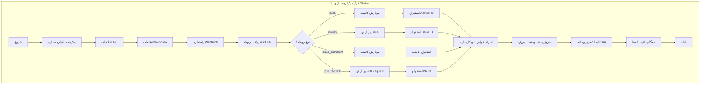

### جدول زیرفرآیندهای یکپارچه‌سازی با GitHub
| زیرفرآیند | توضیح | نقش‌ها | ورودی‌ها | خروجی‌ها |
|-----------|-------|--------|----------|----------|
| پیکربندی یکپارچه‌سازی | پیکربندی تنظیمات اتصال به GitHub | مدیر سیستمی | URL مخزن، توکن API | تنظیمات یکپارچه‌سازی |
| راه‌اندازی Webhook | راه‌اندازی Webhook برای دریافت رویدادها | مدیر سیستمی | URL Webhook، رمز مخفی | Webhook فعال |
| پردازش رویدادهای GitHub | پردازش رویدادهای دریافتی از GitHub | سیستم | payload رویداد | رویداد پردازش شده |
| اجرای قوانین خودکارسازی | اجرای قوانین خودکارسازی بر اساس رویدادها | سیستم | رویداد، قوانین | نتایج اجرای قوانین |
| به‌روزرسانی وضعیت پروژه | به‌روزرسانی وضعیت پروژه بر اساس رویدادها | سیستم | نتایج اجرای قوانین | وضعیت به‌روز شده |
| ایجاد و به‌روزرسانی Issues | ایجاد و به‌روزرسانی Issues در GitHub | سیستم | اطلاعات Issue | Issue ایجاد/به‌روز شده |
| همگام‌سازی داده‌ها | همگام‌سازی داده‌ها بین سیستم و GitHub | سیستم | تغییرات داده‌ها | داده‌های همگام شده |

### دیاگرام جریان پردازش کامیت GitHub
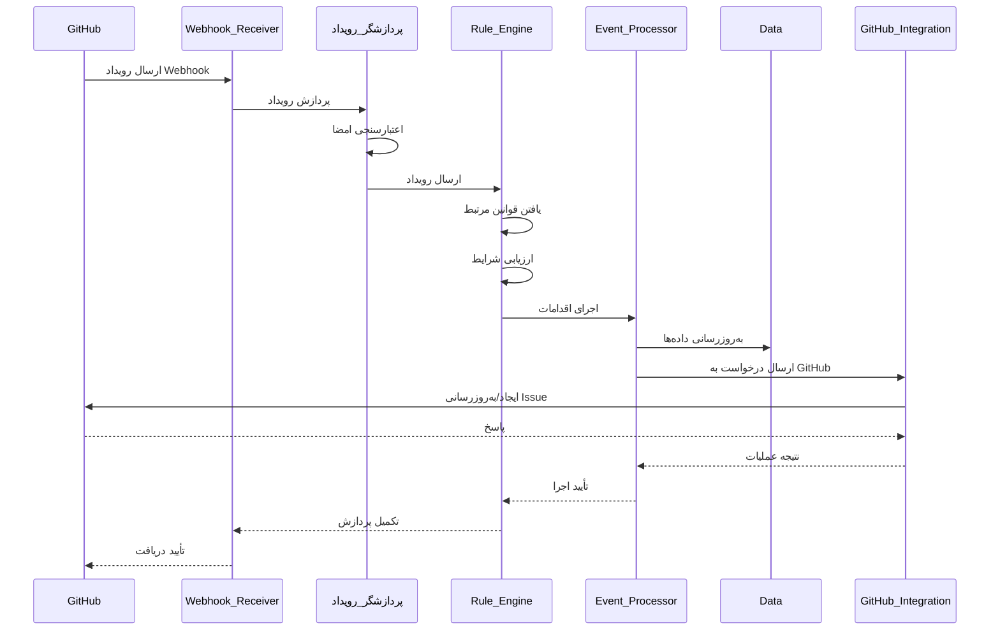

---

## فرآیندهای خودکار و نیمه خودکار

### توضیح کلی
این بخش شامل فرآیندهای خودکار و نیمه خودکار است که به‌طور قابل توجهی کارایی سیستم را افزایش داده و ورودی‌های دستی را کاهش می‌دهند. این فرآیندها بر اساس الگوها، رویدادها و شرایط از پیش تعریف شده اجرا می‌شوند.

### جدول جامع فرآیندهای خودکار/نیمه خودکار
| فرآیند | نوع خودکارسازی | محرک | خروجی | توضیح |
|--------|----------------|--------|---------|-------|
| **پیگیری پیشرفت وظیفه** | کامل | کامیت GitHub | وضعیت جدید وظیفه | به‌روزرسانی وضعیت بر اساس کامیت‌ها |
| **بررسی وابستگی‌ها** | کامل | تغییر وضعیت وظیفه | وضعیت "آماده" برای وابسته‌ها | بررسی خودکار وابستگی‌ها |
| **ثبت و پیگیری باگ‌ها** | کامل | کامیت با برچسب bug | Issue در GitHub | ثبت خودکار باگ‌ها |
| **گزارش‌دهی خودکار** | کامل | زمان‌بندی روزانه | گزارش در GitHub | ایجاد گزارش‌های منظم |
| **تسطیح منابع** | نیمه خودکار | شناسایی تداخل | پیشنهادات تخصیص | جلوگیری از بارگذاری بیش از حد منابع |
| **ری‌اسکجولینگ** | نیمه خودکار | شناسایی تأخیر | زمان‌بندی جدید | تنظیم مجدد برنامه بر اساس تأخیرها |
| **محاسبه مسیر بحرانی** | کامل | تغییر در پروژه | وظایف بحرانی | شناسایی وظایف بحرانی پروژه |
| **پیش‌بینی زمان اتمام** | کامل | تغییر در پیشرفت | تاریخ پیش‌بینی شده | پیش‌بینی زمان اتمام پروژه |
| **هشدارهای زودهنگام** | کامل | پایش شاخص‌ها | هشدارهای مختلف | هشدار قبل از وقوع مشکلات |
| **مدیریت بودجه** | کامل | تغییر در هزینه‌ها | هشدار بودجه | پیگیری و هشدار بودجه |
| **مدیریت مستندات** | نیمه خودکار | تغییر در پروژه | مستندات به‌روز شده | تولید و به‌روزرسانی خودکار مستندات |
| **مدیریت ارتباطات** | کامل | رویدادهای پروژه | اطلاعیه‌ها | ارسال خودکار اطلاعیه‌ها |
| **مدیریت تغییرات** | نیمه خودکار | درخواست تغییر | تأیید/رد تغییر | مدیریت درخواست‌های تغییر |
| **مدیریت قراردادها** | نیمه خودکار | انحراف از تعهدات | گزارش انحراف | پیگیری تعهدات قراردادی |

---

### تسطیح منابع

#### توضیح کلی
فرآیند تسطیح منابع به‌طور خودکار تداخل‌های تخصیص منابع را شناسایی کرده و پیشنهاداتی برای بهینه‌سازی تخصیص ارائه می‌دهد.

#### دیاگرام فرآیند تسطیح منابع
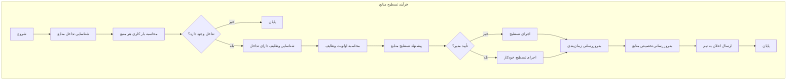

#### جدول زیرفرآیندهای تسطیح منابع
| زیرفرآیند | توضیح | نقش‌ها | ورودی‌ها | خروجی‌ها |
|-----------|-------|--------|----------|----------|
| شناسایی تداخل | شناسایی تداخل در تخصیص منابع | سیستم | داده‌های تخصیص منابع | لیست تداخل‌ها |
| محاسبه بار کاری | محاسبه بار کاری هر منبع | سیستم | تخصیص‌های فعلی | درصد بار کاری |
| پیشنهاد تسطیح | ارائه پیشنهادات برای رفع تداخل | سیستم | داده‌های تداخل | پیشنهادات تسطیح |
| اجرای تسطیح | اجرای تسطیح منابع | مدیر پروژه/سیستم | پیشنهادات تأیید شده | تخصیص‌های به‌روز شده |

---

### ری‌اسکجولینگ

#### توضیح کلی
فرآیند ری‌اسکجولین به‌طور خودکار تأخیرها را شناسایی کرده و زمان‌بندی جدیدی برای پروژه ارائه می‌دهد.

#### دیاگرام فرآیند ری‌اسکجولینگ
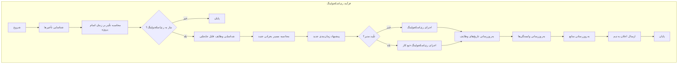

#### جدول زیرفرآیندهای ری‌اسکجولینگ
| زیرفرآیند | توضیح | نقش‌ها | ورودی‌ها | خروجی‌ها |
|-----------|-------|--------|----------|----------|
| شناسایی تأخیرها | شناسایی وظایف تأخیر خورده | سیستم | وضعیت وظایف، تاریخ‌ها | لیست تأخیرها |
| محاسبه تأثیر | محاسبه تأثیر تأخیرها بر پروژه | سیستم | داده‌های تأخیر | تأثیر بر زمان اتمام |
| پیشنهاد زمان‌بندی | ارائه زمان‌بندی جدید | سیستم | داده‌های فعلی | زمان‌بندی پیشنهادی |
| اجرای ری‌اسکجولینگ | اجرای زمان‌بندی جدید | مدیر پروژه/سیستم | زمان‌بندی تأیید شده | تاریخ‌های به‌روز شده |

---

### محاسبه مسیر بحرانی

#### توضیح کلی
فرآیند محاسبه مسیر بحرانی به‌طور خودکار طولانی‌ترین مسیر در پروژه را شناسایی کرده و وظایف بحرانی را مشخص می‌کند.

#### دیاگرام فرآیند محاسبه مسیر بحرانی
```mermaid
graph TB
    subgraph "فرآیند محاسبه مسیر بحرانی"
        A[شروع] --> B[جمع‌آوری تمام وظایف]
        B --> C[استخراج وابستگی‌ها]
        C --> D[محاسبه زمان‌های最早 و 最晚]
        D --> E[محاسبه شناوری (Slack)]
        E --> F[شناسایی وظایف با شناوری صفر]
        F --> G[تعیین مسیر بحرانی]
        G --> H[محاسبه طول مسیر بحرانی]
        H --> I[شناسایی وظایف بحرانی]
        I --> J[بروزرسانی وضعیت وظایف بحرانی]
        J --> K[ارسال هشدار برای وظایف بحرانی]
        K --> L[پایان]
    end
```

#### جدول زیرفرآیندهای محاسبه مسیر بحرانی
| زیرفرآیند | توضیح | نقش‌ها | ورودی‌ها | خروجی‌ها |
|-----------|-------|--------|----------|----------|
| جمع‌آوری وظایف | جمع‌آوری تمام وظایف پروژه | سیستم | داده‌های پروژه | لیست وظایف |
| محاسبه زمان‌ها | محاسبه زمان‌های最早 و 最晚 | سیستم | مدت وظایف، وابستگی‌ها | زمان‌های محاسبه شده |
| شناسایی مسیر | شناسایی مسیر بحرانی | سیستم | داده‌های زمان‌ها | مسیر بحرانی |
| به‌روزرسانی وضعیت | به‌روزرسانی وضعیت وظایف بحرانی | سیستم | مسیر بحرانی | وضعیت‌های به‌روز شده |

---

### پیش‌بینی زمان اتمام پروژه

#### توضیح کلی
فرآیند پیش‌بینی زمان اتمام پروژه به‌طور خودکار زمان احتمالی اتمام پروژه را بر اساس پیشرفت فعلی پیش‌بینی می‌کند.

#### دیاگرام فرآیند پیش‌بینی زمان اتمام پروژه
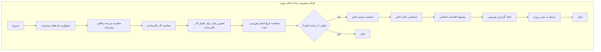

#### جدول زیرفرآیندهای پیش‌بینی زمان اتمام پروژه
| زیرفرآیند | توضیح | نقش‌ها | ورودی‌ها | خروجی‌ها |
|-----------|-------|--------|----------|----------|
| جمع‌آوری داده‌ها | جمع‌آوری داده‌های پیشرفت | سیستم | وضعیت وظایف، تاریخ‌ها | داده‌های پیشرفت |
| محاسبه سرعت | محاسبه سرعت واقعی پیشرفت | سیستم | داده‌های پیشرفت | سرعت پیشرفت |
| پیش‌بینی زمان | پیش‌بینی زمان اتمام | سیستم | سرعت، کار باقی‌مانده | تاریخ پیش‌بینی شده |
| ایجاد گزارش | ایجاد گزارش پیش‌بینی | سیستم | داده‌های پیش‌بینی | گزارش پیش‌بینی |

---

### هشدارهای زودهنگام

#### توضیح کلی
فرآیند هشدارهای زودهنگام به‌طور خودکار شاخص‌های پروژه را پایش کرده و قبل از وقوع مشکلات جدی هشدار صادر می‌کند.

#### دیاگرام فرآیند هشدارهای زودهنگام
```mermaid
graph TB
    subgraph "فرآیند هشدارهای زودهنگام"
        A[شروع] --> B[پایش مستمر شاخص‌ها]
        B --> C[بررسی انحراف از برنامه]
        C --> D{انحراف قابل توجه؟}
        D -->|خیر| E[پایان]
        D -->|بله| F[شناسایی نوع انحراف]
        F --> G[محاسبه شدت انحراف]
        G --> H[پیش‌بینی تأثیر بر پروژه]
        H --> I[تعیین سطح هشدار]
        I --> J[ایجاد هشدار]
        J --> K[ارسال هشدار به مسئولین]
        K --> L[پیشنهاد اقدامات پیشگیرانه]
        L --> M[پیگیری اقدامات]
        M --> N[پایان]
    end
```

#### جدول زیرفرآیندهای هشدارهای زودهنگام
| زیرفرآیند | توضیح | نقش‌ها | ورودی‌ها | خروجی‌ها |
|-----------|-------|--------|----------|----------|
| پایش شاخص‌ها | پایش شاخص‌های پروژه | سیستم | شاخص‌های تعریف شده | وضعیت شاخص‌ها |
| بررسی انحراف | بررسی انحراف از برنامه | سیستم | شاخص‌ها، آستانه‌ها | وضعیت انحراف |
| ایجاد هشدار | ایجاد هشدار مناسب | سیستم | داده‌های انحراف | هشدار |
| ارسال هشدار | ارسال هشدار به مسئولین | سیستم | هشدار، لیست مسئولین | تأیید ارسال |

---

### مدیریت بودجه

#### توضیح کلی
فرآیند مدیریت بودجه به‌طور خودکار هزینه‌های پروژه را پیگیری کرده و در صورت تجاوز از بودجه هشدار صادر می‌کند.

#### دیاگرام فرآیند مدیریت بودجه
```mermaid
graph TB
    subgraph "فرآیند مدیریت بودجه"
        A[شروع] --> B[جمع‌آوری داده‌های هزینه]
        B --> C[محاسبه هزینه‌های واقعی]
        C --> D[مقایسه با بودجه برنامه‌ریزی شده]
        D --> E{تجاوز از بودجه؟}
        E -->|خیر| F[پایان]
        E -->|بله| G[محاسبه میزان تجاوز]
        G --> H[شناسایی دلایل تجاوز]
        H --> I[پیش‌بینی هزینه‌های آتی]
        I --> J[محاسبه بودجه مورد نیاز]
        J --> K[ایجاد هشدار بودجه]
        K --> L[ارسال به مدیر مالی]
        L --> M[پیشنهاد اقدامات اصلاحی]
        M --> N[پایان]
    end
```

#### جدول زیرفرآیندهای مدیریت بودجه
| زیرفرآیند | توضیح | نقش‌ها | ورودی‌ها | خروجی‌ها |
|-----------|-------|--------|----------|----------|
| جمع‌آوری هزینه‌ها | جمع‌آوری داده‌های هزینه | سیستم | داده‌های منابع، وظایف | داده‌های هزینه |
| محاسبه هزینه‌ها | محاسبه هزینه‌های واقعی | سیستم | داده‌های هزینه | هزینه‌های محاسبه شده |
| مقایسه با بودجه | مقایسه با بودجه برنامه‌ریزی | سیستم | هزینه‌ها، بودجه | وضعیت بودجه |
| ایجاد هشدار | ایجاد هشدار بودجه | سیستم | داده‌های تجاوز | هشدار بودجه |

---

### مدیریت مستندات

#### توضیح کلی
فرآیند مدیریت مستندات به‌طور خودکار مستندات پروژه را به‌روزرسانی و تولید می‌کند.

#### دیاگرام فرآیند مدیریت مستندات
```mermaid
graph TB
    subgraph "فرآیند مدیریت مستندات"
        A[شروع] --> B[شناسایی تغییرات پروژه]
        B --> C[استخراج اطلاعات از تغییرات]
        C --> D[به‌روزرسانی مستندات فنی]
        D --> E[به‌روزرسانی مستندات کاربر]
        E --> F[تولید مستندات خودکار]
        F --> G[اعتبارسنجی مستندات]
        G --> H{مستندات معتبر؟}
        H -->|خیر| I[ثبت مشکلات مستندات]
        H -->|بله| J[انتشار مستندات]
        I --> K[اصلاح مستندات]
        K --> J
        J --> L[ارسال اعلان به‌روزرسانی]
        L --> M[پایان]
    end
```

#### جدول زیرفرآیندهای مدیریت مستندات
| زیرفرآیند | توضیح | نقش‌ها | ورودی‌ها | خروجی‌ها |
|-----------|-------|--------|----------|----------|
| شناسایی تغییرات | شناسایی تغییرات پروژه | سیستم | داده‌های پروژه | لیست تغییرات |
| به‌روزرسانی مستندات | به‌روزرسانی مستندات | سیستم | تغییرات | مستندات به‌روز شده |
| تولید خودکار | تولید خودکار مستندات | سیستم | داده‌های پروژه | مستندات تولید شده |
| انتشار مستندات | انتشار مستندات | سیستم | مستندات | مستندات منتشر شده |

---

### مدیریت ارتباطات

#### توضیح کلی
فرآیند مدیریت ارتباطات به‌طور خودکار اطلاعیه‌ها را به ذینفعان مربوطه ارسال می‌کند.

#### دیاگرام فرآیند مدیریت ارتباطات
```mermaid
graph TB
    subgraph "فرآیند مدیریت ارتباطات"
        A[شروع] --> B[شناسایی رویدادهای قابل اطلاع‌رسانی]
        B --> C[تعیین گیرندگان اطلاعیه]
        C --> D[تعیین کانال ارتباطی]
        D --> E[تولید محتوای اطلاعیه]
        E --> F[شخصی‌سازی اطلاعیه برای هر گیرنده]
        F --> G[ارسال اطلاعیه]
        G --> H{تأیید دریافت؟}
        H -->|خیر| I[ارسال مجدد]
        H -->|بله| J[ثبت ارسال اطلاعیه]
        I --> J
        J --> K[پیگیری بازخورد]
        K --> L[پایان]
    end
```

#### جدول زیرفرآیندهای مدیریت ارتباطات
| زیرفرآیند | توضیح | نقش‌ها | ورودی‌ها | خروجی‌ها |
|-----------|-------|--------|----------|----------|
| شناسایی رویدادها | شناسایی رویدادهای قابل اطلاع‌رسانی | سیستم | رویدادهای پروژه | لیست رویدادها |
| تعیین گیرندگان | تعیین گیرندگان اطلاعیه | سیستم | رویدادها، قوانین | لیست گیرندگان |
| تولید محتوا | تولید محتوای اطلاعیه | سیستم | رویدادها، قالب‌ها | محتوای اطلاعیه |
| ارسال اطلاعیه | ارسال اطلاعیه به گیرندگان | سیستم | محتوا، گیرندگان | وضعیت ارسال |

---

### مدیریت تغییرات

#### توضیح کلی
فرآیند مدیریت تغییرات به‌طور خودکار درخواست‌های تغییر را بررسی و مدیریت می‌کند.

#### دیاگرام فرآیند مدیریت تغییرات
```mermaid
graph TB
    subgraph "فرآیند مدیریت تغییرات"
        A[شروع] --> B[دریافت درخواست تغییر]
        B --> C[اعتبارسنجی درخواست]
        C --> D{درخواست معتبر؟}
        D -->|خیر| E[رد درخواست]
        D -->|بله| F[ارزیابی تأثیر تغییر]
        F --> G[محاسبه تأثیر بر زمان]
        G --> H[محاسبه تأثیر بر هزینه]
        H --> I[محاسبه تأثیر بر کیفیت]
        I --> J[ارزیابی ریسک تغییر]
        J --> K{تأیید تغییر؟}
        K -->|خیر| L[رد تغییر]
        K -->|بله| M[برنامه‌ریزی اجرای تغییر]
        M --> N[اجرا تغییر]
        N --> O[به‌روزرسانی مستندات]
        O --> P[پایان]
        E --> P
        L --> P
    end
```

#### جدول زیرفرآندهای مدیریت تغییرات
| زیرفرآیند | توضیح | نقش‌ها | ورودی‌ها | خروجی‌ها |
|-----------|-------|--------|----------|----------|
| دریافت درخواست | دریافت درخواست تغییر | سیستم | فرم درخواست تغییر | درخواست ثبت شده |
| ارزیابی تأثیر | ارزیابی تأثیر تغییر | سیستم | درخواست تغییر | گزارش تأثیر |
| تأیید تغییر | تأیید یا رد تغییر | مدیر پروژه | گزارش تأثیر | تصمیم نهایی |
| اجرای تغییر | اجرای تغییر تأیید شده | تیم پروژه | تغییر تأیید شده | تغییر اجرا شده |

---

### مدیریت قراردادها

#### توضیح کلی
فرآیند مدیریت قراردادها به‌طور خودکار تعهدات قراردادی را پیگیری کرده و انحرافات را گزارش می‌دهد.

#### دیاگرام فرآیند مدیریت قراردادها
```mermaid
graph TB
    subgraph "فرآیند مدیریت قراردادها"
        A[شروع] --> B[جمع‌آوری تعهدات قراردادی]
        B --> C[پایش اجرای تعهدات]
        C --> D{انحراف از تعهدات؟}
        D -->|خیر| E[پایان]
        D -->|بله| F[شناسایی نوع انحراف]
        F --> G[محاسبه میزان انحراف]
        G --> H[ارزیابی تأثیر مالی]
        H --> I[محاسبه جریمه‌ها]
        I --> J[ایجاد گزارش انحراف]
        J --> K[ارسال به مدیر قرارداد]
        K --> L[پیشنهاد اقدامات اصلاحی]
        L --> M[پیگیری اصلاحات]
        M --> N[پایان]
    end
```

#### جدول زیرفرآندهای مدیریت قراردادها
| زیرفرآیند | توضیح | نقش‌ها | ورودی‌ها | خروجی‌ها |
|-----------|-------|--------|----------|----------|
| جمع‌آوری تعهدات | جمع‌آوری تعهدات قراردادی | سیستم | اسناد قرارداد | لیست تعهدات |
| پایش اجرا | پایش اجرای تعهدات | سیستم | تعهدات، داده‌های اجرا | وضعیت اجرا |
| گزارش انحراف | گزارش انحراف از تعهدات | سیستم | داده‌های انحراف | گزارش انحراف |
| پیشنهاد اصلاح | پیشنهاد اقدامات اصلاحی | سیستم | گزارش انحراف | پیشنهادات اصلاحی |

---

## نتیجه‌گیری

این سند فرآیندها و زیرفرآیندهای نرم‌افزار مدیریت پروژه GravityPM را به‌صورت کامل و با جزئیات دقیق توصیف کرد. فرآیندهای اصلی سیستم شامل مدیریت پروژه، مدیریت وظایف، مدیریت منابع، مدیریت وابستگی، مدیریت ریسک، مدیریت کیفیت، گزارش‌دهی و یکپارچه‌سازی با GitHub است.

### نقاط قوت فرآیندها
- **جامعیت**: پوشش کامل تمام جنبه‌های مدیریت پروژه
- **جزئیات**: توصیف دقیق زیرفرآیندها و جریان‌های کاری
- **یکپارچه‌سازی**: اتصال کامل با GitHub برای خودکارسازی
- **شفافیت**: استفاده از دیاگرام‌های واضح برای درک بهتر فرآیندها
- **انعطاف‌پذیری**: قابلیت تنظیم و سفارشی‌سازی فرآیندها بر اساس نیازهای پروژه
- **خودکارسازی**: پوشش کامل فرآیندهای خودکار و نیمه خودکار

### چالش‌های فرآیندها
- **پیچیدگی**: پیچیدگی مدیریت وابستگی‌ها و تخصیص منابع
- **هماهنگی**: نیاز به هماهنگی بین تیم‌های مختلف
- **پایش مستمر**: نیاز به پایش مستمر فرآیندها برای اطمینان از اجرای صحیح
- **به‌روزرسانی**: نیاز به به‌روزرسانی فرآیندها با تغییرات پروژه

### مسیر آینده
- **افزودن هوش مصنوعی**: برای بهینه‌سازی و پیش‌بینی در فرآیندها
- **گسترش یکپارچه‌سازی**: اتصال به سیستم‌های خارجی دیگر
- **بهبود خودکارسازی**: افزایش سطح خودکارسازی در فرآیندها
- **گزارش‌دهی پیشرفته**: افزودن قابلیت‌های تحلیلی پیشرفته به گزارش‌ها

این سند با ارائه توضیحات کامل، دیاگرام‌های دقیق و جداول جامع، چارچوبی روشن برای پیاده‌سازی و اجرای فرآیندهای GravityPM فراهم می‌کند و به‌عنوان مرجعی اصلی برای تیم‌های پروژه عمل خواهد کرد. با پوشش کامل فرآیندهای خودکار و نیمه خودکار، این سند اکنون به‌طور کامل تمام قابلیت‌های ممکن برای سیستم مدیریت پروژه GravityPM را شامل می‌شود.