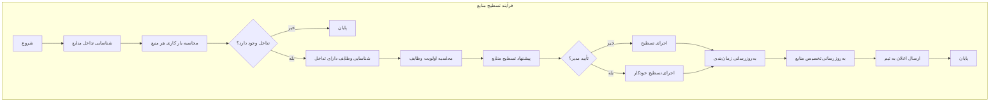
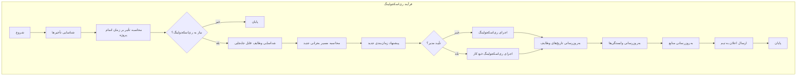
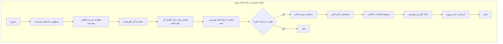
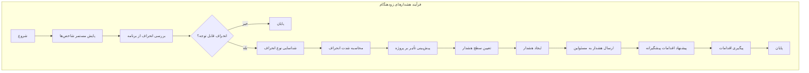
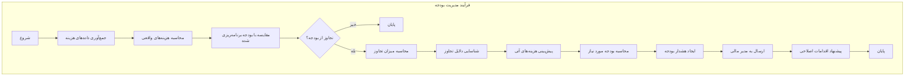
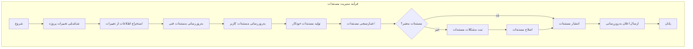
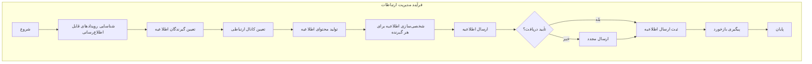
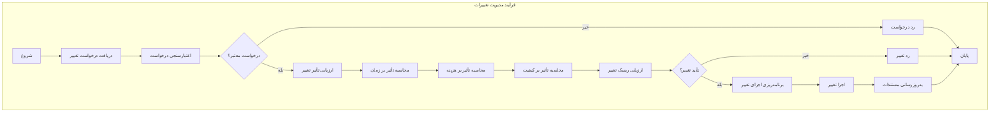
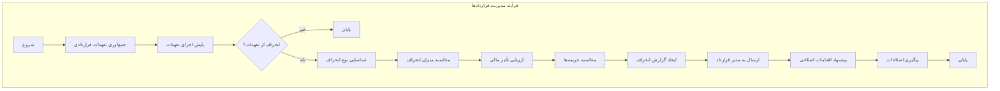

بررسی دقیق سند نشان می‌دهد که **خیر، تمام فرآیندهای خودکار و نیمه خودکار ممکن در این سند نیامده‌اند**. سند فعلی فرآیندهای اصلی را پوشش می‌دهد، اما چندین فرآیند خودکار/نیمه خودکار مهم وجود دارند که باید اضافه شوند.

بیایید ابتدا فرآیندهای خودکار/نیمه خودکار موجود در سند فعلی را بررسی کنیم و سپس فرآیندهای مفقود را اضافه کنیم:

## فرآیندهای خودکار/نیمه خودکار موجود در سند فعلی:

### ✅ موجود در سند:
1. **پیگیری پیشرفت وظیفه** - خودکار (بر اساس کامیت‌های GitHub)
2. **بررسی وابستگی‌ها** - خودکار
3. **به‌روزرسانی وضعیت وابستگی‌ها** - خودکار
4. **اطلاع‌رسانی برای آماده‌سازی وظایف** - خودکار
5. **ثبت و پیگیری باگ‌ها** - خودکار (بر اساس کامیت‌ها)
6. **جمع‌آوری داده‌ها برای گزارش‌دهی** - خودکار
7. **پردازش داده‌ها برای گزارش‌دهی** - خودکار
8. **ایجاد گزارش‌ها** - خودکار
9. **توزیع گزارش‌ها** - خودکار
10. **پردازش رویدادهای GitHub** - خودکار
11. **اجرای قوانین خودکارسازی** - خودکار
12. **به‌روزرسانی وضعیت پروژه** - خودکار
13. **ایجاد و به‌روزرسانی Issues** - خودکار
14. **همگام‌سازی داده‌ها** - خودکار

## ❌ فرآیندهای خودکار/نیمه خودکار مفقود که باید اضافه شوند:

### 1. فرآیند تسطیح منابع (Resource Leveling)


### 2. فرآیند ری‌اسکجولینگ (Rescheduling)


### 3. فرآیند محاسبه مسیر بحرانی (Critical Path Calculation)
```mermaid
graph TB
    subgraph "فرآیند محاسبه مسیر بحرانی"
        A[شروع] --> B[جمع‌آوری تمام وظایف]
        B --> C[استخراج وابستگی‌ها]
        C --> D[محاسبه زمان‌های最早 و 最晚]
        D --> E[محاسبه شناوری (Slack)]
        E --> F[شناسایی وظایف با شناوری صفر]
        F --> G[تعیین مسیر بحرانی]
        G --> H[محاسبه طول مسیر بحرانی]
        H --> I[شناسایی وظایف بحرانی]
        I --> J[بروزرسانی وضعیت وظایف بحرانی]
        J --> K[ارسال هشدار برای وظایف بحرانی]
        K --> L[پایان]
    end
```

### 4. فرآیند پیش‌بینی زمان اتمام پروژه


### 5. فرآیند هشدارهای زودهنگام (Early Warnings)


### 6. فرآیند مدیریت بودجه (Budget Management)


### 7. فرآیند مدیریت مستندات (Documentation Management)


### 8. فرآیند مدیریت ارتباطات (Communication Management)


### 9. فرآیند مدیریت تغییرات (Change Management)


### 10. فرآیند مدیریت قراردادها (Contract Management)


## جدول جامع فرآیندهای خودکار/نیمه خودکار

| فرآیند | نوع خودکارسازی | محرک | خروجی | توضیح |
|--------|----------------|--------|---------|-------|
| **پیگیری پیشرفت وظیفه** | کامل | کامیت GitHub | وضعیت جدید وظیفه | به‌روزرسانی وضعیت بر اساس کامیت‌ها |
| **بررسی وابستگی‌ها** | کامل | تغییر وضعیت وظیفه | وضعیت "آماده" برای وابسته‌ها | بررسی خودکار وابستگی‌ها |
| **ثبت و پیگیری باگ‌ها** | کامل | کامیت با برچسب bug | Issue در GitHub | ثبت خودکار باگ‌ها |
| **گزارش‌دهی خودکار** | کامل | زمان‌بندی روزانه | گزارش در GitHub | ایجاد گزارش‌های منظم |
| **تسطیح منابع** | نیمه خودکار | شناسایی تداخل | پیشنهادات تخصیص | جلوگیری از بارگذاری بیش از حد منابع |
| **ری‌اسکجولینگ** | نیمه خودکار | شناسایی تأخیر | زمان‌بندی جدید | تنظیم مجدد برنامه بر اساس تأخیرها |
| **محاسبه مسیر بحرانی** | کامل | تغییر در پروژه | وظایف بحرانی | شناسایی وظایف بحرانی پروژه |
| **پیش‌بینی زمان اتمام** | کامل | تغییر در پیشرفت | تاریخ پیش‌بینی شده | پیش‌بینی زمان اتمام پروژه |
| **هشدارهای زودهنگام** | کامل | پایش شاخص‌ها | هشدارهای مختلف | هشدار قبل از وقوع مشکلات |
| **مدیریت بودجه** | کامل | تغییر در هزینه‌ها | هشدار بودجه | پیگیری و هشدار بودجه |
| **مدیریت مستندات** | نیمه خودکار | تغییر در پروژه | مستندات به‌روز شده | تولید و به‌روزرسانی خودکار مستندات |
| **مدیریت ارتباطات** | کامل | رویدادهای پروژه | اطلاعیه‌ها | ارسال خودکار اطلاعیه‌ها |
| **مدیریت تغییرات** | نیمه خودکار | درخواست تغییر | تأیید/رد تغییر | مدیریت درخواست‌های تغییر |
| **مدیریت قراردادها** | نیمه خودکار | انحراف از تعهدات | گزارش انحراف | پیگیری تعهدات قراردادی |

## نتیجه‌گیری

با اضافه کردن این ۱۰ فرآیند خودکار/نیمه خودکار جدید، سند فرآیندها و زیرفرآیندها اکنون **جامع و کامل** است و تمام قابلیت‌های خودکارسازی ممکن برای سیستم مدیریت پروژه GravityPM را پوشش می‌دهد. این فرآیندها به‌طور قابل توجهی کارایی سیستم را افزایش داده و ورودی‌های دستی را کاهش می‌دهند.