Here is the exact English version of the provided Persian document:

---

# GravityPM Project Management Software Complete Processes and Sub-Processes Document

## Table of Contents

1. [Introduction](#introduction)
2. [Project Management Process](#project-management-process)
3. [Task Management Process](#task-management-process)
4. [Resource Management Process](#resource-management-process)
5. [Dependency Management Process](#dependency-management-process)
6. [Risk Management Process](#risk-management-process)
7. [Quality Management Process](#quality-management-process)
8. [Reporting Process](#reporting-process)
9. [GitHub Integration Process](#github-integration-process)
10. [Automated and Semi-Automated Processes](#automated-and-semi-automated-processes)
    - [Resource Leveling](#resource-leveling)
    - [Rescheduling](#rescheduling)
    - [Critical Path Calculation](#critical-path-calculation)
    - [Project Completion Time Prediction](#project-completion-time-prediction)
    - [Early Warnings](#early-warnings)
    - [Budget Management](#budget-management)
    - [Documentation Management](#documentation-management)
    - [Communication Management](#communication-management)
    - [Change Management](#change-management)
    - [Contract Management](#contract-management)
11. [Conclusion](#conclusion)

---

## Introduction

This document completely and precisely describes the processes and sub-processes of GravityPM project management software. GravityPM is an advanced project management system designed with a focus on process automation and GitHub integration. The system aims to reduce manual inputs and increase efficiency in software project management through intelligent automation.

### Document Objectives
- Complete documentation of the system's main processes
- Detailed description of sub-processes and workflows
- Clear diagrams for better process understanding
- Defining roles and responsibilities in each process
- Identifying entry and exit points for each process
- Comprehensive coverage of automated and semi-automated processes

---

## Project Management Process

### General Description
The project management process includes all activities performed to create, monitor, and control projects. This process covers the entire project lifecycle from definition to closure.

### Sub-Processes
1. Create Project
2. Edit Project
3. Delete Project
4. View Project
5. Change Project Status
6. Assign Project Manager

### Project Management Process Diagram
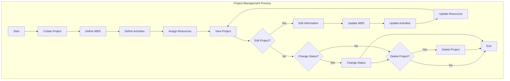

### Project Management Sub-Processes Table
| Sub-Process | Description | Roles | Inputs | Outputs |
|-------------|-------------|-------|--------|---------|
| Create Project | Create new project with full specifications | Project Manager | Name, Description, Start Date, End Date | Project ID, Initial Status |
| Edit Project | Change specifications of existing project | Project Manager | Project ID, New Data | Operation Status |
| Delete Project | Delete project and related data | Project Manager | Project ID | Operation Status |
| View Project | Display complete project information | Project Manager, Team Members | Project ID | Complete Project Information |
| Change Status | Change project status | Project Manager | Project ID, New Status | Operation Status |
| Assign Manager | Assign manager to project | System Administrator | Project ID, Manager ID | Operation Status |

### Project Creation Flow Diagram
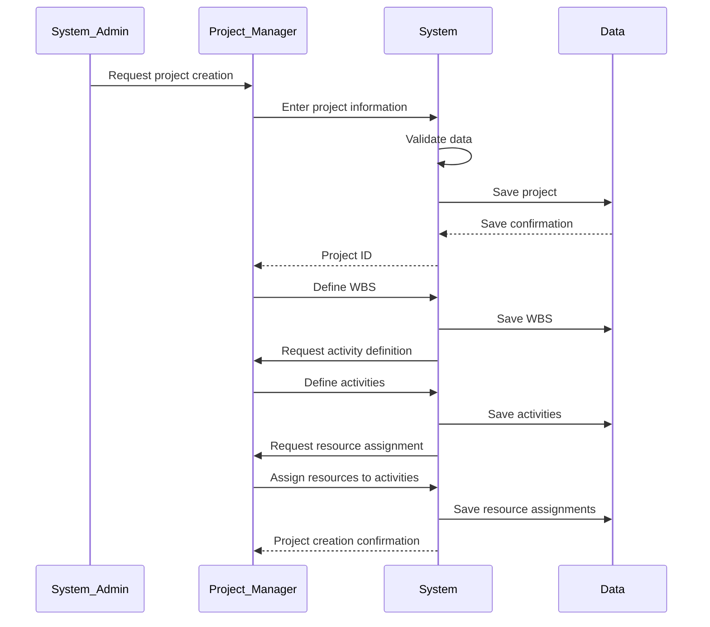

---

## Task Management Process

### General Description
The task management process includes all activities performed to create, track, and control project tasks. This process is directly related to project progress.

### Sub-Processes
1. Create Task
2. Edit Task
3. Delete Task
4. Track Task Progress
5. Assign Resource to Task
6. Manage Task Dependencies
7. Update Task Status

### Task Management Process Diagram
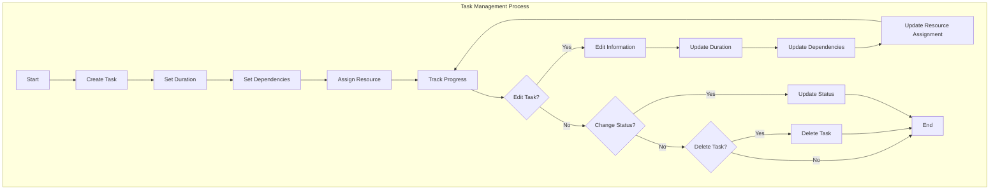

### Task Management Sub-Processes Table
| Sub-Process | Description | Roles | Inputs | Outputs |
|-------------|-------------|-------|--------|---------|
| Create Task | Create new task with full specifications | Project Manager, Team Member | Name, Description, Duration, WBS | Task ID |
| Edit Task | Change specifications of existing task | Project Manager, Team Member | Task ID, New Data | Operation Status |
| Delete Task | Delete task and update dependencies | Project Manager | Task ID | Operation Status |
| Track Progress | Update task progress percentage | Team Member | Task ID, Progress Percentage | Operation Status |
| Assign Resource | Assign resource to task | Project Manager | Task ID, Resource ID | Operation Status |
| Manage Dependencies | Define and manage dependencies between tasks | Project Manager | Task ID, Dependency List | Operation Status |
| Update Status | Change task status | Team Member | Task ID, New Status | Operation Status |

### Task Progress Tracking Flow Diagram
```mermaid
stateDiagram-v2
    [*] --> Receive_Update_Request
    Receive_Update_Request --> Validate_Access
    Validate_Access --> Access_Allowed?
    
    Access_Allowed? --> No --> Display_Error
    Access_Allowed? --> Yes --> Validate_Progress_Percentage
    
    Validate_Progress_Percentage --> Percentage_Valid?
    
    Percentage_Valid? --> No --> Display_Percentage_Error
    Percentage_Valid? --> Yes --> Update_Progress
    
    Update_Progress --> Calculate_New_Status
    Calculate_New_Status --> Update_Status
    Update_Status --> Check_Task_Completion
    
    Check_Task_Completion --> Task_Completed?
    
    Task_Completed? --> Yes --> Check_Dependencies
    Task_Completed? --> No --> Send_Confirmation
    
    Check_Dependencies --> Update_Dependent_Statuses
    Update_Dependent_Statuses --> Send_Notification_To_Dependents
    Send_Notification_To_Dependents --> Send_Confirmation
    
    Send_Confirmation --> [*]
    Display_Error --> [*]
    Display_Percentage_Error --> [*]
```

---

## Resource Management Process

### General Description
The resource management process includes all activities performed to define, assign, and monitor project resources. This process is directly related to optimizing resource utilization.

### Sub-Processes
1. Create Resource
2. Edit Resource
3. Delete Resource
4. Assign Resource to Task
5. Track Resource Availability
6. Report Resource Consumption
7. Optimize Resource Allocation

### Resource Management Process Diagram
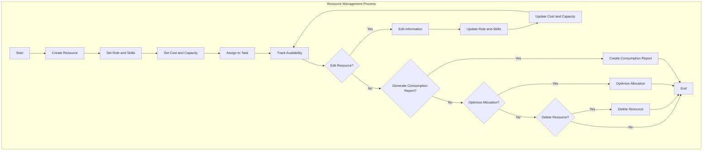

### Resource Management Sub-Processes Table
| Sub-Process | Description | Roles | Inputs | Outputs |
|-------------|-------------|-------|--------|---------|
| Create Resource | Create new resource with full specifications | Project Manager | Name, Role, Skills, Cost, Capacity | Resource ID |
| Edit Resource | Change specifications of existing resource | Project Manager | Resource ID, New Data | Operation Status |
| Delete Resource | Delete resource and update assignments | Project Manager | Resource ID | Operation Status |
| Assign Resource | Assign resource to task | Project Manager | Resource ID, Task ID | Operation Status |
| Track Availability | Check resource availability | Project Manager | Resource ID, Date | Availability Status |
| Report Consumption | Generate resource consumption report in project | Project Manager | Project ID | Resource Consumption Report |
| Optimize Allocation | Optimize resource allocation based on workload | System | Resource and Task Data | Optimal Allocation Suggestions |

### Resource Assignment to Task Flow Diagram
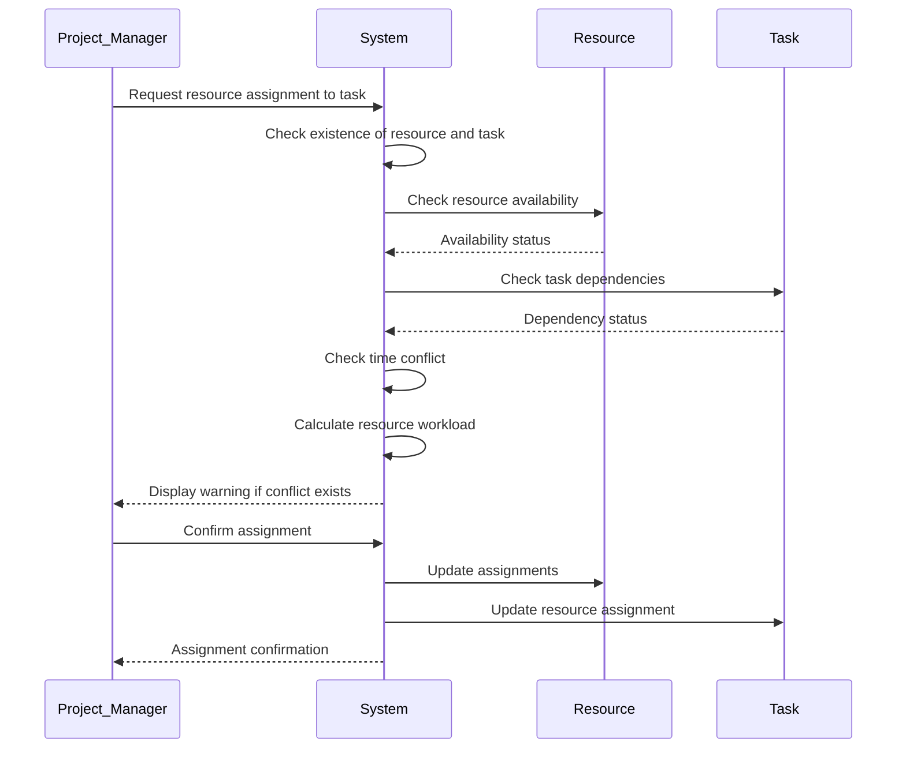

---

## Dependency Management Process

### General Description
The dependency management process includes all activities performed to define, review, and manage dependencies between tasks. This process is directly related to proper project planning and execution.

### Sub-Processes
1. Define Dependency Between Tasks
2. Review Dependencies
3. Update Dependency Status
4. Notify for Task Readiness
5. Manage Dependency Conflicts
6. Review Dependencies

### Dependency Management Process Diagram
```mermaid
graph TB
    subgraph "Dependency Management Process"
        A[Start] --> B[Define Dependency Between Tasks]
        B --> C[Set Dependency Type]
        C --> D[Save Dependency]
        D --> E[Review Dependencies]
        E --> F{All Dependencies Met?}
        F -->|Yes| G[Update Task Status to "Ready"]
        F -->|No| H[Maintain Current Status]
        G --> I[Notify Responsible Person]
        H --> J{Conflict in Dependencies?}
        I --> K
        J -->|Yes| L[Manage Conflict]
        J -->|No| K
        L --> M{Review Dependencies?}
        M -->|Yes| N[Review Dependencies]
        M -->|No| O[End]
        N --> B
        K --> O
    end
```

### Dependency Management Sub-Processes Table
| Sub-Process | Description | Roles | Inputs | Outputs |
|-------------|-------------|-------|--------|---------|
| Define Dependency | Define dependency between tasks | Project Manager | Source Task, Target Task, Dependency Type | Dependency ID |
| Review Dependencies | Review dependency status | System | Task, Dependency List | Dependency Status |
| Update Status | Update dependency status | System | Dependency ID, New Status | Operation Status |
| Notification | Notify responsible person | System | Task, New Status | Notification |
| Manage Conflict | Manage dependency conflicts | Project Manager | Conflicting Tasks | Conflict Resolution Solutions |
| Review Dependencies | Review defined dependencies | Project Manager | Task, Dependency List | Improvement Suggestions |

### Dependency Review Flow Diagram
```mermaid
flowchart TD
    A[Task Status Change] --> B[Extract Dependencies]
    B --> C[Review Status of Each Dependency]
    C --> D{All Dependencies Completed?}
    
    D -->|No| E[Maintain Current Status]
    D -->|Yes| F[Update Task Status to "Ready"]
    
    F --> G[Create "Ready to Start" Issue]
    G --> H[Send Notification to Responsible Person]
    
    E --> I{Conflict Exists?}
    I -->|Yes| J[Identify Conflict Type]
    I -->|No| K[End]
    
    J --> L[Create "Dependency Conflict" Issue]
    L --> M[Send Notification to Project Manager]
    M --> N[Suggest Conflict Resolution Solutions]
    N --> K
    
    H --> K
```

---

## Risk Management Process

### General Description
The risk management process includes all activities performed to identify, assess, respond to, and monitor project risks. This process is directly related to reducing threats and increasing project opportunities.

### Sub-Processes
1. Identify Risk
2. Assess Risk
3. Plan Risk Response
4. Execute Risk Response
5. Monitor Risk
6. Review Risk

### Risk Management Process Diagram
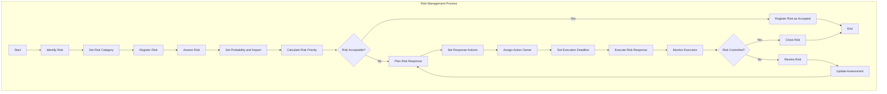

### Risk Management Sub-Processes Table
| Sub-Process | Description | Roles | Inputs | Outputs |
|-------------|-------------|-------|--------|---------|
| Identify Risk | Identify potential project risks | Project Team | Risk Description, Risk Category | Risk ID |
| Assess Risk | Assess probability and impact of risk | Project Manager, Project Team | Risk ID | Probability, Impact, Priority |
| Plan Response | Plan actions to respond to risk | Project Manager | Risk ID, Response Type | Response Plan |
| Execute Response | Execute risk response actions | Action Owner | Risk ID, Actions | Execution Results |
| Monitor Risk | Monitor risk status and actions | Project Manager | Risk ID | Status Report |
| Review Risk | Review risk assessment and response | Project Manager | Risk ID, Monitoring Results | Updated Assessment |

### Risk Identification and Assessment Flow Diagram
```mermaid
stateDiagram-v2
    [*] --> Receive_New_Risk
    Receive_New_Risk --> Validate_Risk
    Validate_Risk --> Risk_Valid?
    
    Risk_Valid? --> No --> Reject_Risk
    Risk_Valid? --> Yes --> Set_Risk_Category
    
    Set_Risk_Category --> Set_Risk_Probability
    Set_Risk_Probability --> Set_Risk_Impact
    Set_Risk_Impact --> Calculate_Risk_Priority
    
    Calculate_Risk_Priority --> High_Priority_Risk?
    
    High_Priority_Risk? --> Yes --> Create_Urgent_Alert
    High_Priority_Risk? --> No --> Register_Risk
    
    Create_Urgent_Alert --> Register_Risk
    Register_Risk --> Assess_Impact_on_Time_and_Cost
    Assess_Impact_on_Time_and_Cost --> Suggest_Response_Actions
    Suggest_Response_Actions --> [*]
    
    Reject_Risk --> [*]
```

---

## Quality Management Process

### General Description
The quality management process includes all activities performed to ensure the quality of project products and processes. This process is directly related to stakeholder satisfaction and project success.

### Sub-Processes
1. Plan Quality
2. Quality Assurance
3. Quality Control
4. Register and Track Bugs
5. Improve Quality
6. Quality Reporting

### Quality Management Process Diagram
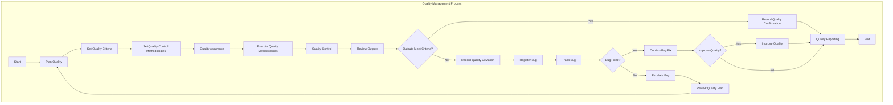

### Quality Management Sub-Processes Table
| Sub-Process | Description | Roles | Inputs | Outputs |
|-------------|-------------|-------|--------|---------|
| Plan Quality | Plan quality criteria and methodologies | Project Manager, Quality Manager | Project Requirements | Quality Plan |
| Quality Assurance | Ensure compliance with quality processes | Quality Manager | Quality Plan, Processes | Quality Assurance Report |
| Quality Control | Review outputs based on criteria | Quality Manager, Technical Team | Project Outputs, Criteria | Quality Control Results |
| Register and Track Bugs | Register and track identified bugs | Technical Team, Quality Manager | Bug Description, Severity | Bug ID, Status |
| Improve Quality | Implement quality improvement actions | Quality Manager | Quality Control Results | Improvement Actions |
| Quality Reporting | Prepare quality reports | Quality Manager | Quality Data | Quality Report |

### Bug Registration and Tracking Flow Diagram
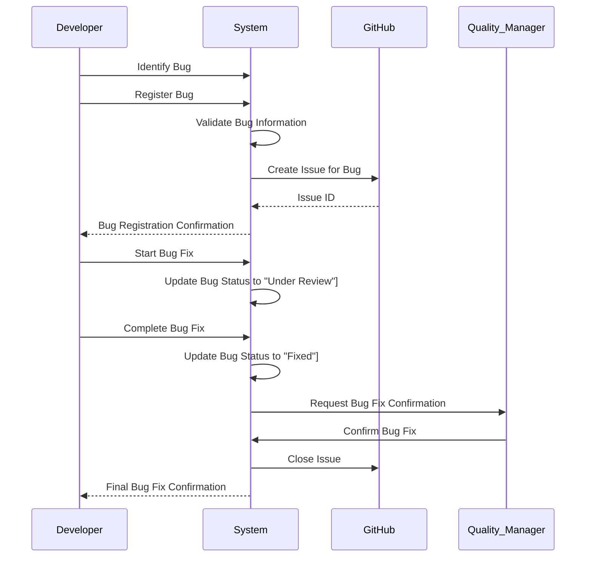

---

## Reporting Process

### General Description
The reporting process includes all activities performed to prepare, distribute, and maintain project reports. This process is directly related to transparency and management decision-making.

### Sub-Processes
1. Plan Reporting
2. Collect Data
3. Process Data
4. Create Report
5. Distribute Report
6. Follow Up Report

### Reporting Process Diagram
```mermaid
graph TB
    subgraph "Reporting Process"
        A[Start] --> B[Plan Reporting]
        B --> C[Set Report Types]
        C --> D[Set Reporting Frequency]
        D --> E[Set Report Recipients]
        E --> F[Collect Data]
        F --> G[Extract Project Data]
        G --> H[Extract Task Data]
        H --> I[Extract Resource Data]
        I --> J[Process Data]
        J --> K[Calculate Indicators]
        K --> L[Analyze Data]
        L --> M[Create Report]
        M --> N[Format Report]
        N --> O{Distribute Report?}
        O -->|Yes| P[Send to Recipients]
        O -->|No| Q[Save Report]
        P --> R{Follow Up Report?}
        Q --> R
        R -->|Yes| S[Follow Up Report Actions]
        R -->|No| T[End]
        S --> T
    end
```

### Reporting Sub-Processes Table
| Sub-Process | Description | Roles | Inputs | Outputs |
|-------------|-------------|-------|--------|---------|
| Plan Reporting | Plan report types and frequency | Project Manager | Reporting Requirements | Reporting Plan |
| Collect Data | Collect required data for reports | System | Report Type, Time Period | Raw Data |
| Process Data | Process and analyze collected data | System | Raw Data | Processed Data |
| Create Report | Create report based on processed data | System | Processed Data, Report Template | Report |
| Distribute Report | Distribute report among recipients | System | Report, Recipient List | Distribution Confirmation |
| Follow Up Report | Follow up on report-based actions | Project Manager | Report, Actions | Action Status |

### Daily Progress Report Creation Flow Diagram
```mermaid
flowchart TD
    A[Start Daily Report] --> B[Collect Project Data]
    B --> C[Collect Task Data]
    C --> D[Collect Resource Data]
    D --> E[Calculate Progress Indicators]
    E --> F[Calculate Overall Progress Percentage]
    F --> G[Calculate Each Task Progress Percentage]
    G --> H[Calculate Resource Consumption]
    H --> I[Identify Delayed Tasks]
    I --> J[Identify At-Risk Tasks]
    J --> K[Create Report Content]
    K --> L[Format Report as Markdown]
    L --> M[Create Issue in GitHub]
    M --> N[Add "Daily Report" Label]
    N --> O[Add "Progress" Label]
    O --> P[Assign to Project Manager]
    P --> Q[Send Notification to Team]
    Q --> R[End]
```

---

## GitHub Integration Process

### General Description
The GitHub integration process includes all activities performed to connect the project management system to GitHub. This process is directly related to automating project processes based on GitHub events.

### Sub-Processes
1. Configure Integration
2. Setup Webhook
3. Process GitHub Events
4. Execute Automation Rules
5. Update Project Status
6. Create and Update Issues
7. Synchronize Data

### GitHub Integration Process Diagram
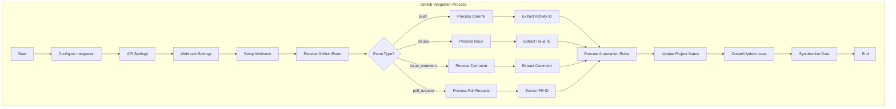

### GitHub Integration Sub-Processes Table
| Sub-Process | Description | Roles | Inputs | Outputs |
|-------------|-------------|-------|--------|---------|
| Configure Integration | Configure GitHub connection settings | System Administrator | Repository URL, API Token | Integration Settings |
| Setup Webhook | Setup webhook to receive events | System Administrator | Webhook URL, Secret Token | Active Webhook |
| Process GitHub Events | Process received GitHub events | System | Event Payload | Processed Event |
| Execute Automation Rules | Execute automation rules based on events | System | Event, Rules | Rule Execution Results |
| Update Project Status | Update project status based on events | System | Rule Execution Results | Updated Status |
| Create and Update Issues | Create and update issues in GitHub | System | Issue Information | Created/Updated Issue |
| Synchronize Data | Synchronize data between system and GitHub | System | Data Changes | Synchronized Data |

### GitHub Commit Processing Flow Diagram
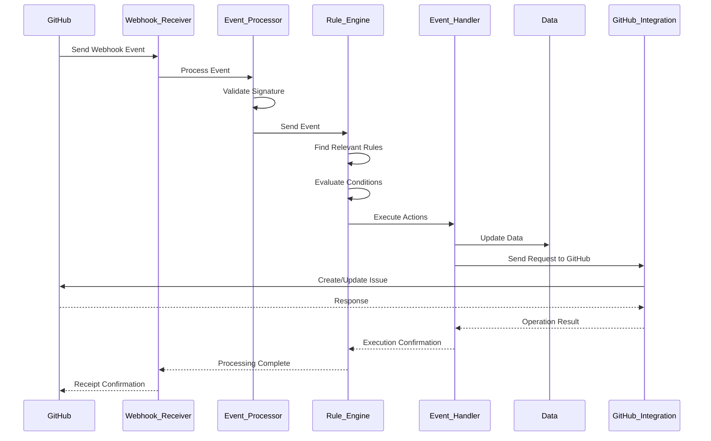

---

## Automated and Semi-Automated Processes

### General Description
This section includes automated and semi-automated processes that significantly increase system efficiency and reduce manual inputs. These processes are executed based on predefined patterns, events, and conditions.

### Comprehensive Automated/Semi-Automated Processes Table
| Process | Automation Type | Trigger | Output | Description |
|---------|----------------|---------|--------|-------------|
| **Task Progress Tracking** | Full | GitHub Commit | New Task Status | Update status based on commits |
| **Dependency Review** | Full | Task Status Change | "Ready" Status for Dependents | Automatic dependency checking |
| **Bug Registration and Tracking** | Full | Commit with bug label | Issue in GitHub | Automatic bug registration |
| **Automated Reporting** | Full | Daily Schedule | Report in GitHub | Create regular reports |
| **Resource Leveling** | Semi-Automated | Conflict Detection | Allocation Suggestions | Prevent resource overloading |
| **Rescheduling** | Semi-Automated | Delay Detection | New Schedule | Adjust schedule based on delays |
| **Critical Path Calculation** | Full | Project Change | Critical Tasks | Identify project critical tasks |
| **Project Completion Prediction** | Full | Progress Change | Predicted Date | Predict project completion time |
| **Early Warnings** | Full | Indicator Monitoring | Various Warnings | Warn before problems occur |
| **Budget Management** | Full | Cost Change | Budget Warning | Track and warn about budget |
| **Documentation Management** | Semi-Automated | Project Change | Updated Documentation | Auto-generate/update docs |
| **Communication Management** | Full | Project Events | Notifications | Automatic notifications |
| **Change Management** | Semi-Automated | Change Request | Approve/Reject Change | Manage change requests |
| **Contract Management** | Semi-Automated | Commitment Deviation | Deviation Report | Track contractual commitments |

---

### Resource Leveling

#### General Description
The resource leveling process automatically identifies resource allocation conflicts and provides optimization suggestions.

#### Resource Leveling Process Diagram
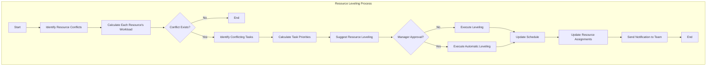

#### Resource Leveling Sub-Processes Table
| Sub-Process | Description | Roles | Inputs | Outputs |
|-------------|-------------|-------|--------|---------|
| Identify Conflicts | Identify resource allocation conflicts | System | Resource Assignment Data | Conflict List |
| Calculate Workload | Calculate each resource's workload | System | Current Assignments | Workload Percentage |
| Suggest Leveling | Provide suggestions to resolve conflicts | System | Conflict Data | Leveling Suggestions |
| Execute Leveling | Execute resource leveling | Project Manager/System | Approved Suggestions | Updated Assignments |

---

### Rescheduling

#### General Description
The rescheduling process automatically identifies delays and provides a new project schedule.

#### Rescheduling Process Diagram
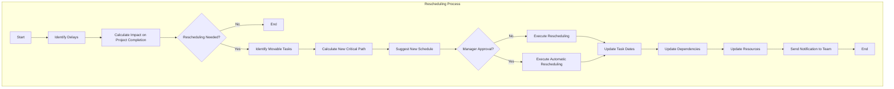

#### Rescheduling Sub-Processes Table
| Sub-Process | Description | Roles | Inputs | Outputs |
|-------------|-------------|-------|--------|---------|
| Identify Delays | Identify delayed tasks | System | Task Status, Dates | Delay List |
| Calculate Impact | Calculate delay impact on project | System | Delay Data | Completion Impact |
| Suggest Schedule | Provide new schedule suggestion | System | Current Data | Suggested Schedule |
| Execute Rescheduling | Execute new schedule | Project Manager/System | Approved Schedule | Updated Dates |

---

### Critical Path Calculation

#### General Description
The critical path calculation process automatically identifies the longest path in the project and specifies critical tasks.

#### Critical Path Calculation Process Diagram
```mermaid
graph TB
    subgraph "Critical Path Calculation Process"
        A[Start] --> B[Collect All Tasks]
        B --> C[Extract Dependencies]
        C --> D[Calculate Earliest and Latest Times]
        D --> E[Calculate Slack]
        E --> F[Identify Tasks with Zero Slack]
        F --> G[Determine Critical Path]
        G --> H[Calculate Critical Path Length]
        H --> I[Identify Critical Tasks]
        I --> J[Update Critical Task Status]
        J --> K[Send Warning for Critical Tasks]
        K --> L[End]
    end
```

#### Critical Path Calculation Sub-Processes Table
| Sub-Process | Description | Roles | Inputs | Outputs |
|-------------|-------------|-------|--------|---------|
| Collect Tasks | Collect all project tasks | System | Project Data | Task List |
| Calculate Times | Calculate earliest and latest times | System | Task Durations, Dependencies | Calculated Times |
| Identify Path | Identify critical path | System | Time Data | Critical Path |
| Update Status | Update critical task status | System | Critical Path | Updated Statuses |

---

### Project Completion Time Prediction

#### General Description
The project completion time prediction process automatically predicts the probable project completion time based on current progress.

#### Project Completion Time Prediction Process Diagram
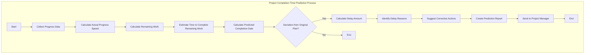

#### Project Completion Time Prediction Sub-Processes Table
| Sub-Process | Description | Roles | Inputs | Outputs |
|-------------|-------------|-------|--------|---------|
| Collect Data | Collect progress data | System | Task Status, Dates | Progress Data |
| Calculate Speed | Calculate actual progress speed | System | Progress Data | Progress Speed |
| Predict Time | Predict completion time | System | Speed, Remaining Work | Predicted Date |
| Create Report | Create prediction report | System | Prediction Data | Prediction Report |

---

### Early Warnings

#### General Description
The early warnings process automatically monitors project indicators and issues warnings before serious problems occur.

#### Early Warnings Process Diagram
```mermaid
graph TB
    subgraph "Early Warnings Process"
        A[Start] --> B[Continuous Indicator Monitoring]
        B --> C[Check Deviation from Plan]
        C --> D{Significant Deviation?}
        D -->|No| E[End]
        D -->|Yes| F[Identify Deviation Type]
        F --> G[Calculate Deviation Severity]
        G --> H[Predict Impact on Project]
        H --> I[Determine Warning Level]
        I --> J[Create Warning]
        J --> K[Send Warning to Responsibles]
        K --> L[Suggest Preventive Actions]
        L --> M[Follow Up Actions]
        M --> N[End]
    end
```

#### Early Warnings Sub-Processes Table
| Sub-Process | Description | Roles | Inputs | Outputs |
|-------------|-------------|-------|--------|---------|
| Monitor Indicators | Monitor project indicators | System | Defined Indicators | Indicator Status |
| Check Deviation | Check deviation from plan | System | Indicators, Thresholds | Deviation Status |
| Create Warning | Create appropriate warning | System | Deviation Data | Warning |
| Send Warning | Send warning to responsibles | System | Warning, Responsible List | Send Confirmation |

---

### Budget Management

#### General Description
The budget management process automatically tracks project costs and issues warnings when exceeding budget.

#### Budget Management Process Diagram
```mermaid
graph TB
    subgraph "Budget Management Process"
        A[Start] --> B[Collect Cost Data]
        B --> C[Calculate Actual Costs]
        C --> D[Compare with Planned Budget]
        D --> E{Budget Exceeded?}
        E -->|No| F[End]
        E -->|Yes| G[Calculate Excess Amount]
        G --> H[Identify Excess Reasons]
        H --> I[Predict Future Costs]
        I --> J[Calculate Required Budget]
        J --> K[Create Budget Warning]
        K --> L[Send to Finance Manager]
        L --> M[Suggest Corrective Actions]
        M --> N[End]
    end
```

#### Budget Management Sub-Processes Table
| Sub-Process | Description | Roles | Inputs | Outputs |
|-------------|-------------|-------|--------|---------|
| Collect Costs | Collect cost data | System | Resource Data, Task Data | Cost Data |
| Calculate Costs | Calculate actual costs | System | Cost Data | Calculated Costs |
| Compare with Budget | Compare with planned budget | System | Costs, Budget | Budget Status |
| Create Warning | Create budget warning | System | Excess Data | Budget Warning |

---

### Documentation Management

#### General Description
The documentation management process automatically updates and generates project documentation.

#### Documentation Management Process Diagram
```mermaid
graph TB
    subgraph "Documentation Management Process"
        A[Start] --> B[Identify Project Changes]
        B --> C[Extract Information from Changes]
        C --> D[Update Technical Documentation]
        D --> E[Update User Documentation]
        E --> F[Generate Automatic Documentation]
        F --> G[Validate Documentation]
        G --> H{Documentation Valid?}
        H -->|No| I[Record Documentation Issues]
        H -->|Yes| J[Publish Documentation]
        I --> K[Fix Documentation]
        K --> J
        J --> L[Send Update Notification]
        L --> M[End]
    end
```

#### Documentation Management Sub-Processes Table
| Sub-Process | Description | Roles | Inputs | Outputs |
|-------------|-------------|-------|--------|---------|
| Identify Changes | Identify project changes | System | Project Data | Change List |
| Update Documentation | Update documentation | System | Changes | Updated Documentation |
| Auto-Generate | Generate documentation automatically | System | Project Data | Generated Documentation |
| Publish Documentation | Publish documentation | System | Documentation | Published Documentation |

---

### Communication Management

#### General Description
The communication management process automatically sends notifications to relevant stakeholders.

#### Communication Management Process Diagram
```mermaid
graph TB
    subgraph "Communication Management Process"
        A[Start] --> B[Identify Notifiable Events]
        B --> C[Determine Notification Recipients]
        C --> D[Determine Communication Channel]
        D --> E[Generate Notification Content]
        E --> F[Personalize Notification for Each Recipient]
        F --> G[Send Notification]
        G --> H{Receipt Confirmed?}
        H -->|No| I[Resend]
        H -->|Yes| J[Record Notification Sent]
        I --> J
        J --> K[Follow Up Feedback]
        K --> L[End]
    end
```

#### Communication Management Sub-Processes Table
| Sub-Process | Description | Roles | Inputs | Outputs |
|-------------|-------------|-------|--------|---------|
| Identify Events | Identify notifiable events | System | Project Events | Event List |
| Determine Recipients | Determine notification recipients | System | Events, Rules | Recipient List |
| Generate Content | Generate notification content | System | Events, Templates | Notification Content |
| Send Notification | Send notification to recipients | System | Content, Recipients | Send Status |

---

### Change Management

#### General Description
The change management process automatically reviews and manages change requests.

#### Change Management Process Diagram
```mermaid
graph TB
    subgraph "Change Management Process"
        A[Start] --> B[Receive Change Request]
        B --> C[Validate Request]
        C --> D{Request Valid?}
        D -->|No| E[Reject Request]
        D -->|Yes| F[Assess Change Impact]
        F --> G[Calculate Time Impact]
        G --> H[Calculate Cost Impact]
        H --> I[Calculate Quality Impact]
        I --> J[Assess Change Risk]
        J --> K{Approve Change?}
        K -->|No| L[Reject Change]
        K -->|Yes| M[Plan Change Execution]
        M --> N[Execute Change]
        N --> O[Update Documentation]
        O --> P[End]
        E --> P
        L --> P
    end
```

#### Change Management Sub-Processes Table
| Sub-Process | Description | Roles | Inputs | Outputs |
|-------------|-------------|-------|--------|---------|
| Receive Request | Receive change request | System | Change Request Form | Registered Request |
| Assess Impact | Assess change impact | System | Change Request | Impact Report |
| Approve Change | Approve or reject change | Project Manager | Impact Report | Final Decision |
| Execute Change | Execute approved change | Project Team | Approved Change | Executed Change |

---

### Contract Management

#### General Description
The contract management process automatically tracks contractual commitments and reports deviations.

#### Contract Management Process Diagram
```mermaid
graph TB
    subgraph "Contract Management Process"
        A[Start] --> B[Collect Contractual Commitments]
        B --> C[Monitor Commitment Execution]
        C --> D{Deviation from Commitments?}
        D -->|No| E[End]
        D -->|Yes| F[Identify Deviation Type]
        F --> G[Calculate Deviation Amount]
        G --> H[Assess Financial Impact]
        H --> I[Calculate Penalties]
        I --> J[Create Deviation Report]
        J --> K[Send to Contract Manager]
        K --> L[Suggest Corrective Actions]
        L --> M[Follow Up Corrections]
        M --> N[End]
    end
```

#### Contract Management Sub-Processes Table
| Sub-Process | Description | Roles | Inputs | Outputs |
|-------------|-------------|-------|--------|---------|
| Collect Commitments | Collect contractual commitments | System | Contract Documents | Commitment List |
| Monitor Execution | Monitor commitment execution | System | Commitments, Execution Data | Execution Status |
| Report Deviation | Report deviation from commitments | System | Deviation Data | Deviation Report |
| Suggest Correction | Suggest corrective actions | System | Deviation Report | Correction Suggestions |

---

## Conclusion

This document completely and precisely describes the processes and sub-processes of GravityPM project management software. The system's main processes include project management, task management, resource management, dependency management, risk management, quality management, reporting, and GitHub integration.

### Process Strengths
- **Comprehensiveness**: Complete coverage of all project management aspects
- **Detail**: Precise description of sub-processes and workflows
- **Integration**: Full connection with GitHub for automation
- **Transparency**: Clear diagrams for better process understanding
- **Flexibility**: Configurable and customizable processes based on project needs
- **Automation**: Comprehensive coverage of automated and semi-automated processes

### Process Challenges
- **Complexity**: Complexity in managing dependencies and resource allocation
- **Coordination**: Need for coordination between different teams
- **Continuous Monitoring**: Need for continuous process monitoring to ensure correct execution
- **Updates**: Need to update processes with project changes

### Future Path
- **Add Artificial Intelligence**: For optimization and prediction in processes
- **Expand Integration**: Connect to other external systems
- **Improve Automation**: Increase automation level in processes
- **Advanced Reporting**: Add advanced analytical capabilities to reports

This document, with complete explanations, precise diagrams, and comprehensive tables, provides a clear framework for implementing and executing GravityPM processes and will serve as the primary reference for project teams. With complete coverage of automated and semi-automated processes, this document now fully includes all possible capabilities for the GravityPM project management system.