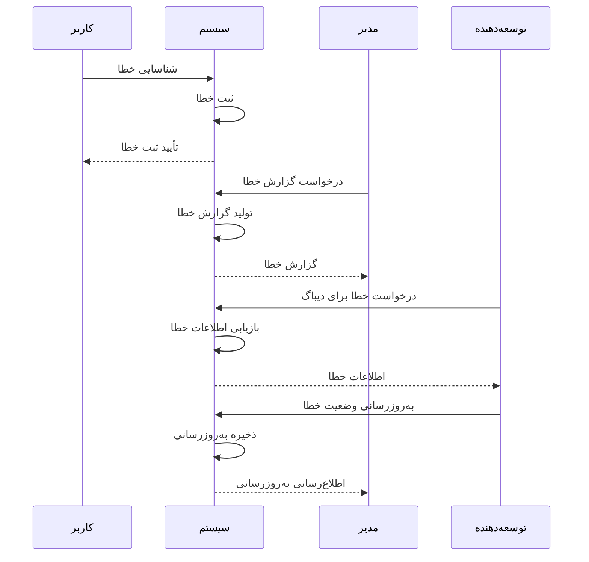

# سند تست و دیباگ نرم‌افزار مدیریت پروژه GravityPM

## فهرست مطالب

1. [مقدمه](#مقدمه)
2. [اهداف تست و دیباگ](#اهداف-تست-و-دیباگ)
3. [استراتژی تست](#استراتژی-تست)
4. [محیط‌های تست](#محیطهای-تست)
5. [فرآیندهای تست](#فرآیندهای-تست)
6. [ابزارهای تست](#ابزارهای-تست)
7. [تست‌های عملکردی](#تستهای-عملکردی)
8. [تست‌های غیرعملکردی](#تستهای-غیرعملکردی)
9. [تست یکپارچه‌سازی با GitHub](#تست-یکپارچهسازی-با-github)
10. [فرآیند دیباگ](#فرآیند-دیباگ)
11. [گزارش‌دهی خطاها](#گزارشدهی-خطاها)
12. [مدیریت باگ‌ها](#مدیریت-باگها)
13. [بهبود مستمر](#بهبود-مستمر)
14. [نتیجه‌گیری](#نتیجهگیری)

---

## مقدمه

این سند فرآیندها و استراتژی‌های تست و دیباگ نرم‌افزار مدیریت پروژه GravityPM را به‌صورت کامل توصیف می‌کند. GravityPM یک سیستم جامع مدیریت پروژه است که با تمرکز بر خودکارسازی فرآیندها و یکپارچه‌سازی با GitHub طراحی شده است. هدف اصلی این سند، اطمینان از کیفیت، پایداری و عملکرد مطلوب سیستم از طریق فرآیندهای تست و دیباگ ساختاریافته است.

### اهمیت تست و دیباگ
- **تضمین کیفیت**: اطمینان از عملکرد صحیح تمام قابلیت‌های سیستم
- **کاهش خطاها**: شناسایی و رفع خطاها قبل از استقرار در محیط تولید
- **افزایش قابلیت اطمینان**: تضمین پایداری سیستم تحت شرایط مختلف
- **بهبود عملکرد**: شناسایی و رفع گلوگاه‌های عملکردی
- **کاهش هزینه‌ها**: کاهش هزینه‌های رفع خطا در مراحل بعدی توسعه

---

## اهداف تست و دیباگ

### اهداف اصلی تست
| شناسه | هدف | اولویت | توضیح |
|-------|------|--------|-------|
| TO-001 | پوشش کامل قابلیت‌ها | بالا | تست تمام قابلیت‌های عملکردی و غیرعملکردی |
| TO-002 | تضمین یکپارچه‌سازی با GitHub | بالا | تست صحت عملکرد یکپارچه‌سازی با GitHub |
| TO-003 | ارزیابی عملکرد سیستم | متوسط | تست عملکرد تحت بارهای مختلف |
| TO-004 | ارزیابی امنیت سیستم | بالا | تست آسیب‌پذیری‌های امنیتی |
| TO-005 | تضمین سازگاری | متوسط | تست سازگاری با مرورگرها و دستگاه‌ها |

### اهداف اصلی دیباگ
| شناسه | هدف | اولویت | توضیح |
|-------|------|--------|-------|
| DO-001 | شناسایی سریع خطاها | بالا | شناسایی و ثبت خطاها در کمترین زمان ممکن |
| DO-002 | ردیابی دقیق خطاها | بالا | ردیابی دقیق ریشه خطاها |
| DO-003 | رفع مؤثر خطاها | متوسط | رفع خطاها با حداقل تأثیر بر سیستم |
| DO-004 | مستندسازی خطاها | متوسط | مستندسازی کامل خطاها و راه‌حل‌ها |
| DO-005 | پیشگیری از خطاهای تکراری | بالا | پیاده‌سازی مکانیزم‌های پیشگیری از خطاهای تکراری |

### دیاگرام اهداف تست و دیباگ


---

## استراتژی تست

### دیاگرام استراتژی تست


### انواع تست
| نوع تست | توضیح | سطح | ابزارها | فرکانس |
|---------|-------|------|--------|--------|
| **تست واحد** | تست اجزای مجزا سیستم | واحد | Jest, Mocha | هر commit |
| **تست یکپارچه‌سازی** | تست تعامل بین اجزا | یکپارچه‌سازی | Cypress, Supertest | روزانه |
| **تست سیستم** | تست سیستم به‌صورت کامل | سیستم | Selenium, Puppeteer | هفتگی |
| **تست پذیرش** | تست الزامات کاربر | پذیرش | Cucumber, SpecFlow | هر نسخه |
| **تست عملکرد** | تست عملکرد تحت بار | عملکرد | K6, JMeter | ماهانه |
| **تست امنیت** | تست آسیب‌پذیری‌ها | امنیت | OWASP ZAP, Burp | ماهانه |
| **تست سازگاری** | تست سازگاری با محیط‌ها | سازگاری | BrowserStack, Sauce Labs | ماهانه |

### دیاگرام انواع تست


### ماتریس تست
| ماژول | تست واحد | تست یکپارچه‌سازی | تست سیستم | تست پذیرش | تست عملکرد | تست امنیت |
|-------|-----------|-------------------|-----------|-----------|-------------|-----------|
| **مدیریت پروژه** | ✓ | ✓ | ✓ | ✓ | ✓ | ✓ |
| **مدیریت وظایف** | ✓ | ✓ | ✓ | ✓ | ✓ | ✓ |
| **مدیریت منابع** | ✓ | ✓ | ✓ | ✓ | ✓ | ✓ |
| **مدیریت وابستگی** | ✓ | ✓ | ✓ | ✓ | ✓ | ✓ |
| **مدیریت ریسک** | ✓ | ✓ | ✓ | ✓ | - | ✓ |
| **یکپارچه‌سازی GitHub** | ✓ | ✓ | ✓ | ✓ | ✓ | ✓ |
| **گزارش‌دهی** | ✓ | ✓ | ✓ | ✓ | ✓ | - |

---

## محیط‌های تست

### دیاگرام محیط‌های تست


### مشخصات محیط‌های تست
| محیط | هدف | پیکربندی | داده‌ها | دسترسی |
|-------|------|-----------|--------|--------|
| **توسعه** | توسعه و تست اولیه | حداقل، محلی | داده‌های تست مصنوعی | توسعه‌دهندگان |
| **تست** | تست جامع سیستم | مشابه تولید | داده‌های تست واقعی | تیم تست |
| **پیش‌تولید** | تست نهایی قبل از تولید | مشابه تولید | داده‌های واقعی (ناشناس) | تیم عملیات |
| **تولید** | استقرار نهایی | بهینه‌سازی شده | داده‌های واقعی | تیم عملیات |

### دیاگرام جریان بین محیط‌ها


---

## فرآیندهای تست

### فرآیند کلی تست


### زیرفرآیندهای تست
| زیرفرآیند | توضیح | ورودی‌ها | خروجی‌ها | مسئول |
|-----------|-------|----------|----------|--------|
| **برنامه‌ریزی تست** | تعیین استراتژی و محدوده تست | نیازمندی‌ها، محدودیت‌ها | برنامه تست | مدیر تست |
| **طراحی موارد تست** | طراحی موارد تست بر اساس نیازمندی‌ها | نیازمندی‌ها، موارد استفاده | موارد تست | طراح تست |
| **آماده‌سازی داده‌ها** | آماده‌سازی داده‌های مورد نیاز برای تست | موارد تست | داده‌های تست | مهندس تست |
| **پیاده‌سازی تست** | پیاده‌سازی خودکار موارد تست | موارد تست | کد تست | توسعه‌دهنده تست |
| **اجرا تست** | اجرای موارد تست | کد تست، داده‌های تست | نتایج تست | مهندس تست |
| **جمع‌آوری نتایج** | جمع‌آوری و تحلیل نتایج تست | نتایج خام | نتایج تحلیل شده | تحلیلگر تست |
| **تأیید تست** | تأیید نتایج تست | نتایج تحلیل شده | گزارش تأیید | مدیر تست |
| **ثبت خطا** | ثبت خطاهای شناسایی شده | نتایج ناموفق | گزارش خطا | مهندس تست |
| **رفع خطا** | رفع خطاهای شناسایی شده | گزارش خطا | کد اصلاح شده | توسعه‌دهنده |
| **تولید گزارش** | تولید گزارش نهایی تست | نتایج تست | گزارش نهایی | مدیر تست |

### دیاگرام فرآیند تست واحد
```mermaid
stateDiagram-v2
    [*] --> انتخاب_ماژول_برای_تست
    انتخاب_ماژول_برای_تست --> طراحی_مورد_تست
    طراحی_مورد_تست --> پیاده‌سازی_تست_واحد
    پیاده‌سازی_تست_واحد --> اجرا_تست_واحد
    اجرا_تست_واحد --> {تست_موفق؟}
    
    {تست_موفق؟} --> بله --> محاسبه_پوشش_تست
    {تست_موفق؟} --> خیر --> دیباگ_کد
    
    دیباگ_کد --> رفع_خطا
    رفع_خطا --> اجرا_تست_واحد
    
    محاسبه_پوشش_تست --> {پوشش_کافی؟}
    
    {پوشش_کافی؟} --> بله --> ثبت_نتایج
    {پوشش_کافی؟} --> خیر --> طراحی_مورد_تست_اضافی
    
    طراحی_مورد_تست_اضافی --> پیاده‌سازی_تست_واحد
    
    ثبت_نتایج --> [*]
```

### دیاگرام فرآیند تست یکپارچه‌سازی


---

## ابزارهای تست

### ابزارهای تست واحد
| ابزار | توضیح | زبان | ویژگی‌ها |
|-------|-------|------|----------|
| **Jest** | فریمورک تست واحد جاوا اسکریپت | JavaScript | سریع، ساده، پوشش تست |
| **Mocha** | فریمورک تست انعطاف‌پذیر | JavaScript | انعطاف‌پذیر، پشتیبانی از promise |
| **Chai** | کتابخانه assert | JavaScript | خوانا، زنجیره‌ای |
| **Sinon** | کتابخانه stub, spy, mock | JavaScript | استاب‌ها، جاسوس‌ها، ماک‌ها |

### ابزارهای تست یکپارچه‌سازی
| ابزار | توضیح | ویژگی‌ها | پشتیبانی |
|-------|-------|----------|----------|
| **Cypress** | فریمورک تست E2E | سریع، قابل اعتماد، دیباگ آسان | مرورگرهای مدرن |
| **Supertest** | کتابخانه تست API | سبک، انعطاف‌پذیر | Node.js |
| **Puppeteer** | اتوماسیون مرورگر | کنترل کامل مرورگر | Chrome, Chromium |

### ابزارهای تست عملکرد
| ابزار | توضیح | ویژگی‌ها | پلتفرم |
|-------|-------|----------|----------|
| **K6** | ابزار تست عملکرد مدرن | اسکریپت نویسی جاوا اسکریپت | چند پلتفرمی |
| **JMeter** | ابزار تست بار قدیمی | جامع، پلاگین‌های زیاد | جاوا |
| **Gatling** | ابزار تست عملکرد | اسکریپت نویسی اسکالا | چند پلتفرمی |

### ابزارهای تست امنیت
| ابزار | توضیح | ویژگی‌ها | نوع |
|-------|-------|----------|------|
| **OWASP ZAP** | ابزار اسکن امنیتی | خودکار، دستی | دسکتاپ |
| **Burp Suite** | ابزار تست امنیت | جامع، حرفه‌ای | دسکتاپ |
| **SonarQube** | تحلیل کد استاتیک | یکپارچه‌سازی با CI/CD | سرور |

### دیاگرام یکپارچه‌سازی ابزارهای تست


---

## تست‌های عملکردی

### دیاگرام تست‌های عملکردی


### موارد تست مدیریت پروژه
| شناسه مورد تست | توضیح | پیش‌شرط‌ها | مراحل تست | نتایج مورد انتظار |
|----------------|-------|-------------|-----------|-------------------|
| TP-001 | ایجاد پروژه جدید | کاربر وارد سیستم شده | 1. کلیک روی دکمه ایجاد پروژه<br>2. وارد کردن اطلاعات پروژه<br>3. کلیک روی ذخیره | پروژه با موفقیت ایجاد شود |
| TP-002 | ویرایش پروژه موجود | پروژه موجود | 1. انتخاب پروژه<br>2. کلیک روی ویرایش<br>3. تغییر اطلاعات<br>4. کلیک روی ذخیره | اطلاعات پروژه با موفقیت به‌روز شود |
| TP-003 | حذف پروژه | پروژه موجود | 1. انتخاب پروژه<br>2. کلیک روی حذف<br>3. تأیید حذف | پروژه با موفقیت حذف شود |
| TP-004 | مشاهده جزئیات پروژه | پروژه موجود | 1. انتخاب پروژه<br>2. کلیک روی مشاهده | جزئیات کامل پروژه نمایش داده شود |
| TP-005 | جستجوی پروژه | چندین پروژه موجود | 1. وارد کردن عبارت جستجو<br>2. کلیک روی جستجو | پروژه‌های مرتبط نمایش داده شوند |

### موارد تست مدیریت وظایف
| شناسه مورد تست | توضیح | پیش‌شرط‌ها | مراحل تست | نتایج مورد انتظار |
|----------------|-------|-------------|-----------|-------------------|
| TT-001 | ایجاد وظیفه جدید | پروژه موجود | 1. انتخاب پروژه<br>2. کلیک روی ایجاد وظیفه<br>3. وارد کردن اطلاعات وظیفه<br>4. کلیک روی ذخیره | وظیفه با موفقیت ایجاد شود |
| TT-002 | ویرایش وظیفه | وظیفه موجود | 1. انتخاب وظیفه<br>2. کلیک روی ویرایش<br>3. تغییر اطلاعات<br>4. کلیک روی ذخیره | اطلاعات وظیفه با موفقیت به‌روز شود |
| TT-003 | تخصیص منبع به وظیفه | وظیفه و منبع موجود | 1. انتخاب وظیفه<br>2. کلیک روی تخصیص منبع<br>3. انتخاب منبع<br>4. کلیک روی ذخیره | منبع با موفقیت تخصیص داده شود |
| TT-004 | به‌روزرسانی پیشرفت وظیفه | وظیفه موجود | 1. انتخاب وظیفه<br>2. تغییر درصد پیشرفت<br>3. کلیک روی ذخیره | پیشرفت وظیفه با موفقیت به‌روز شود |
| TT-005 | مدیریت وابستگی‌ها | چندین وظیفه موجود | 1. انتخاب وظیفه<br>2. کلیک روی وابستگی‌ها<br>3. افزودن وابستگی<br>4. کلیک روی ذخیره | وابستگی با موفقیت ایجاد شود |

### موارد تست یکپارچه‌سازی با GitHub
| شناسه مورد تست | توضیح | پیش‌شرط‌ها | مراحل تست | نتایج مورد انتظار |
|----------------|-------|-------------|-----------|-------------------|
| TG-001 | دریافت وبهوک GitHub | وبهوک پیکربندی شده | 1. ارسال رویداد push به وبهوک<br>2. بررسی پردازش رویداد | رویداد با موفقیت پردازش شود |
| TG-002 | به‌روزرسانی وضعیت وظیفه بر اساس کامیت | وظیفه مرتبط با کامیت | 1. ارسال کامیت با ID وظیفه<br>2. بررسی وضعیت وظیفه | وضعیت وظیفه به‌روز شود |
| TG-003 | ایجاد Issue در GitHub | قانون خودکارسازی فعال | 1. ایجاد رویداد مربوط به قانون<br>2. بررسی Issues در GitHub | Issue با موفقیت ایجاد شود |
| TG-004 | همگام‌سازی داده‌ها | تغییر در داده‌های سیستم | 1. ایجاد تغییر در داده‌ها<br>2. بررسی همگام‌سازی | داده‌ها با موفقیت همگام شوند |

### دیاگرام جریان تست عملکردی


---

## تست‌های غیرعملکردی

### دیاگرام تست‌های غیرعملکردی


### تست عملکرد
| معیار | هدف | حداقل | بهینه | روش تست |
|-------|------|-------|-------|----------|
| **زمان پاسخ API** | < 2 ثانیه | < 3 ثانیه | < 1 ثانیه | اندازه‌گیری زمان پاسخ درخواست‌های API |
| **زمان بارگذاری صفحه** | < 3 ثانیه | < 5 ثانیه | < 2 ثانیه | اندازه‌گیری زمان بارگذاری صفحات اصلی |
| **ظرفیت کاربر همزمان** | 1000 کاربر | 500 کاربر | 2000 کاربر | تست بار با تعداد کاربران همزمان |
| **مصرف منابع** | < 80% CPU | < 90% CPU | < 70% CPU | مانیتورینگ مصرف CPU و حافظه |

### تست امنیت
| نوع تست | توضیح | ابزارها | معیارها |
|---------|-------|--------|----------|
| **تست احراز هویت** | تست مکانیزم‌های احراز هویت | OWASP ZAP | ورود فقط با اعتبار معتبر |
| **تست مجوزها** | تست سطوح دسترسی | Burp Suite | دسترسی فقط بر اساس مجوز |
| **تست تزریق SQL** | تست آسیب‌پذیری تزریق SQL | OWASP ZAP | بدون آسیب‌پذیری |
| **تست XSS** | تست آسیب‌پذیری XSS | OWASP ZAP | بدون آسیب‌پذیری |
| **تست CSRF** | تست آسیب‌پذیری CSRF | OWASP ZAP | بدون آسیب‌پذیری |

### تست قابلیت اطمینان
| معیار | هدف | حداقل | بهینه | روش تست |
|-------|------|-------|-------|----------|
| **زمان کارکرد (Uptime)** | 99.9% | 99% | 99.99% | مانیتورینگ مداوم سیستم |
| **MTBF** | > 1000 ساعت | > 500 ساعت | > 2000 ساعت | اندازه‌گیری زمان بین خرابی‌ها |
| **MTTR** | < 1 ساعت | < 2 ساعت | < 30 دقیقه | اندازه‌گیری زمان رفع خرابی |
| **نرخ خطا** | < 0.1% | < 1% | < 0.01% | محاسبه نرخ خطاها |

### تست قابلیت استفاده
| معیار | توضیح | روش تست | معیارها |
|-------|-------|----------|----------|
| **سادگی رابط کاربری** | ارزیابی سادگی استفاده | تست کاربر | > 80% رضایت کاربران |
| **دسترسی‌پذیری** | ارزیابی دسترسی‌پذیری | تست دسترسی‌پذیری | مطابق با استاندارد WCAG 2.1 |
| **راهنمایی کاربر** | ارزیابی راهنمایی‌ها | تست کاربر | > 90% کاربران توانایی انجام وظایف |
| **ثبات رابط** | ارزیابی ثبات طراحی | بررسی طراحی | ثبات در تمام صفحات |

### دیاگرام جریان تست غیرعملکردی


---

## تست یکپارچه‌سازی با GitHub

### دیاگرام تست یکپارچه‌سازی با GitHub


### موارد تست وبهوک GitHub
| شناسه مورد تست | توضیح | پیش‌شرط‌ها | مراحل تست | نتایج مورد انتظار |
|----------------|-------|-------------|-----------|-------------------|
| TH-001 | تست دریافت وبهوک push | وبهوک پیکربندی شده | 1. ارسال رویداد push<br>2. بررسی دریافت رویداد | رویداد با موفقیت دریافت شود |
| TH-002 | تست اعتبارسنجی امضای وبهوک | وبهوک با امضا | 1. ارسال رویداد با امضای معتبر<br>2. ارسال رویداد با امضای نامعتبر | امضای معتبر تأیید شود، امضای نامعتبر رد شود |
| TH-003 | تست پردازش رویداد issues | وبهوک پیکربندی شده | 1. ارسال رویداد issues<br>2. بررسی پردازش رویداد | رویداد با موفقیت پردازش شود |
| TH-004 | تست پردازش رویداد pull_request | وبهوک پیکربندی شده | 1. ارسال رویداد pull_request<br>2. بررسی پردازش رویداد | رویداد با موفقیت پردازش شود |

### موارد تست API GitHub
| شناسه مورد تست | توضیح | پیش‌شرط‌ها | مراحل تست | نتایج مورد انتظار |
|----------------|-------|-------------|-----------|-------------------|
| TA-001 | تست ایجاد Issue | توکن API معتبر | 1. ارسال درخواست ایجاد Issue<br>2. بررسی ایجاد Issue | Issue با موفقیت ایجاد شود |
| TA-002 | تست به‌روزرسانی Issue | Issue موجود | 1. ارسال درخواست به‌روزرسانی Issue<br>2. بررسی به‌روزرسانی | Issue با موفقیت به‌روز شود |
| TA-003 | تست بستن Issue | Issue باز | 1. ارسال درخواست بستن Issue<br>2. بررسی بسته شدن Issue | Issue با موفقیت بسته شود |
| TA-004 | تست دریافت کامیت‌ها | مخزن موجود | 1. ارسال درخواست دریافت کامیت‌ها<br>2. بررسی دریافت کامیت‌ها | کامیت‌ها با موفقیت دریافت شوند |

### موارد تست قوانین خودکارسازی
| شناسه مورد تست | توضیح | پیش‌شرط‌ها | مراحل تست | نتایج مورد انتظار |
|----------------|-------|-------------|-----------|-------------------|
| TR-001 | تست قانون به‌روزرسانی وضعیت | قانون فعال | 1. ارسال کامیت با ID وظیفه<br>2. بررسی وضعیت وظیفه | وضعیت وظیفه به‌روز شود |
| TR-002 | تست قانون ایجاد Issue | قانون فعال | 1. ایجاد رویداد مربوط به قانون<br>2. بررسی Issues | Issue با موفقیت ایجاد شود |
| TR-003 | تست قانون بررسی وابستگی | قانون فعال | 1. تکمیل وظیفه دارای وابسته<br>2. بررسی وضعیت وابسته‌ها | وضعیت وابسته‌ها به‌روز شود |
| TR-004 | تست قانون گزارش روزانه | قانون فعال | 1. رسیدن به زمان گزارش<br>2. بررسی Issues | گزارش روزانه ایجاد شود |

### دیاگرام جریان تست یکپارچه‌سازی با GitHub


---

## فرآیند دیباگ

### دیاگرام فرآیند دیباگ


### مراحل دیباگ
| مرحله | توضیح | فعالیت‌ها | خروجی‌ها | مسئول |
|--------|-------|----------|----------|--------|
| **شناسایی خطا** | شناسایی و ثبت خطا | - مشاهده رفتار غیرمنتظره<br>- ثبت خطا در سیستم<br>- جمع‌آوری لاگ‌ها | گزارش خطا اولیه | کاربر/تستر |
| **ثبت خطا** | ثبت دقیق خطا | - تکمیل فرم خطا<br>- افزودن لاگ‌ها<br>- افزودن اسکرین‌شات | گزارش خطا کامل | مهندس تست |
| **اولویت‌بندی** | تعیین اولویت خطا | - ارزیابی تأثیر خطا<br>- تعیین شدت خطا<br>- تعیین اولویت | اولویت خطا | مدیر پروژه |
| **تخصیص خطا** | تخصیص خطا به توسعه‌دهنده | - انتخاب توسعه‌دهنده مناسب<br>- اطلاع‌رسانی به توسعه‌دهنده | تخصیص خطا | مدیر پروژه |
| **تحلیل خطا** | تحلیل دقیق خطا | - بررسی کد<br>- بررسی لاگ‌ها<br>- تکرار خطا | تحلیل خطا | توسعه‌دهنده |
| **ردیابی ریشه** | ردیابی ریشه خطا | - استفاده از ابزارهای دیباگ<br>- تحلیل پشته خطا<br>- بررسی وابستگی‌ها | ریشه خطا | توسعه‌دهنده |
| **طراحی راه‌حل** | طراحی راه‌حل برای رفع خطا | - طراحی الگوریتم<br>- طراحی تغییرات کد<br>- ارزیابی تأثیر تغییرات | طرح راه‌حل | توسعه‌دهنده |
| **پیاده‌سازی راه‌حل** | پیاده‌سازی راه‌حل | - نوشتن کد<br>- بازبینی کد<br>- تست واحد | کد اصلاح شده | توسعه‌دهنده |
| **تست راه‌حل** | تست راه‌حل | - اجرای تست‌ها<br>- تست دستی<br>- ارزیابی نتایج | نتایج تست | مهندس تست |
| **تأیید راه‌حل** | تأیید مؤثر بودن راه‌حل | - بررسی نتایج تست<br>- تأیید رفع خطا<br>- بررسی عوارض جانبی | تأیید راه‌حل | مدیر پروژه |
| **استقرار راه‌حل** | استقرار راه‌حل در محیط | - ادغام کد<br>- استقرار در محیط<br>- مانیتورینگ | راه‌حل مستقر شده | تیم عملیات |
| **پیگیری راه‌حل** | پیگیری راه‌حل پس از استقرار | - مانیتورینگ سیستم<br>- جمع‌آوری بازخورد<br>- بررسی خطاهای جدید | گزارش پیگیری | مهندس تست |
| **بستن خطا** | بستن گزارش خطا | - مستندسازی راه‌حل<br>- بستن گزارش خطا<br>- به‌روزرسانی دانش فنی | خطا بسته شده | توسعه‌دهنده |

### سطوح اولویت خطا
| سطح اولویت | توضیح | زمان پاسخ | مثال |
|-------------|-------|-----------|-------|
| **بحرانی** | خطا که سیستم را غیرقابل استفاده می‌کند | فوری | سیستم از کار افتاده |
| **بالا** | خطا که قابلیت اصلی را مختل می‌کند | 4 ساعت | عدم امکان ایجاد پروژه |
| **متوسط** | خطا که قابلیت ثانویه را مختل می‌کند | 24 ساعت | مشکلات گزارش‌دهی |
| **پایین** | خطای جزئی که بر عملکرد اصلی تأثیر ندارد | 1 هفته | مشکلات ظاهری |

### دیاگرام جریان دیباگ
```mermaid
stateDiagram-v2
    [*] --> شناسایی_خطا
    شناسایی_خطا --> ثبت_خطا
    ثبت_خطا --> اولویت‌بندی_خطا
    اولویت‌بندی_خطا --> تخصیص_خطا
    تخصیص_خطا --> تحلیل_خطا
    تحلیل_خطا --> ردیابی_ریشه_خطا
    ردیابی_ریشه_خطا --> طراحی_راه‌حل
    طراحی_راه‌حل --> پیاده‌سازی_راه‌حل
    پیاده‌سازی_راه‌حل --> تست_راه‌حل
    تست_راه‌حل --> {راه‌حل_مؤثر؟}
    
    {راه‌حل_مؤثر؟} --> بله --> تأیید_راه‌حل
    {راه‌حل_مؤثر؟} --> خیر --> بازطراحی_راه‌حل
    
    بازطراحی_راه‌حل --> پیاده‌سازی_راه‌حل
    
    تأیید_راه‌حل --> استقرار_راه‌حل
    استقرار_راه‌حل --> پیگیری_راه‌حل
    پیگیری_راه‌حل --> بستن_خطا
    بستن_خطا --> [*]
```

---

## گزارش‌دهی خطاها

### دیاگرام گزارش‌دهی خطاها


### ساختار گزارش خطا
| بخش | توضیح | محتوا |
|------|-------|--------|
| **اطلاعات پایه** | اطلاعات شناسایی خطا | - شناسه خطا<br>- عنوان خطا<br>- تاریخ ثبت<br>- گزارش‌دهنده |
| **توضیحات خطا** | توضیحات دقیق خطا | - توضیح خطا<br>- مراحل تکرار<br>- رفتار مورد انتظار<br>- رفتار فعلی |
| **محیط خطا** | اطلاعات محیط وقوع خطا | - نسخه سیستم<br>- مرورگر<br>- سیستم‌عامل<br>- دستگاه |
| **اولویت و شدت** | اطلاعات اولویت و شدت | - سطح اولویت<br>- سطح شدت<br>- تأثیر بر سیستم |
| **پیوست‌ها** | فایل‌های پیوست | - لاگ‌ها<br>- اسکرین‌شات<br>- ویدیو<br>- فایل‌های دیگر |
| **وضعیت خطا** | اطلاعات وضعیت خطا | - وضعیت فعلی<br>- مسئول خطا<br>- تاریخ آخرین به‌روزرسانی |
| **راه‌حل‌ها** | اطلاعات راه‌حل‌ها | - راه‌حل‌های پیشنهادی<br>- راه‌حل در حال انجام<br>- راه‌حل نهایی |

### قالب‌های گزارش خطا
| قالب | توضیح | کاربرد |
|-------|-------|--------|
| **HTML** | گزارش خطا با فرمت HTML | نمایش در مرورگر |
| **PDF** | گزارش خطا با فرمت PDF | چاپ و آرشیو |
| **JSON** | گزارش خطا با فرمت JSON | پردازش خودکار |
| **CSV** | گزارش خطا با فرمت CSV | تحلیل در اکسل |

### دیاگرام جریان گزارش‌دهی خطا


---

## مدیریت باگ‌ها

### دیاگرام مدیریت باگ‌ها


### چرخه عمر باگ
| مرحله | توضیح | فعالیت‌ها | وضعیت |
|--------|-------|----------|--------|
| **جدید** | باگ جدید ثبت شده | - ثبت باگ<br>- طبقه‌بندی اولیه | New |
| **تأیید شده** | باگ توسط تیم تأیید شد | - تأیید وجود باگ<br>- اولویت‌بندی | Confirmed |
| **در حال تحلیل** | باگ در حال تحلیل است | - تحلیل باگ<br>- ردیابی ریشه | In Analysis |
| **در حال رفع** | راه‌حل در حال پیاده‌سازی است | - طراحی راه‌حل<br>- پیاده‌سازی راه‌حل | In Progress |
| **در حال تست** | راه‌حل در حال تست است | - تست راه‌حل<br>- ارزیابی نتایج | In Testing |
| **رفع شده** | باگ رفع شد | - تأیید رفع باگ<br>- مستندسازی | Fixed |
| **بسته شده** | باگ بسته شد | - بستن گزارش باگ<br>- تحلیل ریشه‌ای | Closed |
| **رد شده** | باگ رد شد | - دلیل رد<br>- مستندسازی | Rejected |

### استراتژی‌های مدیریت باگ
| استراتژی | توضیح | مزایا | معایب |
|---------|-------|-------|-------|
| **تست متمرکز** | تمرکز بر تست ماژول‌های دارای باگ | - کاهش زمان رفع باگ<br>- بهبود کیفیت ماژول | - نیاز به منابع بیشتر |
| **تست جامع** | تست تمام سیستم پس از رفع باگ | - اطمینان از عدم عوارض جانبی<br>- بهبود کیفیت کلی | - زمان‌بر |
| **تست رگرسیون** | تست مجدد باگ‌های رفع شده | - اطمینان از رفع دائمی باگ<br>- جلوگیری از بازگشت باگ | - نیاز به اتوماسیون |
| **تست اکتشافی** | تست بدون برنامه مشخص | - کشف باگ‌های غیرمنتظره<br>- بهبود کیفیت | - زمان‌بر و غیرقابل پیش‌بینی |

### دیاگرام جریان مدیریت باگ
```mermaid
flowchart TD
    A[کشف باگ] --> B{باگ جدید؟}
    B -->|بله| C[ثبت باگ]
    B -->|خیر| D[بررسی باگ موجود]
    
    C --> E[طبقه‌بندی باگ]
    D --> E
    
    E --> F[اولویت‌بندی باگ]
    F --> G[تخصیص به توسعه‌دهنده]
    G --> H[تحلیل و رفع باگ]
    H --> I[تست رفع باگ]
    I --> J{باگ رفع شد؟}
    
    J -->|بله| K[تأیید رفع باگ]
    J -->|خیر| L[بازگشت به تحلیل]
    
    L --> H
    K --> M[بستن باگ]
    M --> N[تحلیل ریشه‌ای]
    N --> O[به‌روزرسانی دانش فنی]
    O --> P[پایان]
```

---

## بهبود مستمر

### دیاگرام بهبود مستمر
```mermaid
graph TB
    subgraph "چرخه بهبود مستمر"
        A[برنامه‌ریزی] --> B[اجرا]
        B --> C[بررسی]
        C --> D[اقدام]
        D --> A
    end
    
    subgraph "فعالیت‌های بهبود"
        E[تحلیل داده‌های تست]
        F[شناسایی روندها]
        G[تعیین حوزه‌های بهبود]
        H[پیاده‌سازی بهبودها]
        I[ارزیابی اثربخشی]
    end
    
    A --> E
    B --> H
    C --> I
    D --> F
    
    E --> G
    F --> G
    G --> H
    H --> I
    I --> E
```

### فرآیند بهبود مستمر
| مرحله | توضیح | فعالیت‌ها | خروجی‌ها |
|--------|-------|----------|----------|
| **برنامه‌ریزی** | برنامه‌ریزی برای بهبود | - تحلیل داده‌های گذشته<br>- تعیین اهداف بهبود<br>- برنامه‌ریزی فعالیت‌ها | برنامه بهبود |
| **اجرا** | اجرای برنامه بهبود | - پیاده‌سازی تغییرات<br>- آموزش تیم<br>- به‌روزرسانی فرآیندها | تغییرات اجرا شده |
| **بررسی** | بررسی نتایج | - جمع‌آوری داده‌ها<br>- ارزیابی نتایج<br>- مقایسه با اهداف | گزارش ارزیابی |
| **اقدام** | اقدام اصلاحی | - تعیین اقدامات اصلاحی<br>- پیاده‌سازی اقدامات<br>- مستندسازی | اقدامات اصلاحی |

### معیارهای بهبود مستمر
| معیار | توضیح | فرمول محاسبه | هدف |
|-------|-------|----------------|------|
| **نرخ کشف باگ** | تعداد باگ‌های کشف شده در هر ساعت تست | (تعداد باگ‌ها) / (ساعات تست) | کاهش |
| **زمان رفع باگ** | میانگین زمان رفع هر باگ | (مجموع زمان رفع) / (تعداد باگ‌ها) | کاهش |
| **پوشش تست** | درصد کد پوشش شده توسط تست | (تعداد خطات تست شده) / (تعداد کل خطات) * 100 | افزایش |
| **نرخ بازگشت باگ** | درصد باگ‌هایی که پس از رفع دوباره ظاهر می‌شوند | (تعداد باگ‌های بازگشتی) / (تعداد کل باگ‌ها) * 100 | کاهش |
| **رضایت کاربر** | میزان رضایت کاربران از سیستم | (تعداد کاربران راضی) / (تعداد کل کاربران) * 100 | افزایش |

### دیاگرام جریان بهبود مستمر
```mermaid
sequenceDiagram
    تیم->>سیستم: اجرای تست‌ها
    سیستم->>سیستم: جمع‌آوری نتایج تست
    سیستم-->>تیم: گزارش نتایج
    
    تیم->>سیستم: تحلیل نتایج
    سیستم->>سیستم: شناسایی روندها
    سیستم-->>تیم: گزارش تحلیل
    
    تیم->>سیستم: برنامه‌ریزی بهبودها
    سیستم->>سیستم: مستندسازی برنامه
    سیستم-->>تیم: برنامه بهبود
    
    تیم->>سیستم: پیاده‌سازی بهبودها
    سیستم->>سیستم: اعمال تغییرات
    سیستم-->>تیم: تأیید تغییرات
    
    تیم->>سیستم: ارزیابی اثربخشی
    سیستم->>سیستم: جمع‌آوری داده‌های جدید
    سیستم-->>تیم: گزارش ارزیابی
```

---

## نتیجه‌گیری

این سند فرآیندها و استراتژی‌های تست و دیباگ نرم‌افزار مدیریت پروژه GravityPM را به‌صورت کامل توصیف کرد. با پیاده‌سازی این فرآیندها، می‌توانیم کیفیت، پایداری و عملکرد سیستم را تضمین کنیم.

### نقاط قوت استراتژی تست و دیباگ
- **جامعیت**: پوشش کامل تمام جنبه‌های تست و دیباگ
- **ساختاریافته**: فرآیندهای ساختاریافته و قابل پیگیری
- **ابزارمحور**: استفاده از ابزارهای مدرن و کارآمد
- **تمرکز بر کیفیت**: تأکید بر کیفیت در تمام مراحل
- **بهبود مستمر**: چرخه بهبود مستمر برای افزایش کیفیت

### چالش‌های تست و دیباگ
- **پیچیدگی سیستم**: پیچیدگی یکپارچه‌سازی با GitHub
- **تغییرات مداوم**: نیاز به تطبیق با تغییرات مداوم سیستم
- **محدودیت منابع**: محدودیت‌های منابع انسانی و زمانی
- **تست‌های عملکردی**: چالش‌های تست عملکرد تحت بارهای سنگین

### مسیر آینده
- **افزایش اتوماسیون**: افزایش تست‌های خودکار
- **بهبود ابزارها**: استفاده از ابزارهای پیشرفته‌تر
- **تست‌های هوشمند**: استفاده از هوش مصنوعی در تست
- **تست‌های چپ‌گرایی**: ادغام تست در فرآیند توسعه

این سند با ارائه توضیحات کامل، دیاگرام‌های دقیق و جداول جامع، چارچوبی روشن برای پیاده‌سازی و اجرای فرآیندهای تست و دیباگ GravityPM فراهم می‌کند و به‌عنوان مرجعی اصلی برای تیم‌های فنی و مدیریتی عمل خواهد کرد.