Here's the English translation of the document:

---

# GravityPM Project Management Software Testing and Debugging Document

## Table of Contents

1. [Introduction](#introduction)
2. [Testing and Debugging Objectives](#testing-and-debugging-objectives)
3. [Testing Strategy](#testing-strategy)
4. [Testing Environments](#testing-environments)
5. [Testing Processes](#testing-processes)
6. [Testing Tools](#testing-tools)
7. [Functional Testing](#functional-testing)
8. [Non-Functional Testing](#non-functional-testing)
9. [GitHub Integration Testing](#github-integration-testing)
10. [Debugging Process](#debugging-process)
11. [Error Reporting](#error-reporting)
12. [Bug Management](#bug-management)
13. [Continuous Improvement](#continuous-improvement)
14. [Conclusion](#conclusion)

---

## Introduction

This document comprehensively describes the testing and debugging processes and strategies for the GravityPM project management software. GravityPM is a comprehensive project management system designed with a focus on process automation and GitHub integration. The primary goal of this document is to ensure the quality, stability, and optimal performance of the system through structured testing and debugging processes.

### Importance of Testing and Debugging
- **Quality Assurance**: Ensuring correct functionality of all system features
- **Error Reduction**: Identifying and resolving errors before production deployment
- **Increased Reliability**: Guaranteeing system stability under various conditions
- **Performance Improvement**: Identifying and resolving performance bottlenecks
- **Cost Reduction**: Reducing error resolution costs in later development stages

---

## Testing and Debugging Objectives

### Main Testing Objectives
| ID | Objective | Priority | Description |
|-------|------|--------|-------|
| TO-001 | Complete feature coverage | High | Test all functional and non-functional features |
| TO-002 | Ensure GitHub integration | High | Test GitHub integration functionality |
| TO-003 | Evaluate system performance | Medium | Test performance under various loads |
| TO-004 | Evaluate system security | High | Test security vulnerabilities |
| TO-005 | Ensure compatibility | Medium | Test compatibility with browsers and devices |

### Main Debugging Objectives
| ID | Objective | Priority | Description |
|-------|------|--------|-------|
| DO-001 | Rapid error identification | High | Identify and log errors in minimal time |
| DO-002 | Precise error tracking | High | Accurately trace error root causes |
| DO-003 | Effective error resolution | Medium | Resolve errors with minimal system impact |
| DO-004 | Error documentation | Medium | Document errors and solutions completely |
| DO-005 | Prevention of recurring errors | High | Implement mechanisms to prevent recurring errors |

### Testing and Debugging Objectives Diagram
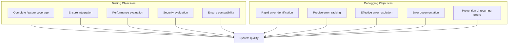

---

## Testing Strategy

### Testing Strategy Diagram
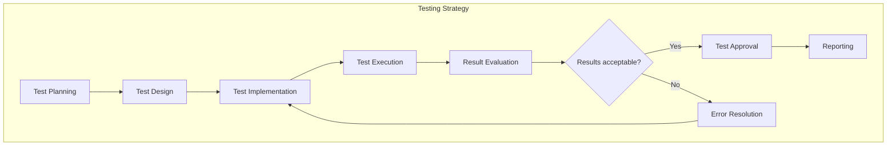

### Test Types
| Test Type | Description | Level | Tools | Frequency |
|---------|-------|------|--------|--------|
| **Unit Testing** | Testing isolated system components | Unit | Jest, Mocha | Every commit |
| **Integration Testing** | Testing interaction between components | Integration | Cypress, Supertest | Daily |
| **System Testing** | Testing complete system | System | Selenium, Puppeteer | Weekly |
| **Acceptance Testing** | Testing user requirements | Acceptance | Cucumber, SpecFlow | Every release |
| **Performance Testing** | Testing performance under load | Performance | K6, JMeter | Monthly |
| **Security Testing** | Testing vulnerabilities | Security | OWASP ZAP, Burp | Monthly |
| **Compatibility Testing** | Testing environment compatibility | Compatibility | BrowserStack, Sauce Labs | Monthly |

### Test Types Diagram
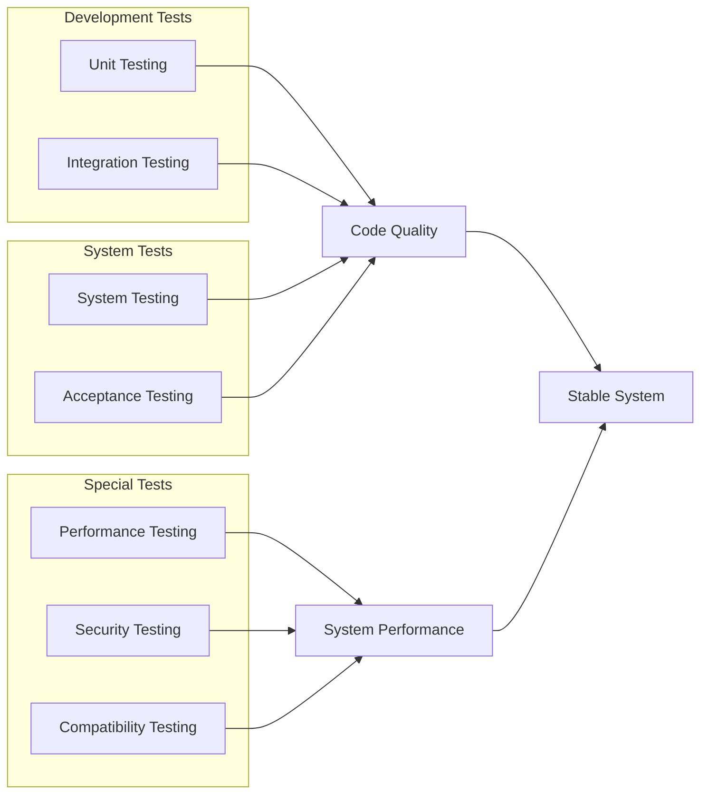

### Test Matrix
| Module | Unit Test | Integration Test | System Test | Acceptance Test | Performance Test | Security Test |
|-------|-----------|-------------------|-----------|-----------|-------------|-----------|
| **Project Management** | ✓ | ✓ | ✓ | ✓ | ✓ | ✓ |
| **Task Management** | ✓ | ✓ | ✓ | ✓ | ✓ | ✓ |
| **Resource Management** | ✓ | ✓ | ✓ | ✓ | ✓ | ✓ |
| **Dependency Management** | ✓ | ✓ | ✓ | ✓ | ✓ | ✓ |
| **Risk Management** | ✓ | ✓ | ✓ | ✓ | - | ✓ |
| **GitHub Integration** | ✓ | ✓ | ✓ | ✓ | ✓ | ✓ |
| **Reporting** | ✓ | ✓ | ✓ | ✓ | ✓ | - |

---

## Testing Environments

### Testing Environments Diagram
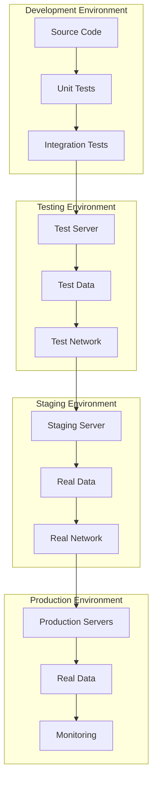

### Testing Environment Specifications
| Environment | Purpose | Configuration | Data | Access |
|-------|------|-----------|--------|--------|
| **Development** | Development and initial testing | Minimal, local | Artificial test data | Developers |
| **Testing** | Comprehensive system testing | Production-like | Realistic test data | Testing Team |
| **Staging** | Final pre-production testing | Production-like | Real data (anonymized) | Operations Team |
| **Production** | Final deployment | Optimized | Real data | Operations Team |

### Environment Flow Diagram
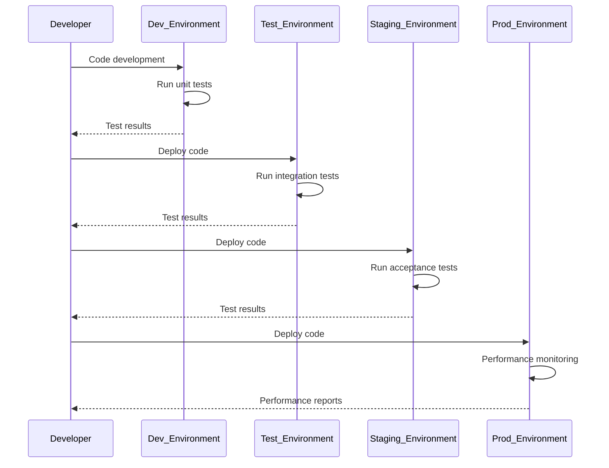

---

## Testing Processes

### General Testing Process
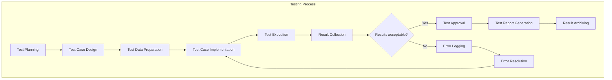

### Testing Sub-processes
| Sub-process | Description | Inputs | Outputs | Responsible |
|-----------|-------|----------|----------|--------|
| **Test Planning** | Define strategy and scope | Requirements, constraints | Test Plan | Test Manager |
| **Test Case Design** | Design test cases based on requirements | Requirements, use cases | Test Cases | Test Designer |
| **Data Preparation** | Prepare required test data | Test Cases | Test Data | Test Engineer |
| **Test Implementation** | Automate test cases | Test Cases | Test Code | Test Developer |
| **Test Execution** | Execute test cases | Test Code, Test Data | Test Results | Test Engineer |
| **Result Collection** | Collect and analyze test results | Raw results | Analyzed results | Test Analyst |
| **Test Approval** | Approve test results | Analyzed results | Approval Report | Test Manager |
| **Error Logging** | Log identified errors | Failed results | Error Report | Test Engineer |
| **Error Resolution** | Resolve identified errors | Error Report | Fixed Code | Developer |
| **Report Generation** | Generate final test report | Test Results | Final Report | Test Manager |

### Unit Testing Process Diagram
```mermaid
stateDiagram-v2
    [*] --> Select_Module_for_Test
    Select_Module_for_Test --> Design_Test_Case
    Design_Test_Case --> Implement_Unit_Test
    Implement_Unit_Test --> Execute_Unit_Test
    Execute_Unit_Test --> {Test_Passed?}
    
    {Test_Passed?} --> Yes --> Calculate_Test_Coverage
    {Test_Passed?} --> No --> Debug_Code
    
    Debug_Code --> Fix_Error
    Fix_Error --> Execute_Unit_Test
    
    Calculate_Test_Coverage --> {Coverage_Sufficient?}
    
    {Coverage_Sufficient?} --> Yes --> Record_Results
    {Coverage_Sufficient?} --> No --> Design_Additional_Test_Case
    
    Design_Additional_Test_Case --> Implement_Unit_Test
    
    Record_Results --> [*]
```

### Integration Testing Process Diagram
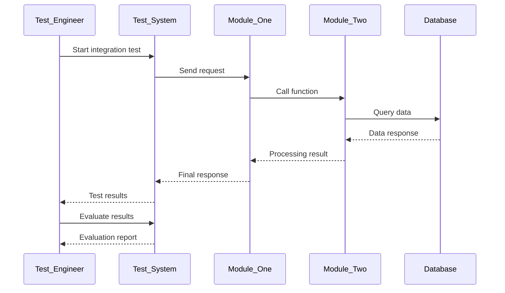

---

## Testing Tools

### Unit Testing Tools
| Tool | Description | Language | Features |
|-------|-------|------|----------|
| **Jest** | JavaScript unit testing framework | JavaScript | Fast, simple, test coverage |
| **Mocha** | Flexible testing framework | JavaScript | Flexible, promise support |
| **Chai** | Assertion library | JavaScript | Readable, chainable |
| **Sinon** | Stub, spy, mock library | JavaScript | Stubs, spies, mocks |

### Integration Testing Tools
| Tool | Description | Features | Support |
|-------|-------|----------|----------|
| **Cypress** | E2E testing framework | Fast, reliable, easy debugging | Modern browsers |
| **Supertest** | API testing library | Lightweight, flexible | Node.js |
| **Puppeteer** | Browser automation | Full browser control | Chrome, Chromium |

### Performance Testing Tools
| Tool | Description | Features | Platform |
|-------|-------|----------|----------|
| **K6** | Modern performance testing tool | JavaScript scripting | Multi-platform |
| **JMeter** | Legacy load testing tool | Comprehensive, many plugins | Java |
| **Gatling** | Performance testing tool | Scala scripting | Multi-platform |

### Security Testing Tools
| Tool | Description | Features | Type |
|-------|-------|----------|------|
| **OWASP ZAP** | Security scanning tool | Automated, manual | Desktop |
| **Burp Suite** | Security testing tool | Comprehensive, professional | Desktop |
| **SonarQube** | Static code analysis | CI/CD integration | Server |

### Testing Tools Integration Diagram
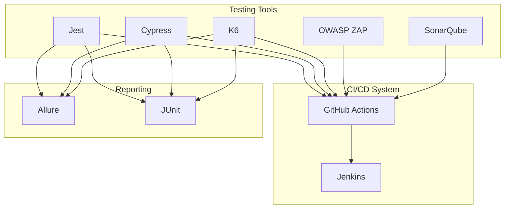

---

## Functional Testing

### Functional Testing Diagram
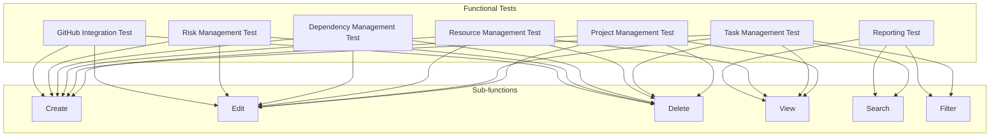

### Project Management Test Cases
| Test Case ID | Description | Prerequisites | Test Steps | Expected Results |
|----------------|-------|-------------|-----------|-------------------|
| TP-001 | Create new project | User logged in | 1. Click create project button<br>2. Enter project info<br>3. Click save | Project successfully created |
| TP-002 | Edit existing project | Existing project | 1. Select project<br>2. Click edit<br>3. Change info<br>4. Click save | Project info successfully updated |
| TP-003 | Delete project | Existing project | 1. Select project<br>2. Click delete<br>3. Confirm deletion | Project successfully deleted |
| TP-004 | View project details | Existing project | 1. Select project<br>2. Click view | Complete project details displayed |
| TP-005 | Search project | Multiple projects exist | 1. Enter search term<br>2. Click search | Relevant projects displayed |

### Task Management Test Cases
| Test Case ID | Description | Prerequisites | Test Steps | Expected Results |
|----------------|-------|-------------|-----------|-------------------|
| TT-001 | Create new task | Existing project | 1. Select project<br>2. Click create task<br>3. Enter task info<br>4. Click save | Task successfully created |
| TT-002 | Edit task | Existing task | 1. Select task<br>2. Click edit<br>3. Change info<br>4. Click save | Task info successfully updated |
| TT-003 | Assign resource to task | Existing task and resource | 1. Select task<br>2. Click assign resource<br>3. Select resource<br>4. Click save | Resource successfully assigned |
| TT-004 | Update task progress | Existing task | 1. Select task<br>2. Change progress percentage<br>3. Click save | Task progress successfully updated |
| TT-005 | Manage dependencies | Multiple tasks exist | 1. Select task<br>2. Click dependencies<br>3. Add dependency<br>4. Click save | Dependency successfully created |

### GitHub Integration Test Cases
| Test Case ID | Description | Prerequisites | Test Steps | Expected Results |
|----------------|-------|-------------|-----------|-------------------|
| TG-001 | Receive GitHub webhook | Webhook configured | 1. Send push event to webhook<br>2. Check event processing | Event successfully processed |
| TG-002 | Update task status based on commit | Task linked to commit | 1. Send commit with task ID<br>2. Check task status | Task status updated |
| TG-003 | Create GitHub Issue | Automation rule active | 1. Trigger rule event<br>2. Check GitHub Issues | Issue successfully created |
| TG-004 | Data synchronization | System data changed | 1. Change system data<br>2. Check synchronization | Data successfully synchronized |

### Functional Testing Flow Diagram
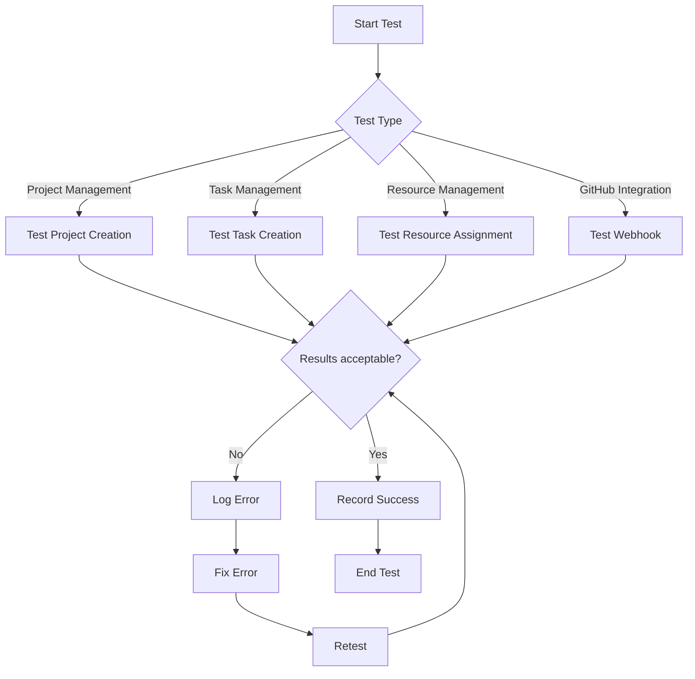

---

## Non-Functional Testing

### Non-Functional Testing Diagram
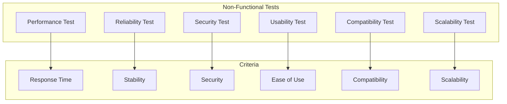

### Performance Testing
| Metric | Goal | Minimum | Optimal | Test Method |
|-------|------|-------|-------|----------|
| **API Response Time** | < 2 seconds | < 3 seconds | < 1 second | Measure API request response time |
| **Page Load Time** | < 3 seconds | < 5 seconds | < 2 seconds | Measure main pages load time |
| **Concurrent User Capacity** | 1000 users | 500 users | 2000 users | Load test with concurrent users |
| **Resource Usage** | < 80% CPU | < 90% CPU | < 70% CPU | Monitor CPU and memory usage |

### Security Testing
| Test Type | Description | Tools | Criteria |
|---------|-------|--------|----------|
| **Authentication Test** | Test authentication mechanisms | OWASP ZAP | Login only with valid credentials |
| **Authorization Test** | Test access levels | Burp Suite | Access only based on permissions |
| **SQL Injection Test** | Test SQL injection vulnerability | OWASP ZAP | No vulnerabilities |
| **XSS Test** | Test XSS vulnerability | OWASP ZAP | No vulnerabilities |
| **CSRF Test** | Test CSRF vulnerability | OWASP ZAP | No vulnerabilities |

### Reliability Testing
| Metric | Goal | Minimum | Optimal | Test Method |
|-------|------|-------|-------|----------|
| **Uptime** | 99.9% | 99% | 99.99% | Continuous system monitoring |
| **MTBF** | > 1000 hours | > 500 hours | > 2000 hours | Measure time between failures |
| **MTTR** | < 1 hour | < 2 hours | < 30 minutes | Measure failure resolution time |
| **Error Rate** | < 0.1% | < 1% | < 0.01% | Calculate error rate |

### Usability Testing
| Metric | Description | Test Method | Criteria |
|-------|-------|----------|----------|
| **UI Simplicity** | Evaluate ease of use | User testing | > 80% user satisfaction |
| **Accessibility** | Evaluate accessibility | Accessibility testing | WCAG 2.1 compliant |
| **User Guidance** | Evaluate guidance | User testing | > 90% users can perform tasks |
| **Interface Consistency** | Evaluate design consistency | Design review | Consistency across all pages |

### Non-Functional Testing Flow Diagram
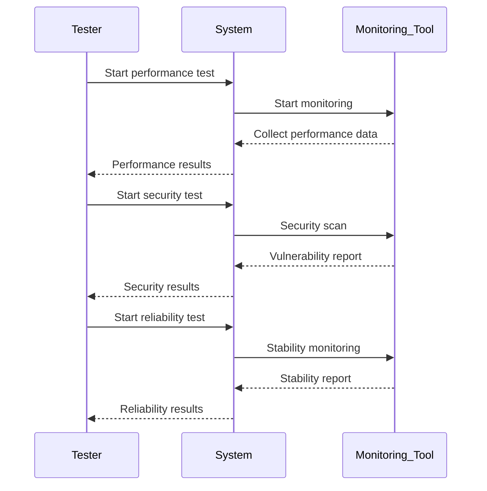

---

## GitHub Integration Testing

### GitHub Integration Testing Diagram
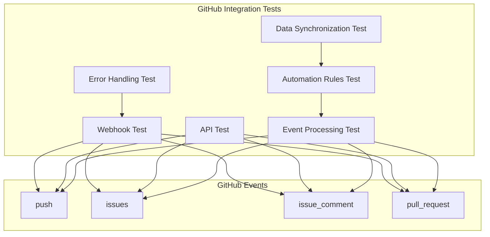

### GitHub Webhook Test Cases
| Test Case ID | Description | Prerequisites | Test Steps | Expected Results |
|----------------|-------|-------------|-----------|-------------------|
| TH-001 | Test receiving push webhook | Webhook configured | 1. Send push event<br>2. Check event reception | Event successfully received |
| TH-002 | Test webhook signature validation | Signed webhook | 1. Send event with valid signature<br>2. Send event with invalid signature | Valid signature accepted, invalid rejected |
| TH-003 | Test issues event processing | Webhook configured | 1. Send issues event<br>2. Check event processing | Event successfully processed |
| TH-004 | Test pull_request event processing | Webhook configured | 1. Send pull_request event<br>2. Check event processing | Event successfully processed |

### GitHub API Test Cases
| Test Case ID | Description | Prerequisites | Test Steps | Expected Results |
|----------------|-------|-------------|-----------|-------------------|
| TA-001 | Test Issue creation | Valid API token | 1. Send create Issue request<br>2. Check Issue creation | Issue successfully created |
| TA-002 | Test Issue update | Existing Issue | 1. Send update Issue request<br>2. Check update | Issue successfully updated |
| TA-003 | Test Issue closure | Open Issue | 1. Send close Issue request<br>2. Check closure | Issue successfully closed |
| TA-004 | Test commits retrieval | Existing repository | 1. Send get commits request<br>2. Check commits retrieval | Commits successfully retrieved |

### Automation Rules Test Cases
| Test Case ID | Description | Prerequisites | Test Steps | Expected Results |
|----------------|-------|-------------|-----------|-------------------|
| TR-001 | Test status update rule | Active rule | 1. Send commit with task ID<br>2. Check task status | Task status updated |
| TR-002 | Test Issue creation rule | Active rule | 1. Trigger rule event<br>2. Check Issues | Issue successfully created |
| TR-003 | Test dependency check rule | Active rule | 1. Complete dependent task<br>2. Check dependent statuses | Dependent statuses updated |
| TR-004 | Test daily report rule | Active rule | 1. Reach report time<br>2. Check Issues | Daily report created |

### GitHub Integration Testing Flow Diagram
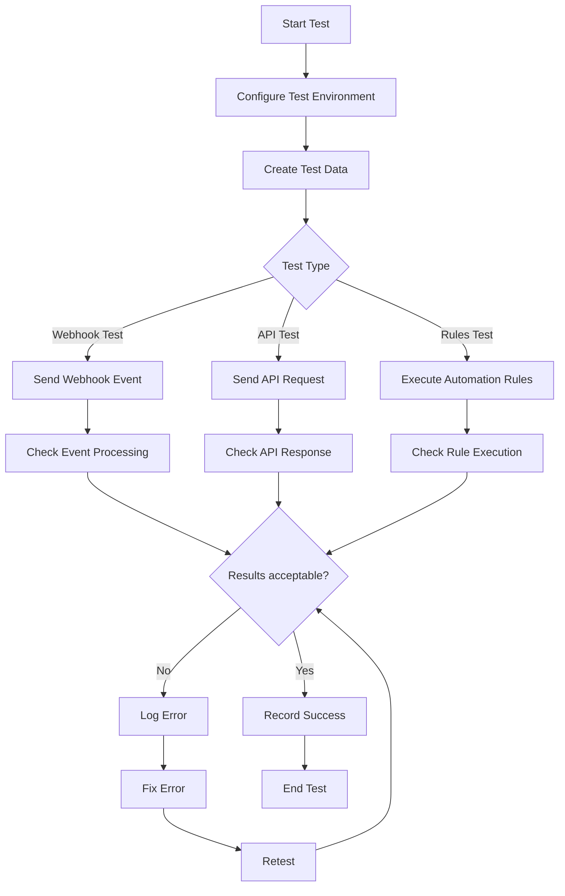

---

## Debugging Process

### Debugging Process Diagram
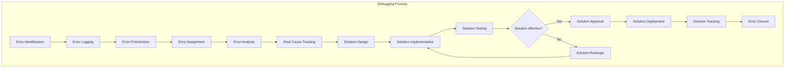

### Debugging Stages
| Stage | Description | Activities | Outputs | Responsible |
|--------|-------|----------|----------|--------|
| **Error Identification** | Identify and log errors | - Observe unexpected behavior<br>- Log error in system<br>- Collect logs | Initial error report | User/Tester |
| **Error Logging** | Log errors precisely | - Complete error form<br>- Add logs<br>- Add screenshots | Complete error report | Test Engineer |
| **Prioritization** | Determine error priority | - Assess error impact<br>- Determine severity<br>- Set priority | Error priority | Project Manager |
| **Error Assignment** | Assign error to developer | - Select appropriate developer<br>- Notify developer | Error assignment | Project Manager |
| **Error Analysis** | Analyze error in detail | - Review code<br>- Check logs<br>- Reproduce error | Error analysis | Developer |
| **Root Cause Tracking** | Track error root cause | - Use debugging tools<br>- Analyze stack trace<br>- Check dependencies | Root cause | Developer |
| **Solution Design** | Design solution to fix error | - Design algorithm<br>- Design code changes<br>- Assess impact | Solution design | Developer |
| **Solution Implementation** | Implement solution | - Write code<br>- Code review<br>- Unit test | Fixed code | Developer |
| **Solution Testing** | Test solution | - Run tests<br>- Manual test<br>- Evaluate results | Test results | Test Engineer |
| **Solution Approval** | Approve solution effectiveness | - Review test results<br>- Confirm error fix<br>- Check side effects | Solution approval | Project Manager |
| **Solution Deployment** | Deploy solution in environment | - Merge code<br>- Deploy in environment<br>- Monitor | Deployed solution | Operations Team |
| **Solution Tracking** | Track solution after deployment | - Monitor system<br>- Collect feedback<br>- Check new errors | Tracking report | Test Engineer |
| **Error Closure** | Close error report | - Document solution<br>- Close error report<br>- Update knowledge base | Closed error | Developer |

### Error Priority Levels
| Priority Level | Description | Response Time | Example |
|-------------|-------|-----------|-------|
| **Critical** | Error that makes system unusable | Immediate | System down |
| **High** | Error that disrupts main functionality | 4 hours | Cannot create project |
| **Medium** | Error that disrupts secondary functionality | 24 hours | Reporting issues |
| **Low** | Minor error with no impact on main functionality | 1 week | Cosmetic issues |

### Debugging Flow Diagram
```mermaid
stateDiagram-v2
    [*] --> Error_Identification
    Error_Identification --> Error_Logging
    Error_Logging --> Error_Prioritization
    Error_Prioritization --> Error_Assignment
    Error_Assignment --> Error_Analysis
    Error_Analysis --> Root_Cause_Tracking
    Root_Cause_Tracking --> Solution_Design
    Solution_Design --> Solution_Implementation
    Solution_Implementation --> Solution_Testing
    Solution_Testing --> {Solution_Effective?}
    
    {Solution_Effective?} --> Yes --> Solution_Approval
    {Solution_Effective?} --> No --> Solution_Redesign
    
    Solution_Redesign --> Solution_Implementation
    
    Solution_Approval --> Solution_Deployment
    Solution_Deployment --> Solution_Tracking
    Solution_Tracking --> Error_Closure
    Error_Closure --> [*]
```

---

## Error Reporting

### Error Reporting Diagram
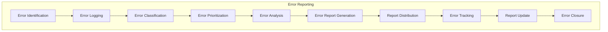

### Error Report Structure
| Section | Description | Content |
|------|-------|--------|
| **Basic Information** | Error identification info | - Error ID<br>- Error title<br>- Log date<br>- Reporter |
| **Error Description** | Detailed error description | - Error description<br>- Reproduction steps<br>- Expected behavior<br>- Actual behavior |
| **Error Environment** | Error occurrence environment info | - System version<br>- Browser<br>- OS<br>- Device |
| **Priority and Severity** | Priority and severity info | - Priority level<br>- Severity level<br>- System impact |
| **Attachments** | Attached files | - Logs<br>- Screenshots<br>- Videos<br>- Other files |
| **Error Status** | Error status info | - Current status<br>- Error owner<br>- Last update date |
| **Solutions** | Solution information | - Proposed solutions<br>- In-progress solution<br>- Final solution |

### Error Report Formats
| Format | Description | Use Case |
|-------|-------|--------|
| **HTML** | Error report in HTML format | Browser display |
| **PDF** | Error report in PDF format | Printing and archiving |
| **JSON** | Error report in JSON format | Automated processing |
| **CSV** | Error report in CSV format | Excel analysis |

### Error Reporting Flow Diagram
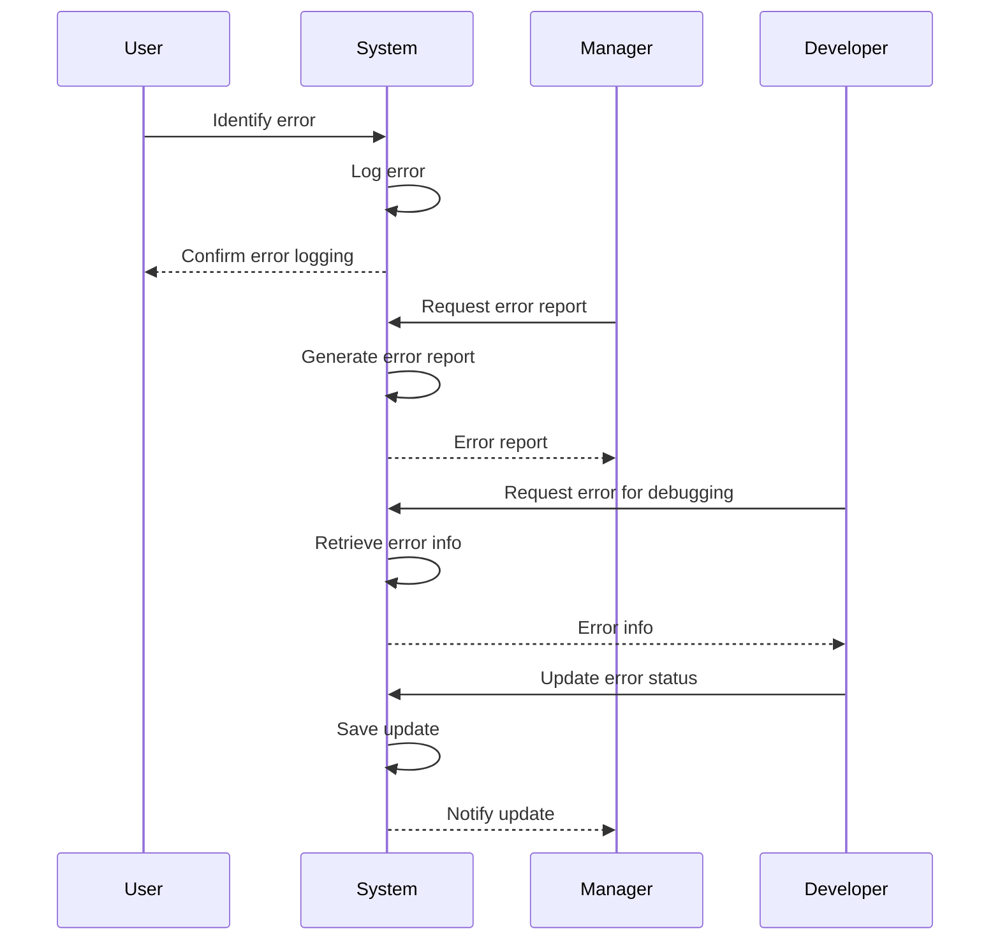

---

## Bug Management

### Bug Management Diagram
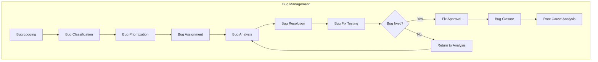

### Bug Lifecycle
| Stage | Description | Activities | Status |
|--------|-------|----------|--------|
| **New** | New bug logged | - Log bug<br>- Initial classification | New |
| **Confirmed** | Bug confirmed by team | - Confirm bug existence<br>- Prioritize | Confirmed |
| **In Analysis** | Bug under analysis | - Analyze bug<br>- Track root cause | In Analysis |
| **In Progress** | Solution being implemented | - Design solution<br>- Implement solution | In Progress |
| **In Testing** | Solution being tested | - Test solution<br>- Evaluate results | In Testing |
| **Fixed** | Bug fixed | - Confirm fix<br>- Document | Fixed |
| **Closed** | Bug closed | - Close bug report<br>- Root cause analysis | Closed |
| **Rejected** | Bug rejected | - Rejection reason<br>- Document | Rejected |

### Bug Management Strategies
| Strategy | Description | Advantages | Disadvantages |
|---------|-------|-------|-------|
| **Focused Testing** | Focus on testing modules with bugs | - Reduced fix time<br>- Improved module quality | - Requires more resources |
| **Comprehensive Testing** | Test entire system after bug fix | - Ensures no side effects<br>- Improves overall quality | - Time-consuming |
| **Regression Testing** | Retest fixed bugs | - Ensures permanent fix<br>- Prevents bug recurrence | - Requires automation |
| **Exploratory Testing** | Unplanned testing | - Discovers unexpected bugs<br>- Improves quality | - Time-consuming and unpredictable |

### Bug Management Flow Diagram
```mermaid
flowchart TD
    A[Bug Discovery] --> B{New bug?}
    B -->|Yes| C[Log Bug]
    B -->|No| D[Check Existing Bug]
    
    C --> E[Classify Bug]
    D --> E
    
    E --> F[Prioritize Bug]
    F --> G[Assign to Developer]
    G --> H[Analyze and Fix Bug]
    H --> I[Test Bug Fix]
    I --> J{Bug fixed?}
    
    J -->|Yes| K[Approve Fix]
    J -->|No| L[Return to Analysis]
    
    L --> H
    K --> M[Close Bug]
    M --> N[Root Cause Analysis]
    N --> O[Update Knowledge Base]
    O --> P[End]
```

---

## Continuous Improvement

### Continuous Improvement Diagram
```mermaid
graph TB
    subgraph "Continuous Improvement Cycle"
        A[Planning] --> B[Execution]
        B --> C[Check]
        C --> D[Act]
        D --> A
    end
    
    subgraph "Improvement Activities"
        E[Test Data Analysis]
        F[Trend Identification]
        G[Improvement Area Determination]
        H[Improvement Implementation]
        I[Effectiveness Evaluation]
    end
    
    A --> E
    B --> H
    C --> I
    D --> F
    
    E --> G
    F --> G
    G --> H
    H --> I
    I --> E
```

### Continuous Improvement Process
| Stage | Description | Activities | Outputs |
|--------|-------|----------|----------|
| **Planning** | Plan for improvement | - Analyze historical data<br>- Set improvement goals<br>- Plan activities | Improvement Plan |
| **Execution** | Execute improvement plan | - Implement changes<br>- Train team<br>- Update processes | Implemented Changes |
| **Check** | Review results | - Collect data<br>- Evaluate results<br>- Compare with goals | Evaluation Report |
| **Act** | Take corrective actions | - Determine corrective actions<br>- Implement actions<br>- Document | Corrective Actions |

### Continuous Improvement Metrics
| Metric | Description | Calculation Formula | Goal |
|-------|-------|----------------|------|
| **Bug Discovery Rate** | Number of bugs discovered per test hour | (Number of bugs) / (Test hours) | Decrease |
| **Bug Fix Time** | Average time to fix each bug | (Total fix time) / (Number of bugs) | Decrease |
| **Test Coverage** | Percentage of code covered by tests | (Tested lines) / (Total lines) * 100 | Increase |
| **Bug Regression Rate** | Percentage of bugs that reappear after fix | (Recurring bugs) / (Total bugs) * 100 | Decrease |
| **User Satisfaction** | User satisfaction level with system | (Satisfied users) / (Total users) * 100 | Increase |

### Continuous Improvement Flow Diagram
```mermaid
sequenceDiagram
    Team->>System: Execute tests
    System->>System: Collect test results
    System-->>Team: Results report
    
    Team->>System: Analyze results
    System->>System: Identify trends
    System-->>Team: Analysis report
    
    Team->>System: Plan improvements
    System->>System: Document plan
    System-->>Team: Improvement plan
    
    Team->>System: Implement improvements
    System->>System: Apply changes
    System-->>Team: Confirm changes
    
    Team->>System: Evaluate effectiveness
    System->>System: Collect new data
    System-->>Team: Evaluation report
```

---

## Conclusion

This document comprehensively described the testing and debugging processes and strategies for the GravityPM project management software. By implementing these processes, we can ensure the quality, stability, and performance of the system.

### Strengths of Testing and Debugging Strategy
- **Comprehensiveness**: Complete coverage of all testing and debugging aspects
- **Structured**: Structured and traceable processes
- **Tool-Oriented**: Use of modern and efficient tools
- **Quality Focus**: Emphasis on quality at all stages
- **Continuous Improvement**: Continuous improvement cycle for quality enhancement

### Testing and Debugging Challenges
- **System Complexity**: Complexity of GitHub integration
- **Constant Changes**: Need to adapt to continuous system changes
- **Resource Constraints**: Human resource and time limitations
- **Performance Testing**: Challenges of testing under heavy loads

### Future Path
- **Increased Automation**: Increase automated testing
- **Tool Improvement**: Use of more advanced tools
- **Intelligent Testing**: Use of AI in testing
- **Shift-Left Testing**: Integrate testing into development process

This document, with its detailed explanations, precise diagrams, and comprehensive tables, provides a clear framework for implementing and executing GravityPM's testing and debugging processes and will serve as a primary reference for technical and management teams.