# مستند رابط کاربری جامع سیستم مدیریت پروژه GravityPM (دوزبانه)

## فهرست مطالب

1. [مقدمه](#مقدمه)
2. [مرور کلی معماری رابط کاربری](#مرور-کلی-معماری-رابط-کاربری)
3. [پشتیبانی دوزبانه](#پشتیبانی-دوزبانه)
4. [صفحات اصلی سیستم](#صفحات-اصلی-سیستم)
   - [داشبورد](#داشبورد)
   - [پروژه‌ها](#پروژهها)
   - [وظایف](#وظایف)
   - [منابع](#منابع)
   - [گزارش‌ها](#گزارشها)
   - [تنظیمات](#تنظیمات)
5. [کامپوننت‌های رابط کاربری](#کامپوننت-های-رابط-کاربری)
6. [سیستم طراحی](#سیستم-طراحی)
7. [تجربه کاربری](#تجربه-کاربری)
8. [دسترسی‌پذیری](#دسترسیپذیری)
9. [طراحی واکنش‌گرا](#طراحی-واکنشگرا)
10. [یکپارچه‌سازی با GitHub](#یکپارچهسازی-با-github)
11. [نتیجه‌گیری](#نتیجهگیری)

---

## مقدمه

این مستند به‌طور جامع رابط کاربری سیستم مدیریت پروژه GravityPM را توصیف می‌کند. GravityPM یک سیستم جامع برای مدیریت پروژه‌های نرم‌افزاری است که با تمرکز بر خودکارسازی فرآیندها و یکپارچه‌سازی با GitHub طراحی شده است. ویژگی برجسته این سیستم، پشتیبانی کامل از دو زبان فارسی و انگلیسی است که به کاربران امکان می‌دهد به زبان دلخواه خود از سیستم استفاده کنند.

رابط کاربری این سیستم با استفاده از Next.js، TypeScript، Tailwind CSS و shadcn/ui پیاده‌سازی شده و تجربه کاربری یکپارچه و کارآمدی را برای مدیران پروژه، اعضای تیم و سایر ذینفعان فراهم می‌کند.

### اهداف طراحی رابط کاربری
- **سادگی و کارایی**: ایجاد رابط کاربری ساده و کارآمد که به کاربران اجازه می‌دهد به سرعت به اهداف خود برسند.
- **یکپارچگی**: ایجاد تجربه کاربری یکپارچه در تمام بخش‌های سیستم.
- **دسترسی‌پذیری**: طراحی رابط کاربری که برای تمام کاربران، از جمله افراد با نیازهای ویژه، قابل دسترسی باشد.
- **واکنش‌گرایی**: طراحی رابط کاربری که در دستگاه‌های مختلف (دسکتاپ، تبلت، موبایل) به درستی عمل کند.
- **پشتیبانی دوزبانه**: ارائه کامل رابط کاربری به زبان‌های فارسی و انگلیسی با امکان جابجایی آسان بین زبان‌ها.
- **یکپارچه‌سازی با GitHub**: نمایش یکپارچه‌سازی با GitHub در رابط کاربری به شکلی طبیعی و کارآمد.

---

## مرور کلی معماری رابط کاربری

### دیاگرام معماری رابط کاربری

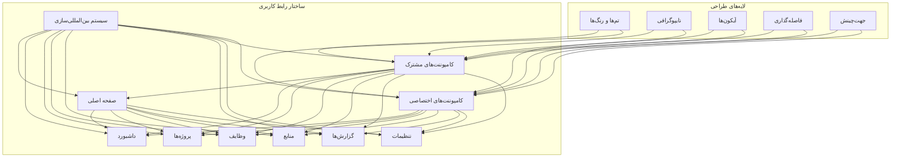

### توضیح معماری رابط کاربری

معماری رابط کاربری GravityPM بر اساس اصول طراحی مدرن و بهترین شیوه‌های تجربه کاربری طراحی شده است. این معماری از چند لایه اصلی تشکیل شده است:

1. **لایه صفحات**: شامل صفحات اصلی سیستم مانند داشبورد، پروژه‌ها، وظایف، منابع، گزارش‌ها و تنظیمات.
2. **لایه کامپوننت‌ها**: شامل کامپوننت‌های مشترک (مانند هدر، فوتر، منوی ناوبری) و کامپوننت‌های اختصاصی (مانند کارت پروژه، لیست وظایف).
3. **لایه طراحی**: شامل تم‌ها و رنگ‌ها، تایپوگرافی، آیکون‌ها و فاصله‌گذاری.
4. **لایه بین‌المللی‌سازی**: سیستم مدیریت زبان‌ها و جهت‌چینش که پشتیبانی از فارسی و انگلیسی را فراهم می‌کند.

### جدول اجزای اصلی رابط کاربری

| جزء | توضیح | نقش در رابط کاربری | پشتیبانی دوزبانه |
|------|-------|-------------------|-----------------|
| **صفحه اصلی** | نقطه ورود به سیستم | هدایت کاربر به بخش‌های مختلف | ✓ |
| **داشبورد** | نمایش نمای کلی از وضعیت پروژه‌ها | ارائه اطلاعات کلیدی و آمار | ✓ |
| **پروژه‌ها** | مدیریت پروژه‌ها | ایجاد، ویرایش، حذف و مشاهده پروژه‌ها | ✓ |
| **وظایف** | مدیریت وظایف پروژه‌ها | ایجاد، ویرایش، حذف و پیگیری وظایف | ✓ |
| **منابع** | مدیریت منابع پروژه‌ها | تخصیص و مدیریت منابع انسانی و غیرانسانی | ✓ |
| **گزارش‌ها** | ایجاد و مشاهده گزارش‌ها | ارائه گزارش‌های متنوع از پروژه‌ها | ✓ |
| **تنظیمات** | مدیریت تنظیمات سیستم و کاربر | پیکربندی سیستم و حساب کاربری | ✓ |

---

## پشتیبانی دوزبانه

### دیاگرام سیستم بین‌المللی‌سازی

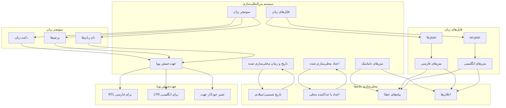

### جدول ویژگی‌های پشتیبانی دوزبانه

| ویژگی | توضیح | پیاده‌سازی |
|--------|-------|-------------|
| **سوئیچر زبان** | امکان تغییر زبان بین فارسی و انگلیسی | دکمه در هدر با پرچم‌ها و نام زبان‌ها |
| **جهت‌چینش پویا** | تغییر خودکار جهت چینش بر اساس زبان | RTL برای فارسی، LTR برای انگلیسی |
| **تاریخ محلی‌سازی شده** | نمایش تاریخ به فرمت محلی | شمسی برای فارسی، میلادی برای انگلیسی |
| **اعداد محلی‌سازی شده** | نمایش اعداد با فرمت محلی | فارسی: اعداد فارسی، انگلیسی: اعداد انگلیسی |
| **متن‌های استاتیک** | تمام متن‌های ثابت در دو زبان | استفاده از کلیدهای بین‌المللی‌سازی |
| **متن‌های داینامیک** | متن‌های تولید شده به صورت داینامیک | توابع محلی‌سازی برای متن‌های داینامیک |
| **پیام‌های خطا** | پیام‌های خطا به زبان انتخاب شده | پیام‌های خطا محلی‌سازی شده |
| **اعلان‌ها** | اعلان‌ها به زبان انتخاب شده | اعلان‌های محلی‌سازی شده |

### دیاگرام جریان تغییر زبان

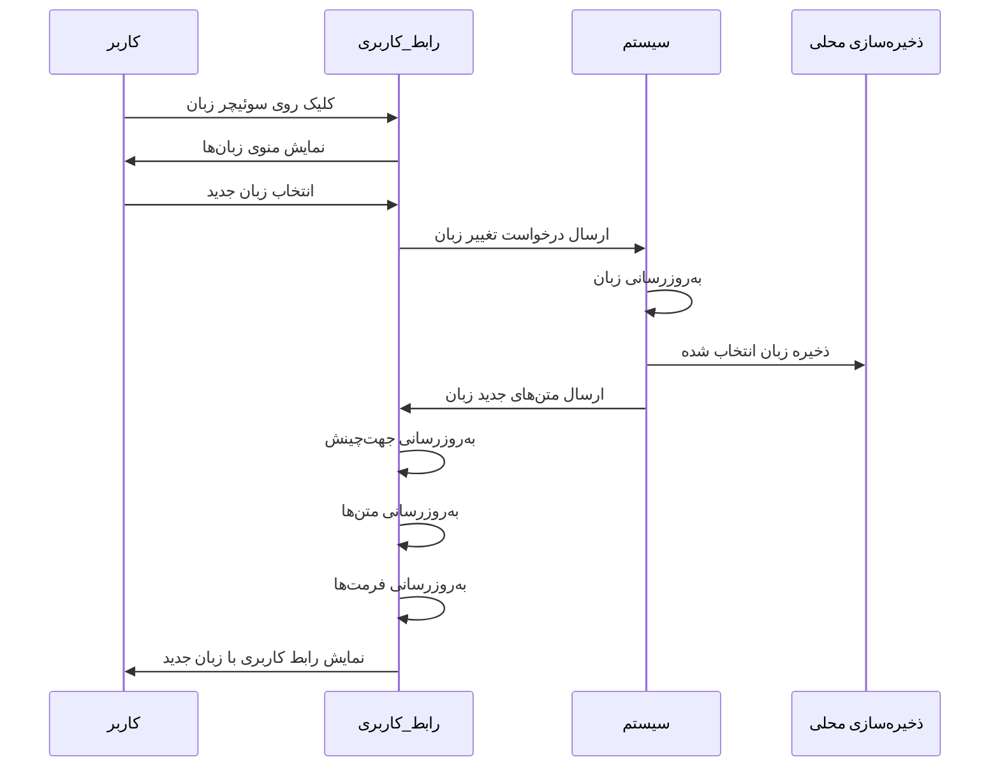

### دیاگرام تفاوت‌های طراحی بین زبان‌ها

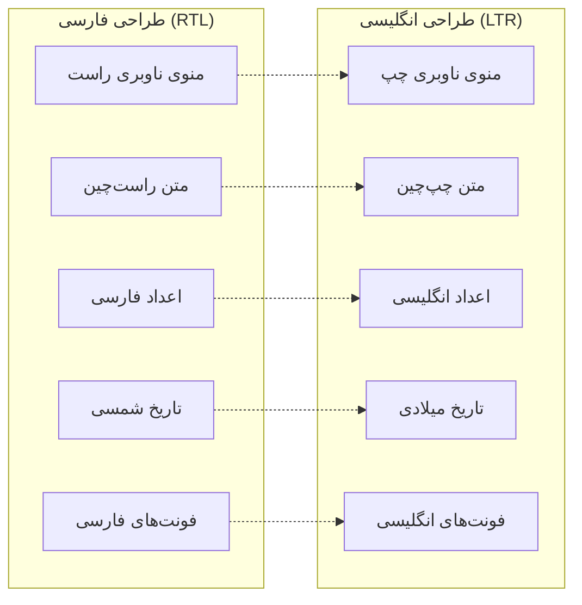

---

## صفحات اصلی سیستم

### داشبورد

#### توضیح کلی
داشبورد صفحه اصلی سیستم است که نمای کلی از وضعیت پروژه‌ها، فعالیت‌های اخیر و آمار کلیدی را نمایش می‌دهد. این صفحه به کاربران اجازه می‌دهد به سرعت با وضعیت پروژه‌ها آشنا شوند و به بخش‌های مورد نیاز خود دسترسی پیدا کنند. داشبورد به‌طور کامل از دو زبان فارسی و انگلیسی پشتیبانی می‌کند.

#### دیاگرام ساختار داشبورد

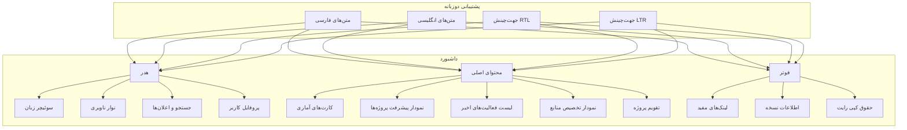

#### جدول اجزای داشبورد

| جزء | توضیح | عملکرد | داده‌های نمایشی | پشتیبانی دوزبانه |
|------|-------|--------|----------------|-----------------|
| **کارت‌های آماری** | نمایش آمار کلیدی پروژه‌ها | ارائه نمای کلی از وضعیت پروژه‌ها | تعداد پروژه‌ها، وظایف، منابع، پیشرفت کلی | ✓ |
| **نمودار پیشرفت پروژه‌ها** | نمایش پیشرفت پروژه‌ها به صورت گرافیکی | نمایش پیشرفت پروژه‌ها در زمان | نام پروژه، درصد پیشرفت، وضعیت | ✓ |
| **لیست فعالیت‌های اخیر** | نمایش فعالیت‌های اخیر سیستم | نمایش آخرین تغییرات و فعالیت‌ها | نوع فعالیت، کاربر، زمان، توضیح | ✓ |
| **نمودار تخصیص منابع** | نمایش تخصیص منابع به پروژه‌ها | نمایش نحوه تخصیص منابع | نام منبع، پروژه، درصد تخصیص | ✓ |
| **تقویم پروژه** | نمایش تقویم پروژه‌ها | نمایش رویدادها و ضرب‌الاجل‌ها | تاریخ، رویداد، پروژه مرتبط | ✓ |
| **سوئیچر زبان** | امکان تغییر زبان بین فارسی و انگلیسی | تغییر زبان رابط کاربری | پرچم‌ها، نام زبان‌ها | ✓ |

#### دیاگرام جریان کاربری داشبورد

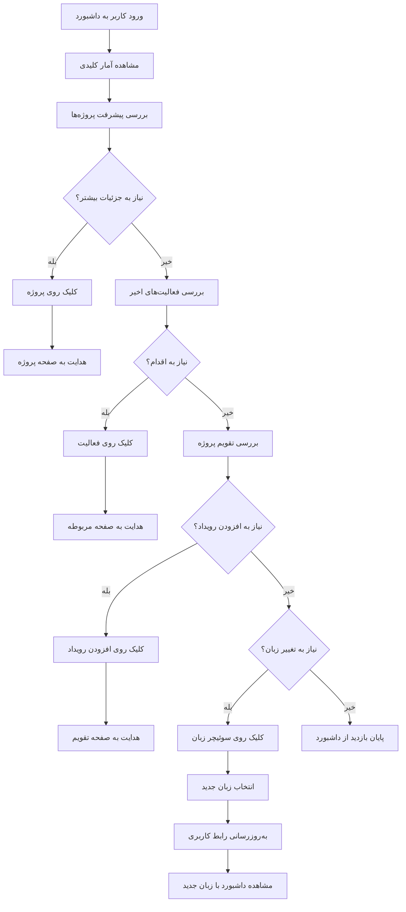

### پروژه‌ها

#### توضیح کلی
صفحه پروژه‌ها به کاربران اجازه می‌دهد پروژه‌های جدید ایجاد کنند، پروژه‌های موجود را ویرایش یا حذف کنند و جزئیات پروژه‌ها را مشاهده کنند. این صفحه شامل لیست پروژه‌ها، فیلترها و امکان جستجو است و به‌طور کامل از دو زبان فارسی و انگلیسی پشتیبانی می‌کند.

#### دیاگرام ساختار صفحه پروژه‌ها

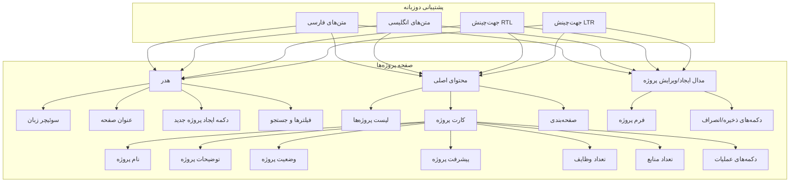

#### جدول اجزای صفحه پروژه‌ها

| جزء | توضیح | عملکرد | داده‌های نمایشی | پشتیبانی دوزبانه |
|------|-------|--------|----------------|-----------------|
| **لیست پروژه‌ها** | نمایش تمام پروژه‌ها | ارائه نمای کلی از پروژه‌ها | نام، توضیحات، وضعیت، پیشرفت | ✓ |
| **کارت پروژه** | نمایش اطلاعات هر پروژه | ارائه جزئیات پروژه به صورت بصری | نام، توضیحات، وضعیت، پیشرفت، تعداد وظایف، تعداد منابع | ✓ |
| **فیلترها و جستجو** | فیلتر کردن و جستجوی پروژه‌ها | کمک به یافتن پروژه‌های مورد نظر | نام پروژه، وضعیت، تاریخ | ✓ |
| **صفحه‌بندی** | مدیریت تعداد پروژه‌های نمایش داده شده | کنترل تعداد پروژه‌ها در هر صفحه | تعداد کل، تعداد در هر صفحه، شماره صفحات | ✓ |
| **مدال ایجاد/ویرایش** | فرم ایجاد یا ویرایش پروژه | ایجاد یا ویرایش اطلاعات پروژه | نام، توضیحات، تاریخ شروع، تاریخ پایان، وضعیت | ✓ |
| **سوئیچر زبان** | امکان تغییر زبان بین فارسی و انگلیسی | تغییر زبان رابط کاربری | پرچم‌ها، نام زبان‌ها | ✓ |

#### دیاگرام جریان کاربری صفحه پروژه‌ها

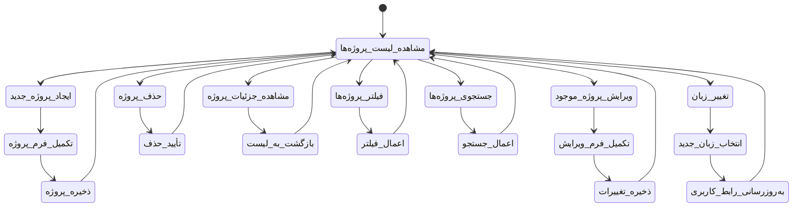

### وظایف

#### توضیح کلی
صفحه وظایف به کاربران اجازه می‌دهد وظایف جدید ایجاد کنند، وظایف موجود را ویرایش یا حذف کنند و وضعیت وظایف را پیگیری کنند. این صفحه شامل لیست وظایف، فیلترها و امکان جستجو است و از دو دیدگاه لیست و کانبان پشتیبانی می‌کند. صفحه وظایف به‌طور کامل از دو زبان فارسی و انگلیسی پشتیبانی می‌کند.

#### دیاگرام ساختار صفحه وظایف

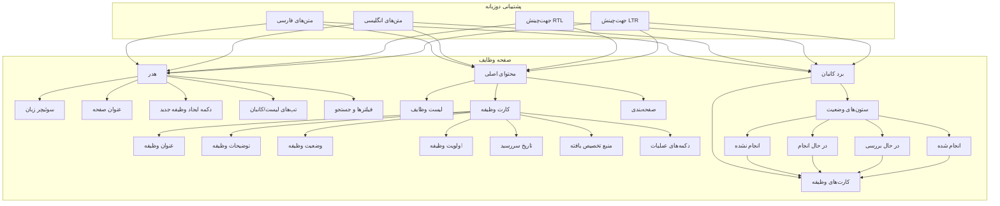

#### جدول اجزای صفحه وظایف

| جزء | توضیح | عملکرد | داده‌های نمایشی | پشتیبانی دوزبانه |
|------|-------|--------|----------------|-----------------|
| **لیست وظایف** | نمایش تمام وظایف | ارائه نمای کلی از وظایف | عنوان، توضیحات، وضعیت، اولویت، تاریخ سررسید | ✓ |
| **کارت وظیفه** | نمایش اطلاعات هر وظیفه | ارائه جزئیات وظیفه به صورت بصری | عنوان، توضیحات، وضعیت، اولویت، تاریخ سررسید، منبع تخصیص یافته | ✓ |
| **برد کانبان** | نمایش وظایف در ستون‌های وضعیت مختلف | ارائه دیدگاه بصری از وضعیت وظایف | ستون‌های وضعیت (انجام نشده، در حال انجام، در حال بررسی، انجام شده) | ✓ |
| **فیلترها و جستجو** | فیلتر کردن و جستجوی وظایف | کمک به یافتن وظایف مورد نظر | عنوان، وضعیت، اولویت، تاریخ، منبع | ✓ |
| **تب‌های لیست/کانبان** | تغییر بین دیدگاه لیست و کانبان | ارائه انعطاف‌پذیری در نمایش وظایف | - | ✓ |
| **سوئیچر زبان** | امکان تغییر زبان بین فارسی و انگلیسی | تغییر زبان رابط کاربری | پرچم‌ها، نام زبان‌ها | ✓ |

#### دیاگرام جریان کاربری صفحه وظایف

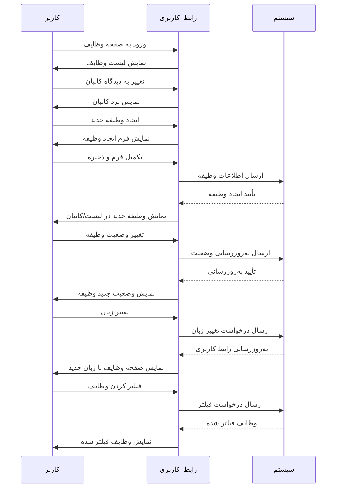

### منابع

#### توضیح کلی
صفحه منابع به کاربران اجازه می‌دهد منابع جدید ایجاد کنند، منابع موجود را ویرایش یا حذف کنند و منابع را به وظایف تخصیص دهند. این صفحه شامل لیست منابع، فیلترها و امکان جستجو است و به‌طور کامل از دو زبان فارسی و انگلیسی پشتیبانی می‌کند.

#### دیاگرام ساختار صفحه منابع

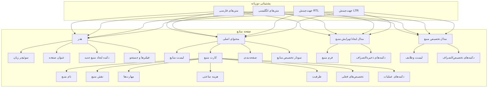

#### جدول اجزای صفحه منابع

| جزء | توضیح | عملکرد | داده‌های نمایشی | پشتیبانی دوزبانه |
|------|-------|--------|----------------|-----------------|
| **لیست منابع** | نمایش تمام منابع | ارائه نمای کلی از منابع | نام، نقش، مهارت‌ها، هزینه ساعتی، ظرفیت | ✓ |
| **کارت منبع** | نمایش اطلاعات هر منبع | ارائه جزئیات منبع به صورت بصری | نام، نقش، مهارت‌ها، هزینه ساعتی، ظرفیت، تخصیص‌های فعلی | ✓ |
| **نمودار تخصیص منابع** | نمایش تخصیص منابع به پروژه‌ها | ارائه دیدگاه بصری از تخصیص منابع | نام منبع، پروژه، درصد تخصیص | ✓ |
| **فیلترها و جستجو** | فیلتر کردن و جستجوی منابع | کمک به یافتن منابع مورد نظر | نام، نقش، مهارت‌ها | ✓ |
| **مدال ایجاد/ویرایش منبع** | فرم ایجاد یا ویرایش منبع | ایجاد یا ویرایش اطلاعات منبع | نام، نقش، مهارت‌ها، هزینه ساعتی، ظرفیت | ✓ |
| **مدال تخصیص منبع** | فرم تخصیص منبع به وظایف | تخصیص منبع به وظایف | لیست وظایف، دکمه‌های تخصیص | ✓ |
| **سوئیچر زبان** | امکان تغییر زبان بین فارسی و انگلیسی | تغییر زبان رابط کاربری | پرچم‌ها، نام زبان‌ها | ✓ |

#### دیاگرام جریان کاربری صفحه منابع

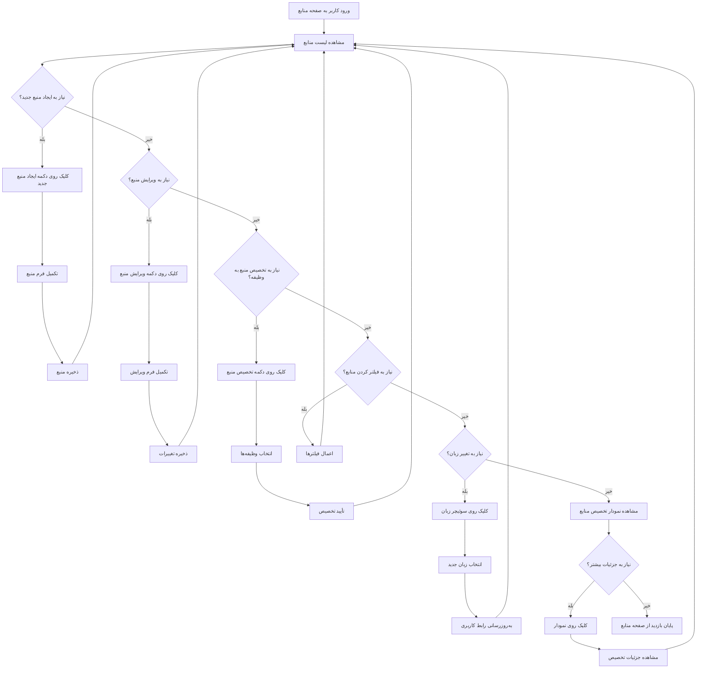

### گزارش‌ها

#### توضیح کلی
صفحه گزارش‌ها به کاربران اجازه می‌دهد گزارش‌های متنوعی از پروژه‌ها ایجاد کنند، گزارش‌های موجود را مشاهده کنند و گزارش‌ها را صادر کنند. این صفحه شامل لیست گزارش‌ها، فیلترها و امکان جستجو است و به‌طور کامل از دو زبان فارسی و انگلیسی پشتیبانی می‌کند.

#### دیاگرام ساختار صفحه گزارش‌ها

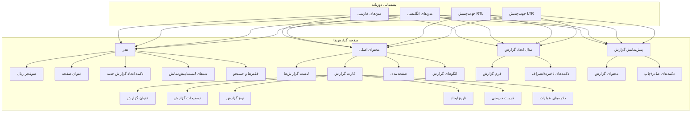

#### جدول اجزای صفحه گزارش‌ها

| جزء | توضیح | عملکرد | داده‌های نمایشی | پشتیبانی دوزبانه |
|------|-------|--------|----------------|-----------------|
| **لیست گزارش‌ها** | نمایش تمام گزارش‌ها | ارائه نمای کلی از گزارش‌ها | عنوان، توضیحات، نوع، تاریخ ایجاد، فرمت خروجی | ✓ |
| **کارت گزارش** | نمایش اطلاعات هر گزارش | ارائه جزئیات گزارش به صورت بصری | عنوان، توضیحات، نوع، تاریخ ایجاد، فرمت خروجی | ✓ |
| **الگوهای گزارش** | نمایش الگوهای گزارش آماده | ارائه گزارش‌های آماده برای استفاده | نام الگو، توضیحات، نوع | ✓ |
| **فیلترها و جستجو** | فیلتر کردن و جستجوی گزارش‌ها | کمک به یافتن گزارش‌های مورد نظر | عنوان، نوع، تاریخ | ✓ |
| **مدال ایجاد گزارش** | فرم ایجاد گزارش جدید | ایجاد گزارش جدید با پارامترهای دلخواه | نوع گزارش، پارامترها، فرمت خروجی | ✓ |
| **پیش‌نمایش گزارش** | نمایش پیش‌نمایش گزارش قبل از صادر | نمایش محتوای گزارش قبل از صادر | محتوای گزارش، دکمه‌های صادر/چاپ | ✓ |
| **سوئیچر زبان** | امکان تغییر زبان بین فارسی و انگلیسی | تغییر زبان رابط کاربری | پرچم‌ها، نام زبان‌ها | ✓ |

#### دیاگرام جریان کاربری صفحه گزارش‌ها

```mermaid
stateDiagram-v2
    [*] --> مشاهده_لیست_گزارش‌ها
    مشاهده_لیست_گزارش‌ها --> ایجاد_گزارش_جدید
    مشاهده_لیست_گزارش‌ها --> مشاهده_جزئیات_گزارش
    مشاهده_لیست_گزارش‌ها --> صادر_گزارش
    مشاهده_لیست_گزارش‌ها --> حذف_گزارش
    مشاهده_لیست_گزارش‌ها --> فیلتر_گزارش‌ها
    مشاهده_لیست_گزارش‌ها --> جستجوی_گزارش‌ها
    مشاهده_لیست_گزارش‌ها --> استفاده_از_الگو
    مشاهده_لیست_گزارش‌ها --> تغییر_زبان
    
    ایجاد_گزارش_جدید --> انتخاب_نوع_گزارش
    انتخاب_نوع_گزارش --> تنظیم_پارامترها
    تنظیم_پارامترها --> انتخاب_فرمت_خروجی
    انتخاب_فرمت_خروجی --> پیش‌نمایش_گزارش
    پیش‌نمایش_گزارش --> ذخیره_گزارش
    ذخیره_گزارش --> مشاهده_لیست_گزارش‌ها
    
    مشاهده_جزئیات_گزارش --> بازگشت_به_لیست
    بازگشت_به_لیست --> مشاهده_لیست_گزارش‌ها
    
    صادر_گزارش --> انتخاب_فرمت_صادر
    انتخاب_فرمت_صادر -> دانلود_گزارش
    دانلود_گزارش --> مشاهده_لیست_گزارش‌ها
    
    حذف_گزارش --> تأیید_حذف
    تأیید_حذف --> مشاهده_لیست_گزارش‌ها
    
    فیلتر_گزارش‌ها --> اعمال_فیلتر
    اعمال_فیلتر --> مشاهده_لیست_گزارش‌ها
    
    جستجوی_گزارش‌ها --> اعمال_جستجو
    اعمال_جستجو --> مشاهده_لیست_گزارش‌ها
    
    استفاده_از_الگو --> انتخاب_الگو
    انتخاب_الگو --> تنظیم_پارامترهای_الگو
    تنظیم_پارامترهای_الگو --> پیش‌نمایش_گزارش
    پیش‌نمایش_گزارش --> ذخیره_گزارش
    
    تغییر_زبان --> انتخاب_زبان_جدید
    انتخاب_زبان_جدید --> به‌روزرسانی_رابط_کاربری
    به‌روزرسانی_رابط_کاربری --> مشاهده_لیست_گزارش‌ها
```

### تنظیمات

#### توضیح کلی
صفحه تنظیمات به کاربران اجازه می‌دهد تنظیمات سیستم و حساب کاربری خود را مدیریت کنند. این صفحه شامل بخش‌های مختلفی مانند تنظیمات عمومی، یکپارچه‌سازی با GitHub، اعلان‌ها و امنیت است و به‌طور کامل از دو زبان فارسی و انگلیسی پشتیبانی می‌کند.

#### دیاگرام ساختار صفحه تنظیمات

```mermaid
graph TB
    subgraph "صفحه تنظیمات"
        A[هدر] --> B[سوئیچر زبان]
        A --> C[عنوان صفحه]
        A --> D[تب‌های تنظیمات]
        
        D --> E[تنظیمات عمومی]
        D --> F[یکپارچه‌سازی GitHub]
        D --> G[اعلان‌ها]
        D --> H[امنیت]
        
        I[محتوای اصلی] --> J[فرم تنظیمات]
        I --> K[فیلدهای ورودی]
        I --> L[دکمه‌های ذخیره/انصراف]
        
        M[تنظیمات عمومی] --> N[زبان]
        M --> O[منطقه زمانی]
        M --> P[حالت تاریک/روشن]
        
        Q[یکپارچه‌سازی GitHub] --> R[مخزن پیش‌فرض]
        Q --> S[Webhook URL]
        Q --> T[توکن دسترسی]
        
        U[اعلان‌ها] --> V[اعلان‌های ایمیل]
        U --> W[اعلان‌های push]
        U --> X[اعلان‌های درون‌سیستمی]
        
        Y[امنیت] --> Z[تغییر رمز عبور]
        Y --> AA[احراز هویت دو مرحله‌ای]
        Y --> AB[تاریخچه ورود]
    end
    
    subgraph "پشتیبانی دوزبانه"
        AC[متن‌های فارسی]
        AD[متن‌های انگلیسی]
        AE[جهت‌چینش RTL]
        AF[جهت‌چینش LTR]
        
        AC --> A
        AC --> I
        AC --> M
        AC --> Q
        AC --> U
        AC --> Y
        
        AD --> A
        AD --> I
        AD --> M
        AD --> Q
        AD --> U
        AD --> Y
        
        AE --> A
        AE --> I
        AE --> M
        AE --> Q
        AE --> U
        AE --> Y
        
        AF --> A
        AF --> I
        AF --> M
        AF --> Q
        AF --> U
        AF --> Y
    end
```

#### جدول اجزای صفحه تنظیمات

| جزء | توضیح | عملکرد | داده‌های نمایشی | پشتیبانی دوزبانه |
|------|-------|--------|----------------|-----------------|
| **تب‌های تنظیمات** | دسته‌بندی تنظیمات | سازماندهی تنظیمات در دسته‌های مختلف | تنظیمات عمومی، یکپارچه‌سازی GitHub، اعلان‌ها، امنیت | ✓ |
| **تنظیمات عمومی** | تنظیمات اصلی سیستم | مدیریت تنظیمات پایه سیستم | زبان، منطقه زمانی، حالت تاریک/روشن | ✓ |
| **یکپارچه‌سازی GitHub** | تنظیمات اتصال به GitHub | مدیریت تنظیمات یکپارچه‌سازی با GitHub | مخزن پیش‌فرض، Webhook URL، توکن دسترسی | ✓ |
| **اعلان‌ها** | تنظیمات اعلان‌ها | مدیریت نحوه دریافت اعلان‌ها | اعلان‌های ایمیل، اعلان‌های push، اعلان‌های درون‌سیستمی | ✓ |
| **امنیت** | تنظیمات امنیتی | مدیریت تنظیمات امنیتی حساب کاربری | تغییر رمز عبور، احراز هویت دو مرحله‌ای، تاریخچه ورود | ✓ |
| **سوئیچر زبان** | امکان تغییر زبان بین فارسی و انگلیسی | تغییر زبان رابط کاربری | پرچم‌ها، نام زبان‌ها | ✓ |

#### دیاگرام جریان کاربری صفحه تنظیمات

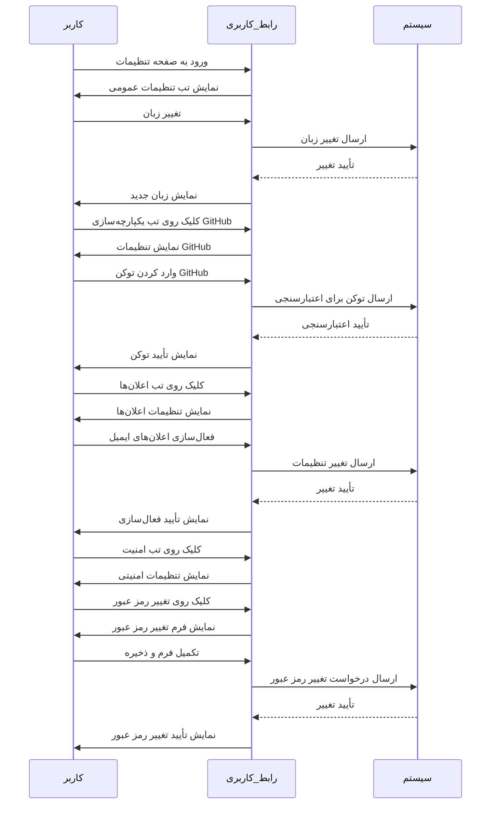

---

## کامپوننت‌های رابط کاربری

### دیاگرام سلسله مراتب کامپوننت‌ها

```mermaid
graph TB
    subgraph "کامپوننت‌های اصلی"
        A[کامپوننت‌های چیدمان]
        B[کامپوننت‌های ناوبری]
        C[کامپوننت‌های فرم]
        D[کامپوننت‌های نمایش داده]
        E[کامپوننت‌های بازخورد]
    end
    
    subgraph "کامپوننت‌های چیدمان"
        A --> F[کانتینر]
        A --> G[گرید]
        A --> H[کارت]
        A --> I[جعبه]
    end
    
    subgraph "کامپوننت‌های ناوبری"
        B --> J[هدر]
        B --> K[فوتر]
        B --> L[منوی کناری]
        B --> M[نان‌برادکرومب]
        B --> N[تب‌ها]
        B --> O[سوئیچر زبان]
    end
    
    subgraph "کامپوننت‌های فرم"
        C --> P[ورودی متن]
        C --> Q[انتخابگر]
        C --> R[چک‌باکس]
        C --> S[رادیو]
        C --> T[دکمه]
        C --> U[سوییچ]
    end
    
    subgraph "کامپوننت‌های نمایش داده"
        D --> V[جدول]
        D --> W[لیست]
        D --> X[بج]
        D --> Y[آواتار]
        D --> Z[پیشرفت]
    end
    
    subgraph "کامپوننت‌های بازخورد"
        E --> AA[هشدار]
        E --> AB[مدال]
        E --> AC[ابزارکیت]
        E --> AD[نوتیفیکیشن]
        E --> AE[تولتیپ]
    end
    
    subgraph "پشتیبانی دوزبانه"
        AF[متن‌های دوزبانه]
        AG[جهت‌چینش پویا]
        AH[تاریخ محلی‌سازی شده]
        AI[اعداد محلی‌سازی شده]
        
        AF --> A
        AF --> B
        AF --> C
        AF --> D
        AF --> E
        
        AG --> A
        AG --> B
        AG --> C
        AG --> D
        AG --> E
        
        AH --> A
        AH --> B
        AH --> C
        AH --> D
        AH --> E
        
        AI --> A
        AI --> B
        AI --> C
        AI --> D
        AI --> E
    end
```

### جدول کامپوننت‌های اصلی رابط کاربری

| کامپوننت | توضیح | کاربرد | ویژگی‌ها | پشتیبانی دوزبانه |
|-----------|-------|--------|----------|-----------------|
| **کانتینر** | ظرف اصلی برای محتوا | نگهداری و سازماندهی محتوا | حداکثر عرض، padding، margin | ✓ |
| **گرید** | سیستم گریدبندی برای چیدمان | ایجاد چیدمان‌های پیچیده | ستون‌های قابل تنظیم، واکنش‌گرا | ✓ |
| **کارت** | کارت برای نمایش محتوا | نمایش اطلاعات به صورت گروه‌بندی شده | سربرگ، محتوا، فوتر، سایه | ✓ |
| **جعبه** | جعبه برای محتوا | ایجاد فضای مشخص برای محتوا | padding، border، background | ✓ |
| **هدر** | سربرگ صفحه | نمایش عنوان و اقدامات صفحه | عنوان، دکمه‌های عملیات، منوی کاربر | ✓ |
| **فوتر** | پایین صفحه | نمایش اطلاعات پایین صفحه | لینک‌ها، اطلاعات کپی رایت | ✓ |
| **منوی کناری** | منوی ناوبری کناری | دسترسی به بخش‌های مختلف سیستم | لینک‌ها، آیکون‌ها، برچسب‌ها | ✓ |
| **نان‌برادکرومب** | مسیر پیمایش | نمایش مسیر فعلی | لینک‌ها، جداکننده | ✓ |
| **تب‌ها** | تب‌ها برای دسته‌بندی محتوا | سازماندهی محتوا در تب‌ها | عنوان، محتوا، فعال/غیرفعال | ✓ |
| **سوئیچر زبان** | سوئیچر برای تغییر زبان | تغییر زبان بین فارسی و انگلیسی | پرچم‌ها، نام زبان‌ها | ✓ |
| **ورودی متن** | ورودی متن | دریافت متن از کاربر | placeholder، validation، آیکون | ✓ |
| **انتخابگر** | انتخابگر گزینه‌ها | انتخاب یک گزینه از لیست | گزینه‌ها، placeholder، جستجو | ✓ |
| **چک‌باکس** | چک‌باکس برای انتخاب چندگانه | انتخاب چند گزینه | برچسب، وضعیت انتخاب | ✓ |
| **رادیو** | دکمه رادیویی برای انتخاب تکی | انتخاب یک گزینه | برچسب، وضعیت انتخاب | ✓ |
| **دکمه** | دکمه برای اقدامات | انجام اقدامات | متن، آیکون، نوع (اولیه، ثانویه، و...) | ✓ |
| **سوییچ** | سوییچ برای روشن/خاموش کردن | تغییر وضعیت دو حالتی | برچسب، وضعیت | ✓ |
| **جدول** | جدول برای نمایش داده‌ها | نمایش داده‌ها به صورت ساختاریافته | ستون‌ها، سطرها، مرتب‌سازی | ✓ |
| **لیست** | لیست برای نمایش آیتم‌ها | نمایش آیتم‌ها به صورت خطی | آیتم‌ها، آیکون‌ها، اقدامات | ✓ |
| **بج** | برچسب برای نمایش وضعیت | نمایش وضعیت یا دسته | متن، رنگ، شکل | ✓ |
| **آواتار** | آواتار برای نمایش کاربر | نمایش تصویر یا حروف اول کاربر | تصویر، حروف اول، سایز | ✓ |
| **پیشرفت** | نوار پیشرفت | نمایش پیشرفت یک فرآیند | درصد، رنگ، متحرک | ✓ |
| **هشدار** | هشدار برای نمایش پیام | نمایش پیام‌های مهم | نوع (موفقیت، خطا، هشدار، اطلاعات) | ✓ |
| **مدال** | پنجره مودال | نمایش محتوا در پنجره بازشو | عنوان، محتوا، دکمه‌ها | ✓ |
| **ابزارکیت** | ابزارکیت برای نمایش اطلاعات | نمایش اطلاعات خلاصه | عنوان، محتوا، آیکون | ✓ |
| **نوتیفیکیشن** | اعلان برای نمایش پیام | نمایش پیام‌های کوتاه | عنوان، محتوا، نوع | ✓ |
| **تولتیپ** | راهنمای ابزار | نمایش راهنمای کوتاه | متن، موقعیت | ✓ |

### دیاگرام جریان تعامل کامپوننت‌ها

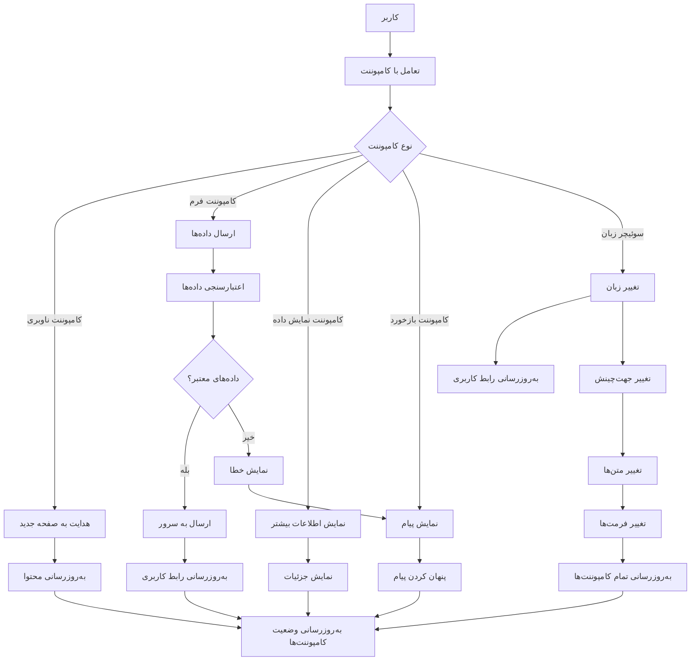

---

## سیستم طراحی

### دیاگرام سیستم طراحی

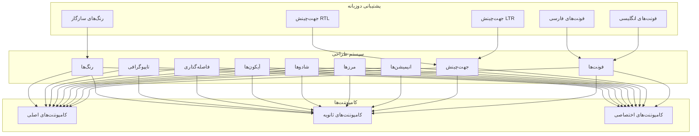

### جدول پالت رنگی

| رنگ | کد هگز | کاربرد | معنا | سازگاری با زبان |
|------|--------|--------|------|-----------------|
| **اصلی** | #4F46E5 | دکمه‌های اصلی، لینک‌ها، هایلایت | اعتماد، حرفه‌ای | ✓ |
| **ثانویه** | #10B981 | دکمه‌های ثانویه، موفقیت | موفقیت، مثبت | ✓ |
| **خطر** | #EF4444 | خطاها، هشدارها، خطر | خطر، خطا | ✓ |
| **هشدار** | #F59E0B | هشدارها، توجه | توجه، هشدار | ✓ |
| **اطلاعات** | #3B82F6 | اطلاعات، راهنما | اطلاعات، راهنمایی | ✓ |
| **تیره** | #1F2937 | متن اصلی، پس‌زمینه‌های تیره | حرفه‌ای، جدی | ✓ |
| **روشن** | #F9FAFB | پس‌زمینه، متن تیره روی پس‌زمینه روشن | سادگی، خلوت | ✓ |
| **خاکستری** | #6B7280 | متن ثانویه، مرزها | خنثی، کم‌اهمیت | ✓ |
| **سفید** | #FFFFFF | پس‌زمینه، متن تیره روی پس‌زمینه سفید | خلوت، سادگی | ✓ |

### جدول تایپوگرافی

| سایز | وزن | ارتفاع خط | کاربرد | پشتیبانی دوزبانه |
|------|------|-----------|--------|-----------------|
| **12px** | 400 (رگولار) | 1.5 | کپشن، برچسب‌های کوچک | ✓ |
| **14px** | 400 (رگولار) | 1.5 | متن بدنه، توضیحات | ✓ |
| **14px** | 500 (مدیوم) | 1.5 | برچسب‌ها، لینک‌ها | ✓ |
| **16px** | 400 (رگولار) | 1.5 | پاراگراف، توضیحات طولانی | ✓ |
| **16px** | 500 (مدیوم) | 1.5 | عناوین کوچک، برچسب‌های مهم | ✓ |
| **18px** | 500 (مدیوم) | 1.5 | عناوین فرعی | ✓ |
| **20px** | 600 (سemi‌بولد) | 1.5 | عناوین کارت‌ها | ✓ |
| **24px** | 600 (سemi‌بولد) | 1.25 | عناوین صفحه‌ها | ✓ |
| **32px** | 700 (بولد) | 1.25 | عناوین اصلی | ✓ |

### جدول فونت‌ها

| زبان | فونت اصلی | فونت ثانویه | کاربرد |
|------|-----------|-------------|--------|
| **فارسی** | Vazirmatn | Samim | متن اصلی، عناوین |
| **انگلیسی** | Inter | Roboto | متن اصلی، عناوین |

### جدول فاصله‌گذاری

| اندازه | پیکسل | rem | کاربرد | پشتیبانی دوزبانه |
|--------|--------|-----|--------|-----------------|
| **XS** | 4px | 0.25rem | فاصله‌های بسیار کوچک | ✓ |
| **SM** | 8px | 0.5rem | فاصله‌های کوچک | ✓ |
| **MD** | 16px | 1rem | فاصله‌های استاندارد | ✓ |
| **LG** | 24px | 1.5rem | فاصله‌های بزرگ | ✓ |
| **XL** | 32px | 2rem | فاصله‌های بسیار بزرگ | ✓ |
| **2XL** | 48px | 3rem | فاصله‌های بزرگتر | ✓ |
| **3XL** | 64px | 4rem | فاصله‌های بسیار بزرگتر | ✓ |

### دیاگرام استفاده از سیستم طراحی در کامپوننت‌ها

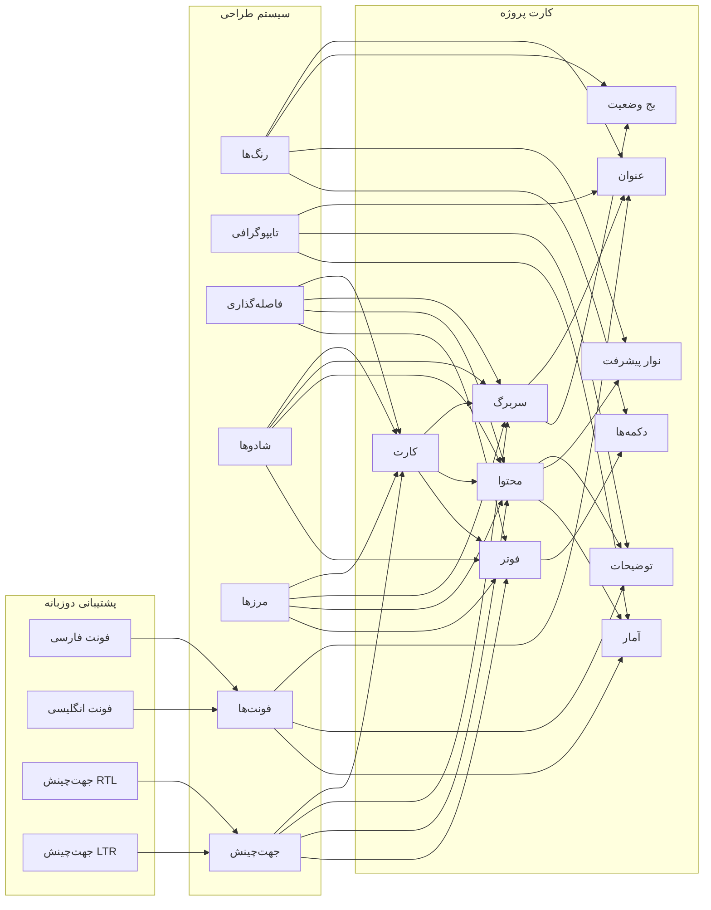

---

## تجربه کاربری

### دیاگرام تجربه کاربری

```mermaid
graph TB
    subgraph "تجربه کاربری"
        A[سادگی]
        B[ثبات]
        C[دسترسی‌پذیری]
        D[بازخورد]
        E[کارایی]
        F[یادگیری]
        G[پشتیبانی دوزبانه]
    end
    
    subgraph "اصول طراحی"
        H[تمرکز بر کاربر]
        I[وضوح]
        J[انعطاف‌پذیری]
        K[پیش‌بینی]
        L[بازیابی]
        M[محلی‌سازی]
    end
    
    subgraph "الگوهای تعامل"
        N[جریان کار]
        O[ناوبری]
        P[ورودی داده]
        Q[نمایش اطلاعات]
        R[خطاها]
        S[تغییر زبان]
    end
    
    A --> H
    B --> H
    C --> H
    D --> H
    E --> H
    F --> H
    G --> H
    
    H --> I
    H --> J
    H --> K
    H --> L
    H --> M
    
    I --> N
    J --> N
    K --> N
    L --> N
    M --> N
    
    N --> O
    N --> P
    N --> Q
    N --> R
    N --> S
```

### جدول اصول تجربه کاربری

| اصل | توضیح | کاربرد در GravityPM | پشتیبانی دوزبانه |
|------|-------|-------------------|-----------------|
| **سادگی** | رابط کاربری باید ساده و قابل فهم باشد | استفاده از طراحی مینیمال، حذف عناصر غیرضروری | ✓ |
| **ثبات** | عناصر رابط کاربری باید در تمام صفحات ثابت باشند | استفاده از سیستم طراحی یکپارچه در تمام صفحات | ✓ |
| **دسترسی‌پذیری** | رابط کاربری باید برای تمام کاربران قابل دسترسی باشد | رعایت استانداردهای WCAG، پشتیبانی از صفحه‌خوان‌ها | ✓ |
| **بازخورد** | سیستم باید به اقدامات کاربر بازخورد دهد | نمایش پیام‌های موفقیت/خطا، بارگذاری، پیشرفت | ✓ |
| **کارایی** | کاربر باید بتواند به سرعت به اهداف خود برسد | بهینه‌سازی جریان کار، کاهش کلیک‌ها، میان‌برها | ✓ |
| **یادگیری** | رابط کاربری باید قابل یادگیری باشد | استفاده از الگوهای آشنا، راهنمایی‌ها، آموزش | ✓ |
| **پشتیبانی دوزبانه** | رابط کاربری باید از چند زبان پشتیبانی کند | ارائه کامل رابط کاربری به زبان‌های فارسی و انگلیسی | ✓ |

### جدول الگوهای تعامل

| الگو | توضیح | مثال در GravityPM | پشتیبانی دوزبانه |
|------|-------|-------------------|-----------------|
| **جریان کار** | توالی اقداماتی که کاربر برای رسیدن به هدف انجام می‌دهد | جریان ایجاد پروژه: فرم پروژه → تأیید → ایجاد | ✓ |
| **ناوبری** | روش حرکت کاربر در سیستم | منوی کناری، نان‌برادکرومب، لینک‌ها | ✓ |
| **ورودی داده** | روش ورود اطلاعات به سیستم | فرم‌ها، انتخابگرها، چک‌باکس‌ها | ✓ |
| **نمایش اطلاعات** | روش نمایش اطلاعات به کاربر | جداول، لیست‌ها، کارت‌ها، نمودارها | ✓ |
| **خطاها** | روش مدیریت خطاها | پیام‌های خطا، اعتبارسنجی فرم، راهنمایی | ✓ |
| **تغییر زبان** | روش تغییر زبان رابط کاربری | سوئیچر زبان در هدر، تغییر خودکار جهت‌چینش | ✓ |

### دیاگرام جریان کاربر

```mermaid
flowchart TD
    A[ورود کاربر] --> B[مشاهده داشبورد]
    B --> C{هدف کاربر}
    
    C -->|مدیریت پروژه‌ها| D[رفتن به صفحه پروژه‌ها]
    C -->|مدیریت وظایف| E[رفتن به صفحه وظایف]
    C -->|مدیریت منابع| F[رفتن به صفحه منابع]
    C -->|مشاهده گزارش‌ها| G[رفتن به صفحه گزارش‌ها]
    C -->|تنظیمات| H[رفتن به صفحه تنظیمات]
    C -->|تغییر زبان| I[تغییر زبان رابط کاربری]
    
    D --> J[ایجاد/ویرایش/حذف پروژه]
    E --> K[ایجاد/ویرایش/حذف وظیفه]
    F --> L[ایجاد/ویرایش/حذف منبع]
    G --> M[ایجاد/مشاهده/صادر گزارش]
    H --> N[تغییر تنظیمات سیستم/کاربر]
    I --> O[به‌روزرسانی رابط کاربری]
    
    J --> P[بازگشت به داشبورد]
    K --> P
    L --> P
    M --> P
    N --> P
    O --> P
    
    P --> Q[خروج از سیستم]
```

---

## دسترسی‌پذیری

### دیاگرام دسترسی‌پذیری

```mermaid
graph TB
    subgraph "دسترسی‌پذیری"
        A[بینایی]
        B[شنوایی]
        C[حرکتی]
        D[شناختی]
        E[عصبی]
        F[زبانی]
    end
    
    subgraph "ویژگی‌های دسترسی‌پذیری"
        G[کنتراست رنگ]
        H[اندازه فونت]
        I[صفحه‌خوان‌ها]
        J[کیبورد]
        K[زمان]
        L[سادگی]
        M[جهت‌چینش]
        N[زبان]
    end
    
    subgraph "استانداردها"
        O[WCAG 2.1]
        P[سطح AA]
        Q[سطح AAA]
    end
    
    A --> G
    A --> H
    A --> I
    
    B --> I
    B --> L
    B --> N
    
    C --> J
    C --> L
    
    D --> H
    D --> I
    D --> N
    
    E --> K
    E --> L
    
    F --> N
    
    G --> O
    H --> O
    I --> O
    J --> O
    K --> O
    L --> O
    M --> O
    N --> O
    
    O --> P
    O --> Q
```

### جدول ویژگی‌های دسترسی‌پذیری

| ویژگی | توضیح | پیاده‌سازی در GravityPM | پشتیبانی دوزبانه |
|--------|-------|------------------------|-----------------|
| **کنتراست رنگ** | تفاوت رنگ بین متن و پس‌زمینه | استفاده از رنگ‌های با کنتراست حداقل 4.5:1 | ✓ |
| **اندازه فونت** | اندازه فونت قابل تنظیم | استفاده از واحدهای rem برای فونت‌ها | ✓ |
| **صفحه‌خوان‌ها** | پشتیبانی از صفحه‌خوان‌ها | استفاده از تگ‌های معنایی، alt برای تصاویر | ✓ |
| **کیبورد** | دسترسی کامل با کیبورد | پشتیبانی از tab، enter، space، escape | ✓ |
| **زمان** | کنترل زمان برای محتواهای متحرک | امکان توقف، مکث، مخفی کردن محتواهای متحرک | ✓ |
| **سادگی** | سادگی رابط کاربری | حذف عناصر غیرضروری، ساده‌سازی فرم‌ها | ✓ |
| **جهت‌چینش** | پشتیبانی از RTL و LTR | تغییر خودکار جهت‌چینش بر اساس زبان | ✓ |
| **زبان** | پشتیبانی از چند زبان | ارائه رابط کاربری به زبان‌های فارسی و انگلیسی | ✓ |

### جدول استانداردهای WCAG

| استاندارد | سطح | توضیح | پیاده‌سازی | پشتیبانی دوزبانه |
|-----------|------|-------|-------------|-----------------|
| **1.4.3 کنتراست (حداقل)** | AA | کنتراست رنگ حداقل 4.5:1 | استفاده از رنگ‌های با کنتراست کافی | ✓ |
| **1.3.1 اطلاعات و روابط** | A | استفاده از تگ‌های معنایی | استفاده از تگ‌های HTML5 معنایی | ✓ |
| **2.1.1 کیبورد** | A | دسترسی کامل با کیبورد | پشتیبانی از ناوبری با کیبورد | ✓ |
| **2.4.6 عناوین و برچسب‌ها** | AA | استفاده از عناوین و برچسب‌ها | استفاده از تگ‌های h1-h6، label برای فرم‌ها | ✓ |
| **3.3.2 برچسب‌ها یا دستورالعمل‌ها** | A | برچسب‌ها یا دستورالعمل‌ها برای ورودی‌ها | استفاده از label برای تمام ورودی‌ها | ✓ |
| **1.3.3 جهت خواندن** | AA | جهت خواندن متن | پشتیبانی از RTL و LTR | ✓ |
| **3.1.1 زبان صفحه** | A | تعیین زبان صفحه | استفاده از lang attribute | ✓ |
| **3.1.2 زبان بخش‌ها** | AA | تعیین زبان بخش‌های مختلف | استفاده از lang attribute برای بخش‌ها | ✓ |

### دیاگرام تست دسترسی‌پذیری

```mermaid
flowchart TD
    A[تست دسترسی‌پذیری] --> B[تست خودکار]
    A --> C[تست دستی]
    
    B --> D[ابزارهای تست خودکار]
    D --> E[AXE]
    D --> F[WAVE]
    D --> G[Lighthouse]
    
    C --> H[تست با صفحه‌خوان]
    C --> I[تست با کیبورد]
    C --> J[تست کنتراست رنگ]
    C --> K[تست با بزرگنمایی]
    C --> L[تست جهت‌چینش]
    C --> M[تست زبان]
    
    E --> N[گزارش خطاها]
    F --> N
    G --> N
    
    H --> O[گزارش مشکلات]
    I --> O
    J --> O
    K --> O
    L --> O
    M --> O
    
    N --> P[رفع خطاها]
    O --> P
    
    P --> Q[تست مجدد]
    Q --> R{تمام خطاها رفع شد؟}
    
    R -->|بله| S[تأیید دسترسی‌پذیری]
    R -->|خیر| P
```

---

## طراحی واکنش‌گرا

### دیاگرام طراحی واکنش‌گرا

```mermaid
graph TB
    subgraph "شکست‌های واکنش‌گرا"
        A[دسکتاپ]
        B[تبلت]
        C[موبایل]
    end
    
    subgraph "استراتژی‌های واکنش‌گرا"
        D[گرید سیال]
        E[تصاویر واکنش‌گرا]
        F[تایپوگرافی واکنش‌گرا]
        G[ناوبری واکنش‌گرا]
        H[جدول واکنش‌گرا]
        I[جهت‌چینش واکنش‌گرا]
    end
    
    subgraph "نقاط شکست"]
        J[> 1200px]
        K[768px - 1200px]
        L[< 768px]
    end
    
    A --> J
    B --> K
    C --> L
    
    D --> A
    D --> B
    D --> C
    
    E --> A
    E --> B
    E --> C
    
    F --> A
    F --> B
    F --> C
    
    G --> A
    G --> B
    G --> C
    
    H --> A
    H --> B
    H --> C
    
    I --> A
    I --> B
    I --> C
```

### جدول نقاط شکست واکنش‌گرا

| دستگاه | اندازه صفحه | استراتژی | تغییرات اصلی | پشتیبانی دوزبانه |
|--------|-------------|----------|-------------|-----------------|
| **دسکتاپ** | > 1200px | نمایش کامل | منوی کناری کامل، چند ستونه، تمام جزئیات | ✓ |
| **تبلت** | 768px - 1200px | نمایش متوسط | منوی کناری فشرده، دو ستونه، جزئیات اصلی | ✓ |
| **موبایل** | < 768px | نمایش فشرده | منوی همبرگری، تک ستونه، جزئیات ضروری | ✓ |

### جدول استراتژی‌های واکنش‌گرا

| استراتژی | توضیح | پیاده‌سازی | پشتیبانی دوزبانه |
|----------|-------|-------------|-----------------|
| **گرید سیال** | استفاده از گرید سیال برای چیدمان | استفاده از CSS Grid و Flexbox | ✓ |
| **تصاویر واکنش‌گرا** | استفاده از تصاویر با اندازه‌های مختلف | استفاده از srcset و sizes | ✓ |
| **تایپوگرافی واکنش‌گرا** | تغییر اندازه فونت بر اساس اندازه صفحه | استفاده از واحدهای rem و media queries | ✓ |
| **ناوبری واکنش‌گرا** | تغییر ناوبری بر اساس اندازه صفحه | منوی کناری برای دسکتاپ، منوی همبرگری برای موبایل | ✓ |
| **جدول واکنش‌گرا** | تغییر نمایش جدول بر اساس اندازه صفحه | اسکرول افقی برای موبایل، ستون‌های قابل پنهان کردن | ✓ |
| **جهت‌چینش واکنش‌گرا** | تغییر جهت‌چینش بر اساس زبان و اندازه صفحه | RTL/LTR بر اساس زبان، تنظیمات اضافی برای موبایل | ✓ |

### دیاگرام تغییرات واکنش‌گرا

```mermaid
flowchart LR
    subgraph "دسکتوب (> 1200px)"
        A[منوی کناری کامل]
        B[محتوای چند ستونه]
        C[جدول کامل]
        D[تمام جزئیات]
        E[جهت‌چینش بر اساس زبان]
    end
    
    subgraph "تبلت (768px - 1200px)"
        F[منوی کناری فشرده]
        G[محتوای دو ستونه]
        H[جدول فشرده]
        I[جزئیات اصلی]
        J[جهت‌چینش بر اساس زبان]
    end
    
    subgraph "موبایل (< 768px)"
        K[منوی همبرگری]
        L[محتوای تک ستونه]
        M[جدول اسکرول افقی]
        N[جزئیات ضروری]
        O[جهت‌چینش بر اساس زبان]
    end
    
    A --> F
    B --> G
    C --> H
    D --> I
    E --> J
    
    F --> K
    G --> L
    H --> M
    I --> N
    J --> O
```

---

## یکپارچه‌سازی با GitHub

### دیاگرام یکپارچه‌سازی با GitHub در رابط کاربری

```mermaid
graph TB
    subgraph "یکپارچه‌سازی با GitHub"
        A[نمایش وضعیت یکپارچه‌سازی]
        B[مدیریت تنظیمات GitHub]
        C[نمایش فعالیت‌های GitHub]
        D[همگام‌سازی وظایف با Issues]
        E[نمایش کامیت‌ها]
        F[نمایش Pull Requestها]
        G[پشتیبانی دوزبانه]
    end
    
    subgraph "صفحات اصلی"
        H[داشبورد]
        I[پروژه‌ها]
        J[وظایف]
        K[تنظیمات]
    end
    
    subgraph "کامپوننت‌های اختصاصی"
        L[کارت وضعیت GitHub]
        M[لیست کامیت‌ها]
        N[لیست Issues]
        O[نمودار فعالیت GitHub]
        P[سوئیچر زبان]
    end
    
    A --> H
    A --> I
    A --> J
    
    B --> K
    
    C --> H
    C --> I
    C --> J
    
    D --> J
    
    E --> H
    E --> I
    E --> J
    
    F --> H
    F --> I
    F --> J
    
    G --> H
    G --> I
    G --> J
    G --> K
    
    H --> L
    H --> M
    H --> O
    H --> P
    
    I --> L
    I --> M
    I --> N
    I --> O
    I --> P
    
    J --> L
    J --> M
    J --> N
    J --> O
    J --> P
    
    K --> P
```

### جدول اجزای یکپارچه‌سازی با GitHub

| جزء | توضیح | کاربرد | داده‌های نمایشی | پشتیبانی دوزبانه |
|------|-------|--------|----------------|-----------------|
| **نمایش وضعیت یکپارچه‌سازی** | نمایش وضعیت اتصال به GitHub | اطلاع‌رسانی وضعیت اتصال | وضعیت (متصل/قطع)، آخرین به‌روزرسانی | ✓ |
| **مدیریت تنظیمات GitHub** | مدیریت تنظیمات اتصال به GitHub | پیکربندی اتصال به GitHub | مخزن، توکن، Webhook URL | ✓ |
| **نمایش فعالیت‌های GitHub** | نمایش فعالیت‌های اخیر GitHub | نمایش فعالیت‌های اخیر در GitHub | نوع فعالیت، کاربر، زمان، توضیح | ✓ |
| **همگام‌سازی وظایف با Issues** | نمایش وظایف همگام با Issues | نمایش ارتباط وظایف و Issues | عنوان وظیفه، شماره Issue، وضعیت | ✓ |
| **نمایش کامیت‌ها** | نمایش کامیت‌های اخیر | نمایش کامیت‌های اخیر در مخزن | پیام کامیت، کاربر، زمان، هش | ✓ |
| **نمایش Pull Requestها** | نمایش Pull Requestهای باز | نمایش Pull Requestهای باز | عنوان، کاربر، زمان، وضعیت | ✓ |
| **سوئیچر زبان** | امکان تغییر زبان بین فارسی و انگلیسی | تغییر زبان رابط کاربری | پرچم‌ها، نام زبان‌ها | ✓ |

### دیاگرام جریان یکپارچه‌سازی با GitHub

```mermaid
sequenceDiagram
    participant کاربر
    participant رابط_کاربری
    participant سیستم
    participant GitHub
    
    کاربر->>رابط_کاربری: ورود به صفحه تنظیمات
    رابط_کاربری->>کاربر: نمایش تنظیمات GitHub
    
    کاربر->>رابط_کاربری: وارد کردن توکن GitHub
    رابط_کاربری->>سیستم: ارسال توکن برای اعتبارسنجی
    سیستم->>GitHub: درخواست اعتبارسنجی توکن
    GitHub-->>سیستم: تأیید توکن
    سیستم-->>رابط_کاربری: تأیید اعتبارسنجی
    رابط_کاربری->>کاربر: نمایش تأیید اتصال
    
    کاربر->>رابط_کاربری: ورود به صفحه وظایف
    رابط_کاربری->>سیستم: درخواست وظایف
    سیستم->>سیستم: دریافت وظایف و Issues همگام
    سیستم-->>رابط_کاربری: وظایف و Issues همگام
    رابط_کاربری->>کاربر: نمایش وظایف با شماره Issues
    
    کاربر->>رابط_کاربری: تغییر وضعیت وظیفه
    رابط_کاربری->>سیستم: ارسال به‌روزرسانی وضعیت
    سیستم->>سیستم: به‌روزرسانی وضعیت وظیفه
    سیستم->>GitHub: به‌روزرسانی Issue مرتبط
    GitHub-->>سیستم: تأیید به‌روزرسانی
    سیستم-->>رابط_کاربری: تأیید به‌روزرسانی
    رابط_کاربری->>کاربر: نمایش وضعیت جدید وظیفه و Issue
    
    کاربر->>رابط_کاربری: تغییر زبان
    رابط_کاربری->>سیستم: ارسال درخواست تغییر زبان
    سیستم->>سیستم: به‌روزرسانی زبان و جهت‌چینش
    سیستم-->>رابط_کاربری: به‌روزرسانی رابط کاربری
    رابط_کاربری->>کاربر: نمایش رابط کاربری با زبان جدید
    
    GitHub->>سیستم: ارسال رویداد Webhook
    سیستم->>سیستم: پردازش رویداد
    سیستم->>سیستم: به‌روزرسانی داده‌ها
    سیستم-->>رابط_کاربری: به‌روزرسانی رابط کاربری
    رابط_کاربری->>کاربر: نمایش تغییرات در رابط کاربری
```

---

## نتیجه‌گیری

این مستند به‌طور جامع رابط کاربری سیستم مدیریت پروژه GravityPM را توصیف کرد. رابط کاربری این سیستم با استفاده از Next.js، TypeScript، Tailwind CSS و shadcn/ui پیاده‌سازی شده و تجربه کاربری یکپارچه و کارآمدی را برای مدیران پروژه، اعضای تیم و سایر ذینفعان فراهم می‌کند.

ویژگی برجسته این سیستم، پشتیبانی کامل از دو زبان فارسی و انگلیسی است که به کاربران امکان می‌دهد به زبان دلخواه خود از سیستم استفاده کنند. این پشتیبانی دوزبانه شامل تغییر خودکار جهت‌چینش (RTL/LTR)، محلی‌سازی متن‌ها، تاریخ‌ها و اعداد، و ارائه تمام کامپوننت‌ها و صفحات به هر دو زبان است.

### نقاط قوت رابط کاربری
- **طراحی یکپارچه**: استفاده از سیستم طراحی یکپارچه در تمام صفحات و کامپوننت‌ها
- **تجربه کاربری بهینه**: جریان کار ساده و کارآمد، کاهش کلیک‌ها و زمان انجام کارها
- **دسترسی‌پذیری**: رعایت استانداردهای WCAG برای دسترسی‌پذیری تمام کاربران
- **طراحی واکنش‌گرا**: عملکرد صحیح در دستگاه‌های مختلف (دسکتاپ، تبلت، موبایل)
- **یکپارچه‌سازی با GitHub**: نمایش یکپارچه‌سازی با GitHub به شکلی طبیعی و کارآمد
- **پشتیبانی دوزبانه**: ارائه کامل رابط کاربری به زبان‌های فارسی و انگلیسی با تغییر خودکار جهت‌چینش

### چالش‌های رابط کاربری
- **پیچیدگی سیستم**: نیاز به نمایش اطلاعات پیچیده به صورت ساده و قابل فهم
- **تعادل بین سادگی و قابلیت**: ارائه قابلیت‌های کامل بدون پیچیدگی رابط کاربری
- **همگام‌سازی با GitHub**: نیاز به همگام‌سازی داده‌ها بین دو سیستم مختلف
- **کارایی در دستگاه‌های مختلف**: نیاز به بهینه‌سازی برای عملکرد خوب در تمام دستگاه‌ها
- **پیچیدگی پشتیبانی دوزبانه**: نیاز به مدیریت متن‌ها، جهت‌چینش و فرمت‌ها در دو زبان

### مسیر آینده
- **بهبود تجربه کاربری**: افزودن ویژگی‌های جدید برای بهبود تجربه کاربری
- **بهینه‌سازی عملکرد**: بهینه‌سازی بیشتر برای عملکرد بهتر در دستگاه‌های مختلف
- **گسترش یکپارچه‌سازی**: افزودن قابلیت‌های جدید برای یکپارچه‌سازی با GitHub
- **بهبود دسترسی‌پذیری**: بهبود بیشتر دسترسی‌پذیری برای تمام کاربران
- **افزایش زبان‌های پشتیبانی شده**: افزودن زبان‌های جدید در آینده

این مستند با ارائه توضیحات کامل، دیاگرام‌های دقیق و جداول جامع، چارچوبی روشن برای طراحی و پیاده‌سازی رابط کاربری GravityPM فراهم می‌کند و به‌عنوان مرجعی اصلی برای تیم‌های طراحی و توسعه عمل خواهد کرد. پشتیبانی دوزبانه این سیستم، آن را به یک ابزار جهانی برای تیم‌های چندفرهنگی و بین‌المللی تبدیل می‌کند.