Here's the complete English version of the UI documentation for the GravityPM project management system:

---

# Comprehensive UI Documentation for GravityPM Project Management System (Bilingual)

## Table of Contents
1. [Introduction](#introduction)
2. [UI Architecture Overview](#ui-architecture-overview)
3. [Bilingual Support](#bilingual-support)
4. [System Main Pages](#system-main-pages)
   - [Dashboard](#dashboard)
   - [Projects](#projects)
   - [Tasks](#tasks)
   - [Resources](#resources)
   - [Reports](#reports)
   - [Settings](#settings)
5. [UI Components](#ui-components)
6. [Design System](#design-system)
7. [User Experience](#user-experience)
8. [Accessibility](#accessibility)
9. [Responsive Design](#responsive-design)
10. [GitHub Integration](#github-integration)
11. [Conclusion](#conclusion)

---

## Introduction

This document comprehensively describes the user interface of the GravityPM project management system. GravityPM is a comprehensive system for software project management designed with a focus on process automation and GitHub integration. A standout feature of this system is full support for both Persian and English languages, allowing users to interact with the system in their preferred language.

The UI is implemented using Next.js, TypeScript, Tailwind CSS, and shadcn/ui, providing a seamless and efficient user experience for project managers, team members, and other stakeholders.

### UI Design Goals
- **Simplicity and Efficiency**: Create a simple and efficient UI that allows users to quickly achieve their goals.
- **Consistency**: Provide a unified user experience across all system sections.
- **Accessibility**: Design a UI accessible to all users, including those with special needs.
- **Responsiveness**: Design a UI that works properly across different devices (desktop, tablet, mobile).
- **Bilingual Support**: Provide complete UI in Persian and English with easy language switching.
- **GitHub Integration**: Display GitHub integration naturally and efficiently in the UI.

---

## UI Architecture Overview

### UI Architecture Diagram


### UI Architecture Explanation

The GravityPM UI architecture is based on modern design principles and UX best practices. This architecture consists of several main layers:

1. **Page Layer**: Includes main system pages like Dashboard, Projects, Tasks, Resources, Reports, and Settings.
2. **Component Layer**: Includes shared components (like header, footer, navigation menu) and specific components (like project card, task list).
3. **Design Layer**: Includes themes and colors, typography, icons, and spacing.
4. **Internationalization Layer**: Language management and direction system providing Persian and English support.

### Main UI Components Table
| Component | Description | Role in UI | Bilingual Support |
|-----------|-------------|------------|------------------|
| **Main Page** | System entry point | Guides users to different sections | ✓ |
| **Dashboard** | Overview of project status | Provides key information and statistics | ✓ |
| **Projects** | Project management | Create, edit, delete, and view projects | ✓ |
| **Tasks** | Project task management | Create, edit, delete, and track tasks | ✓ |
| **Resources** | Project resource management | Allocate and manage human/non-human resources | ✓ |
| **Reports** | Create and view reports | Provide various project reports | ✓ |
| **Settings** | System and user settings management | Configure system and user account | ✓ |

---

## Bilingual Support

### Internationalization System Diagram


### Bilingual Support Features Table
| Feature | Description | Implementation |
|---------|-------------|----------------|
| **Language Switcher** | Ability to switch between Persian and English | Button in header with flags and language names |
| **Dynamic Direction** | Automatic layout direction change based on language | RTL for Persian, LTR for English |
| **Localized Dates** | Display dates in local format | Solar for Persian, Gregorian for English |
| **Localized Numbers** | Display numbers in local format | Persian: Persian numerals, English: English numerals |
| **Static Texts** | All static texts in both languages | Using internationalization keys |
| **Dynamic Texts** | Dynamically generated texts | Localization functions for dynamic texts |
| **Error Messages** | Error messages in selected language | Localized error messages |
| **Notifications** | Notifications in selected language | Localized notifications |

### Language Change Flow Diagram


### Design Differences Between Languages Diagram


---

## System Main Pages

### Dashboard

#### General Description
The Dashboard is the system's main page displaying an overview of project status, recent activities, and key statistics. This page allows users to quickly familiarize themselves with project status and access needed sections. The Dashboard fully supports both Persian and English languages.

#### Dashboard Structure Diagram


#### Dashboard Components Table
| Component | Description | Function | Displayed Data | Bilingual Support |
|-----------|-------------|----------|----------------|------------------|
| **Statistic Cards** | Display key project statistics | Provide project status overview | Number of projects, tasks, resources, overall progress | ✓ |
| **Project Progress Chart** | Graphical display of project progress | Show project progress over time | Project name, progress percentage, status | ✓ |
| **Recent Activities List** | Display recent system activities | Show latest changes and activities | Activity type, user, time, description | ✓ |
| **Resource Allocation Chart** | Display resource allocation to projects | Show resource allocation method | Resource name, project, allocation percentage | ✓ |
| **Project Calendar** | Display project calendar | Show events and deadlines | Date, event, related project | ✓ |
| **Language Switcher** | Ability to switch between Persian and English | Change UI language | Flags, language names | ✓ |

#### Dashboard User Flow Diagram


### Projects

#### General Description
The Projects page allows users to create new projects, edit or delete existing projects, and view project details. This page includes a project list, filters, and search functionality, fully supporting both Persian and English languages.

#### Projects Page Structure Diagram


#### Projects Page Components Table
| Component | Description | Function | Displayed Data | Bilingual Support |
|-----------|-------------|----------|----------------|------------------|
| **Project List** | Display all projects | Provide project overview | Name, description, status, progress | ✓ |
| **Project Card** | Display each project's information | Provide visual project details | Name, description, status, progress, task count, resource count | ✓ |
| **Filters and Search** | Filter and search projects | Help find desired projects | Project name, status, date | ✓ |
| **Pagination** | Manage number of displayed projects | Control projects per page | Total count, per page count, page numbers | ✓ |
| **Create/Edit Modal** | Form to create or edit project | Create or edit project information | Name, description, start date, end date, status | ✓ |
| **Language Switcher** | Ability to switch between Persian and English | Change UI language | Flags, language names | ✓ |

#### Projects Page User Flow Diagram


### Tasks

#### General Description
The Tasks page allows users to create new tasks, edit or delete existing tasks, and track task status. This page includes a task list, filters, search functionality, and supports both list and Kanban views. The Tasks page fully supports both Persian and English languages.

#### Tasks Page Structure Diagram


#### Tasks Page Components Table
| Component | Description | Function | Displayed Data | Bilingual Support |
|-----------|-------------|----------|----------------|------------------|
| **Task List** | Display all tasks | Provide task overview | Title, description, status, priority, due date | ✓ |
| **Task Card** | Display each task's information | Provide visual task details | Title, description, status, priority, due date, assigned resource | ✓ |
| **Kanban Board** | Display tasks in different status columns | Provide visual task status view | Status columns (Not Started, In Progress, In Review, Completed) | ✓ |
| **Filters and Search** | Filter and search tasks | Help find desired tasks | Title, status, priority, date, resource | ✓ |
| **List/Kanban Tabs** | Switch between list and Kanban views | Provide flexibility in task display | - | ✓ |
| **Language Switcher** | Ability to switch between Persian and English | Change UI language | Flags, language names | ✓ |

#### Tasks Page User Flow Diagram

```mermaid
sequenceDiagram
    participant User
    participant UI
    participant System
    
    User->>UI: Enter tasks page
    UI->>User: Display task list
    
    User->>UI: Switch to Kanban view
    UI->>User: Display Kanban board
    
    User->>UI: Create new task
    UI->>User: Display create task form
    
    User->>UI: Complete form and save
    UI->>System: Send task information
    System-->>UI: Confirm task creation
    UI->>User: Display new task in list/Kanban
    
    User->>UI: Change task status
    UI->>System: Send status update
    System-->>UI: Confirm update
    UI->>User: Display new task status
    
    User->>UI: Change language
    UI->>System: Send language change request
    System-->>UI: Update UI
    UI->>User: Display tasks page in new language
    
    User->>UI: Filter tasks
    UI->>System: Send filter request
    System-->>UI: Filtered tasks
    UI->>User: Display filtered tasks
```


### Resources

#### General Description
The Resources page allows users to create new resources, edit or delete existing resources, and assign resources to tasks. This page includes a resource list, filters, and search functionality, fully supporting both Persian and English languages.

#### Resources Page Structure Diagram


#### Resources Page Components Table
| Component | Description | Function | Displayed Data | Bilingual Support |
|-----------|-------------|----------|----------------|------------------|
| **Resource List** | Display all resources | Provide resource overview | Name, role, skills, hourly cost, capacity | ✓ |
| **Resource Card** | Display each resource's information | Provide visual resource details | Name, role, skills, hourly cost, capacity, current assignments | ✓ |
| **Resource Allocation Chart** | Display resource allocation to projects | Provide visual resource allocation view | Resource name, project, allocation percentage | ✓ |
| **Filters and Search** | Filter and search resources | Help find desired resources | Name, role, skills | ✓ |
| **Create/Edit Resource Modal** | Form to create or edit resource | Create or edit resource information | Name, role, skills, hourly cost, capacity | ✓ |
| **Assign Resource Modal** | Form to assign resource to tasks | Assign resource to tasks | Task list, assign buttons | ✓ |
| **Language Switcher** | Ability to switch between Persian and English | Change UI language | Flags, language names | ✓ |

#### Resources Page User Flow Diagram


### Reports

#### General Description
The Reports page allows users to create various project reports, view existing reports, and export reports. This page includes a report list, filters, and search functionality, fully supporting both Persian and English languages.

#### Reports Page Structure Diagram


#### Reports Page Components Table
| Component | Description | Function | Displayed Data | Bilingual Support |
|-----------|-------------|----------|----------------|------------------|
| **Report List** | Display all reports | Provide report overview | Title, description, type, creation date, output format | ✓ |
| **Report Card** | Display each report's information | Provide visual report details | Title, description, type, creation date, output format | ✓ |
| **Report Templates** | Display ready report templates | Provide ready-to-use reports | Template name, description, type | ✓ |
| **Filters and Search** | Filter and search reports | Help find desired reports | Title, type, date | ✓ |
| **Create Report Modal** | Form to create new report | Create new report with custom parameters | Report type, parameters, output format | ✓ |
| **Report Preview** | Display report preview before export | Show report content before export | Report content, export/print buttons | ✓ |
| **Language Switcher** | Ability to switch between Persian and English | Change UI language | Flags, language names | ✓ |

#### Reports Page User Flow Diagram
```mermaid
stateDiagram-v2
    [*] --> View_Report_List
    View_Report_List --> Create_New_Report
    View_Report_List --> View_Report_Details
    View_Report_List --> Export_Report
    View_Report_List --> Delete_Report
    View_Report_List --> Filter_Reports
    View_Report_List --> Search_Reports
    View_Report_List --> Use_Template
    View_Report_List --> Change_Language
    
    Create_New_Report --> Select_Report_Type
    Select_Report_Type --> Set_Parameters
    Set_Parameters --> Select_Output_Format
    Select_Output_Format --> Preview_Report
    Preview_Report --> Save_Report
    Save_Report --> View_Report_List
    
    View_Report_Details --> Return_To_List
    Return_To_List --> View_Report_List
    
    Export_Report --> Select_Export_Format
    Select_Export_Format -> Download_Report
    Download_Report --> View_Report_List
    
    Delete_Report --> Confirm_Delete
    Confirm_Delete --> View_Report_List
    
    Filter_Reports --> Apply_Filter
    Apply_Filter --> View_Report_List
    
    Search_Reports --> Apply_Search
    Apply_Search --> View_Report_List
    
    Use_Template --> Select_Template
    Select_Template --> Set_Template_Parameters
    Set_Template_Parameters --> Preview_Report
    Preview_Report --> Save_Report
    
    Change_Language --> Select_New_Language
    Select_New_Language --> Update_UI
    Update_UI --> View_Report_List
```

### Settings

#### General Description
The Settings page allows users to manage system and user account settings. This page includes various sections like general settings, GitHub integration, notifications, and security, fully supporting both Persian and English languages.

#### Settings Page Structure Diagram


#### Settings Page Components Table
| Component | Description | Function | Displayed Data | Bilingual Support |
|-----------|-------------|----------|----------------|------------------|
| **Settings Tabs** | Categorize settings | Organize settings in different categories | General settings, GitHub integration, notifications, security | ✓ |
| **General Settings** | Main system settings | Manage basic system settings | Language, time zone, dark/light mode | ✓ |
| **GitHub Integration** | GitHub connection settings | Manage GitHub integration settings | Default repository, Webhook URL, access token | ✓ |
| **Notifications** | Notification settings | Manage notification preferences | Email notifications, push notifications, in-system notifications | ✓ |
| **Security** | Security settings | Manage account security settings | Change password, two-factor authentication, login history | ✓ |
| **Language Switcher** | Ability to switch between Persian and English | Change UI language | Flags, language names | ✓ |

#### Settings Page User Flow Diagram


---

## UI Components

### Component Hierarchy Diagram


### Main UI Components Table
| Component | Description | Usage | Features | Bilingual Support |
|-----------|-------------|-------|----------|------------------|
| **Container** | Main container for content | Hold and organize content | Max width, padding, margin | ✓ |
| **Grid** | Grid system for layout | Create complex layouts | Adjustable columns, responsive | ✓ |
| **Card** | Card for displaying content | Display grouped information | Header, content, footer, shadow | ✓ |
| **Box** | Box for content | Create defined space for content | Padding, border, background | ✓ |
| **Header** | Page header | Display page title and actions | Title, action buttons, user menu | ✓ |
| **Footer** | Page footer | Display bottom page information | Links, copyright info | ✓ |
| **Sidebar Menu** | Side navigation menu | Access different system sections | Links, icons, labels | ✓ |
| **Breadcrumb** | Navigation path | Display current path | Links, separators | ✓ |
| **Tabs** | Tabs for content categorization | Organize content in tabs | Title, content, active/inactive | ✓ |
| **Language Switcher** | Switcher for changing language | Change between Persian and English | Flags, language names | ✓ |
| **Text Input** | Text input | Receive text from user | Placeholder, validation, icon | ✓ |
| **Selector** | Option selector | Select one option from list | Options, placeholder, search | ✓ |
| **Checkbox** | Checkbox for multiple selection | Select multiple options | Label, selection status | ✓ |
| **Radio** | Radio button for single selection | Select one option | Label, selection status | ✓ |
| **Button** | Button for actions | Perform actions | Text, icon, type (primary, secondary, etc.) | ✓ |
| **Switch** | Switch for on/off | Toggle two-state options | Label, status | ✓ |
| **Table** | Table for displaying data | Display data structurally | Columns, rows, sorting | ✓ |
| **List** | List for displaying items | Display items linearly | Items, icons, actions | ✓ |
| **Badge** | Badge for displaying status | Display status or category | Text, color, shape | ✓ |
| **Avatar** | Avatar for displaying user | Display user image or initials | Image, initials, size | ✓ |
| **Progress** | Progress bar | Display process progress | Percentage, color, animated | ✓ |
| **Alert** | Alert for displaying messages | Display important messages | Type (success, error, warning, info) | ✓ |
| **Modal** | Modal window | Display content in popup window | Title, content, buttons | ✓ |
| **Tooltip** | Tooltip | Display short help | Text, position | ✓ |
| **Notification** | Notification for displaying messages | Display short messages | Title, content, type | ✓ |

### Component Interaction Flow Diagram


---

## Design System

### Design System Diagram


### Color Palette Table
| Color | Hex Code | Usage | Meaning | Language Compatibility |
|-------|----------|-------|---------|----------------------|
| **Primary** | #4F46E5 | Primary buttons, links, highlights | Trust, professional | ✓ |
| **Secondary** | #10B981 | Secondary buttons, success | Success, positive | ✓ |
| **Danger** | #EF4444 | Errors, warnings, danger | Danger, error | ✓ |
| **Warning** | #F59E0B | Warnings, attention | Attention, warning | ✓ |
| **Info** | #3B82F6 | Information, help | Information, guidance | ✓ |
| **Dark** | #1F2937 | Main text, dark backgrounds | Professional, serious | ✓ |
| **Light** | #F9FAFB | Background, dark text on light background | Simplicity, clean | ✓ |
| **Gray** | #6B7280 | Secondary text, borders | Neutral, less important | ✓ |
| **White** | #FFFFFF | Background, dark text on white background | Clean, simple | ✓ |

### Typography Table
| Size | Weight | Line Height | Usage | Bilingual Support |
|------|--------|-------------|-------|------------------|
| **12px** | 400 (Regular) | 1.5 | Captions, small labels | ✓ |
| **14px** | 400 (Regular) | 1.5 | Body text, descriptions | ✓ |
| **14px** | 500 (Medium) | 1.5 | Labels, links | ✓ |
| **16px** | 400 (Regular) | 1.5 | Paragraphs, long descriptions | ✓ |
| **16px** | 500 (Medium) | 1.5 | Small headings, important labels | ✓ |
| **18px** | 500 (Medium) | 1.5 | Subheadings | ✓ |
| **20px** | 600 (Semi-bold) | 1.5 | Card titles | ✓ |
| **24px** | 600 (Semi-bold) | 1.25 | Page titles | ✓ |
| **32px** | 700 (Bold) | 1.25 | Main headings | ✓ |

### Fonts Table
| Language | Main Font | Secondary Font | Usage |
|----------|-----------|----------------|-------|
| **Persian** | Vazirmatn | Samim | Main text, headings |
| **English** | Inter | Roboto | Main text, headings |

### Spacing Table
| Size | Pixels | rem | Usage | Bilingual Support |
|------|--------|-----|-------|------------------|
| **XS** | 4px | 0.25rem | Very small spacing | ✓ |
| **SM** | 8px | 0.5rem | Small spacing | ✓ |
| **MD** | 16px | 1rem | Standard spacing | ✓ |
| **LG** | 24px | 1.5rem | Large spacing | ✓ |
| **XL** | 32px | 2rem | Very large spacing | ✓ |
| **2XL** | 48px | 3rem | Larger spacing | ✓ |
| **3XL** | 64px | 4rem | Very larger spacing | ✓ |

### Design System Usage in Components Diagram


---

## User Experience

### User Experience Diagram
```mermaid
graph TB
    subgraph "User Experience"
        A[Simplicity]
        B[Consistency]
        C[Accessibility]
        D[Feedback]
        E[Efficiency]
        F[Learnability]
        G[Bilingual Support]
    end
    
    subgraph "Design Principles"
        H[User Focus]
        I[Clarity]
        J[Flexibility]
        K[Anticipation]
        L[Recovery]
        M[Localization]
    end
    
    subgraph "Interaction Patterns"
        N[Workflow]
        O[Navigation]
        P[Data Input]
        Q[Information Display]
        R[Errors]
        S[Language Change]
    end
    
    A --> H
    B --> H
    C --> H
    D --> H
    E --> H
    F --> H
    G --> H
    
    H --> I
    H --> J
    H --> K
    H --> L
    H --> M
    
    I --> N
    J --> N
    K --> N
    L --> N
    M --> N
    
    N --> O
    N --> P
    N --> Q
    N --> R
    N --> S
```

### User Experience Principles Table
| Principle | Description | Application in GravityPM | Bilingual Support |
|-----------|-------------|--------------------------|------------------|
| **Simplicity** | UI should be simple and understandable | Use minimal design, remove unnecessary elements | ✓ |
| **Consistency** | UI elements should be consistent across pages | Use unified design system across all pages | ✓ |
| **Accessibility** | UI should be accessible to all users | Follow WCAG standards, support screen readers | ✓ |
| **Feedback** | System should provide feedback to user actions | Display success/error messages, loading, progress | ✓ |
| **Efficiency** | User should quickly reach goals | Optimize workflows, reduce clicks, shortcuts | ✓ |
| **Learnability** | UI should be easy to learn | Use familiar patterns, guidance, tutorials | ✓ |
| **Bilingual Support** | UI should support multiple languages | Provide complete UI in Persian and English | ✓ |

### Interaction Patterns Table
| Pattern | Description | Example in GravityPM | Bilingual Support |
|---------|-------------|---------------------|------------------|
| **Workflow** | Sequence of actions to reach goal | Project creation workflow: Form → Confirm → Create | ✓ |
| **Navigation** | Method of moving through system | Sidebar menu, breadcrumb, links | ✓ |
| **Data Input** | Method of entering information | Forms, selectors, checkboxes | ✓ |
| **Information Display** | Method of displaying information | Tables, lists, cards, charts | ✓ |
| **Errors** | Method of handling errors | Error messages, form validation, guidance | ✓ |
| **Language Change** | Method of changing UI language | Language switcher in header, automatic direction change | ✓ |

### User Flow Diagram
```mermaid
flowchart TD
    A[User Login] --> B[View Dashboard]
    B --> C{User Goal}
    
    C -->|Manage Projects| D[Go to Projects Page]
    C -->|Manage Tasks| E[Go to Tasks Page]
    C -->|Manage Resources| F[Go to Resources Page]
    C -->|View Reports| G[Go to Reports Page]
    C -->|Settings| H[Go to Settings Page]
    C -->|Change Language| I[Change UI Language]
    
    D --> J[Create/Edit/Delete Project]
    E --> K[Create/Edit/Delete Task]
    F --> L[Create/Edit/Delete Resource]
    G --> M[Create/View/Export Report]
    H --> N[Change System/User Settings]
    I --> O[Update UI]
    
    J --> P[Return to Dashboard]
    K --> P
    L --> P
    M --> P
    N --> P
    O --> P
    
    P --> Q[Logout]
```

---

## Accessibility

### Accessibility Diagram
```mermaid
graph TB
    subgraph "Accessibility"
        A[Visual]
        B[Hearing]
        C[Mobility]
        D[Cognitive]
        E[Neurological]
        F[Linguistic]
    end
    
    subgraph "Accessibility Features"
        G[Color Contrast]
        H[Font Size]
        I[Screen Readers]
        J[Keyboard]
        K[Time]
        L[Simplicity]
        M[Direction]
        N[Language]
    end
    
    subgraph "Standards"
        O[WCAG 2.1]
        P[Level AA]
        Q[Level AAA]
    end
    
    A --> G
    A --> H
    A --> I
    
    B --> I
    B --> L
    B --> N
    
    C --> J
    C --> K
    
    D --> H
    D --> I
    D --> N
    
    E --> K
    E --> L
    
    F --> N
    
    G --> O
    H --> O
    I --> O
    J --> O
    K --> O
    L --> O
    M --> O
    N --> O
    
    O --> P
    O --> Q
```

### Accessibility Features Table
| Feature | Description | Implementation in GravityPM | Bilingual Support |
|---------|-------------|----------------------------|------------------|
| **Color Contrast** | Color difference between text and background | Use colors with minimum 4.5:1 contrast | ✓ |
| **Font Size** | Adjustable font size | Use rem units for fonts | ✓ |
| **Screen Readers** | Support for screen readers | Use semantic tags, alt for images | ✓ |
| **Keyboard** | Full keyboard access | Support tab, enter, space, escape | ✓ |
| **Time** | Time control for moving content | Ability to stop, pause, hide moving content | ✓ |
| **Simplicity** | UI simplicity | Remove unnecessary elements, simplify forms | ✓ |
| **Direction** | RTL and LTR support | Automatic direction change based on language | ✓ |
| **Language** | Multi-language support | Provide UI in Persian and English | ✓ |

### WCAG Standards Table
| Standard | Level | Description | Implementation | Bilingual Support |
|----------|-------|-------------|----------------|------------------|
| **1.4.3 Contrast (Minimum)** | AA | Minimum color contrast 4.5:1 | Use colors with sufficient contrast | ✓ |
| **1.3.1 Info and Relationships** | A | Use semantic tags | Use HTML5 semantic tags | ✓ |
| **2.1.1 Keyboard** | A | Full keyboard access | Support keyboard navigation | ✓ |
| **2.4.6 Headings and Labels** | AA | Use headings and labels | Use h1-h6 tags, label for forms | ✓ |
| **3.3.2 Labels or Instructions** | A | Labels or instructions for inputs | Use label for all inputs | ✓ |
| **1.3.3 Reading Direction** | AA | Text reading direction | Support RTL and LTR | ✓ |
| **3.1.1 Page Language** | A | Determine page language | Use lang attribute | ✓ |
| **3.1.2 Parts Language** | AA | Determine language of parts | Use lang attribute for parts | ✓ |

### Accessibility Testing Diagram
```mermaid
flowchart TD
    A[Accessibility Testing] --> B[Automated Testing]
    A --> C[Manual Testing]
    
    B --> D[Automated Testing Tools]
    D --> E[AXE]
    D --> F[WAVE]
    D --> G[Lighthouse]
    
    C --> H[Screen Reader Testing]
    C --> I[Keyboard Testing]
    C --> J[Color Contrast Testing]
    C --> K[Zoom Testing]
    C --> L[Direction Testing]
    C --> M[Language Testing]
    
    E --> N[Error Reports]
    F --> N
    G --> N
    
    H --> O[Problem Reports]
    I --> O
    J --> O
    K --> O
    L --> O
    M --> O
    
    N --> P[Fix Errors]
    O --> P
    
    P --> Q[Retest]
    Q --> R{All errors fixed?}
    
    R -->|Yes| S[Confirm Accessibility]
    R -->|No| P
```

---

## Responsive Design

### Responsive Design Diagram
```mermaid
graph TB
    subgraph "Responsive Breakpoints"
        A[Desktop]
        B[Tablet]
        C[Mobile]
    end
    
    subgraph "Responsive Strategies"
        D[Fluid Grid]
        E[Responsive Images]
        F[Responsive Typography]
        G[Responsive Navigation]
        H[Responsive Table]
        I[Responsive Direction]
    end
    
    subgraph "Breakpoints"
        J[> 1200px]
        K[768px - 1200px]
        L[< 768px]
    end
    
    A --> J
    B --> K
    C --> L
    
    D --> A
    D --> B
    D --> C
    
    E --> A
    E --> B
    E --> C
    
    F --> A
    F --> B
    F --> C
    
    G --> A
    G --> B
    G --> C
    
    H --> A
    H --> B
    H --> C
    
    I --> A
    I --> B
    I --> C
```

### Responsive Breakpoints Table
| Device | Screen Size | Strategy | Main Changes | Bilingual Support |
|--------|-------------|----------|--------------|------------------|
| **Desktop** | > 1200px | Full display | Full sidebar, multi-column, all details | ✓ |
| **Tablet** | 768px - 1200px | Medium display | Compact sidebar, two-column, main details | ✓ |
| **Mobile** | < 768px | Compact display | Hamburger menu, single-column, essential details | ✓ |

### Responsive Strategies Table
| Strategy | Description | Implementation | Bilingual Support |
|----------|-------------|----------------|------------------|
| **Fluid Grid** | Use fluid grid for layout | Use CSS Grid and Flexbox | ✓ |
| **Responsive Images** | Use images with different sizes | Use srcset and sizes | ✓ |
| **Responsive Typography** | Change font size based on screen size | Use rem units and media queries | ✓ |
| **Responsive Navigation** | Change navigation based on screen size | Sidebar for desktop, hamburger menu for mobile | ✓ |
| **Responsive Table** | Change table display based on screen size | Horizontal scroll for mobile, hideable columns | ✓ |
| **Responsive Direction** | Change direction based on language and screen size | RTL/LTR based on language, additional settings for mobile | ✓ |

### Responsive Changes Diagram
```mermaid
flowchart LR
    subgraph "Desktop (> 1200px)"
        A[Full Sidebar Menu]
        B[Multi-column Content]
        C[Full Table]
        D[All Details]
        E[Direction Based on Language]
    end
    
    subgraph "Tablet (768px - 1200px)"
        F[Compact Sidebar Menu]
        G[Two-column Content]
        H[Compact Table]
        I[Main Details]
        J[Direction Based on Language]
    end
    
    subgraph "Mobile (< 768px)"
        K[Hamburger Menu]
        L[Single-column Content]
        M[Horizontal Scroll Table]
        N[Essential Details]
        O[Direction Based on Language]
    end
    
    A --> F
    B --> G
    C --> H
    D --> I
    E --> J
    
    F --> K
    G --> L
    H --> M
    I --> N
    J --> O
```

---

## GitHub Integration

### GitHub Integration in UI Diagram
```mermaid
graph TB
    subgraph "GitHub Integration"
        A[Display Integration Status]
        B[Manage GitHub Settings]
        C[Display GitHub Activities]
        D[Sync Tasks with Issues]
        E[Display Commits]
        F[Display Pull Requests]
        G[Bilingual Support]
    end
    
    subgraph "Main Pages"
        H[Dashboard]
        I[Projects]
        J[Tasks]
        K[Settings]
    end
    
    subgraph "Specific Components"
        L[GitHub Status Card]
        M[Commits List]
        N[Issues List]
        O[GitHub Activity Chart]
        P[Language Switcher]
    end
    
    A --> H
    A --> I
    A --> J
    
    B --> K
    
    C --> H
    C --> I
    C --> J
    
    D --> J
    
    E --> H
    E --> I
    
    F --> H
    F --> I
    
    G --> A
    G --> B
    G --> C
    G --> D
    G --> E
    G --> F
    G --> L
    G --> M
    G --> N
    G --> O
    G --> P
```

### GitHub Integration Features Table
| Feature | Description | Implementation | Bilingual Support |
|---------|-------------|----------------|------------------|
| **Display Integration Status** | Show GitHub connection status | Status indicator in relevant pages | ✓ |
| **Manage GitHub Settings** | Configure GitHub integration | Settings page with GitHub section | ✓ |
| **Display GitHub Activities** | Show recent GitHub activities | Activity feed in dashboard and project pages | ✓ |
| **Sync Tasks with Issues** | Synchronize system tasks with GitHub issues | Two-way sync between tasks and issues | ✓ |
| **Display Commits** | Show repository commits | Commits list in project pages | ✓ |
| **Display Pull Requests** | Show pull requests | PR list in project pages | ✓ |
| **Bilingual Support** | Support both languages in GitHub UI | All GitHub-related UI in Persian and English | ✓ |

---

## Conclusion

This comprehensive UI documentation for the GravityPM project management system demonstrates a robust, bilingual interface designed for optimal user experience. Key aspects include:

1. **Bilingual Architecture**: Full support for Persian (RTL) and English (LTR) with dynamic language switching and localized content
2. **Responsive Design**: Adaptive layouts for desktop, tablet, and mobile devices
3. **Accessibility**: WCAG-compliant design supporting users with diverse needs
4. **Component-Based System**: Reusable, consistent UI components following established design patterns
5. **GitHub Integration**: Seamless connection with GitHub workflows directly in the UI
6. **User-Centric Design**: Focus on simplicity, efficiency, and learnability

The system successfully balances technical requirements with user needs, providing an intuitive interface that enhances productivity while maintaining cultural and linguistic accessibility. The design system ensures consistency across all touchpoints, while the responsive approach guarantees usability across devices.

GravityPM's UI represents a modern approach to project management tools, where internationalization, accessibility, and user experience are prioritized from the ground up.