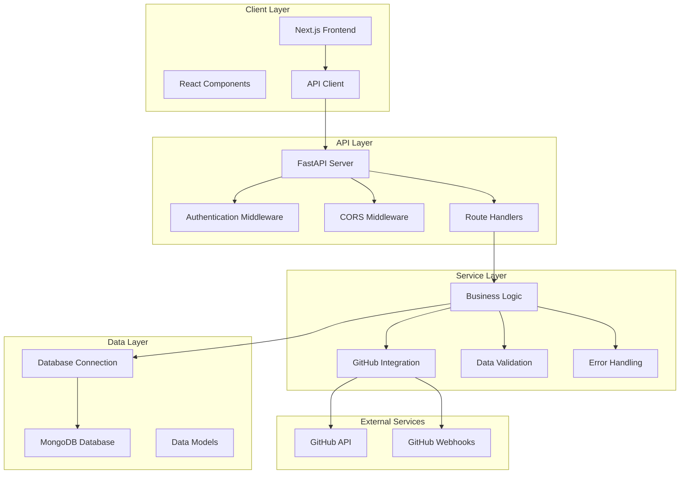
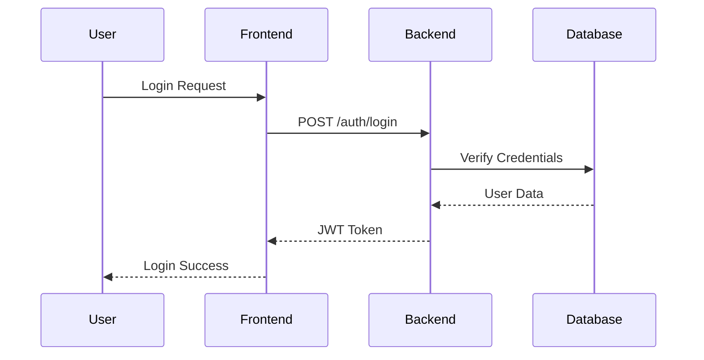
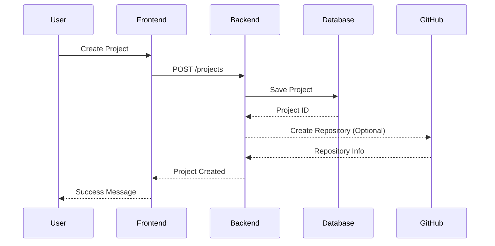
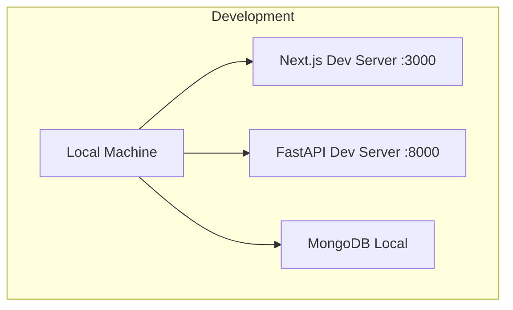
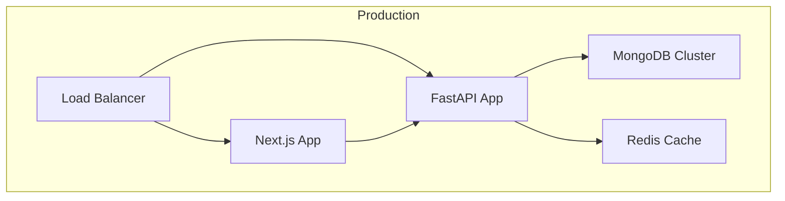

# GravityManagement (GravityPM)

## Project Overview
GravityManagement (GravityPM) is a modern, comprehensive project management system designed to streamline project workflows with automated features and seamless GitHub integration. It supports task management, resource allocation, rule-based automation, and real-time collaboration.

## Technology Stack

| Layer       | Technology / Frameworks                  |
|-------------|----------------------------------------|
| Backend     | FastAPI, Python, MongoDB, Redis, JWT   |
| Frontend    | Next.js 14, React, TypeScript, Tailwind CSS, Radix UI |
| Infrastructure | Docker, Git, GitHub Actions          |

## System Architecture

## Data Flow Examples

### Authentication Flow

### Project Management Flow

## Database Schema (Example)

| Collection | Fields                                                                                  |
|------------|-----------------------------------------------------------------------------------------|
| User       | _id, username, email, full_name, hashed_password, role, github_id, disabled, timestamps |
| Project    | _id, name, description, owner_id, members, status, github_repo, timestamps              |
| Task       | _id, title, description, project_id, assignee_id, status, priority, due_date, timestamps |

## API Endpoints Overview

| Resource       | Endpoint               | Method | Description                  |
|----------------|------------------------|--------|------------------------------|
| Authentication | /auth/login            | POST   | User login                   |
|                | /auth/register         | POST   | User registration            |
| Projects       | /projects              | GET    | List projects                |
|                | /projects              | POST   | Create project               |
| Tasks          | /tasks                 | GET    | List tasks                   |
|                | /tasks                 | POST   | Create task                  |
| GitHub         | /github/webhook        | POST   | GitHub webhook handler       |
|                | /github/repos          | GET    | Get user repositories        |

## Security Considerations
- JWT-based authentication with role-based access control
- Password hashing with bcrypt
- Input validation and XSS protection
- GitHub webhook signature validation
- Rate limiting and secure token storage

## Deployment Architecture

### Development Environment

### Production Environment

## Performance Optimization
- Asynchronous database operations
- Caching with Redis
- Database indexing
- API rate limiting
- Frontend code splitting and lazy loading

## Monitoring & Logging
- Health check endpoints
- Structured logging with log levels
- Centralized log aggregation

## Conclusion
GravityManagement offers a scalable, secure, and efficient project management platform with modern technologies and seamless GitHub integration.
