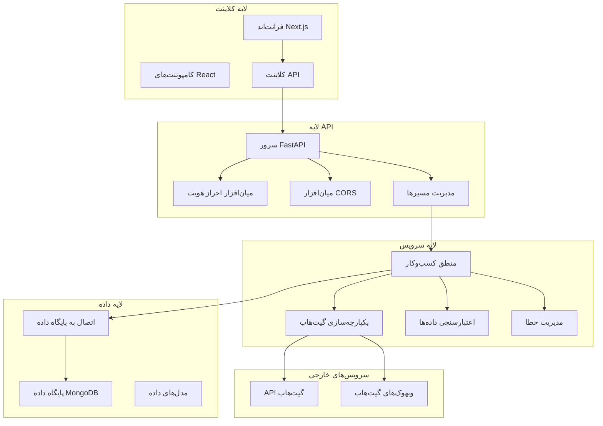
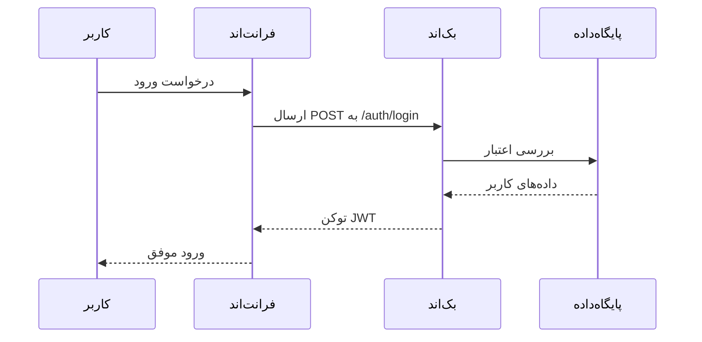
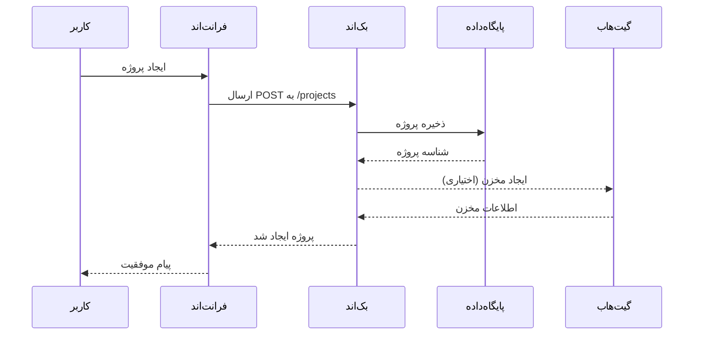
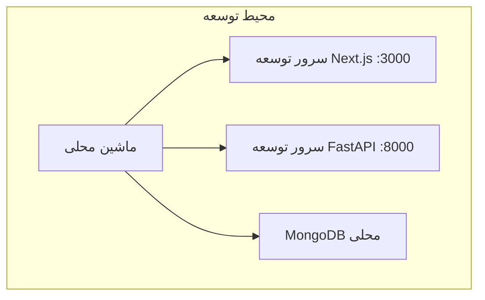
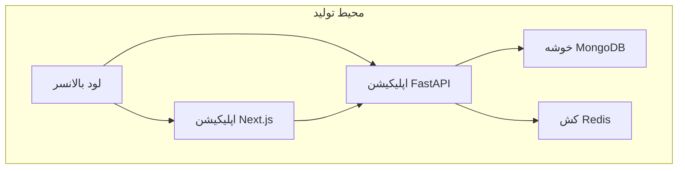

# GravityManagement (GravityPM)

## معرفی پروژه
GravityManagement (GravityPM) یک سیستم مدیریت پروژه مدرن و جامع است که با هدف ساده‌سازی جریان‌های کاری پروژه با ویژگی‌های خودکار و یکپارچه‌سازی بی‌وقفه با گیت‌هاب طراحی شده است. این سیستم مدیریت وظایف، تخصیص منابع، اتوماسیون مبتنی بر قوانین و همکاری بلادرنگ را پشتیبانی می‌کند.

## تکنولوژی‌های استفاده شده

| لایه        | تکنولوژی‌ها و فریم‌ورک‌ها                  |
|-------------|--------------------------------------------|
| بک‌اند     | FastAPI، پایتون، MongoDB، Redis، JWT       |
| فرانت‌اند  | Next.js 14، React، TypeScript، Tailwind CSS، Radix UI |
| زیرساخت    | Docker، Git، GitHub Actions                 |

## معماری سیستم

## جریان داده‌ها

### جریان احراز هویت

### جریان مدیریت پروژه

## نمونه ساختار پایگاه داده

| مجموعه     | فیلدها                                                                                  |
|------------|-----------------------------------------------------------------------------------------|
| کاربر      | _id، نام کاربری، ایمیل، نام کامل، رمز عبور هش شده، نقش، شناسه گیت‌هاب، فعال/غیرفعال، تاریخ‌ها |
| پروژه      | _id، نام، توضیحات، شناسه مالک، اعضا، وضعیت، مخزن گیت‌هاب، تاریخ‌ها                      |
| وظیفه      | _id، عنوان، توضیحات، شناسه پروژه، شناسه مسئول، وضعیت، اولویت، تاریخ سررسید، تاریخ‌ها    |

## نمای کلی API

| منبع          | مسیر                    | متد    | توضیح                         |
|---------------|-------------------------|--------|------------------------------|
| احراز هویت    | /auth/login             | POST   | ورود کاربر                   |
|               | /auth/register          | POST   | ثبت نام کاربر                |
| پروژه‌ها      | /projects               | GET    | لیست پروژه‌ها                |
|               | /projects               | POST   | ایجاد پروژه                  |
| وظایف         | /tasks                  | GET    | لیست وظایف                   |
|               | /tasks                  | POST   | ایجاد وظیفه                  |
| گیت‌هاب       | /github/webhook         | POST   | مدیریت وبهوک گیت‌هاب         |
|               | /github/repos           | GET    | دریافت مخازن کاربر           |

## ملاحظات امنیتی
- احراز هویت مبتنی بر JWT با کنترل دسترسی نقش‌ها
- هش کردن رمز عبور با bcrypt
- اعتبارسنجی ورودی و محافظت در برابر XSS
- اعتبارسنجی امضای وبهوک گیت‌هاب
- محدودیت نرخ و ذخیره امن توکن‌ها

## معماری استقرار

### محیط توسعه

### محیط تولید

## بهینه‌سازی عملکرد
- عملیات پایگاه داده ناهمزمان
- کش با Redis
- ایندکس‌گذاری پایگاه داده
- محدودیت نرخ API
- تقسیم کد و بارگذاری تنبل در فرانت‌اند

## پایش و لاگ‌گیری
- نقاط بررسی سلامت
- لاگ‌گیری ساختاریافته با سطوح مختلف
- تجمیع مرکزی لاگ‌ها

## نتیجه‌گیری
GravityManagement یک پلتفرم مدیریت پروژه مقیاس‌پذیر، امن و کارآمد با فناوری‌های مدرن و یکپارچه‌سازی بی‌وقفه با گیت‌هاب ارائه می‌دهد.
